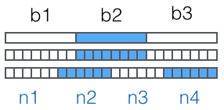

# Python入门

Python

* 龟叔”Guido van Rossum在1989年圣诞节期间为打发无聊而编写。
* 解释型的语言
* 用来编写应用程序的高级编程语言。

那Python适合开发哪些类型的应用呢？

* 首选是网络应用，包括网站、后台服务等等；
* 其次是许多日常需要的小工具，包括系统管理员需要的脚本任务等等；
* 另外就是把其他语言开发的程序再包装起来，方便使用。

Python缺点

1. 行速度慢；和C程序相比非常慢，因为Python是解释型语言，你的代码在执行时会一行一行地翻译成CPU能理解的机器码，这个翻译过程非常耗时，所以很慢。而C程序是运行前直接编译成CPU能执行的机器码，所以非常快。
2. 代码不能加密；如果要发布你的Python程序，实际上就是发布源代码，这一点跟C语言不同，C语言不用发布源代码，只需要把编译后的机器码（也就是你在Windows上常见的xxx.exe文件）发布出去。要从机器码反推出C代码是不可能的，所以，凡是编译型的语言，都没有这个问题，而解释型的语言，则必须把源码发布出去。这个缺点仅限于你要编写的软件需要卖给别人挣钱的时候。好消息是目前的互联网时代，靠卖软件授权的商业模式越来越少了，靠网站和移动应用卖服务的模式越来越多了，后一种模式不需要把源码给别人。

学习版本：3.9

开发工具：PyCharm

Python解释器

1. CPython：官方版本的解释器，用c语言开发，在命令行下运行python就是启动CPython解释器。
2. IPython：基于CPython之上的一个交互式解释器，只是在交互方式上有所增强，但是执行Python代码的功能和CPython是完全一样的。好比很多国产浏览器虽然外观不同，但内核其实都是调用了IE。
3. PyPy：目标是执行速度。PyPy采用[JIT技术](http://en.wikipedia.org/wiki/Just-in-time_compilation)，对Python代码进行动态编译（注意不是解释），所以可以显著提高Python代码的执行速度。绝大部分Python代码都可以在PyPy下运行，但是PyPy和CPython有一些是不同的，这就导致相同的Python代码在两种解释器下执行可能会有不同的结果。如果你的代码要放到PyPy下执行，就需要了解[PyPy和CPython的不同点](http://pypy.readthedocs.org/en/latest/cpython_differences.html)。
4. Jython：运行在Java平台上的Python解释器，可以直接把Python代码编译成Java字节码执行。
5. IronPython：运行在微软.Net平台上的Python解释器，可以直接把Python代码编译成.Net的字节码。

Python的解释器很多，但使用最广泛的还是CPython。如果要和Java或.Net平台交互，最好的办法不是用Jython或IronPython，而是通过网络调用来交互，确保各程序之间的独立性。

# 第一个Python程序

## 命令行与交互模式

命令行模式：打开iterm2客户端，就进入了命令行模式

```
Last login: Fri Jul 22 16:16:49 on ttys000
(base) suker@192 ~ %
```

Python交互模式：在命令行模式下执行命令`python`，然后就进入到Python交互模式

```
(base) suker@192 ~ % python
Python 3.9.12 (main, Apr  5 2022, 01:52:34)
[Clang 12.0.0 ] :: Anaconda, Inc. on darwin
Type "help", "copyright", "credits" or "license" for more information.
>>>
```

在Python交互模式下执行`exit()`，就退出了Python交互模式，回到命令行模式

```
(base) suker@192 ~ % python
Python 3.9.12 (main, Apr  5 2022, 01:52:34)
[Clang 12.0.0 ] :: Anaconda, Inc. on darwin
Type "help", "copyright", "credits" or "license" for more information.
>>> exit()
(base) suker@192 ~ %
```

在交互模式下，输入代码并执行，就可以立刻得到执行结果

```
>>> 100+200
300
>>> print('hello, world')
hello, world
>>>
```

最后，用exit()退出Python，我们的第一个Python程序完成！

编写一个hello.py文件

```python
print('hello world')
```

在命令行下执行命令`python hello.py`

```
(base) suker@192 ~ % python hello.py
hello world
```

Python交互模式的代码是输入一行，执行一行，而命令行模式下直接运行.py文件是一次性执行该文件内的所有代码。可见，Python交互模式主要是为了调试Python代码用的，也便于初学者学习，它不是正式运行Python代码的环境！

SyntaxError：表示输入的Python代码有语法错误

## 输入与输出

输入input()

```python
name = input()
name2 = input("请输入你的名字")
```

输出`print()`

```python
print('hello world')
print('hello', 'world') # 可以接受多个字符串，用逗号“,”隔开；会依次打印每个字符串，遇到逗号“,”会输出一个空格
```

# Python基础

```python
# print absolute value of an integer
a = 100
if a >= 0:
    print(a)
else:
    print(-a)
```

以`#`开头的语句是注释，注释是给人看的，可以是任意内容，解释器会忽略掉注释。其他每一行都是一个语句，当语句以冒号`:`结尾时，缩进的语句视为代码块。

缩进有利有弊。好处是强迫你写出格式化的代码，但没有规定缩进是几个空格还是Tab。按照约定俗成的惯例，应该始终坚持使用*4个空格*的缩进。

缩进的另一个好处是强迫你写出缩进较少的代码，你会倾向于把一段很长的代码拆分成若干函数，从而得到缩进较少的代码。

缩进的坏处就是“复制－粘贴”功能失效了，这是最坑爹的地方。当你重构代码时，粘贴过去的代码必须重新检查缩进是否正确。此外，IDE很难像格式化Java代码那样格式化Python代码。

最后，**请务必注意，Python程序是大小写敏感的**，如果写错了大小写，程序会报错。

**小结**

Python使用缩进来组织代码块，请务必遵守约定俗成的习惯，坚持使用4个空格的缩进。

在文本编辑器中，需要设置把Tab自动转换为4个空格，确保不混用Tab和空格。

## 数据类型和变量

1. 整数

   Python可以处理任意大小的整数，当然包括负整数，在程序中的表示方法和数学上的写法一模一样，例如：`1`，`100`，`-8080`，`0`，等等。

   计算机由于使用二进制，所以有时候用十六进制表示整数比较方便，十六进制用`0x`前缀和0-9，a-f表示，例如：`0xff00`，`0xa5b4c3d2`等。

   对于很大的数，例如`10000000000`，很难数清楚0的个数。Python允许在数字中间以`_`分隔，因此，写成`10_000_000_000`和`10000000000`是完全一样的。十六进制数也可以写成`0xa1b2_c3d4`。

2. 浮点数

   浮点数也就是小数，之所以称为浮点数，是因为按照科学记数法表示时，一个浮点数的小数点位置是可变的，比如，1.23x10^9^和12.3x10^8^是完全相等的。浮点数可以用数学写法，如`1.23`，`3.14`，`-9.01`等。但是对于很大或很小的浮点数，就必须用科学计数法表示，把10用e替代，1.23x10^9^就是`1.23e9`，或者`12.3e8`，0.000012可以写成`1.2e-5`等。

   整数和浮点数在计算机内部存储的方式是不同的，整数运算永远是精确的（除法难道也是精确的？是的！），而浮点数运算则可能会有四舍五入的误差。

3. 字符串

   字符串是以单引号`'`或双引号`"`括起来的任意文本，比如`'abc'`，`"xyz"`等。请注意，`''`或`""`本身只是一种表示方式，不是字符串的一部分，因此，字符串`'abc'`只有`a`，`b`，`c`这3个字符。如果`'`本身也是一个字符，那就可以用`""`括起来，比如`"I'm OK"`包含的字符是`I`，`'`，`m`，空格，`O`，`K`这6个字符。

   如果字符串内部既包含`'`又包含`"`怎么办？可以用转义字符`\`来标识，比如：

   ```
   'I\'m \"OK\"!'
   ```

   表示的字符串内容是：

   ```
   I'm "OK"!
   ```

   转义字符`\`可以转义很多字符，比如`\n`表示换行，`\t`表示制表符，字符`\`本身也要转义，所以`\\`表示的字符就是`\`，可以在Python的交互式命令行用`print()`打印字符串看看：

   ```
   >>> print('I\'m OK')
   I'm OK
   >>> print('I\'m learning\nPython.')
   I'm learning
   Python.
   >>> print('\\\n\\')
   \
   \
   ```

   如果字符串里面有很多字符都需要转义，就需要加很多\，为了简化，Python还允许用r''表示''内部的字符串默认不转义，可以自己试试：

   ```
   >>> print('\\\t\\')
   \	\
   >>> print(r'\\\t\\')
   \\\t\\
   ```

   如果字符串内部有很多换行，用\n写在一行里不好阅读，为了简化，Python允许用'''...'''的格式表示多行内容，可以自己试试：

   ```
   >>> print('''line1
   ... line2
   ... line3''')
   line1
   line2
   line3
   ```

   多行字符串'''...'''也可以在前面加上r使用

4. 布尔值

   一个布尔值只有True、False两种值，要么是True，要么是False，在Python中，可以直接用True、False表示布尔值（请注意大小写），也可以通过布尔运算计算出来
   布尔值可以用`and`、`or`、`not`运算

   布尔值经常用在条件判断中，比如：

   ```python
   if age > 18:
       print('adult')
   else:
       print('teenager')
   ```

5. 空值

   空值是python中一个特殊的值，用`None`表示。`None`不能理解为`0`，因为`0`是有意义的，而`None`是一个特殊的空值。

此外，Python还提供了列表、字典等多种数据类型，还允许创建自定义数据类型，我们后面会继续讲到。

**变量**

变量不仅可以是数字，还可以是任意数据类型；

变量在程序中就是用一个变量名表示，变量名必须是大小写英文、数字和`_`的组合，且不能用数字开头；

在Python中，等号`=`是赋值语句，可以把任意数据类型赋值给变量，同一个变量可以反复赋值，而且可以是不同类型的变量

```
a = 123 # a是整数
print(a)
a = 'ABC' # a变为字符串
print(a)
```

这种变量本身类型不固定的语言称之为*动态语言*，与之对应的是*静态语言*。静态语言在定义变量时必须指定变量类型，如果赋值的时候类型不匹配，就会报错。例如Java是静态语言，赋值语句如下（// 表示注释）：

```java
int a = 123; // a是整数类型变量
a = "ABC"; // 错误：不能把字符串赋给整型变量
```

和静态语言相比，动态语言更灵活，就是这个原因。

理解变量在计算机内存中的表示也非常重要

```
a = 'ABC'
```

时，Python解释器干了两件事情：

1. 在内存中创建了一个`'ABC'`的字符串；
2. 在内存中创建了一个名为`a`的变量，并把它指向`'ABC'`。

也可以把一个变量`a`赋值给另一个变量`b`，这个操作实际上是把变量`b`指向变量`a`所指向的数据，例如下面的代码：

```python
# -*- coding: utf-8 -*-
a = 'ABC'
b = a
a = 'XYZ'
print(b)
```

最后一行打印出变量`b`的内容到底是`'ABC'`呢还是`'XYZ'`？如果从数学意义上理解，就会错误地得出`b`和`a`相同，也应该是`'XYZ'`，但实际上`b`的值是`'ABC'`，让我们一行一行地执行代码，就可以看到到底发生了什么事：

1. 执行`a = 'ABC'`，解释器创建了字符串`'ABC'`和变量`a`，并把`a`指向`'ABC'`;
2. 执行`b = a`，解释器创建了变量`b`，并把`b`指向`a`指向的字符串`'ABC'`;
3. 执行`a = 'XYZ'`，解释器创建了字符串'XYZ'，并把`a`的指向改为`'XYZ'`，但`b`并没有更改;

所以，最后打印变量`b`的结果自然是`'ABC'`了。

**常量**

所谓常量就是不能变的变量，比如常用的数学常数π就是一个常量。在Python中，通常用全部大写的变量名表示常量：

```python
PI = 3.1415926
```

但事实上`PI`仍然是一个变量，Python根本没有任何机制保证`PI`不会被改变，所以，用全部大写的变量名表示常量只是一个习惯上的用法，如果你一定要改变变量`PI`的值，也没人能拦住你。

最后解释一下整数的除法为什么也是精确的。在Python中，有两种除法，一种除法是`/`：

```
>>> 10/3
3.3333333333333335
```

`/`除法计算结果是浮点数，即使是两个整数恰好整除，结果也是浮点数：

```
>>> 9/3
3.0
```

还有一种除法是`//`，称为地板除，两个整数的除法仍然是整数：

```
>>> 10 // 3
3
```

你没有看错，整数的地板除`//`永远是整数，即使除不尽。要做精确的除法，使用`/`就可以。

因为`//`除法只取结果的整数部分，所以Python还提供一个余数运算，可以得到两个整数相除的余数：

```
>>> 10 % 3
1
```

无论整数做`//`除法还是取余数，结果永远是整数，所以，整数运算结果永远是精确的。

**小结**

Python支持多种数据类型，在计算机内部，可以把任何数据都看成一个“对象”，而变量就是在程序中用来指向这些数据对象的，对变量赋值就是把数据和变量给关联起来。

对变量赋值`x = y`是把变量`x`指向真正的对象，该对象是变量`y`所指向的。随后对变量`y`的赋值*不影响*变量`x`的指向。

注意：Python的整数没有大小限制，而某些语言的整数根据其存储长度是有大小限制的，例如Java对32位整数的范围限制在`-2147483648`-`2147483647`。

Python的浮点数也没有大小限制，但是超出一定范围就直接表示为`inf`（无限大）。

## 字符串和编码

我们已经讲过了，字符串也是一种数据类型，但是，字符串比较特殊的是还有一个编码问题。

因为计算机只能处理数字，如果要处理文本，就必须先把文本转换为数字才能处理。最早的计算机在设计时采用8个比特（bit）作为一个字节（byte），所以，一个字节能表示的最大的整数就是255（二进制11111111=十进制255），如果要表示更大的整数，就必须用更多的字节。比如两个字节可以表示的最大整数是`65535`，4个字节可以表示的最大整数是`4294967295`。

由于计算机是美国人发明的，因此，最早只有127个字符被编码到计算机里，也就是大小写英文字母、数字和一些符号，这个编码表被称为`ASCII`编码，比如大写字母`A`的编码是`65`，小写字母`z`的编码是`122`。

但是要处理中文显然一个字节是不够的，至少需要两个字节，而且还不能和ASCII编码冲突，所以，中国制定了`GB2312`编码，用来把中文编进去。

你可以想得到的是，全世界有上百种语言，日本把日文编到`Shift_JIS`里，韩国把韩文编到`Euc-kr`里，各国有各国的标准，就会不可避免地出现冲突，结果就是，在多语言混合的文本中，显示出来会有乱码。

因此，Unicode字符集应运而生。Unicode把所有语言都统一到一套编码里，这样就不会再有乱码问题了。

Unicode标准也在不断发展，但最常用的是UCS-16编码，用两个字节表示一个字符（如果要用到非常偏僻的字符，就需要4个字节）。现代操作系统和大多数编程语言都直接支持Unicode。

现在，捋一捋ASCII编码和Unicode编码的区别：ASCII编码是1个字节，而Unicode编码通常是2个字节。

字母`A`用ASCII编码是十进制的`65`，二进制的`01000001`；

字符`0`用ASCII编码是十进制的`48`，二进制的`00110000`，注意字符`'0'`和整数`0`是不同的；

汉字`中`已经超出了ASCII编码的范围，用Unicode编码是十进制的`20013`，二进制的`01001110 00101101`。

你可以猜测，如果把ASCII编码的`A`用Unicode编码，只需要在前面补0就可以，因此，`A`的Unicode编码是`00000000 01000001`。

新的问题又出现了：如果统一成Unicode编码，乱码问题从此消失了。但是，如果你写的文本基本上全部是英文的话，用Unicode编码比ASCII编码需要多一倍的存储空间，在存储和传输上就十分不划算。

所以，本着节约的精神，又出现了把Unicode编码转化为“可变长编码”的`UTF-8`编码。UTF-8编码把一个Unicode字符根据不同的数字大小编码成1-6个字节，常用的英文字母被编码成1个字节，汉字通常是3个字节，只有很生僻的字符才会被编码成4-6个字节。如果你要传输的文本包含大量英文字符，用UTF-8编码就能节省空间：

| 字符 | ASCII    | Unicode           | UTF-8                      |
| ---- | -------- | ----------------- | -------------------------- |
| A    | 01000001 | 00000000 01000001 | 01000001                   |
| 中   | x        | 01001110 00101101 | 11100100 10111000 10101101 |

从上面的表格还可以发现，UTF-8编码有一个额外的好处，就是ASCII编码实际上可以被看成是UTF-8编码的一部分，所以，大量只支持ASCII编码的历史遗留软件可以在UTF-8编码下继续工作。

搞清楚了ASCII、Unicode和UTF-8的关系，我们就可以总结一下现在计算机系统通用的字符编码工作方式：

在计算机内存中，统一使用Unicode编码，当需要保存到硬盘或者需要传输的时候，就转换为UTF-8编码。

用记事本编辑的时候，从文件读取的UTF-8字符被转换为Unicode字符到内存里，编辑完成后，保存的时候再把Unicode转换为UTF-8保存到文件：


浏览网页的时候，服务器会把动态生成的Unicode内容转换为UTF-8再传输到浏览器：


所以你看到很多网页的源码上会有类似`<meta charset="UTF-8" />`的信息，表示该网页正是用的UTF-8编码。

**Python的字符串**

在最新的Python 3版本中，字符串是以Unicode编码的，也就是说，Python的字符串支持多语言，例如：

```
>>> print('包含中文的str')
包含中文的str
```

对于单个字符的编码，Python提供了`ord()`函数获取字符的整数表示，`chr()`函数把编码转换为对应的字符：

```
>>> ord('A')
65
>>> ord('中')
20013
>>> chr(66)
'B'
>>> chr(25991)
'文'
```

如果知道字符的整数编码，还可以用十六进制这么写`str`

```
>>> '\u4e2d\u6587'
'中文'
```

两种写法完全是等价的。

由于Python的字符串类型是`str`，在内存中以Unicode表示，一个字符对应若干个字节。如果要在网络上传输，或者保存到磁盘上，就需要把`str`变为以字节为单位的`bytes`。

Python对`bytes`类型的数据用带`b`前缀的单引号或双引号表示：

```python
x = b'ABC'
```

要注意区分`'ABC'`和`b'ABC'`，前者是`str`，后者虽然内容显示得和前者一样，但`bytes`的每个字符都只占用一个字节。

以Unicode表示的`str`通过`encode()`方法可以编码为指定的`bytes`，例如：

```
>>> 'ABC'.encode('ascii')
b'ABC'
>>> '中文'.encode('utf-8')
b'\xe4\xb8\xad\xe6\x96\x87'
>>> '中文'.encode('ascii')
Traceback (most recent call last):
  File "<stdin>", line 1, in <module>
UnicodeEncodeError: 'ascii' codec can't encode characters in position 0-1: ordinal not in range(128)
```

纯英文的`str`可以用`ASCII`编码为`bytes`，内容是一样的，含有中文的`str`可以用`UTF-8`编码为`bytes`。含有中文的`str`无法用`ASCII`编码，因为中文编码的范围超过了`ASCII`编码的范围，Python会报错。

在`bytes`中，无法显示为ASCII字符的字节，用`\x##`显示。

反过来，如果我们从网络或磁盘上读取了字节流，那么读到的数据就是`bytes`。要把`bytes`变为`str`，就需要用`decode()`方法：

```
>>> b'ABC'.decode('ascii')
'ABC'
>>> b'\xe4\xb8\xad\xe6\x96\x87'.decode('utf-8')
'中文'
```

如果`bytes`中包含无法解码的字节，`decode()`方法会报错：

```
>>> b'\xe4\xb8\xad\xff'.decode('utf-8')
Traceback (most recent call last):
  File "<stdin>", line 1, in <module>
UnicodeDecodeError: 'utf-8' codec can't decode byte 0xff in position 3: invalid start byte
```

如果`bytes`中只有一小部分无效的字节，可以传入`errors='ignore'`忽略错误的字节：

```
>>> b'\xe4\xb8\xad\xff'.decode('utf-8', errors='ignore')
'中'
```

要计算`str`包含多少个字符，可以用`len()`函数：

```
>>> len('ABC')
3
>>> len('中文')
2
```

`len()`函数计算的是`str`的字符数，如果换成`bytes`，`len()`函数就计算字节数：

```
>>> len(b'ABC')
3
>>> len(b'\xe4\xb8\xad\xe6\x96\x87')
6
>>> len('中文'.encode('utf-8'))
6
```

可见，1个中文字符经过UTF-8编码后通常会占用3个字节，而1个英文字符只占用1个字节。

在操作字符串时，我们经常遇到`str`和`bytes`的互相转换。为了避免乱码问题，应当始终坚持使用UTF-8编码对`str`和`bytes`进行转换。

由于Python源代码也是一个文本文件，所以，当你的源代码中包含中文的时候，在保存源代码时，就需要务必指定保存为UTF-8编码。当Python解释器读取源代码时，为了让它按UTF-8编码读取，我们通常在文件开头写上这两行：

```python
#!/usr/bin/env python3
# -*- coding: utf-8 -*-
```

第一行注释是为了告诉Linux/OS X系统，这是一个Python可执行程序，Windows系统会忽略这个注释；

第二行注释是为了告诉Python解释器，按照UTF-8编码读取源代码，否则，你在源代码中写的中文输出可能会有乱码。

申明了UTF-8编码并不意味着你的`.py`文件就是UTF-8编码的，必须并且要确保文本编辑器正在使用UTF-8 without BOM编码

如果`.py`文件本身使用UTF-8编码，并且也申明了`# -*- coding: utf-8 -*-`，打开命令提示符测试就可以正常显示中文：

```
(base) suker@192 ~ % python hello.py
中文测试正常
```


**格式化**

最后一个常见的问题是如何输出格式化的字符串。我们经常会输出类似`'亲爱的xxx你好！你xx月的话费是xx，余额是xx'`之类的字符串，而xxx的内容都是根据变量变化的，所以，需要一种简便的格式化字符串的方式。

在Python中，采用的格式化方式和C语言是一致的，用`%`实现，举例如下：

```
>>> 'Hello, %s' % 'world'
'Hello, world'
>>> 'Hi, %s, hou have $%d' % ('Michael', 1000000)
'Hi, Michael, hou have $1000000'
```

你可能猜到了，`%`运算符就是用来格式化字符串的。在字符串内部，`%s`表示用字符串替换，`%d`表示用整数替换，有几个`%?`占位符，后面就跟几个变量或者值，顺序要对应好。如果只有一个`%?`，括号可以省略。

常见的占位符有：

| 占位符 | 替换内容     |
| ------ | ------------ |
| %d     | 整数         |
| %f     | 浮点数       |
| %s     | 字符串       |
| %x     | 十六进制整数 |

其中，格式化整数和浮点数还可以指定是否补0和整数与小数的位数：

```
>>> '%2d-%02d' % (3, 1)
' 3-01'
>>> '%.2f' % 3.1415926
'3.14'
```

如果你不太确定应该用什么，`%s`永远起作用，它会把任何数据类型转换为字符串：

```
>>> 'Age: %s. Gender: %s' % (25, True)
'Age: 25. Gender: True'
```

有些时候，字符串里面的`%`是一个普通字符怎么办？这个时候就需要转义，用`%%`来表示一个`%`：

```
>>> 'growth rate: %d %%' % 7
'growth rate: 7 %'
```

**format()**

另一种格式化字符串的方法是使用字符串的`format()`方法，它会用传入的参数依次替换字符串内的占位符`{0}`、`{1}`……，不过这种方式写起来比%要麻烦得多：

```
>>> 'Hello, {0}, 成绩提升了{1:.1f}%'.format('小明', 17.125)
'Hello, 小明, 成绩提升了17.1%'
```

**f-string**

最后一种格式化字符串的方法是使用以`f`开头的字符串，称之为`f-string`，它和普通字符串不同之处在于，字符串如果包含`{xxx}`，就会以对应的变量替换：

```
>>> r = 2.5
>>> s = 3.15 * r * 2
>>> print(f'The area of a circle with radius {r} is {s: .2f}')
The area of a circle with radius 2.5 is  15.75
```

上述代码中，`{r}`被变量`r`的值替换，`{s:.2f}`被变量`s`的值替换，并且`:`后面的`.2f`指定了格式化参数（即保留两位小数），因此，`{s:.2f}`的替换结果是`19.62`。

**小结**

Python 3的字符串使用Unicode，直接支持多语言。

当`str`和`bytes`互相转换时，需要指定编码。最常用的编码是`UTF-8`。Python当然也支持其他编码方式，比如把Unicode编码成`GB2312`：

```
>>> '中文'.encode('gb2312')
b'\xd6\xd0\xce\xc4'
```

但这种方式纯属自找麻烦，如果没有特殊业务要求，请牢记仅使用`UTF-8`编码。

格式化字符串的时候，可以用Python的交互式环境测试，方便快捷。

## 使用list和tuple

**list**

Python内置的一种数据类型是列表：list。list是一种有序的集合，可以随时添加和删除其中的元素。

比如，列出班里所有同学的名字，就可以用一个list表示：

```
>>> classmates = ['Michael', 'Bob', 'Tracy']
>>> classmates
['Michael', 'Bob', 'Tracy']
```

变量`classmates`就是一个list。用`len()`函数可以获得list元素的个数：

```
>>> len(classmates)
3
```

用索引来访问list中每一个位置的元素，记得索引是从`0`开始的：

```
>>> classmates[0]
'Michael'
>>> classmates[1]
'Bob'
>>> classmates[2]
'Tracy'
>>> classmates[3]
Traceback (most recent call last):
  File "<stdin>", line 1, in <module>
IndexError: list index out of range
```

当索引超出了范围时，Python会报一个`IndexError`错误，所以，要确保索引不要越界，记得最后一个元素的索引是`len(classmates) - 1`。

如果要取最后一个元素，除了计算索引位置外，还可以用`-1`做索引，直接获取最后一个元素：

```
>>> classmates[-1]
'Tracy'
```

以此类推，可以获取倒数第2个、倒数第3个：

```
>>> classmates[-2]
'Bob'
>>> classmates[-3]
'Michael'
>>> classmates[-4]
Traceback (most recent call last):
  File "<stdin>", line 1, in <module>
IndexError: list index out of range
```

当然，倒数第4个就越界了。

list是一个可变的有序表，所以，可以往list中追加元素到末尾：

```
>>> classmates.append('Adam')
>>> classmates
['Michael', 'Bob', 'Tracy', 'Adam']
```

也可以把元素插入到指定的位置，比如索引号为`1`的位置：

```
>>> classmates.insert(1, 'Jack')
>>> classmates
['Michael', 'Jack', 'Bob', 'Tracy', 'Adam']
```

要删除list末尾的元素，用`pop()`方法：

```
>>> classmates.pop()
'Adam'
>>> classmates
['Michael', 'Jack', 'Bob', 'Tracy']
```

要删除指定位置的元素，用`pop(i)`方法，其中`i`是索引位置：

```
>>> classmates.pop(1)
'Jack'
>>> classmates
['Michael', 'Bob', 'Tracy']
```

要把某个元素替换成别的元素，可以直接赋值给对应的索引位置：

```
>>> classmates[1] = 'Sarah'
>>> classmates
['Michael', 'Sarah', 'Tracy']
```

list里面的元素的数据类型也可以不同，比如：

```
>>> L = ['Apple', 123, True]
```

list元素也可以是另一个list，比如：

```
>>> s = ['python', 'java', ['asp', 'php'], 'scheme']
>>> len(s)
4
```

要注意`s`只有4个元素，其中`s[2]`又是一个list，如果拆开写就更容易理解了：

```
>>> p = ['asp', 'php']
>>> s = ['python', 'java', p, 'scheme']
```

要拿到`'php'`可以写`p[1]`或者`s[2][1]`，因此`s`可以看成是一个二维数组，类似的还有三维、四维……数组，不过很少用到。

如果一个list中一个元素也没有，就是一个空的list，它的长度为0：

```
>>> L = []
>>> len(L)
0
```

**tuple**

另一种有序列表叫元组：tuple。tuple和list非常类似，但是tuple一旦初始化就不能修改，比如同样是列出同学的名字：

```
>>> classmates = ('Michael', 'Bob', 'Tracy')
```

现在，classmates这个tuple不能变了，它也没有append()，insert()这样的方法。其他获取元素的方法和list是一样的，你可以正常地使用`classmates[0]`，`classmates[-1]`，但不能赋值成另外的元素。

不可变的tuple有什么意义？因为tuple不可变，所以代码更安全。如果可能，能用tuple代替list就尽量用tuple。

tuple的陷阱：当你定义一个tuple时，在定义的时候，tuple的元素就必须被确定下来，比如：

```
>>> t = (1,2)
>>> t
(1, 2)
```

如果要定义一个空的tuple，可以写成`()`：

```
>>> t = ()
>>> t
()
```

但是，要定义一个只有1个元素的tuple，如果你这么定义：

```
>>> t = (1)
>>> t
1
```

定义的不是tuple，是`1`这个数！这是因为括号`()`既可以表示tuple，又可以表示数学公式中的小括号，这就产生了歧义，因此，Python规定，这种情况下，按小括号进行计算，计算结果自然是`1`。

所以，只有1个元素的tuple定义时必须加一个逗号`,`，来消除歧义：

```
>>> t = (1,)
>>> t
(1,)
```

Python在显示只有1个元素的tuple时，也会加一个逗号`,`，以免你误解成数学计算意义上的括号。

```
>>> t = ('a', 'b', ['A', 'B'])
>>> t[2][0] = 'X'
>>> t[2][1] = 'Y'
>>> t
('a', 'b', ['X', 'Y'])
```

这个tuple定义的时候有3个元素，分别是`'a'`，`'b'`和一个list。不是说tuple一旦定义后就不可变了吗？怎么后来又变了？

别急，我们先看看定义的时候tuple包含的3个元素：


当我们把list的元素`'A'`和`'B'`修改为`'X'`和`'Y'`后，tuple变为：


表面上看，tuple的元素确实变了，但其实变的不是tuple的元素，而是list的元素。tuple一开始指向的list并没有改成别的list，所以，tuple所谓的“不变”是说，tuple的每个元素，指向永远不变。即指向`'a'`，就不能改成指向`'b'`，指向一个list，就不能改成指向其他对象，但指向的这个list本身是可变的！

理解了“指向不变”后，要创建一个内容也不变的tuple怎么做？那就必须保证tuple的每一个元素本身也不能变。

**小结**

list和tuple是Python内置的有序集合，一个可变，一个不可变。根据需要来选择使用它们。

## 条件判断

计算机之所以能做很多自动化的任务，因为它可以自己做条件判断。

比如，输入用户年龄，根据年龄打印不同的内容，在Python程序中，用`if`语句实现：

```python
age = 20
if age >= 18:
    print('your age is', age)
    print('adult')
```

根据Python的缩进规则，如果`if`语句判断是`True`，就把缩进的两行print语句执行了，否则，什么也不做。

也可以给`if`添加一个`else`语句，意思是，如果`if`判断是`False`，不要执行`if`的内容，去把`else`执行了：

```python
age = 3
if age >= 18:
    print('your age is', age)
    print('adult')
else:
    print('you age is', age)
    print('teenager')
```

`elif`是`else if`的缩写，完全可以有多个`elif`，所以`if`语句的完整形式就是：

```
if <条件判断1>:
    <执行1>
elif <条件判断2>:
    <执行2>
elif <条件判断3>:
    <执行3>
else:
    <执行4>
```

`if`语句执行有个特点，它是从上往下判断，如果在某个判断上是`True`，把该判断对应的语句执行后，就忽略掉剩下的`elif`和`else`，所以，请测试并解释为什么下面的程序打印的是`teenager`：

```python
age = 20
if age >= 6:
    print('teenager')
elif age >= 19:
    print('adult')
else:
    print('kid')
```

`if`判断条件还可以简写，比如写：

```
if x:
    print('True')
```

只要`x`是非零数值、非空字符串、非空list等，就判断为`True`，否则为`False`。

**再议input**

最后看一个有问题的条件判断。很多同学会用`input()`读取用户的输入，这样可以自己输入，程序运行得更有意思：

```python
birth = input('birth: ')
if birth < 2000:
    print('00前')
else:
    print('00后')
```

输入`1982`，结果报错：

```
Traceback (most recent call last):
  File "/Users/suker/PycharmProjects/test/list-tuple.py", line 5, in <module>
    if birth < 2000:
TypeError: '<' not supported between instances of 'str' and 'int'
```

这是因为`input()`返回的数据类型是`str`，`str`不能直接和整数比较，必须先把`str`转换成整数。Python提供了`int()`函数来完成这件事情：

```
s = input('birth: ')
birth = int(s)
if birth < 2000:
    print('00前')
else:
    print('00后')
```

再次运行，就可以得到正确地结果。但是，如果输入`abc`呢？又会得到一个错误信息：

```
Traceback (most recent call last):
  File "/Users/suker/PycharmProjects/test/list-tuple.py", line 5, in <module>
    birth = int(s)
ValueError: invalid literal for int() with base 10: 'abc'
```

原来`int()`函数发现一个字符串并不是合法的数字时就会报错，程序就退出了。

如何检查并捕获程序运行期的错误呢？后面的错误和调试会讲到。

## 循环

要计算1+2+3，我们可以直接写表达式：

```
>>> 1+2+3
6
```

要计算1+2+3+...+10，勉强也能写出来。

但是，要计算1+2+3+...+10000，直接写表达式就不可能了。

为了让计算机能计算成千上万次的重复运算，我们就需要循环语句。

Python的循环有两种，一种是for...in循环，依次把list或tuple中的每个元素迭代出来，看例子：

```python
names = ['Michael', 'Bob', 'Tracy']
for name in names:
    print(name)
```

执行这段代码，会依次打印`names`的每一个元素：

```
Michael
Bob
Tracy
```

所以`for x in ...`循环就是把每个元素代入变量`x`，然后执行缩进块的语句。

再比如我们想计算1-10的整数之和，可以用一个`sum`变量做累加：

```python
sum = 0
for x in [1,2,3,4,5,6,7,8,9,10]:
    sum = sum + x
print(sum)
```

如果要计算1-100的整数之和，从1写到100有点困难，幸好Python提供一个`range()`函数，可以生成一个整数序列，再通过`list()`函数可以转换为list。比如`range(5)`生成的序列是从0开始小于5的整数：

```
>>> list(range(5))
[0, 1, 2, 3, 4]
```

`range(101)`就可以生成0-100的整数序列，计算如下：

```
sum = 0
for x in range(101):
    sum = sum + x
print(sum)
```

第二种循环是while循环，只要条件满足，就不断循环，条件不满足时退出循环。比如我们要计算100以内所有奇数之和，可以用while循环实现：

```python
sum = 0
n = 99
while n > 0:
    sum = sum + n
    n = n - 2
print(sum)
```

在循环内部变量`n`不断自减，直到变为`-1`时，不再满足while条件，循环退出。

**break**

在循环中，`break`语句可以提前退出循环。例如，本来要循环打印1～100的数字：

```python
n = 1
while n <= 100:
    print(n)
    n = n+1
print('END')
```

上面的代码可以打印出1~100。

如果要提前结束循环，可以用`break`语句：

```python
n = 1
while n <= 100:
    if n > 10:
        break
    print(n)
    n = n+1
print('END')
```

执行上面的代码可以看到，打印出1~10后，紧接着打印`END`，程序结束。

可见`break`的作用是提前结束循环。

**continue**

在循环过程中，也可以通过`continue`语句，跳过当前的这次循环，直接开始下一次循环。

```python
n = 0
while n < 10:
    n = n + 1
    print(n)
```

上面的程序可以打印出1～10。但是，如果我们想只打印奇数，可以用`continue`语句跳过某些循环：

```python
n = 0
while n < 10:
    n = n+1
    if n % 2 == 0:
        continue
    print(n)
```

执行上面的代码可以看到，打印的不再是1～10，而是1，3，5，7，9。

可见`continue`的作用是提前结束本轮循环，并直接开始下一轮循环。


**小结**

循环是让计算机做重复任务的有效的方法。

`break`语句可以在循环过程中直接退出循环，而`continue`语句可以提前结束本轮循环，并直接开始下一轮循环。这两个语句通常都*必须*配合`if`语句使用。

*要特别注意*，不要滥用`break`和`continue`语句。`break`和`continue`会造成代码执行逻辑分叉过多，容易出错。大多数循环并不需要用到`break`和`continue`语句，上面的两个例子，都可以通过改写循环条件或者修改循环逻辑，去掉`break`和`continue`语句。

有些时候，如果代码写得有问题，会让程序陷入“死循环”，也就是永远循环下去。这时可以用`Ctrl+C`退出程序，或者强制结束Python进程。

## 使用dict和set

**dict**

Python内置了字典：dict的支持，dict全称dictionary，在其他语言中也称为map，使用键-值（key-value）存储，具有极快的查找速度。

举个例子，假设要根据同学的名字查找对应的成绩，如果用list实现，需要两个list：

```python
names = ['Michael', 'Bob', 'Tracy']
scores = [95, 75, 85]
```

给定一个名字，要查找对应的成绩，就先要在names中找到对应的位置，再从scores取出对应的成绩，list越长，耗时越长。

如果用dict实现，只需要一个“名字”-“成绩”的对照表，直接根据名字查找成绩，无论这个表有多大，查找速度都不会变慢。用Python写一个dict如下：

```
>>> d = {'Michael': 95, 'Bob': 75, 'Tracy': 85}
>>> d['Michael']
95
```

为什么dict查找速度这么快？因为dict的实现原理和查字典是一样的。假设字典包含了1万个汉字，我们要查某一个字，一个办法是把字典从第一页往后翻，直到找到我们想要的字为止，这种方法就是在list中查找元素的方法，list越大，查找越慢。

第二种方法是先在字典的索引表里（比如部首表）查这个字对应的页码，然后直接翻到该页，找到这个字。无论找哪个字，这种查找速度都非常快，不会随着字典大小的增加而变慢。

dict就是第二种实现方式，给定一个名字，比如`'Michael'`，dict在内部就可以直接计算出`Michael`对应的存放成绩的“页码”，也就是`95`这个数字存放的内存地址，直接取出来，所以速度非常快。

你可以猜到，这种key-value存储方式，在放进去的时候，必须根据key算出value的存放位置，这样，取的时候才能根据key直接拿到value。

把数据放入dict的方法，除了初始化时指定外，还可以通过key放入：

```
>>> d['Adam'] = 67
>>> d
{'Michael': 95, 'Bob': 75, 'Tracy': 85, 'Adam': 67}
```

由于一个key只能对应一个value，所以，多次对一个key放入value，后面的值会把前面的值冲掉：

```
>>> d['Jack'] = 90
>>> d['Jack']
90
>>> d['Jack'] = 80
>>> d['Jack']
80
```

如果key不存在，dict就会报错：

```
>>> d['Thomas']
Traceback (most recent call last):
  File "<stdin>", line 1, in <module>
KeyError: 'Thomas'
```

要避免key不存在的错误，有两种办法，一是通过`in`判断key是否存在：

```
>>> 'Thomas' in d
False
```

二是通过dict提供的`get()`方法，如果key不存在，可以返回`None`，或者自己指定的value：

```
>>> d.get('Thomas')
>>> d.get('Thomas', -1)
-1
```

注意：返回`None`的时候Python的交互环境不显示结果。

要删除一个key，用`pop(key)`方法，对应的value也会从dict中删除：

```
>>> d.pop('Bob')
75
>>> d
{'Michael': 95, 'Tracy': 85, 'Adam': 67, 'Jack': 80}
```

> 请务必注意，dict内部存放的顺序和key放入的顺序是没有关系的。

和list比较，dict有以下几个特点：

1. 查找和插入的速度极快，不会随着key的增加而变慢；
2. 需要占用大量的内存，内存浪费多。

而list相反：

1. 查找和插入的时间随着元素的增加而增加；
2. 占用空间小，浪费内存很少。

所以，dict是用空间来换取时间的一种方法。

dict可以用在需要高速查找的很多地方，在Python代码中几乎无处不在，正确使用dict非常重要，需要牢记的第一条就是dict的key必须是**不可变对象**。

这是因为dict根据key来计算value的存储位置，如果每次计算相同的key得出的结果不同，那dict内部就完全混乱了。这个通过key计算位置的算法称为哈希算法（Hash）。

要保证hash的正确性，作为key的对象就不能变。在Python中，字符串、整数等都是不可变的，因此，可以放心地作为key。而list是可变的，就不能作为key：

```
>>> key = [1, 2, 3]
>>> d[key] = 'a list'
Traceback (most recent call last):
  File "<stdin>", line 1, in <module>
TypeError: unhashable type: 'list'
```

**set**

set和dict类似，也是一组key的集合，但不存储value。由于key不能重复，所以，在set中，没有重复的key。

要创建一个set，需要提供一个list作为输入集合：

```
>>> s = set([1,2,3])
>>> s
{1, 2, 3}
```

注意，传入的参数`[1, 2, 3]`是一个list，而显示的`{1, 2, 3}`只是告诉你这个set内部有1，2，3这3个元素，显示的顺序也不表示set是有序的。。

重复元素在set中自动被过滤：

```
>>> s = set([1, 1, 2, 2, 3, 3])
>>> s
{1, 2, 3}
```

通过`add(key)`方法可以添加元素到set中，可以重复添加，但不会有效果：

```
>>> s.add(4)
>>> s
{1, 2, 3, 4}
>>> s.add(4)
>>> s
{1, 2, 3, 4}
```

通过`remove(key)`方法可以删除元素：

```
>>> s.remove(2)
>>> s
{1, 3, 4}
```

set可以看成数学意义上的无序和无重复元素的集合，因此，两个set可以做数学意义上的交集、并集等操作：

```
>>> s1 = set([1,2,3,4])
>>> s2 = set([2,3,5])
>>> s1 & s2
{2, 3}
>>> s1 | s2
{1, 2, 3, 4, 5}
```

set和dict的唯一区别仅在于没有存储对应的value，但是，set的原理和dict一样，所以，同样不可以放入可变对象，因为无法判断两个可变对象是否相等，也就无法保证set内部“不会有重复元素”。试试把list放入set，看看是否会报错。

**再议不可变对象**

上面我们讲了，str是不变对象，而list是可变对象。

对于可变对象，比如list，对list进行操作，list内部的内容是会变化的，比如：

```
>>> a = ['c','b','a']
>>> a.sort()
>>> a
['a', 'b', 'c']
```

而对于不可变对象，比如str，对str进行操作呢：

```
>>> a = 'abc'
>>> a.replace('a', 'A')
'Abc'
>>> a
'abc'
```

虽然字符串有个`replace()`方法，也确实变出了`'Abc'`，但变量`a`最后仍是`'abc'`，应该怎么理解呢？

我们先把代码改成下面这样：

```
>>> a = 'abc'
>>> b = a.replace('a', 'A')
>>> b
'Abc'
>>> a
'abc'
```

要始终牢记的是，`a`是变量，而`'abc'`才是字符串对象！有些时候，我们经常说，对象`a`的内容是`'abc'`，但其实是指，`a`本身是一个变量，它指向的对象的内容才是`'abc'`：

```ascii
│ a │─────────────────>│ 'abc' │
```
当我们调用a.replace('a', 'A')时，实际上调用方法replace是作用在字符串对象'abc'上的，而这个方法虽然名字叫replace，但却没有改变字符串'abc'的内容。相反，replace方法创建了一个新字符串'Abc'并返回，如果我们用变量b指向该新字符串，就容易理解了，变量a仍指向原有的字符串'abc'，但变量b却指向新字符串'Abc'了：

```ascii
┌───┐                  ┌───────┐
│ a │─────────────────>│ 'abc' │
└───┘                  └───────┘
┌───┐                  ┌───────┐
│ b │─────────────────>│ 'Abc' │
└───┘                  └───────┘
```

所以，对于不变对象来说，调用对象自身的任意方法，也不会改变该对象自身的内容。相反，这些方法会创建新的对象并返回，这样，就保证了不可变对象本身永远是不可变的。

**小结**

使用key-value存储结构的dict在Python中非常有用，选择不可变对象作为key很重要，最常用的key是字符串。

tuple虽然是不变对象，但试试把`(1, 2, 3)`和`(1, [2, 3])`放入dict或set中，并解释结果。


# 函数

## 调用函数

要调用一个函数，需要知道函数的名称和参数，比如求绝对值的函数`abs`，只有一个参数。可以直接从Python的官方网站查看文档：

http://docs.python.org/3/library/functions.html#abs

也可以在交互式命令行通过`help(abs)`查看`abs`函数的帮助信息。

```
>>> abs(100)
100
>>> abs(-20)
20
>>> abs(12.34)
12.34
```

调用函数的时候，如果传入的参数数量不对，会报`TypeError`的错误，并且Python会明确地告诉你：`abs()`有且仅有1个参数，但给出了两个：

```
>>> abs(1,2)
Traceback (most recent call last):
  File "<stdin>", line 1, in <module>
TypeError: abs() takes exactly one argument (2 given)
```

如果传入的参数数量是对的，但参数类型不能被函数所接受，也会报`TypeError`的错误，并且给出错误信息：`str`是错误的参数类型：

```
>>> abs('a')
Traceback (most recent call last):
  File "<stdin>", line 1, in <module>
TypeError: bad operand type for abs(): 'str'
```

而`max`函数`max()`可以接收任意多个参数，并返回最大的那个：

```
>>> max(1,2)
2
>>> max(1,2,3,-1,-5)
3
```

**数据类型转换**

Python内置的常用函数还包括数据类型转换函数，比如`int()`函数可以把其他数据类型转换为整数：

```
>>> int('123')
123
>>> int(12.34)
12
>>> float('12.34')
12.34
>>> str(1.23)
'1.23'
>>> str(100)
'100'
>>> bool(1)
True
>>> bool(0)
False
>>> bool('')
False
```

函数名其实就是指向一个函数对象的引用，完全可以把函数名赋给一个变量，相当于给这个函数起了一个“别名”：

```
>>> a = abs	# 变量a指向abs函数
>>> a(-2)
2
```

`hex()`函数把一个整数转换成十六进制

```
>>> hex(255)
'0xff'
```

## 定义函数

在Python中，定义一个函数要使用`def`语句，依次写出函数名、括号、括号中的参数和冒号`:`，然后，在缩进块中编写函数体，函数的返回值用`return`语句返回。

我们以自定义一个求绝对值的`my_abs`函数为例：

```python
def my_abs(x):
    if x >= 0:
        return x
    else:
        return -x

print(my_abs(-1))
```

请注意，函数体内部的语句在执行时，一旦执行到`return`时，函数就执行完毕，并将结果返回。因此，函数内部通过条件判断和循环可以实现非常复杂的逻辑。

如果没有`return`语句，函数执行完毕后也会返回结果，只是结果为`None`。`return None`可以简写为`return`。

如果你已经把`my_abs()`的函数定义保存为`abstest.py`文件了，那么，可以在该文件的当前目录下启动Python解释器，用`from abstest import my_abs`来导入`my_abs()`函数，注意`abstest`是文件名（不含`.py`扩展名）：

```
>>> from abstest import my_abs
>>> my_abs(-99)
99
```

**空函数**

如果想定义一个什么事也不做的空函数，可以用`pass`语句：

```python
def nop():
    pass
```

缺少了`pass`，代码运行就会有语法错误。

**参数检查**

调用函数时，如果参数个数不对，Python解释器会自动检查出来，并抛出`TypeError`：

```
>>> my_abs(1,2)
Traceback (most recent call last):
  File "<stdin>", line 1, in <module>
TypeError: my_abs() takes 1 positional argument but 2 were given
```

但是如果参数类型不对，Python解释器就无法帮我们检查。试试`my_abs`和内置函数`abs`的差别：

```
>>> my_abs('A')
Traceback (most recent call last):
  File "<stdin>", line 1, in <module>
  File "/Users/suker/abstest.py", line 4, in my_abs
    if x >= 0:
TypeError: '>=' not supported between instances of 'str' and 'int'
>>> abs('A')
Traceback (most recent call last):
  File "<stdin>", line 1, in <module>
TypeError: bad operand type for abs(): 'str'
```

当传入了不恰当的参数时，内置函数`abs`会检查出参数错误，而我们定义的`my_abs`没有参数检查，会导致`if`语句出错，出错信息和`abs`不一样。所以，这个函数定义不够完善。

让我们修改一下`my_abs`的定义，对参数类型做检查，只允许整数和浮点数类型的参数。数据类型检查可以用内置函数`isinstance()`实现：

```
def my_abs(x):
    if not isinstance(x, (int, float)):
        raise TypeError('bad operand type')
    if x >= 0:
        return x
    else:
        return -x
```

添加了参数检查后，如果传入错误的参数类型，函数就可以抛出一个错误：

```
>>> from abstest import my_abs
>>> my_abs('A')
Traceback (most recent call last):
  File "<stdin>", line 1, in <module>
  File "/Users/suker/abstest.py", line 5, in my_abs
    raise TypeError('bad operand type')
TypeError: bad operand type
```

错误和异常处理将在后续讲到。

**返回多个值**

函数可以返回多个值吗？答案是肯定的。

比如在游戏中经常需要从一个点移动到另一个点，给出坐标、位移和角度，就可以计算出新的坐标：

```python
import math

def move(x, y, step, angle=0):
    nx = x + step * math.cos(angle)
    ny = y - step * math.sin(angle)
    return nx, ny
```

`import math`语句表示导入`math`包，并允许后续代码引用`math`包里的`sin`、`cos`等函数。

然后，我们就可以同时获得返回值：

```
>>> x,y = move(100, 100, 60, math.pi / 6)
>>> print(x, y)
151.96152422706632 70.0
```

但其实这只是一种假象，Python函数返回的仍然是单一值：

```
>>> r = move(100, 100, 60, math.pi / 6)
>>> print(r)
(151.96152422706632, 70.0)
```

原来返回值是一个tuple！但是，在语法上，返回一个tuple可以省略括号，而多个变量可以同时接收一个tuple，按位置赋给对应的值，所以，Python的函数返回多值其实就是返回一个tuple，但写起来更方便。

**小结**

定义函数时，需要确定函数名和参数个数；

如果有必要，可以先对参数的数据类型做检查；

函数体内部可以用`return`随时返回函数结果；

函数执行完毕也没有`return`语句时，自动`return None`。

函数可以同时返回多个值，但其实就是一个tuple。

## 函数的参数

定义函数的时候，我们把参数的名字和位置确定下来，函数的接口定义就完成了。对于函数的调用者来说，只需要知道如何传递正确的参数，以及函数将返回什么样的值就够了，函数内部的复杂逻辑被封装起来，调用者无需了解。

Python的函数定义非常简单，但灵活度却非常大。除了正常定义的必选参数外，还可以使用默认参数、可变参数和关键字参数，使得函数定义出来的接口，不但能处理复杂的参数，还可以简化调用者的代码。

**位置参数**

我们先写一个计算x2的函数：

```python
def power(x):
	return x * x
```

对于`power(x)`函数，参数`x`就是一个位置参数。

当我们调用`power`函数时，必须传入有且仅有的一个参数`x`：

```
>>> power(5)
25
>>> power(15)
225
```

现在，如果我们要计算x3怎么办？可以再定义一个`power3`函数，但是如果要计算x4、x5……怎么办？我们不可能定义无限多个函数。

你也许想到了，可以把`power(x)`修改为`power(x, n)`，用来计算xn，说干就干：

```python
def power(x, n):
    s = 1
    while n > 0:
        n = n - 1
        s = s * x
    return s
```

对于这个修改后的`power(x, n)`函数，可以计算任意n次方：

```
>>> power(5,2)
25
>>> power(5,3)
125
```

修改后的`power(x, n)`函数有两个参数：`x`和`n`，这两个参数都是位置参数，调用函数时，传入的两个值按照位置顺序依次赋给参数`x`和`n`。

**默认参数**

新的`power(x, n)`函数定义没有问题，但是，旧的调用代码失败了，原因是我们增加了一个参数，导致旧的代码因为缺少一个参数而无法正常调用：

```
>>> power(5)
Traceback (most recent call last):
  File "<stdin>", line 1, in <module>
TypeError: power() missing 1 required positional argument: 'n'
```

Python的错误信息很明确：调用函数`power()`缺少了一个位置参数`n`。

这个时候，默认参数就排上用场了。由于我们经常计算x2，所以，完全可以把第二个参数n的默认值设定为2：

```
def power(x, n=2):
    s = 1
    while n > 0:
        n = n - 1
        s = s * x
    return s
```

这样，当我们调用`power(5)`时，相当于调用`power(5, 2)`：

```
>>> power(5)
25
>>> power(5,2)
25
```

而对于`n > 2`的其他情况，就必须明确地传入n，比如`power(5, 3)`。

从上面的例子可以看出，默认参数可以简化函数的调用。设置默认参数时，有几点要注意：

一是必选参数在前，默认参数在后，否则Python的解释器会报错（思考一下为什么默认参数不能放在必选参数前面）；

二是如何设置默认参数。

当函数有多个参数时，把变化大的参数放前面，变化小的参数放后面。变化小的参数就可以作为默认参数。

使用默认参数有什么好处？最大的好处是能降低调用函数的难度。

举个例子，我们写个一年级小学生注册的函数，需要传入`name`和`gender`两个参数：

```python
def enroll(name, gender):
    print('name:', name)
    print('gender:', gender)
```

这样，调用`enroll()`函数只需要传入两个参数：

```
>>> enroll('Sarah', 'F')
name: Sarah
gender: F
```

如果要继续传入年龄、城市等信息怎么办？这样会使得调用函数的复杂度大大增加。

我们可以把年龄和城市设为默认参数：

```python
def enroll(name, gender, age=6, city='Beijing'):
    print('name:', name)
    print('gender:', gender)
    print('age:', age)
    print('city:', city)
```

这样，大多数学生注册时不需要提供年龄和城市，只提供必须的两个参数：

```
>>> enroll('Sarah', 'F')
name: Sarah
gender: F
age: 6
city: Beijing
```

只有与默认参数不符的学生才需要提供额外的信息

```
>>> enroll('Bob', 'M', 7)
name: Bob
gender: M
age: 7
city: Beijing
>>> enroll('Adam', 'M', city='Tianjin')
name: Adam
gender: M
age: 6
city: Tianjin
```

可见，默认参数降低了函数调用的难度，而一旦需要更复杂的调用时，又可以传递更多的参数来实现。无论是简单调用还是复杂调用，函数只需要定义一个。

有多个默认参数时，调用的时候，既可以按顺序提供默认参数，比如调用`enroll('Bob', 'M', 7)`，意思是，除了`name`，`gender`这两个参数外，最后1个参数应用在参数`age`上，`city`参数由于没有提供，仍然使用默认值。

也可以不按顺序提供部分默认参数。当不按顺序提供部分默认参数时，需要把参数名写上。比如调用`enroll('Adam', 'M', city='Tianjin')`，意思是，`city`参数用传进去的值，其他默认参数继续使用默认值。

**默认参数很有用，但使用不当，也会掉坑里**。默认参数有个最大的坑，演示如下：

先定义一个函数，传入一个list，添加一个`END`再返回：

```python
def add_end(L=[]):
    L.append('END')
    return L
```

当你正常调用时，结果似乎不错：

```python
>>> add_end([1,2,3])
[1, 2, 3, 'END']
>>> add_end(['x','y','x'])
['x', 'y', 'x', 'END']
```

当你使用默认参数调用时，一开始结果也是对的：

```
>>> add_end()
['END']
```

但是，再次调用`add_end()`时，结果就不对了：

```
>>> add_end()
['END', 'END']
>>> add_end()
['END', 'END', 'END']
```

很多初学者很疑惑，默认参数是`[]`，但是函数似乎每次都“记住了”上次添加了`'END'`后的list。

原因解释如下：

Python函数在定义的时候，默认参数`L`的值就被计算出来了，即`[]`，因为默认参数`L`也是一个变量，它指向对象`[]`，每次调用该函数，如果改变了`L`的内容，则下次调用时，默认参数的内容就变了，不再是函数定义时的`[]`了。

> ⚠️ 定义默认参数要牢记一点：默认参数必须指向不变对象！ 

要修改上面的例子，我们可以用`None`这个不变对象来实现：

```python
def add_end(L=None):
    if L is None:
        L = []
    L.append('END')
    return L
```

现在，无论调用多少次，都不会有问题：

```
>>> add_end()
['END']
>>> add_end()
['END']
```

为什么要设计`str`、`None`这样的不变对象呢？因为不变对象一旦创建，对象内部的数据就不能修改，这样就减少了由于修改数据导致的错误。此外，由于对象不变，多任务环境下同时读取对象不需要加锁，同时读一点问题都没有。我们在编写程序时，如果可以设计一个不变对象，那就尽量设计成不变对象。

**可变参数**

在Python函数中，还可以定义可变参数。顾名思义，可变参数就是传入的参数个数是可变的，可以是1个、2个到任意个，还可以是0个。

我们以数学题为例子，给定一组数字a，b，c……，请计算a2 + b2 + c2 + ……。

要定义出这个函数，我们必须确定输入的参数。由于参数个数不确定，我们首先想到可以把a，b，c……作为一个list或tuple传进来，这样，函数可以定义如下：

```python
def calc(numbers):
    sum = 0
    for n in numbers:
        sum = sum + n * n
    return sum
```

但是调用的时候，需要先组装出一个list或tuple：

```
>>> calc([1, 2, 3])
14
>>> calc((1, 3, 5, 7))
84
```

如果利用可变参数，调用函数的方式可以简化成这样：

```
calc(1, 2, 3)
calc(1, 3, 5, 7)
```

所以，我们把函数的参数改为可变参数：

```python
def calc(*numbers):
    sum = 0
    for n in numbers:
        sum = sum + n * n
    return sum
```

定义可变参数和定义一个list或tuple参数相比，仅仅在参数前面加了一个`*`号。在函数内部，参数`numbers`接收到的是一个tuple，因此，函数代码完全不变。但是，调用该函数时，可以传入任意个参数，包括0个参数：

```
>>> calc(1,2)
5
>>> calc(1,2,3,4,5)
55
>>> calc()
0
```

如果已经有一个list或者tuple，要调用一个可变参数怎么办？可以这样做：

```
>>> nums = [1,2,3]
>>> calc(nums[0],nums[1],nums[2])
14
```

这种写法当然是可行的，问题是太繁琐，所以Python允许你在list或tuple前面加一个`*`号，把list或tuple的元素变成可变参数传进去：

```
>>> nums = [1,2,3]
>>> calc(*nums)
14
```

`*nums`表示把`nums`这个list的所有元素作为可变参数传进去。这种写法相当有用，而且很常见。

**关键字参数**

可变参数允许你传入0个或任意个参数，这些可变参数在函数调用时自动组装为一个tuple。而关键字参数允许你传入0个或任意个含参数名的参数，这些关键字参数在函数内部自动组装为一个dict。请看示例：

```python
def person(name, age, **kw):
    print('name:', name, 'age:', age, 'other:', kw)
```

函数`person`除了必选参数`name`和`age`外，还接受关键字参数`kw`。在调用该函数时，可以只传入必选参数：

```
>>> person('Michael', 30)
name: Michael age: 30 other: {}
```

也可以传入任意个数的关键字参数

```
>>> person('Bob', 35, city='Beijing')
name: Bob age: 35 other: {'city': 'Beijing'}
>>> person('Adam', 45, gender='M', job='Engineer')
name: Adam age: 45 other: {'gender': 'M', 'job': 'Engineer'}
```

关键字参数有什么用？它可以扩展函数的功能。比如，在`person`函数里，我们保证能接收到`name`和`age`这两个参数，但是，如果调用者愿意提供更多的参数，我们也能收到。试想你正在做一个用户注册的功能，除了用户名和年龄是必填项外，其他都是可选项，利用关键字参数来定义这个函数就能满足注册的需求。

和可变参数类似，也可以先组装出一个dict，然后，把该dict转换为关键字参数传进去：

```
>>> extra = {'city': 'Beijing', 'job': 'Engineer'}
>>> person('Jack', 24, city=extra['city'], job=extra['job'])
name: Jack age: 24 other: {'city': 'Beijing', 'job': 'Engineer'}
```

当然，上面复杂的调用可以用简化的写法：

```
>>> extra = {'city': 'Beijing', 'job': 'Engineer'}
>>> person('Jack', 24, **extra)
name: Jack age: 24 other: {'city': 'Beijing', 'job': 'Engineer'}
```

`**extra`表示把`extra`这个dict的所有key-value用关键字参数传入到函数的`**kw`参数，`kw`将获得一个dict，注意`kw`获得的dict是`extra`的一份拷贝，对`kw`的改动不会影响到函数外的`extra`。

**命名关键字参数**

对于关键字参数，函数的调用者可以传入任意不受限制的关键字参数。至于到底传入了哪些，就需要在函数内部通过`kw`检查。

仍以`person()`函数为例，我们希望检查是否有`city`和`job`参数：

```python
def person(name, age, **kw):
    if 'city' in kw:
        # 有city参数
        pass
    if 'job' in kw:
        # 有job参数
        pass
    print('name:', name, 'age:', age, 'other:', kw)
```

但是调用者仍可以传入不受限制的关键字参数：

```
>>> person('Jack', 24, city='Beijing', addr='Chaoyang', zipcode=123456)
```

如果要限制关键字参数的名字，就可以用命名关键字参数，例如，只接收`city`和`job`作为关键字参数。这种方式定义的函数如下：

```python
def person(name, age, *, city, job):
    print('name:', name, 'age:', age, 'city:', city, 'job:', job)
```

和关键字参数`**kw`不同，命名关键字参数需要一个特殊分隔符`*`，`*`后面的参数被视为命名关键字参数。

调用方式如下：

```
>>> person('jack', 24, city='BJ', job='Engineer')
name: jack age: 24 city: BJ job: Engineer
```

如果函数定义中已经有了一个可变参数，后面跟着的命名关键字参数就不再需要一个特殊分隔符`*`了：

```
def person(name, age, *args, city, job):
    print('name:', name, 'age:', age, 'city:', city, 'job:', job)
```

命名关键字参数必须传入参数名，这和位置参数不同。如果没有传入参数名，调用将报错：

```
>>> person('Jack', 24, 'BJ', 'Engineer')
Traceback (most recent call last):
  File "<stdin>", line 1, in <module>
TypeError: person() missing 2 required keyword-only arguments: 'city' and 'job'
```

由于调用时缺少参数名`city`和`job`，Python解释器把前两个参数视为位置参数，后两个参数传给`*args`，但缺少命名关键字参数导致报错。

命名关键字参数可以有缺省值，从而简化调用：

```python
def person(name, age, *, city='Beijing', job):
    print(name, age, city, job)
```

由于命名关键字参数`city`具有默认值，调用时，可不传入`city`参数：

```
>>> person('Jack', 24, job='Engineer')
Jack 24 Beijing Engineer
```

使用命名关键字参数时，要特别注意，如果没有可变参数，就必须加一个`*`作为特殊分隔符。如果缺少`*`，Python解释器将无法识别位置参数和命名关键字参数：

```python
def person(name, age, city, job):
    # 缺少 *，city和job被视为位置参数
    pass
```

**参数组合**

在Python中定义函数，可以用必选参数、默认参数、可变参数、关键字参数和命名关键字参数，这5种参数都可以组合使用。

但是请注意，**参数定义的顺序必须是：必选参数、默认参数、可变参数、命名关键字参数和关键字参数。**

比如定义一个函数，包含上述若干种参数：

```python
def f1(a, b, c=0, *args, **kw):
    print('a =', a, 'b =', b, 'c =', c, 'args =', args, 'kw =', kw)

def f2(a, b, c=0, *, d, **kw):
    print('a =', a, 'b =', b, 'c =', c, 'd =', d, 'kw =', kw)
```

在函数调用的时候，Python解释器自动按照参数位置和参数名把对应的参数传进去。

```
>>> f1(1, 2)
a = 1 b = 2 c = 0 args = () kw = {}
>>> f1(1, 2, c=3)
a = 1 b = 2 c = 3 args = () kw = {}
>>> f1(1, 2, 3, 'a', 'b')
a = 1 b = 2 c = 3 args = ('a', 'b') kw = {}
>>> f1(1, 2, 3, 'a', 'b', x=99)
a = 1 b = 2 c = 3 args = ('a', 'b') kw = {'x': 99}
>>> f2(1, 2, d=99, ext=None)
a = 1 b = 2 c = 0 d = 99 kw = {'ext': None}
```

最神奇的是通过一个tuple和dict，你也可以调用上述函数：

```
>>> args = (1, 2, 3, 4)
>>> kw = {'d': 99, 'x': '#'}
>>> f1(*args, **kw)
a = 1 b = 2 c = 3 args = (4,) kw = {'d': 99, 'x': '#'}
>>> args = (1, 2, 3)
>>> kw = {'d': 88, 'x': '#'}
>>> f2(*args, **kw)
a = 1 b = 2 c = 3 d = 88 kw = {'x': '#'}
```

所以，对于任意函数，都可以通过类似`func(*args, **kw)`的形式调用它，无论它的参数是如何定义的。

> 虽然可以组合多达5种参数，但不要同时使用太多的组合，否则函数接口的可理解性很差。 

**小结**

Python的函数具有非常灵活的参数形态，既可以实现简单的调用，又可以传入非常复杂的参数。

默认参数一定要用不可变对象，如果是可变对象，程序运行时会有逻辑错误！

要注意定义可变参数和关键字参数的语法：

`*args`是可变参数，args接收的是一个tuple；

`**kw`是关键字参数，kw接收的是一个dict。

以及调用函数时如何传入可变参数和关键字参数的语法：

可变参数既可以直接传入：`func(1, 2, 3)`，又可以先组装list或tuple，再通过`*args`传入：`func(*(1, 2, 3))`；

关键字参数既可以直接传入：`func(a=1, b=2)`，又可以先组装dict，再通过`**kw`传入：`func(**{'a': 1, 'b': 2})`。

使用`*args`和`**kw`是Python的习惯写法，当然也可以用其他参数名，但最好使用习惯用法。

命名的关键字参数是为了限制调用者可以传入的参数名，同时可以提供默认值。

定义命名的关键字参数在没有可变参数的情况下不要忘了写分隔符`*`，否则定义的将是位置参数。

## 递归函数

在函数内部，可以调用其他函数。如果一个函数在内部调用自身本身，这个函数就是递归函数。

举个例子，我们来计算阶乘`n! = 1 x 2 x 3 x ... x n`，用函数`fact(n)`表示，可以看出：

fact(n)=n!=1×2×3×⋅⋅⋅×(n−1)×n=(n−1)!×n=fact(n−1)×n

所以，`fact(n)`可以表示为`n x fact(n-1)`，只有n=1时需要特殊处理。

于是，`fact(n)`用递归的方式写出来就是：

```
def fact(n):
    if n==1:
        return 1
    return n * fact(n - 1)
```

上面就是一个递归函数。可以试试：

```
>>> fact(1)
1
>>> fact(5)
120
```

如果我们计算`fact(5)`，可以根据函数定义看到计算过程如下：

```
===> fact(5)
===> 5 * fact(4)
===> 5 * (4 * fact(3))
===> 5 * (4 * (3 * fact(2)))
===> 5 * (4 * (3 * (2 * fact(1))))
===> 5 * (4 * (3 * (2 * 1)))
===> 5 * (4 * (3 * 2))
===> 5 * (4 * 6)
===> 5 * 24
===> 120
```

递归函数的优点是定义简单，逻辑清晰。理论上，所有的递归函数都可以写成循环的方式，但循环的逻辑不如递归清晰。

使用递归函数需要注意防止栈溢出。在计算机中，函数调用是通过栈（stack）这种数据结构实现的，每当进入一个函数调用，栈就会加一层栈帧，每当函数返回，栈就会减一层栈帧。由于栈的大小不是无限的，所以，递归调用的次数过多，会导致栈溢出。可以试试`fact(1000)`：

```
>>> fact(1000)
Traceback (most recent call last):
  File "<stdin>", line 1, in <module>
  File "<stdin>", line 4, in fact
  ...
  File "<stdin>", line 4, in fact
RuntimeError: maximum recursion depth exceeded in comparison
```

解决递归调用栈溢出的方法是通过**尾递归**优化，事实上尾递归和循环的效果是一样的，所以，把循环看成是一种特殊的尾递归函数也是可以的。

尾递归是指，在函数返回的时候，调用自身本身，并且，return语句不能包含表达式。这样，编译器或者解释器就可以把尾递归做优化，使递归本身无论调用多少次，都只占用一个栈帧，不会出现栈溢出的情况。

上面的`fact(n)`函数由于`return n * fact(n - 1)`引入了乘法表达式，所以就不是尾递归了。要改成尾递归方式，需要多一点代码，主要是要把每一步的乘积传入到递归函数中

```python
def fact(n):
    return fact_iter(n, 1)

def fact_iter(num, product):
    if num == 1:
        return product
    return fact_iter(num - 1, num * product)
```

可以看到，`return fact_iter(num - 1, num * product)`仅返回递归函数本身，`num - 1`和`num * product`在函数调用前就会被计算，不影响函数调用。

`fact(5)`对应的`fact_iter(5, 1)`的调用如下：

```
===> fact_iter(5, 1)
===> fact_iter(4, 5)
===> fact_iter(3, 20)
===> fact_iter(2, 60)
===> fact_iter(1, 120)
===> 120
```

尾递归调用时，如果做了优化，栈不会增长，因此，无论多少次调用也不会导致栈溢出。

遗憾的是，大多数编程语言没有针对尾递归做优化，Python解释器也没有做优化，所以，即使把上面的`fact(n)`函数改成尾递归方式，也会导致栈溢出。

**小结**

使用递归函数的优点是逻辑简单清晰，缺点是过深的调用会导致栈溢出。

针对尾递归优化的语言可以通过尾递归防止栈溢出。尾递归事实上和循环是等价的，没有循环语句的编程语言只能通过尾递归实现循环。

Python标准的解释器没有针对尾递归做优化，任何递归函数都存在栈溢出的问题。

# 高级特性

## 切片

取一个list或tuple的部分元素是非常常见的操作。比如，一个list如下：

```
>>> L = ['Michael', 'Sarah', 'Tracy', 'Bob', 'Jack']
```

取前3个元素，应该怎么做？

笨办法：

```
>>> [L[0], L[1], L[2]]
['Michael', 'Sarah', 'Tracy']
```

之所以是笨办法是因为扩展一下，取前N个元素就没辙了。

取前N个元素，也就是索引为0-(N-1)的元素，可以用循环：

```
>>> r = []
>>> n = 3
>>> for i in range(n):
...     r.append(L[i])
...
>>> r
['Michael', 'Sarah', 'Tracy']
```

对这种经常取指定索引范围的操作，用循环十分繁琐，因此，Python提供了切片（Slice）操作符，能大大简化这种操作。

对应上面的问题，取前3个元素，用一行代码就可以完成切片：

```
>>> L[0:3]
['Michael', 'Sarah', 'Tracy']
```

`L[0:3]`表示，从索引`0`开始取，直到索引`3`为止，但不包括索引`3`。即索引`0`，`1`，`2`，正好是3个元素。

如果第一个索引是`0`，还可以省略：

```
>>> L[:3]
['Michael', 'Sarah', 'Tracy']
```

也可以从索引1开始，取出2个元素出来：

```
>>> L[1:3]
['Sarah', 'Tracy']
```

类似的，既然Python支持`L[-1]`取倒数第一个元素，那么它同样支持倒数切片，试试：

```
>>> L[-2:]
['Bob', 'Jack']
>>> L[-2:-1]
['Bob']
```

记住倒数第一个元素的索引是`-1`。

切片操作十分有用。我们先创建一个0-99的数列：

```
>>> L = list(range(100))
```

可以通过切片轻松取出某一段数列。比如前10个数：

```
>>> L[:10]
[0, 1, 2, 3, 4, 5, 6, 7, 8, 9]
```

后10个数：

```
>>> L[-10:]
[90, 91, 92, 93, 94, 95, 96, 97, 98, 99]
```

前11-20个数：

```
>>> L[10:20]
[10, 11, 12, 13, 14, 15, 16, 17, 18, 19]
```

前10个数，每两个取一个：

```
>>> L[:10:2]
[0, 2, 4, 6, 8]
```

所有数，每5个取一个：

```
>>> L[::5]
[0, 5, 10, 15, 20, 25, 30, 35, 40, 45, 50, 55, 60, 65, 70, 75, 80, 85, 90, 95]
```

甚至什么都不写，只写`[:]`就可以原样复制一个list：

```
>>> L[:]
```

tuple也是一种list，唯一区别是tuple不可变。因此，tuple也可以用切片操作，只是操作的结果仍是tuple：

```
>>> (0,1,2,3,4,5)[:3]
(0, 1, 2)
```

字符串`'xxx'`也可以看成是一种list，每个元素就是一个字符。因此，字符串也可以用切片操作，只是操作结果仍是字符串：

```
>>> 'ABCDEFG'[:3]
'ABC'
>>> 'ABCDEFG'[::2]
'ACEG'
```

在很多编程语言中，针对字符串提供了很多各种截取函数（例如，substring），其实目的就是对字符串切片。Python没有针对字符串的截取函数，只需要切片一个操作就可以完成，非常简单。


例：对字符串反转

```
>>> 'ABCDEFG'[::-1]
'GFEDCBA'
>>> 'ABCDEFG'[::-2]
'GECA'
```

**小结**

有了切片操作，很多地方循环就不再需要了。Python的切片非常灵活，一行代码就可以实现很多行循环才能完成的操作。

## 迭代

如果给定一个`list`或`tuple`，我们可以通过`for`循环来遍历这个`list`或`tuple`，这种遍历我们称为迭代（Iteration）。

在Python中，迭代是通过`for ... in`来完成的，而很多语言比如C语言，迭代`list`是通过下标完成的，比如C代码：

```c
for (i=0; i<length; i++) {
    n = list[i];
}
```

可以看出，Python的`for`循环抽象程度要高于C的`for`循环，因为Python的`for`循环不仅可以用在`list`或`tuple`上，还可以作用在其他可迭代对象上。

`list`这种数据类型虽然有下标，但很多其他数据类型是没有下标的，但是，只要是可迭代对象，无论有无下标，都可以迭代，比如`dict`就可以迭代：

```
>>> d = {'a': 1, 'b': 2, 'c': 3}
>>> for key in d:
...     print(key)
...
a
b
c
```

因为`dict`的存储不是按照`list`的方式顺序排列，所以，迭代出的结果顺序很可能不一样。

默认情况下，`dict`迭代的是key。如果要迭代value，可以用`for value in d.values()`，如果要同时迭代key和value，可以用`for k, v in d.items()`。

由于字符串也是可迭代对象，因此，也可以作用于`for`循环：

```
>>> for ch in 'ABC':
...     print(ch)
...
A
B
C
```

所以，当我们使用`for`循环时，只要作用于一个可迭代对象，`for`循环就可以正常运行，而我们不太关心该对象究竟是`list`还是其他数据类型。

那么，如何判断一个对象是可迭代对象呢？方法是通过`collections.abc`模块的`Iterable`类型判断：

```
>>> from collections.abc import Iterable
>>> isinstance('abc', Iterable)	# str是否可迭代
True
>>> isinstance([1,2,3], Iterable)	# list是否可迭代
True
>>> isinstance(123, Iterable) # 整数是否可迭代
False
```

最后一个小问题，如果要对`list`实现类似Java那样的下标循环怎么办？Python内置的`enumerate`函数可以把一个`list`变成索引-元素对，这样就可以在`for`循环中同时迭代索引和元素本身：

```
>>> for i, value in enumerate(['A', 'B', 'C']):
...     print(i, value)
...
0 A
1 B
2 C
```

上面的`for`循环里，同时引用了两个变量，在Python里是很常见的，比如下面的代码：

```
>>> for x, y in [(1,2), (3,4), (5,6)]:
...     print(x, y)
...
1 2
3 4
5 6
```

**小结**

任何可迭代对象都可以作用于`for`循环，包括我们自定义的数据类型，只要符合迭代条件，就可以使用`for`循环。

## 列表生成式

列表生成式即List Comprehensions，是Python内置的非常简单却强大的可以用来创建list的生成式。

举个例子，要生成list `[1, 2, 3, 4, 5, 6, 7, 8, 9, 10]`可以用`list(range(1, 11))`：

```
>>> list(range(1,11))
[1, 2, 3, 4, 5, 6, 7, 8, 9, 10]
```

但如果要生成`[1x1, 2x2, 3x3, ..., 10x10]`怎么做？方法一是循环：

```
>>> L = []
>>> for x in range(1,11):
...     L.append(x * x)
...
>>> L
[1, 4, 9, 16, 25, 36, 49, 64, 81, 100]
```

但是循环太繁琐，而列表生成式则可以用一行语句代替循环生成上面的list：

```
>>> [x * x for x in range(1,11)]
[1, 4, 9, 16, 25, 36, 49, 64, 81, 100]
```

写列表生成式时，把要生成的元素`x * x`放到前面，后面跟`for`循环，就可以把list创建出来，十分有用，多写几次，很快就可以熟悉这种语法。

for循环后面还可以加上if判断，这样我们就可以筛选出仅偶数的平方：

```
>>> [x * x for x in range(1,11) if x % 2 == 0]
[4, 16, 36, 64, 100]
```

还可以使用两层循环，可以生成全排列：

```
>>> [m + n for m in 'ABC' for n in 'XYZ']
['AX', 'AY', 'AZ', 'BX', 'BY', 'BZ', 'CX', 'CY', 'CZ']
```

三层和三层以上的循环就很少用到了。

运用列表生成式，可以写出非常简洁的代码。例如，列出当前目录下的所有文件和目录名，可以通过一行代码实现：

```
>>> import os
>>> [d for d in os.listdir('.')]
['gift_record.log', '__pycache__', 'test.py', 'video_info.log']
```

`for`循环其实可以同时使用两个甚至多个变量，比如`dict`的`items()`可以同时迭代key和value：

```
>>> d = {'x': 'A', 'y': 'B', 'z': 'C'}
>>> for k, v in d.items():
...     print(k, '=', v)
...
x = A
y = B
z = C
```

因此，列表生成式也可以使用两个变量来生成list：

```
>>> [k + '=' + v for k, v in d.items()]
['x=A', 'y=B', 'z=C']
```

最后把一个list中所有的字符串变成小写：

```
>>> L = ['Hello', 'World', 'IBM', 'Apple']
>>> [s.lower() for s in L]
['hello', 'world', 'ibm', 'apple']
```

**if ... else**

使用列表生成式的时候，有些童鞋经常搞不清楚`if...else`的用法。

例如，以下代码正常输出偶数：

```
>>> [x for x in range(1,11) if x % 2 == 0]
```

但是，我们不能在最后的`if`加上`else`：

```
>>> [x for x in range(1,11) if x % 2 == 0 else 0]
  File "<stdin>", line 1
    [x for x in range(1,11) if x % 2 == 0 else 0]
                                          ^
SyntaxError: invalid syntax
```

这是因为跟在`for`后面的`if`是一个筛选条件，不能带`else`，否则如何筛选？

另一些童鞋发现把`if`写在`for`前面必须加`else`，否则报错：

```
>>> [x if x % 2 == 0 for x in range(1,11)]
  File "<stdin>", line 1
    [x if x % 2 == 0 for x in range(1,11)]
                     ^
SyntaxError: invalid syntax
```

这是因为`for`前面的部分是一个表达式，它必须根据`x`计算出一个结果。因此，考察表达式：`x if x % 2 == 0`，它无法根据`x`计算出结果，因为缺少`else`，必须加上`else`：

```
>>> [x if x % 2 == 0 else -x for x in range(1, 11)]
[-1, 2, -3, 4, -5, 6, -7, 8, -9, 10]
```

述`for`前面的表达式`x if x % 2 == 0 else -x`才能根据`x`计算出确定的结果。

可见，在一个列表生成式中，`for`前面的`if ... else`是表达式，而`for`后面的`if`是过滤条件，不能带`else`。

**小结**

运用列表生成式，可以快速生成list，可以通过一个list推导出另一个list，而代码却十分简洁。

## 生成器

通过列表生成式，我们可以直接创建一个列表。但是，受到内存限制，列表容量肯定是有限的。而且，创建一个包含100万个元素的列表，不仅占用很大的存储空间，如果我们仅仅需要访问前面几个元素，那后面绝大多数元素占用的空间都白白浪费了。

所以，如果列表元素可以按照某种算法推算出来，那我们是否可以在循环的过程中不断推算出后续的元素呢？这样就不必创建完整的list，从而节省大量的空间。在Python中，这种一边循环一边计算的机制，称为生成器：generator。

要创建一个generator，有很多种方法。第一种方法很简单，只要把一个列表生成式的`[]`改成`()`，就创建了一个generator：

```
>>> L = [x * x for x in range(10)]
>>> L
[0, 1, 4, 9, 16, 25, 36, 49, 64, 81]
>>> g = (x * x for x in range(10))
>>> g
<generator object <genexpr> at 0x1048c9c10>
```

创建`L`和`g`的区别仅在于最外层的`[]`和`()`，`L`是一个list，而`g`是一个generator。

我们可以直接打印出list的每一个元素，但我们怎么打印出generator的每一个元素呢？

如果要一个一个打印出来，可以通过`next()`函数获得generator的下一个返回值：

```
>>> next(g)
0
>>> next(g)
1
>>>
>>> next(g)
4
......
......
>>> next(g)
81
>>> next(g)
Traceback (most recent call last):
  File "<stdin>", line 1, in <module>
StopIteration
```

我们讲过，generator保存的是算法，每次调用`next(g)`，就计算出`g`的下一个元素的值，直到计算到最后一个元素，没有更多的元素时，抛出`StopIteration`的错误。

当然，上面这种不断调用`next(g)`实在是太变态了，正确的方法是使用`for`循环，因为generator也是可迭代对象：

```
>>> g = (x * x for x in range(10))
>>> for n in g:
...     print(n)
...
0
1
4
9
16
25
36
49
64
81
```

所以，我们创建了一个generator后，基本上永远不会调用`next()`，而是通过`for`循环来迭代它，并且不需要关心`StopIteration`的错误。

generator非常强大。如果推算的算法比较复杂，用类似列表生成式的`for`循环无法实现的时候，还可以用函数来实现。

比如，著名的斐波拉契数列（Fibonacci），除第一个和第二个数外，任意一个数都可由前两个数相加得到：

1, 1, 2, 3, 5, 8, 13, 21, 34, ...

斐波拉契数列用列表生成式写不出来，但是，用函数把它打印出来却很容易：

```python
def fib(max):
    n, a, b = 0, 0, 1
    while n < max:
        print(b)
        a, b = b, a + b
        n = n + 1
    return 'done'
```

*注意*，赋值语句：

```
a, b = b, a + b
```

相当于：

```
t = (b, a + b) # t是一个tuple
a = t[0]
b = t[1]
```

但不必显式写出临时变量t就可以赋值。

上面的函数可以输出斐波那契数列的前N个数：

```
>>> fib(6)
1
1
2
3
5
8
```

仔细观察，可以看出，`fib`函数实际上是定义了斐波拉契数列的推算规则，可以从第一个元素开始，推算出后续任意的元素，这种逻辑其实非常类似generator。

也就是说，上面的函数和generator仅一步之遥。要把`fib`函数变成generator函数，只需要把`print(b)`改为`yield b`就可以了：

```python
def fib(max):
    n, a, b = 0, 0, 1
    while n < max:
        yield b
        a, b = b, a + b
        n = n + 1
    return 'done'
```

这就是定义generator的另一种方法。如果一个函数定义中包含`yield`关键字，那么这个函数就不再是一个普通函数，而是一个generator函数，调用一个generator函数将返回一个generator：

```
>>> f = fib(6)
>>> f
<generator object fib at 0x1048c9c10>
```

这里，最难理解的就是generator函数和普通函数的执行流程不一样。普通函数是顺序执行，遇到`return`语句或者最后一行函数语句就返回。而变成generator的函数，在每次调用`next()`的时候执行，遇到`yield`语句返回，再次执行时从上次返回的`yield`语句处继续执行。

举个简单的例子，定义一个generator函数，依次返回数字1，3，5：

```
def odd():
    print('step 1')
    yield 1
    print('step 2')
    yield(3)
    print('step 3')
    yield(5)
```

调用该generator函数时，首先要生成一个generator对象，然后用`next()`函数不断获得下一个返回值：

```
>>> o = odd()
>>> next(o)
step 1
1
>>> next(o)
step 2
3
>>> next(o)
step 3
5
>>> next(o)
Traceback (most recent call last):
  File "<stdin>", line 1, in <module>
StopIteration
```

可以看到，`odd`不是普通函数，而是generator函数，在执行过程中，遇到`yield`就中断，下次又继续执行。执行3次`yield`后，已经没有`yield`可以执行了，所以，第4次调用`next(o)`就报错。

> 请务必注意：调用generator函数会创建一个generator对象，多次调用generator函数会创建多个相互独立的generator。 

有的童鞋会发现这样调用`next()`每次都返回1：

```
>>> next(odd())
step 1
1
>>> next(odd())
step 1
1
>>> next(odd())
step 1
1
```

原因在于`odd()`会创建一个新的generator对象，上述代码实际上创建了3个完全独立的generator，对3个generator分别调用`next()`当然每个都会返回第一个值。

正确的写法是创建一个generator对象，然后不断对这一个generator对象调用`next()`：

```
>>> g = odd()
>>> next(g)
step 1
1
>>> next(g)
step 2
3
>>> next(g)
step 3
5
```

回到`fib`的例子，我们在循环过程中不断调用`yield`，就会不断中断。当然要给循环设置一个条件来退出循环，不然就会产生一个无限数列出来。

同样的，把函数改成generator函数后，我们基本上从来不会用`next()`来获取下一个返回值，而是直接使用`for`循环来迭代：

```
>>> for n in fib(6):
...     print(n)
...
1
1
2
3
5
8
```

但是用`for`循环调用generator时，发现拿不到generator的`return`语句的返回值。如果想要拿到返回值，必须捕获`StopIteration`错误，返回值包含在`StopIteration`的`value`中：

```
>>> g = fib(6)
>>> while True:
...     try:
...             x = next(g)
...             print('g:', x)
...     except StopIteration as e:
...             print('Generator return value:', e.value)
...             break
...
g: 1
g: 1
g: 2
g: 3
g: 5
g: 8
Generator return value: done
```

关于如何捕获错误，后面的错误处理还会详细讲解。

**小结**

generator是非常强大的工具，在Python中，可以简单地把列表生成式改成generator，也可以通过函数实现复杂逻辑的generator。

要理解generator的工作原理，它是在`for`循环的过程中不断计算出下一个元素，并在适当的条件结束`for`循环。对于函数改成的generator来说，遇到`return`语句或者执行到函数体最后一行语句，就是结束generator的指令，`for`循环随之结束。

请注意区分普通函数和generator函数，普通函数调用直接返回结果：

```
>>> r = abs(6)
>>> r
6
```

generator函数的调用实际返回一个generator对象：

```
>>> g = fib(6)
>>> g
<generator object fib at 0x104a4eeb0>
```

## 迭代器

我们已经知道，可以直接作用于`for`循环的数据类型有以下几种：

一类是集合数据类型，如`list`、`tuple`、`dict`、`set`、`str`等；

一类是`generator`，包括生成器和带`yield`的generator function。

这些可以直接作用于`for`循环的对象统称为可迭代对象：`Iterable`。

可以使用`isinstance()`判断一个对象是否是`Iterable`对象：

```
>>> isinstance([], Iterable)
True
>>> isinstance({}, Iterable)
True
>>> isinstance('abc', Iterable)
True
>>> isinstance((x for x in range(10)), Iterable)
True
>>> isinstance(100, Iterable)
False
```

而生成器不但可以作用于`for`循环，还可以被`next()`函数不断调用并返回下一个值，直到最后抛出`StopIteration`错误表示无法继续返回下一个值了。

可以被`next()`函数调用并不断返回下一个值的对象称为迭代器：`Iterator`。

可以使用`isinstance()`判断一个对象是否是`Iterator`对象：

```
>>> from collections.abc import Iterator
>>> isinstance((x for x in range(10)), Iterator)
True
>>> isinstance([], Iterator)
False
>>> isinstance({}, Iterator)
False
>>> isinstance('abc', Iterator)
False
```

生成器都是`Iterator`对象，但`list`、`dict`、`str`虽然是`Iterable`，却不是`Iterator`。

把`list`、`dict`、`str`等`Iterable`变成`Iterator`可以使用`iter()`函数：

```
>>> isinstance(iter([]), Iterator)
True
>>> isinstance(iter('abc'), Iterator)
True
```

这是因为Python的`Iterator`对象表示的是一个数据流，Iterator对象可以被`next()`函数调用并不断返回下一个数据，直到没有数据时抛出`StopIteration`错误。可以把这个数据流看做是一个有序序列，但我们却不能提前知道序列的长度，只能不断通过`next()`函数实现按需计算下一个数据，所以`Iterator`的计算是惰性的，只有在需要返回下一个数据时它才会计算。

`Iterator`甚至可以表示一个无限大的数据流，例如全体自然数。而使用list是永远不可能存储全体自然数的。

**小结**

凡是可作用于`for`循环的对象都是`Iterable`类型；

凡是可作用于`next()`函数的对象都是`Iterator`类型，它们表示一个惰性计算的序列；

集合数据类型如`list`、`dict`、`str`等是`Iterable`但不是`Iterator`，不过可以通过`iter()`函数获得一个`Iterator`对象。

Python的`for`循环本质上就是通过不断调用`next()`函数实现的，例如：

```
for x in [1,2,3,4,5]:
    pass
```

实际上完全等价于：

```
# 首先获得Iterator对象
it = iter([1, 2, 3, 4, 5])

# 循环
while True:
    try:
        # 获得下一个值
        x = next(it)
    except StopIteration:
        # 遇到StopIteration就退出循环
        break
```

# 函数式编程

## 高阶函数

### map/reduce

Python内建了`map()`和`reduce()`函数。

`map()`函数接收两个参数，一个是函数，一个是`Iterable`，`map`将传入的函数依次作用到序列的每个元素，并把结果作为新的`Iterator`返回。

例：有一个函数f(x)=x * x，要把这个函数作用在一个list `[1, 2, 3, 4, 5, 6, 7, 8, 9]`上，就可以用`map()`实现如下：

```ascii
 f(x) = x * x

          │
          │
  ┌───┬───┬───┬───┐
  │   │   │   │   │
  ▼   ▼   ▼   ▼   ▼

[ 1   2   3   4   5 ]

  │   │   │   │   │
  │   │   │   │   │
  ▼   ▼   ▼   ▼   ▼

[ 1   4   9  16  25 ]
```

代码实现

```
>>> def f(x):
...     return x * x
...
>>> r = map(f, [1,2,3,4,5])
>>> list(r)
[1, 4, 9, 16, 25]
```

`map()`传入的第一个参数是`f`，即函数对象本身。由于结果`r`是一个`Iterator`，`Iterator`是惰性序列，因此通过`list()`函数让它把整个序列都计算出来并返回一个list。

你可能会想，不需要`map()`函数，写一个循环，也可以计算出结果：

```
>>> L = []
>>> for n in [1,2,3,4,5]:
...     L.append(f(n))
...
>>> print(L)
[1, 4, 9, 16, 25]
```

的确可以，但是，从上面的循环代码，能一眼看明白“把f(x)作用在list的每一个元素并把结果生成一个新的list”吗？

所以，`map()`作为高阶函数，事实上它把运算规则抽象了，因此，我们不但可以计算简单的f(x)=x * x，还可以计算任意复杂的函数，比如，把这个list所有数字转为字符串：

```
>>> list(map(str, [1,2,3,4,5]))
['1', '2', '3', '4', '5']
```

只需要一行代码。

`reduce`把一个函数作用在一个序列`[x1, x2, x3, ...]`上，这个函数必须接收两个参数，`reduce`把结果继续和序列的下一个元素做累积计算，其效果就是：

```
reduce(f, [x1, x2, x3, x4]) = f(f(f(x1, x2), x3), x4)
```

比方说对一个序列求和，就可以用`reduce`实现：

```
>>> from functools import reduce
>>> def add(x, y):
...     return x + y
...
>>> reduce(add, [1,3,5,7,9])
25
```

当然求和运算可以直接用Python内建函数`sum()`，没必要动用`reduce`。

但是如果要把序列`[1, 3, 5, 7, 9]`变换成整数`13579`，`reduce`就可以派上用场：

```
>>> from functools import reduce
>>> def fn(x,y):
...     return x * 10 + y
...
>>> reduce(fn, [1,3,5,7,9])
13579
```

这个例子本身没多大用处，但是，如果考虑到字符串`str`也是一个序列，对上面的例子稍加改动，配合`map()`，我们就可以写出把`str`转换为`int`的函数：

```
>>> from functools import reduce
>>> def fn(x, y):
...     return x * 10 + y
...
>>> def char2num(s):
...     digits = {'0': 0, '1': 1, '2': 2, '3': 3, '4': 4, '5': 5, '6': 6, '7': 7, '8': 8, '9': 9}
...     return digits[s]
...
>>> reduce(fn, map(char2num, '13579'))
13579
```

整理成一个`str2int`的函数就是：

```
from functools import reduce

DIGITS = {'0': 0, '1': 1, '2': 2, '3': 3, '4': 4, '5': 5, '6': 6, '7': 7, '8': 8, '9': 9}


def str2int(s):
    def fn(x, y):
        return x * 10 + y

    def char2num(s):
        return DIGITS[s]

    return reduce(fn, map(char2num, s))
```

还可以用lambda函数进一步简化成：

```
from functools import reduce

DIGITS = {'0': 0, '1': 1, '2': 2, '3': 3, '4': 4, '5': 5, '6': 6, '7': 7, '8': 8, '9': 9}


def char2num(s):
    return DIGITS[s]


def str2int(s):
    return reduce(lambda x, y: x * 10 + y, map(char2num, s))
```

也就是说，假设Python没有提供`int()`函数，你完全可以自己写一个把字符串转化为整数的函数，而且只需要几行代码！

例：利用`map`和`reduce`编写一个`str2float`函数，把字符串`'123.456'`转换成浮点数`123.456`

```python
from functools import reduce

CHAR_TO_FLOAT = {
    '0': 0,
    "1": 1,
    "2": 2,
    "3": 3,
    "4": 4,
    "5": 5,
    "6": 6,
    "7": 7,
    "8": 8,
    "9": 9,
    ".": -1
}


def str2float(s):
    nums = map(lambda ch: CHAR_TO_FLOAT[ch], s)
    point = 0

    def num2float(f, n):
        nonlocal point
        if n == -1:
            point = 1
            return f
        if point == 0:
            return f * 10 + n
        else:
            point = point * 10
            return f + n / point
    return reduce(num2float, nums, 0.0)


# 测试
print(str2float('123.456'))
print(str2float('0'))
print(str2float('123.456'))
print(str2float('123.45600'))
print(str2float('0.1234'))
print(str2float('.1234'))
print(str2float('120.0034'))
```

### filter

Python内建的`filter()`函数用于过滤序列。

和`map()`类似，`filter()`也接收一个函数和一个序列。和`map()`不同的是，`filter()`把传入的函数依次作用于每个元素，然后根据返回值是`True`还是`False`决定保留还是丢弃该元素。

例如，在一个list中，删掉偶数，只保留奇数，可以这么写：

```
>>> def is_odd(n):
...     return n % 2 == 1
...
>>> list(filter(is_odd, [1, 2, 3, 4, 5, 6, 7, 8, 9]))
[1, 3, 5, 7, 9]
```

把一个序列中的空字符串删掉，可以这么写：

```
>>> def not_empty(s):
...     return s and s.strip()
...
>>> list(filter(not_empty, ['A', '', 'B', None, 'C', '  ']))
['A', 'B', 'C']
```

可见用`filter()`这个高阶函数，关键在于正确实现一个“筛选”函数。

注意到`filter()`函数返回的是一个`Iterator`，也就是一个惰性序列，所以要强迫`filter()`完成计算结果，需要用`list()`函数获得所有结果并返回list。

**用filter求素数**

计算[素数](http://baike.baidu.com/view/10626.htm)的一个方法是[埃氏筛法](http://baike.baidu.com/view/3784258.htm)，它的算法理解起来非常简单：

首先，列出从`2`开始的所有自然数，构造一个序列：

2, 3, 4, 5, 6, 7, 8, 9, 10, 11, 12, 13, 14, 15, 16, 17, 18, 19, 20, ...

取序列的第一个数`2`，它一定是素数，然后用`2`把序列的`2`的倍数筛掉：

3, ~~4~~, 5, ~~6~~, 7, ~~8~~, 9, ~~10~~, 11, ~~12~~, 13, ~~14~~, 15, ~~16~~, 17, ~~18~~, 19, ~~20~~, ...

取新序列的第一个数`3`，它一定是素数，然后用`3`把序列的`3`的倍数筛掉：

5, ~~6~~, 7, ~~8~~, ~~9~~, ~~10~~, 11, ~~12~~, 13, ~~14~~, ~~15~~, ~~16~~, 17, ~~18~~, 19, ~~20~~, ...

取新序列的第一个数`5`，然后用`5`把序列的`5`的倍数筛掉：

7, ~~8~~, ~~9~~, ~~10~~, 11, ~~12~~, 13, ~~14~~, ~~15~~, ~~16~~, 17, ~~18~~, 19, ~~20~~, ...

不断筛下去，就可以得到所有的素数。

用Python来实现这个算法，可以先构造一个从`3`开始的奇数序列：

```python
def _odd_iter():
    n = 1
    while True:
        n = n + 2
        yield n
```

注意这是一个生成器，并且是一个无限序列。

然后定义一个筛选函数：

```python
def _not_divisible(n):
    return lambda x : x % n > 0
```

最后，定义一个生成器，不断返回下一个素数：

```python
def primes():
    yield 2
    it = _odd_iter()
    while True:
        n = next(it)
        yield n
        it = filter(_not_divisible(n), it)
```

这个生成器先返回第一个素数`2`，然后，利用`filter()`不断产生筛选后的新的序列。

由于`primes()`也是一个无限序列，所以调用时需要设置一个退出循环的条件：

```
# 打印1000以内的素数:
for n in primes():
    if n < 1000:
        print(n)
    else:
        break
```

注意到`Iterator`是惰性计算的序列，所以我们可以用Python表示“全体自然数”，“全体素数”这样的序列，而代码非常简洁。

**小结**

`filter()`的作用是从一个序列中筛出符合条件的元素。由于`filter()`使用了惰性计算，所以只有在取`filter()`结果的时候，才会真正筛选并每次返回下一个筛出的元素。

### sorted

排序是在程序中经常用到的算法。无论使用冒泡排序还是快速排序，排序的核心是比较两个元素的大小。如果是数字，我们可以直接比较，但如果是字符串或者两个dict呢？直接比较数学上的大小是没有意义的，因此，比较的过程必须通过函数抽象出来。

Python内置的`sorted()`函数就可以对list进行排序：

```
>>> sorted([36, 5, -12, 9, -21])
[-21, -12, 5, 9, 36]
```

此外，`sorted()`函数也是一个高阶函数，它还可以接收一个`key`函数来实现自定义的排序，例如按绝对值大小排序：

```
>>> sorted([36, 5, -12, 9, -21], key=abs)
[5, 9, -12, -21, 36]
```

key指定的函数将作用于list的每一个元素上，并根据key函数返回的结果进行排序。对比原始的list和经过`key=abs`处理过的list：

```
list = [36, 5, -12, 9, -21]

keys = [36, 5,  12, 9,  21]
```

然后`sorted()`函数按照keys进行排序，并按照对应关系返回list相应的元素：

```ascii
keys排序结果 => [5, 9,  12,  21, 36]
                |  |    |    |   |
最终结果     => [5, 9, -12, -21, 36]
```

我们再看一个字符串排序的例子：

```
>>> sorted(['bob', 'about', 'Zoo', 'Credit'])
['Credit', 'Zoo', 'about', 'bob']
```

默认情况下，对字符串排序，是按照ASCII的大小比较的，由于`'Z' < 'a'`，结果，大写字母`Z`会排在小写字母`a`的前面。

现在，我们提出排序应该忽略大小写，按照字母序排序。要实现这个算法，不必对现有代码大加改动，只要我们能用一个key函数把字符串映射为忽略大小写排序即可。忽略大小写来比较两个字符串，实际上就是先把字符串都变成大写（或者都变成小写），再比较。

这样，我们给`sorted`传入key函数，即可实现忽略大小写的排序：

```
>>> sorted(['bob', 'about', 'Zoo', 'Credit'], key=str.lower)
['about', 'bob', 'Credit', 'Zoo']
```

要进行反向排序，不必改动key函数，可以传入第三个参数`reverse=True`：

```
>>> sorted(['bob', 'about', 'Zoo', 'Credit'], key=str.lower, reverse=True)
['Zoo', 'Credit', 'bob', 'about']
```

从上述例子可以看出，高阶函数的抽象能力是非常强大的，而且，核心代码可以保持得非常简洁。

**小结**

`sorted()`也是一个高阶函数。用`sorted()`排序的关键在于实现一个映射函数。

## 返回函数

**函数作为返回值**

高阶函数除了可以接受函数作为参数外，还可以把函数作为结果值返回。

我们来实现一个可变参数的求和。通常情况下，求和的函数是这样定义的：

```python
def calc_sum(*args):
    ax = 0
    for n in args:
        ax = ax + n
    return ax
```

但是，如果不需要立刻求和，而是在后面的代码中，根据需要再计算怎么办？可以不返回求和的结果，而是返回求和的函数：

```python
def lazy_sum(*args):
    def calc_sum():
        ax = 0
        for n in args:
            ax = ax + n
        return ax
    return calc_sum
```

当我们调用`lazy_sum()`时，返回的并不是求和结果，而是求和函数：

```
>>> f = lazy_sum(1, 3, 5, 7, 9)
>>> f
```

调用函数`f`时，才真正计算求和的结果：

```
>>> f()
25
```

在这个例子中，我们在函数`lazy_sum`中又定义了函数`calc_sum`，并且，内部函数`calc_sum`可以引用外部函数`lazy_sum`的参数和局部变量，当`lazy_sum`返回函数`calc_sum`时，相关参数和变量都保存在返回的函数中，这种称为“闭包（Closure）”的程序结构拥有极大的威力。

请再注意一点，当我们调用`lazy_sum()`时，每次调用都会返回一个新的函数，即使传入相同的参数：

```
>>> f1 = lazy_sum(1, 3, 5, 7, 9)
>>> f2 = lazy_sum(1, 3, 5, 7, 9)
>>> f1 == f2
False
```

`f1()`和`f2()`的调用结果互不影响。

**闭包**

注意到返回的函数在其定义内部引用了局部变量`args`，所以，当一个函数返回了一个函数后，其内部的局部变量还被新函数引用，所以，闭包用起来简单，实现起来可不容易。

另一个需要注意的问题是，返回的函数并没有立刻执行，而是直到调用了`f()`才执行。我们来看一个例子：

```python
def count():
    fs = []
    for i in range(1, 4):
        def f():
            return i * i
        fs.append(f)
    return fs

f1, f2, f3 = count()
```

在上面的例子中，每次循环，都创建了一个新的函数，然后，把创建的3个函数都返回了。

你可能认为调用`f1()`，`f2()`和`f3()`结果应该是`1`，`4`，`9`，但实际结果是：

```
>>> f1()
9
>>> f2()
9
>>> f3()
9
```

全部都是`9`！原因就在于返回的函数引用了变量`i`，但它并非立刻执行。等到3个函数都返回时，它们所引用的变量`i`已经变成了`3`，因此最终结果为`9`。

> 返回闭包时牢记一点：返回函数不要引用任何循环变量，或者后续会发生变化的变量。 

如果一定要引用循环变量怎么办？方法是再创建一个函数，用该函数的参数绑定循环变量当前的值，无论该循环变量后续如何更改，已绑定到函数参数的值不变：

```python
def count():
    def f(j):
        def g():
            return j * j
        return g
    fs = []
    for i in range(1, 4):
        print(f(i))
        fs.append(f(i)) # f(i)立刻被执行，因此i的当前值被传入f()
    return fs


f1, f2, f3 = count()
```

再看看结果

```
>>> f1()
1
>>> f2()
4
>>> f3()
9
```

缺点是代码较长，可利用lambda函数缩短代码。

**nonlocal**

使用闭包，就是内层函数引用了外层函数的局部变量。如果只是读外层变量的值，我们会发现返回的闭包函数调用一切正常：

```python
def inc():
    x = 0

    def fn():
        # 仅读取x的值
        return x + 1
    return fn


f = inc()
print(f())	# 1
print(f())	# 1
```

但是，如果对外层变量赋值，由于Python解释器会把`x`当作函数`fn()`的局部变量，它会报错：

```python
def inc():
    x = 0

    def fn():
        # nonlocal x
        x = x + 1
        return x
    return fn


f = inc()
print(f()) # 1
print(f()) # 2
```

原因是`x`作为局部变量并没有初始化，直接计算`x+1`是不行的。但我们其实是想引用`inc()`函数内部的`x`，所以需要在`fn()`函数内部加一个`nonlocal x`的声明。加上这个声明后，解释器把`fn()`的`x`看作外层函数的局部变量，它已经被初始化了，可以正确计算`x+1`。

> 使用闭包时，对外层变量赋值前，需要先使用nonlocal声明该变量不是当前函数的局部变量。 

**小结**

一个函数可以返回一个计算结果，也可以返回一个函数。

返回一个函数时，牢记该函数并未执行，返回函数中不要引用任何可能会变化的变量。

## 匿名函数

当我们在传入函数时，有些时候，不需要显式地定义函数，直接传入匿名函数更方便。

在Python中，对匿名函数提供了有限支持。还是以`map()`函数为例，计算f(x)=x2时，除了定义一个`f(x)`的函数外，还可以直接传入匿名函数：

```
>>> list(map(lambda x: x * x, [1, 2, 3, 4, 5]))
[1, 4, 9, 16, 25]
```

通过对比可以看出，匿名函数`lambda x: x * x`实际上就是：

```
def f(x):
	return x * x
```

关键字`lambda`表示匿名函数，冒号前面的`x`表示函数参数。

匿名函数有个限制，就是只能有一个表达式，不用写`return`，返回值就是该表达式的结果。

用匿名函数有个好处，因为函数没有名字，不必担心函数名冲突。此外，匿名函数也是一个函数对象，也可以把匿名函数赋值给一个变量，再利用变量来调用该函数：

```
>>> f = lambda x: x * x
>>> f
<function <lambda> at 0x7fca9012baf0>
>>> f(5)
25
```

同样，也可以把匿名函数作为返回值返回，比如：

```python
def build(x, y):
  return x * x + y * y
```

**小结**

Python对匿名函数的支持有限，只有一些简单的情况下可以使用匿名函数。

## 装饰器

由于函数也是一个对象，而且函数对象可以被赋值给变量，所以，通过变量也能调用该函数。

```
>>> def now():
...     print('2015-3-25')
...
>>> f = now
>>> f()
2015-3-25
```

函数对象有一个`__name__`属性，可以拿到函数的名字：

```
>>> now.__name__
'now'
>>> f.__name__
'now'
```

现在，假设我们要增强`now()`函数的功能，比如，在函数调用前后自动打印日志，但又不希望修改`now()`函数的定义，这种在代码运行期间动态增加功能的方式，称之为“装饰器”（Decorator）。

```python
def log(func):
    def wrapper(*args, **kw):
        print('call %s():' % func.__name__)
        return func(*args, **kw)
    return wrapper
```

观察上面的`log`，因为它是一个decorator，所以接受一个函数作为参数，并返回一个函数。我们要借助Python的@语法，把decorator置于函数的定义处：

```
@log
def now():
    print('2015-3-25')
```

调用`now()`函数，不仅会运行`now()`函数本身，还会在运行`now()`函数前打印一行日志：

```
>>> now()
call now():
2015-3-25
```

把`@log`放到`now()`函数的定义处，相当于执行了语句：

```
now = log(now)
```

由于`log()`是一个decorator，返回一个函数，所以，原来的`now()`函数仍然存在，只是现在同名的`now`变量指向了新的函数，于是调用`now()`将执行新函数，即在`log()`函数中返回的`wrapper()`函数。

`wrapper()`函数的参数定义是`(*args, **kw)`，因此，`wrapper()`函数可以接受任意参数的调用。在`wrapper()`函数内，首先打印日志，再紧接着调用原始函数。

如果decorator本身需要传入参数，那就需要编写一个返回decorator的高阶函数，写出来会更复杂。比如，要自定义log的文本：

```python
def log(text):
    def decorator(func):
        def wrapper(*args, **kw):
            print('%s %s()' % (text, func.__name__))
            return func(*args, **kw)
        return wrapper
    return decorator


@log('execute')
def now():
    print('2015-3-25')
```

执行结果如下：

```
>>> now()
execute now()
2015-3-25
```

和两层嵌套的decorator相比，3层嵌套的效果是这样的：

```
now = log('execute')(now)
```

我们来剖析上面的语句，首先执行`log('execute')`，返回的是`decorator`函数，再调用返回的函数，参数是`now`函数，返回值最终是`wrapper`函数。

以上两种decorator的定义都没有问题，但还差最后一步。因为我们讲了函数也是对象，它有`__name__`等属性，但你去看经过decorator装饰之后的函数，它们的`__name__`已经从原来的`'now'`变成了`'wrapper'`：

```
>>> now.__name__
'wrapper'
```

因为返回的那个`wrapper()`函数名字就是`'wrapper'`，所以，需要把原始函数的`__name__`等属性复制到`wrapper()`函数中，否则，有些依赖函数签名的代码执行就会出错。

不需要编写`wrapper.__name__ = func.__name__`这样的代码，Python内置的`functools.wraps`就是干这个事的，所以，一个完整的decorator的写法如下：

```python
import functools


def log(func):
    @functools.wraps(func)
    def wrapper(*args, **kw):
        print('call %s()' % func.__name__)
        return func(*args, **kw)
    return wrapper
```

或者针对带参数的decorator：

```python
import functools


def log(text):
    def decorator(func):
        @functools.wraps(func)
        def wrapper(*args, **kw):
            print('%s %s()' % (text, func.__name__))
            return func(*args, **kw)
        return wrapper
    return decorator
```

`import functools`是导入`functools`模块。模块的概念稍候讲解。现在，只需记住在定义`wrapper()`的前面加上`@functools.wraps(func)`即可。

**小结**

在面向对象（OOP）的设计模式中，decorator被称为装饰模式。OOP的装饰模式需要通过继承和组合来实现，而Python除了能支持OOP的decorator外，直接从语法层次支持decorator。Python的decorator可以用函数实现，也可以用类实现。

decorator可以增强函数的功能，定义起来虽然有点复杂，但使用起来非常灵活和方便。

请编写一个decorator，能在函数调用的前后打印出`'begin call'`和`'end call'`的日志。

再思考一下能否写出一个`@log`的decorator，使它既支持：

```
@log()
def f():
    pass
```

又支持：

```
@log('execute')
def f():
    pass
```

代码实现

```python
def log(text=None):
    def decorator(func):
        @functools.wraps(func)
        def wrapper(*args, **kw):
            print('begin call')
            fn = func(*args, **kw)
            if text is None:
                print('%s()' % func.__name__)
            else:
                print('%s %s()' % (text, func.__name__))
            print('end call')
            return fn
        return wrapper
    return decorator
```


## 偏函数

Python的`functools`模块提供了很多有用的功能，其中一个就是偏函数（Partial function）。要注意，这里的偏函数和数学意义上的偏函数不一样。

在介绍函数参数的时候，我们讲到，通过设定参数的默认值，可以降低函数调用的难度。而偏函数也可以做到这一点。举例如下：

`int()`函数可以把字符串转换为整数，当仅传入字符串时，`int()`函数默认按十进制转换：

```
>>> int('123')
123
```

但`int()`函数还提供额外的`base`参数，默认值为`10`。如果传入`base`参数，就可以做N进制的转换：

```
>>> int('123', base=8)			# 3 + 8*2 + 8*8*1
83
>>> int('123', 16)
291
```

假设要转换大量的二进制字符串，每次都传入`int(x, base=2)`非常麻烦，于是，我们想到，可以定义一个`int2()`的函数，默认把`base=2`传进去：

```
def int2(x, base=2):
    return int(x, base)
```

这样，我们转换二进制就非常方便了：

```
>>> int2('10')
2
```

`functools.partial`就是帮助我们创建一个偏函数的，不需要我们自己定义`int2()`，可以直接使用下面的代码创建一个新的函数`int2`：

```
>>> import functools
>>> int2 = functools.partial(int, base=2)
>>> int2('10')
2
>>> int2('101')
5
```

所以，简单总结`functools.partial`的作用就是，把一个函数的某些参数给固定住（也就是设置默认值），返回一个新的函数，调用这个新函数会更简单。

注意到上面的新的`int2`函数，仅仅是把`base`参数重新设定默认值为`2`，但也可以在函数调用时传入其他值：

```
>>> int2('10', base=10)
10
```

最后，创建偏函数时，实际上可以接收函数对象、`*args`和`**kw`这3个参数，当传入：

```
int2 = functools.partial(int, base=2)
```

实际上固定了int()函数的关键字参数`base`，也就是：

```
int2('10')
```

相当于：

```
kw = { 'base': 2 }
int('10010', **kw)
```

当传入：

```
max2 = functools.partial(max, 10)
```

实际上会把`10`作为`*args`的一部分自动加到左边，也就是：

```
>>> max2(5, 6, 7)
10
```

相当于：

```
args = (10, 5, 6, 7)
max(*args)
```

结果为`10`。

**小结**

当函数的参数个数太多，需要简化时，使用`functools.partial`可以创建一个新的函数，这个新函数可以固定住原函数的部分参数，从而在调用时更简单。

# 模块

在计算机程序的开发过程中，随着程序代码越写越多，在一个文件里代码就会越来越长，越来越不容易维护。

为了编写可维护的代码，我们把很多函数分组，分别放到不同的文件里，这样，每个文件包含的代码就相对较少，很多编程语言都采用这种组织代码的方式。在Python中，一个.py文件就称之为一个模块（Module）。

使用模块有什么好处？

最大的好处是大大提高了代码的可维护性。其次，编写代码不必从零开始。当一个模块编写完毕，就可以被其他地方引用。我们在编写程序的时候，也经常引用其他模块，包括Python内置的模块和来自第三方的模块。

使用模块还可以避免函数名和变量名冲突。相同名字的函数和变量完全可以分别存在不同的模块中，因此，我们自己在编写模块时，不必考虑名字会与其他模块冲突。但是也要注意，尽量不要与内置函数名字冲突。点[这里](http://docs.python.org/3/library/functions.html)查看Python的所有内置函数。

你也许还想到，如果不同的人编写的模块名相同怎么办？为了避免模块名冲突，Python又引入了按目录来组织模块的方法，称为包（Package）。

举个例子，一个`abc.py`的文件就是一个名字叫`abc`的模块，一个`xyz.py`的文件就是一个名字叫`xyz`的模块。

现在，假设我们的`abc`和`xyz`这两个模块名字与其他模块冲突了，于是我们可以通过包来组织模块，避免冲突。方法是选择一个顶层包名，比如`mycompany`，按照如下目录存放：

```ascii
mycompany
├─ __init__.py
├─ abc.py
└─ xyz.py
```

引入了包以后，只要顶层的包名不与别人冲突，那所有模块都不会与别人冲突。现在，`abc.py`模块的名字就变成了`mycompany.abc`，类似的，`xyz.py`的模块名变成了`mycompany.xyz`。

请注意，每一个包目录下面都会有一个`__init__.py`的文件，这个文件是必须存在的，否则，Python就把这个目录当成普通目录，而不是一个包。`__init__.py`可以是空文件，也可以有Python代码，因为`__init__.py`本身就是一个模块，而它的模块名就是`mycompany`。

类似的，可以有多级目录，组成多级层次的包结构。比如如下的目录结构：

```ascii
mycompany
 ├─ web
 │  ├─ __init__.py
 │  ├─ utils.py
 │  └─ www.py
 ├─ __init__.py
 ├─ abc.py
 └─ utils.py
```

文件`www.py`的模块名就是`mycompany.web.www`，两个文件`utils.py`的模块名分别是`mycompany.utils`和`mycompany.web.utils`。

> 自己创建模块时要注意命名，不能和Python自带的模块名称冲突。例如，系统自带了sys模块，自己的模块就不可命名为sys.py，否则将无法导入系统自带的sys模块。 

`mycompany.web`也是一个模块，请指出该模块对应的.py文件。

**总结**

模块是一组Python代码的集合，可以使用其他模块，也可以被其他模块使用。

创建自己的模块时，要注意：

- 模块名要遵循Python变量命名规范，不要使用中文、特殊字符；
- 模块名不要和系统模块名冲突，最好先查看系统是否已存在该模块，检查方法是在Python交互环境执行`import abc`，若成功则说明系统存在此模块。

## 使用模块

Python本身就内置了很多非常有用的模块，只要安装完毕，这些模块就可以立刻使用。

我们以内建的sys模块为例，编写一个hello的模块：

```python
#!/usr/bin/env python3
# -*- coding: utf-8 -*-

' a test module '

__author__ = 'Alex Zhang'

import sys


def test():
    args = sys.argv
    if len(args) == 1:
        print('Hello World!')
    elif len(args) == 2:
        print('Hello %s' % args[1])
    else:
        print("Too many arguments!")


if __name__ == '__main__':
    test()
```

第1行和第2行是标准注释，第1行注释可以让这个`hello.py`文件直接在Unix/Linux/Mac上运行，第2行注释表示.py文件本身使用标准UTF-8编码；

第4行是一个字符串，表示模块的文档注释，任何模块代码的第一个字符串都被视为模块的文档注释；

第6行使用`__author__`变量把作者写进去，这样当你公开源代码后别人就可以瞻仰你的大名；

以上就是Python模块的标准文件模板，当然也可以全部删掉不写，但是，按标准办事肯定没错。

后面开始就是真正的代码部分。

你可能注意到了，使用`sys`模块的第一步，就是导入该模块：

```python
import sys
```

导入`sys`模块后，我们就有了变量`sys`指向该模块，利用`sys`这个变量，就可以访问`sys`模块的所有功能。

`sys`模块有一个`argv`变量，用list存储了命令行的所有参数。`argv`至少有一个元素，因为第一个参数永远是该.py文件的名称，例如：

运行`python3 hello.py`获得的`sys.argv`就是`['hello.py']`；

运行`python3 hello.py Michael`获得的`sys.argv`就是`['hello.py', 'Michael']`。

最后，注意到这两行代码：

```python
if __name__=='__main__':
    test()
```

当我们在命令行运行`hello`模块文件时，Python解释器把一个特殊变量`__name__`置为`__main__`，而如果在其他地方导入该`hello`模块时，`if`判断将失败，因此，这种`if`测试可以让一个模块通过命令行运行时执行一些额外的代码，最常见的就是运行测试。

我们可以用命令行运行`hello.py`看看效果：

```
% python3 hello.py
Hello World!
% python3 hello.py suker
Hello suker
% python3 hello.py suker 30
Too many arguments!
```

如果启动Python交互环境，再导入`hello`模块：

```
% python3
Python 3.8.5 (v3.8.5:580fbb018f, Jul 20 2020, 12:11:27)
[Clang 6.0 (clang-600.0.57)] on darwin
Type "help", "copyright", "credits" or "license" for more information.
>>> import hello
>>>
```

导入时，没有打印`Hello, word!`，因为没有执行`test()`函数。

调用`hello.test()`时，才能打印出`Hello, word!`：

```
% python3
Python 3.8.5 (v3.8.5:580fbb018f, Jul 20 2020, 12:11:27)
[Clang 6.0 (clang-600.0.57)] on darwin
Type "help", "copyright", "credits" or "license" for more information.
>>> import hello
>>> hello.test()
Hello World!
>>>
```

**作用域**

在一个模块中，我们可能会定义很多函数和变量，但有的函数和变量我们希望给别人使用，有的函数和变量我们希望仅仅在模块内部使用。在Python中，是通过`_`前缀来实现的。

正常的函数和变量名是公开的（public），可以被直接引用，比如：`abc`，`x123`，`PI`等；

类似`__xxx__`这样的变量是特殊变量，可以被直接引用，但是有特殊用途，比如上面的`__author__`，`__name__`就是特殊变量，`hello`模块定义的文档注释也可以用特殊变量`__doc__`访问，我们自己的变量一般不要用这种变量名；

类似`_xxx`和`__xxx`这样的函数或变量就是非公开的（private），不应该被直接引用，比如`_abc`，`__abc`等；

之所以我们说，private函数和变量“不应该”被直接引用，而不是“不能”被直接引用，是因为Python并没有一种方法可以完全限制访问private函数或变量，但是，从编程习惯上不应该引用private函数或变量。

private函数或变量不应该被别人引用，那它们有什么用呢？请看例子：

```python
def _private_1(name):
    return 'Hello %s' % name


def _private_2(name):
    return 'Hi, %s' % name


def greeting(name):
    if len(name) > 3:
        return _private_1(name)
    else:
        return _private_2(name)
```

我们在模块里公开`greeting()`函数，而把内部逻辑用private函数隐藏起来了，这样，调用`greeting()`函数不用关心内部的private函数细节，这也是一种非常有用的代码封装和抽象的方法，即：

外部不需要引用的函数全部定义成private，只有外部需要引用的函数才定义为public。

## 安装第三方模块

------

在Python中，安装第三方模块，是通过包管理工具pip完成的。

如果你正在使用Mac或Linux，安装pip本身这个步骤就可以跳过了。

如果你正在使用Windows，请参考[安装Python](https://www.liaoxuefeng.com/wiki/1016959663602400/1016959856222624)一节的内容，确保安装时勾选了`pip`和`Add python.exe to Path`。

在命令提示符窗口下尝试运行`pip`，如果Windows提示未找到命令，可以重新运行安装程序添加`pip`。

注意：Mac或Linux上有可能并存Python 3.x和Python 2.x，因此对应的pip命令是`pip3`。

例如，我们要安装一个第三方库——Python Imaging  Library，这是Python下非常强大的处理图像的工具库。不过，PIL目前只支持到Python  2.7，并且有年头没有更新了，因此，基于PIL的Pillow项目开发非常活跃，并且支持最新的Python 3。

一般，第三方库都会在Python官方的[pypi.python.org](https://pypi.python.org/)网站注册，要安装一个第三方库，必须先知道该库的名称，可以在官网或pypi上搜索，比如Pillow的名称叫[Pillow](https://pypi.python.org/pypi/Pillow/)，因此，安装Pillow的命令就是：

```
pip install Pillow
```

耐心等待下载并安装后，就可以使用Pillow了。

**安装常用模块**

在使用Python时，我们经常需要用到很多第三方库，例如，上面提到的Pillow，以及MySQL驱动程序，Web框架Flask，科学计算Numpy等。用pip一个一个安装费时费力，还需要考虑兼容性。我们推荐直接使用[Anaconda](https://www.anaconda.com/)，这是一个基于Python的数据处理和科学计算平台，它已经内置了许多非常有用的第三方库，我们装上Anaconda，就相当于把数十个第三方模块自动安装好了，非常简单易用。

可以从[Anaconda官网](https://www.anaconda.com/download/)下载GUI安装包，安装包有500~600M，所以需要耐心等待下载。下载后直接安装，Anaconda会把系统Path中的python指向自己自带的Python，并且，Anaconda安装的第三方模块会安装在Anaconda自己的路径下，不影响系统已安装的Python目录。

安装好Anaconda后，可以尝试直接`import numpy`等已安装的第三方模块。


**模块搜索路径**

当我们试图加载一个模块时，Python会在指定的路径下搜索对应的.py文件，如果找不到，就会报错：

```
>>> import mymodule
Traceback (most recent call last):
  File "<stdin>", line 1, in <module>
ModuleNotFoundError: No module named 'mymodule'
```

默认情况下，Python解释器会搜索当前目录、所有已安装的内置模块和第三方模块，搜索路径存放在`sys`模块的`path`变量中：

```
>>> import sys
>>> sys.path
['', '/Library/Frameworks/Python.framework/Versions/3.8/lib/python38.zip', '/Library/Frameworks/Python.framework/Versions/3.8/lib/python3.8', '/Library/Frameworks/Python.framework/Versions/3.8/lib/python3.8/lib-dynload', '/Library/Frameworks/Python.framework/Versions/3.8/lib/python3.8/site-packages']
```

如果我们要添加自己的搜索目录，有两种方法：

一是直接修改`sys.path`，添加要搜索的目录：

```
>>> import sys
>>> sys.path.append('/Users/suker/my_py_scripts')
```

这种方法是在运行时修改，运行结束后失效。

第二种方法是设置环境变量`PYTHONPATH`，该环境变量的内容会被自动添加到模块搜索路径中。设置方式与设置Path环境变量类似。注意只需要添加你自己的搜索路径，Python自己本身的搜索路径不受影响。

# 面向对象编程

面向对象编程——Object Oriented Programming，简称OOP，是一种程序设计思想。OOP把对象作为程序的基本单元，一个对象包含了数据和操作数据的函数。

面向过程的程序设计把计算机程序视为一系列的命令集合，即一组函数的顺序执行。为了简化程序设计，面向过程把函数继续切分为子函数，即把大块函数通过切割成小块函数来降低系统的复杂度。

而面向对象的程序设计把计算机程序视为一组对象的集合，而每个对象都可以接收其他对象发过来的消息，并处理这些消息，计算机程序的执行就是一系列消息在各个对象之间传递。

在Python中，所有数据类型都可以视为对象，当然也可以自定义对象。自定义的对象数据类型就是面向对象中的类（Class）的概念。

我们以一个例子来说明面向过程和面向对象在程序流程上的不同之处。

假设我们要处理学生的成绩表，为了表示一个学生的成绩，面向过程的程序可以用一个dict表示：

```python
std1 = { 'name': 'Michael', 'score': 98 }
std2 = { 'name': 'Bob', 'score': 81 }
```

而处理学生成绩可以通过函数实现，比如打印学生的成绩：

```python
def print_score(std):
    print('%s: %s' % (std['name'], std['score']))
```

如果采用面向对象的程序设计思想，我们首选思考的不是程序的执行流程，而是`Student`这种数据类型应该被视为一个对象，这个对象拥有`name`和`score`这两个属性（Property）。如果要打印一个学生的成绩，首先必须创建出这个学生对应的对象，然后，给对象发一个`print_score`消息，让对象自己把自己的数据打印出来。

```python
class Student(object):

    def __init__(self, name, score):
        self.name = name
        self.score = score

    def print_score(self):
        print('%s: %s' % (self.name, self.score))
```

给对象发消息实际上就是调用对象对应的关联函数，我们称之为对象的方法（Method）。面向对象的程序写出来就像这样：

```python
bart = Student('Bart Simpson', 59)
lisa = Student('Lisa Simpson', 87)
bart.print_score()
lisa.print_score()
```

面向对象的设计思想是从自然界中来的，因为在自然界中，类（Class）和实例（Instance）的概念是很自然的。Class是一种抽象概念，比如我们定义的Class——Student，是指学生这个概念，而实例（Instance）则是一个个具体的Student，比如，Bart Simpson和Lisa Simpson是两个具体的Student。

所以，面向对象的设计思想是抽象出Class，根据Class创建Instance。

面向对象的抽象程度又比函数要高，因为一个Class既包含数据，又包含操作数据的方法。

**小结**

数据封装、继承和多态是面向对象的三大特点，我们后面会详细讲解。

## 类和实例

面向对象最重要的概念就是类（Class）和实例（Instance），必须牢记类是抽象的模板，比如Student类，而实例是根据类创建出来的一个个具体的“对象”，每个对象都拥有相同的方法，但各自的数据可能不同。

仍以Student类为例，在Python中，定义类是通过`class`关键字：

```python
class Student(object):
    pass
```

`class`后面紧接着是类名，即`Student`，类名通常是大写开头的单词，紧接着是`(object)`，表示该类是从哪个类继承下来的，继承的概念我们后面再讲，通常，如果没有合适的继承类，就使用`object`类，这是所有类最终都会继承的类。

定义好了`Student`类，就可以根据`Student`类创建出`Student`的实例，创建实例是通过类名+()实现的：

```
>>> bart = Student()
>>> bart
<__main__.Student object at 0x7f7eb80bbf70>
>>> Student
<class '__main__.Student'>
```

可以看到，变量`bart`指向的就是一个`Student`的实例，后面的`0x10a67a590`是内存地址，每个object的地址都不一样，而`Student`本身则是一个类。

可以自由地给一个实例变量绑定属性，比如，给实例`bart`绑定一个`name`属性：

```
>>> bart.name = 'Bart'
>>> bart.name
'Bart'
```

由于类可以起到模板的作用，因此，可以在创建实例的时候，把一些我们认为必须绑定的属性强制填写进去。通过定义一个特殊的`__init__`方法，在创建实例的时候，就把`name`，`score`等属性绑上去：

```python
class Student(object):
    def __init__(self, name, score):
        self.name = name
        self.score = score
```

>  注意：特殊方法“__init__”前后分别有两个下划线！！！ 

注意到`__init__`方法的第一个参数永远是`self`，表示创建的实例本身，因此，在`__init__`方法内部，就可以把各种属性绑定到`self`，因为`self`就指向创建的实例本身。

有了`__init__`方法，在创建实例的时候，就不能传入空的参数了，必须传入与`__init__`方法匹配的参数，但`self`不需要传，Python解释器自己会把实例变量传进去：

```
>>> bart = Student('Bart', 59)
>>> bart.name
'Bart'
>>> bart.score
59
```

和普通的函数相比，在类中定义的函数只有一点不同，就是第一个参数永远是实例变量`self`，并且，调用时，不用传递该参数。除此之外，类的方法和普通函数没有什么区别，所以，你仍然可以用默认参数、可变参数、关键字参数和命名关键字参数。

**数据封装**

面向对象编程的一个重要特点就是数据封装。在上面的`Student`类中，每个实例就拥有各自的`name`和`score`这些数据。我们可以通过函数来访问这些数据，比如打印一个学生的成绩：

```
>>> def print_score(std):
...     print('%s: %s' % (std.name, std.score))
...
>>> print_score(bart)
Bart: 59
```

但是，既然`Student`实例本身就拥有这些数据，要访问这些数据，就没有必要从外面的函数去访问，可以直接在`Student`类的内部定义访问数据的函数，这样，就把“数据”给封装起来了。这些封装数据的函数是和`Student`类本身是关联起来的，我们称之为类的方法：

```python
class Student(object):
    def __init__(self, name, score):
        self.name = name
        self.score = score
        
    def print_score(self):
        print('%s: %s' % (self.name, self.score))
```

要定义一个方法，除了第一个参数是`self`外，其他和普通函数一样。要调用一个方法，只需要在实例变量上直接调用，除了`self`不用传递，其他参数正常传入：

```
>>> bart = Student('Bart', 99)
>>> bart.print_score()
Bart: 99
```

这样一来，我们从外部看`Student`类，就只需要知道，创建实例需要给出`name`和`score`，而如何打印，都是在`Student`类的内部定义的，这些数据和逻辑被“封装”起来了，调用很容易，但却不用知道内部实现的细节。

封装的另一个好处是可以给`Student`类增加新的方法，比如`get_grade`：

```python
class Student(object):
    // ...

    def get_grade(self):
        if self.score >= 90:
            return 'A'
        elif self.score >= 60:
            return 'B'
        else:
            return 'C'

```

同样的，`get_grade`方法可以直接在实例变量上调用，不需要知道内部实现细节：\

```python
class Student(object):
    def __init__(self, name, score):
        self.name = name
        self.score = score

    def get_grade(self):
        if self.score >= 90:
            return 'A'
        elif self.score >= 80:
            return 'B'
        else:
            return 'C'


if __name__ == '__main__':
    lisa = Student('Lisa', 99)
    print('%s: %s' % (lisa.name, lisa.get_grade()))
    bart = Student('Bart', 80)
    print('%s: %s' %(bart.name, bart.get_grade()))
    tom = Student('Tom', 66)
    print('%s: %s' % (tom.name, tom.get_grade()))

```

**小结**

类是创建实例的模板，而实例则是一个一个具体的对象，各个实例拥有的数据都互相独立，互不影响；

方法就是与实例绑定的函数，和普通函数不同，方法可以直接访问实例的数据；

通过在实例上调用方法，我们就直接操作了对象内部的数据，但无需知道方法内部的实现细节。

和静态语言不同，Python允许对实例变量绑定任何数据，也就是说，对于两个实例变量，虽然它们都是同一个类的不同实例，但拥有的变量名称都可能不同：

## 访问限制

在Class内部，可以有属性和方法，而外部代码可以通过直接调用实例变量的方法来操作数据，这样，就隐藏了内部的复杂逻辑。

但是，从前面Student类的定义来看，外部代码还是可以自由地修改一个实例的`name`、`score`属性：

```
>>> bart = Student('Bart', 59)
>>> bart.score
59
>>> bart.score = 99
>>> bart.score
99
```

如果要让内部属性不被外部访问，可以把属性的名称前加上两个下划线`__`，在Python中，实例的变量名如果以`__`开头，就变成了一个私有变量（private），只有内部可以访问，外部不能访问，所以，我们把Student类改一改：

```python
class Student(object):
    def __init__(self, name, score):
        self.__name = name
        self.__score = score

    def print_score(self):
        print('%s: %s' % self.__name, self.__score)
```

改完后，对于外部代码来说，没什么变动，但是已经无法从外部访问`实例变量.__name`和`实例变量.__score`了：

```
>>> bart = Student('Bart', 99)
>>> bart.__name
Traceback (most recent call last):
  File "<stdin>", line 1, in <module>
AttributeError: 'Student' object has no attribute '__name'
```

这样就确保了外部代码不能随意修改对象内部的状态，这样通过访问限制的保护，代码更加健壮。

但是如果外部代码要获取name和score怎么办？可以给Student类增加`get_name`和`get_score`这样的方法：

```python
class Student(object):
    // ...

    def get_name(self):
        return self.__name

    def get_score(self):
        return self.__score
```

如果又要允许外部代码修改score怎么办？可以再给Student类增加`set_score`方法：

```pythonßß
class Student(object):
    // ...

    def set_score(self, score):
        self.__score = score
```

你也许会问，原先那种直接通过`bart.score = 99`也可以修改啊，为什么要定义一个方法大费周折？因为在方法中，可以对参数做检查，避免传入无效的参数：

```python
class Student(object):
    // ...

    def set_score(self, score):
        if 0 <= score <= 100:
            self.__score = score
        else:
            raise ValueError('bad score')
```

需要注意的是，在Python中，变量名类似`__xxx__`的，也就是以双下划线开头，并且以双下划线结尾的，是特殊变量，特殊变量是可以直接访问的，不是private变量，所以，不能用`__name__`、`__score__`这样的变量名。

有些时候，你会看到以一个下划线开头的实例变量名，比如`_name`，这样的实例变量外部是可以访问的，但是，按照约定俗成的规定，当你看到这样的变量时，意思就是，“虽然我可以被访问，但是，请把我视为私有变量，不要随意访问”。

双下划线开头的实例变量是不是一定不能从外部访问呢？其实也不是。不能直接访问`__name`是因为Python解释器对外把`__name`变量改成了`_Student__name`，所以，仍然可以通过`_Student__name`来访问`__name`变量：

```
>>> bart._Student__name
'Bart'
```

但是强烈建议你不要这么干，因为不同版本的Python解释器可能会把`__name`改成不同的变量名。

总的来说就是，Python本身没有任何机制阻止你干坏事，一切全靠自觉。

最后注意下面的这种**错误写法**

```
>>> bart = Student('Bart', 99)
>>> bart.get_name()
'Bart'
>>> bart.__name = 'New Name'  # 设置__name变量！
>>> bart.__name
New Name
```

表面上看，外部代码“成功”地设置了`__name`变量，但实际上这个`__name`变量和class内部的`__name`变量*不是*一个变量！内部的`__name`变量已经被Python解释器自动改成了`_Student__name`，而外部代码给`bart`新增了一个`__name`变量。不信试试：

```
>>> bart.get_name()
'Bart'
```

## 继承和多态

在OOP程序设计中，当我们定义一个class的时候，可以从某个现有的class继承，新的class称为子类（Subclass），而被继承的class称为基类、父类或超类（Base class、Super class）。

比如，我们已经编写了一个名为`Animal`的class，有一个`run()`方法可以直接打印：

```python
class Animal(object):
    def run(self):
        print('Animal is running...')
```

当我们需要编写`Dog`和`Cat`类时，就可以直接从`Animal`类继承：

```python
class Dog(Animal):
    pass

class Cat(Animal):
    pass
```

对于`Dog`来说，`Animal`就是它的父类，对于`Animal`来说，`Dog`就是它的子类。`Cat`和`Dog`类似。

继承有什么好处？最大的好处是子类获得了父类的全部功能。由于`Animial`实现了`run()`方法，因此，`Dog`和`Cat`作为它的子类，什么事也没干，就自动拥有了`run()`方法：

```python
dog = Dog()
dog.run()

cat = Cat()
cat.run()
```

运行结果如下：

```
Animal is running...
Animal is running...
```

继承的第二个好处需要我们对代码做一点改进。你看到了，无论是`Dog`还是`Cat`，它们`run()`的时候，显示的都是`Animal is running...`，符合逻辑的做法是分别显示`Dog is running...`和`Cat is running...`，因此，对`Dog`和`Cat`类改进如下：

```python
class Dog(Animal):
    def run(self):
        print('Dog is running...')


class Cat(Animal):
    def run(self):
        print('Cat is running...')
```

再次运行，结果如下：

```
Dog is running...
Cat is running...
```

当子类和父类都存在相同的`run()`方法时，我们说，子类的`run()`覆盖了父类的`run()`，在代码运行的时候，总是会调用子类的`run()`。这样，我们就获得了继承的另一个好处：多态。

要理解什么是多态，我们首先要对数据类型再作一点说明。当我们定义一个class的时候，我们实际上就定义了一种数据类型。我们定义的数据类型和Python自带的数据类型，比如str、list、dict没什么两样：

```
a = list() # a是list类型
b = Animal() # b是Animal类型
c = Dog() # c是Dog类型
```

判断一个变量是否是某个类型可以用`isinstance()`判断：

```
>>> isinstance(a, list)
True
>>> isinstance(b, Animal)
True
>>> isinstance(c, Dog)
True
```

看来`a`、`b`、`c`确实对应着`list`、`Animal`、`Dog`这3种类型。

但是等等，试试：

```
>>> isinstance(c, Animal)
True
```

看来`c`不仅仅是`Dog`，`c`还是`Animal`！

不过仔细想想，这是有道理的，因为`Dog`是从`Animal`继承下来的，当我们创建了一个`Dog`的实例`c`时，我们认为`c`的数据类型是`Dog`没错，但`c`同时也是`Animal`也没错，`Dog`本来就是`Animal`的一种！

所以，在继承关系中，如果一个实例的数据类型是某个子类，那它的数据类型也可以被看做是父类。但是，反过来就不行：

```
>>> b = Animal()
>>> isinstance(b, Dog)
False
```

`Dog`可以看成`Animal`，但`Animal`不可以看成`Dog`。

要理解多态的好处，我们还需要再编写一个函数，这个函数接受一个`Animal`类型的变量：

```python
class Tortoise(Animal):
    def run(self):
        print('Tortoise is running slowly...')
```

当我们调用`run_twice()`时，传入`Tortoise`的实例：

```
>>> run_twice(Tortoise())
Tortoise is running slowly...
Tortoise is running slowly...
```

你会发现，新增一个`Animal`的子类，不必对`run_twice()`做任何修改，实际上，任何依赖`Animal`作为参数的函数或者方法都可以不加修改地正常运行，原因就在于多态。

多态的好处就是，当我们需要传入`Dog`、`Cat`、`Tortoise`……时，我们只需要接收`Animal`类型就可以了，因为`Dog`、`Cat`、`Tortoise`……都是`Animal`类型，然后，按照`Animal`类型进行操作即可。由于`Animal`类型有`run()`方法，因此，传入的任意类型，只要是`Animal`类或者子类，就会自动调用实际类型的`run()`方法，这就是多态的意思：

对于一个变量，我们只需要知道它是`Animal`类型，无需确切地知道它的子类型，就可以放心地调用`run()`方法，而具体调用的`run()`方法是作用在`Animal`、`Dog`、`Cat`还是`Tortoise`对象上，由运行时该对象的确切类型决定，这就是多态真正的威力：调用方只管调用，不管细节，而当我们新增一种`Animal`的子类时，只要确保`run()`方法编写正确，不用管原来的代码是如何调用的。这就是著名的“开闭”原则：

对扩展开放：允许新增`Animal`子类；

对修改封闭：不需要修改依赖`Animal`类型的`run_twice()`等函数。

继承还可以一级一级地继承下来，就好比从爷爷到爸爸、再到儿子这样的关系。而任何类，最终都可以追溯到根类object，这些继承关系看上去就像一颗倒着的树。比如如下的继承树：

```ascii
│    object     │
                └───────────────┘
                        │
           ┌────────────┴────────────┐
           │                         │
           ▼                         ▼
    ┌─────────────┐           ┌─────────────┐
    │   Animal    │           │    Plant    │
    └─────────────┘           └─────────────┘
           │                         │
     ┌─────┴──────┐            ┌─────┴──────┐
     │            │            │            │
     ▼            ▼            ▼            ▼
┌─────────┐  ┌─────────┐  ┌─────────┐  ┌─────────┐
│   Dog   │  │   Cat   │  │  Tree   │  │ Flower  │
└─────────┘  └─────────┘  └─────────┘  └─────────┘
```

**静态语言 vs 动态语言**

对于静态语言（例如Java）来说，如果需要传入`Animal`类型，则传入的对象必须是`Animal`类型或者它的子类，否则，将无法调用`run()`方法。

对于Python这样的动态语言来说，则不一定需要传入`Animal`类型。我们只需要保证传入的对象有一个`run()`方法就可以了：

```python
class Timer(object):
    def run(self):
        print('Start...')
```

Python的“file-like object“就是一种鸭子类型。对真正的文件对象，它有一个`read()`方法，返回其内容。但是，许多对象，只要有`read()`方法，都被视为“file-like object“。许多函数接收的参数就是“file-like object“，你不一定要传入真正的文件对象，完全可以传入任何实现了`read()`方法的对象。

**小结**

继承可以把父类的所有功能都直接拿过来，这样就不必重零做起，子类只需要新增自己特有的方法，也可以把父类不适合的方法覆盖重写。

动态语言的鸭子类型特点决定了继承不像静态语言那样是必须的。

## 获取对象信息

当我们拿到一个对象的引用时，如何知道这个对象是什么类型、有哪些方法呢？

首先，我们来判断对象类型，使用`type()`函数：

基本类型都可以用`type()`判断：

```
>>> type(123)
<class 'int'>
>>> type('str')
<class 'str'>
>>> type(None)
<class 'NoneType'>
```

如果一个变量指向函数或者类，也可以用`type()`判断：

```
>>> type(abs)
<class 'builtin_function_or_method'>
>>> type(a)
<class '__main__.Animal'>
```

但是`type()`函数返回的是什么类型呢？它返回对应的Class类型。如果我们要在`if`语句中判断，就需要比较两个变量的type类型是否相同：

```
>>> type(123) == type(456)
True
>>> type(123) == int
True
>>> type('abc') == type('123')
True
>>> type('abc') == str
True
>>> type('abc') == type(123)
False
```

判断基本数据类型可以直接写`int`，`str`等，但如果要判断一个对象是否是函数怎么办？可以使用`types`模块中定义的常量：

```
>>> import types
>>> def fn():
...     pass
...
>>> type(fn) == types.FunctionType
True
>>> type(abs) == types.BuiltinFunctionType
True
>>> type(lambda x: x) == types.LambdaType
True
>>> type((x for x in range(10))) == types.GeneratorType
True
```

**使用isinstance()**

对于class的继承关系来说，使用`type()`就很不方便。我们要判断class的类型，可以使用`isinstance()`函数。

我们回顾上次的例子，如果继承关系是：

```
object -> Animal -> Dog -> Husky
```

那么，`isinstance()`就可以告诉我们，一个对象是否是某种类型。先创建3种类型的对象：

```
>>> a = Animal()
>>> d = Dog()
>>> h = Husky()
```

然后，判断：

```
>>> isinstance(h, Husky)
True
```

没有问题，因为`h`变量指向的就是Husky对象。

再判断：

```
>>> isinstance(h, Dog)
True
```

因此，我们可以确信，`h`还是Animal类型：

```
>>> isinstance(h, Animal)
True
```

同理，实际类型是Dog的`d`也是Animal类型：

```
>>> isinstance(d, Dog) and isinstance(d, Animal)
True
```

但是，`d`不是Husky类型：

```
>>> isinstance(d, Husky)
False
```

能用`type()`判断的基本类型也可以用`isinstance()`判断：

```
>>> isinstance('a', str)
True
>>> isinstance(123, int)
True
>>> isinstance(b'a', bytes)
True
```

并且还可以判断一个变量是否是某些类型中的一种，比如下面的代码就可以判断是否是list或者tuple：

```
>>> isinstance([1, 2, 3], (list, tuple))
True
>>> isinstance((1,2,3), (list, tuple))
True
```

>  总是优先使用isinstance()判断类型，可以将指定类型及其子类“一网打尽”。 

**使用dir()**

如果要获得一个对象的所有属性和方法，可以使用`dir()`函数，它返回一个包含字符串的list，比如，获得一个str对象的所有属性和方法：

```
>>> dir('ABC')
['__add__', '__class__',..., '__subclasshook__', 'capitalize', 'casefold',..., 'zfill']
```

类似`__xxx__`的属性和方法在Python中都是有特殊用途的，比如`__len__`方法返回长度。在Python中，如果你调用`len()`函数试图获取一个对象的长度，实际上，在`len()`函数内部，它自动去调用该对象的`__len__()`方法，所以，下面的代码是等价的：

```
>>> len('ABC')
3
>>> 'ABC'.__len__()
3
```

我们自己写的类，如果也想用`len(myObj)`的话，就自己写一个`__len__()`方法：

```
>>> class MyDog(object):
...     def __len__(self):
...         return 100
...
>>> dog = MyDog()
>>> len(dog)
100
```

剩下的都是普通属性或方法，比如`lower()`返回小写的字符串：

```
>>> 'ABC'.lower()
'abc'
```

仅仅把属性和方法列出来是不够的，配合`getattr()`、`setattr()`以及`hasattr()`，我们可以直接操作一个对象的状态：

```
>>> class MyObject(object):
...     def __init__(self):
...         self.x = 9
...     def power(self):
...         return self.x * self.x
...
>>> obj = MyObject()
```

紧接着，可以测试该对象的属性：

```
>>> hasattr(obj, 'x') # 有属性'x'吗？
True
>>> obj.x
9
>>> hasattr(obj, 'y') # 有属性'y'吗？
False
>>> setattr(obj, 'y', 19) # 设置一个属性'y'
>>> hasattr(obj, 'y') # 有属性'y'吗？
True
>>> getattr(obj, 'y') # 获取属性'y'
19
>>> obj.y # 获取属性'y'
19
```

如果试图获取不存在的属性，会抛出AttributeError的错误：

```
>>> getattr(obj, 'z')
Traceback (most recent call last):
  File "<stdin>", line 1, in <module>
AttributeError: 'MyObject' object has no attribute 'z'
```

可以传入一个default参数，如果属性不存在，就返回默认值：

```
>>> getattr(obj, 'z', 404)
404
```

也可以获得对象的方法：

```
>>> hasattr(obj, 'power')	# 有属性'power'吗？
True
>>> getattr(obj, 'power')	# 获取属性'power'
<bound method MyObject.power of <__main__.MyObject object at 0x7f7eb8120f10>>
>>> fn = getattr(obj, 'power')	# 获取属性'power'并赋值到变量fn
>>> fn	# fn指向obj.power
<bound method MyObject.power of <__main__.MyObject object at 0x7f7eb8120f10>>
>>> fn()	# 调用fn()与调用obj.power()是一样的
81
```

**小结**

通过内置的一系列函数，我们可以对任意一个Python对象进行剖析，拿到其内部的数据。要注意的是，只有在不知道对象信息的时候，我们才会去获取对象信息。如果可以直接写：

```python
sum = obj.x + obj.y
```

就不要写：

```python
sum = getattr(obj, 'x') + getattr(obj, 'y')
```

一个正确的用法的例子如下：

```python
def readImage(fp):
    if hasattr(fp, 'read'):
        return readData(fp)
    return None
```

假设我们希望从文件流fp中读取图像，我们首先要判断该fp对象是否存在read方法，如果存在，则该对象是一个流，如果不存在，则无法读取。`hasattr()`就派上了用场。

请注意，在Python这类动态语言中，根据鸭子类型，有`read()`方法，不代表该fp对象就是一个文件流，它也可能是网络流，也可能是内存中的一个字节流，但只要`read()`方法返回的是有效的图像数据，就不影响读取图像的功能。s

## 实例属性和类属性

由于Python是动态语言，根据类创建的实例可以任意绑定属性。

给实例绑定属性的方法是通过实例变量，或者通过`self`变量：

```python
class Student(object):
    def __init__(self, name):
        self.name = name


s = Student('Bob')
s.score = 90
```

但是，如果`Student`类本身需要绑定一个属性呢？可以直接在class中定义属性，这种属性是类属性，归`Student`类所有：

```python
class Student(object):
    name = 'Student'
```

当我们定义了一个类属性后，这个属性虽然归类所有，但类的所有实例都可以访问到。来测试一下：

```
>>> s = Student() # 创建实例s
>>> s.name # 打印name属性，因为实例并没有name属性，所以会继续查找class的name属性
'Student'
>>> Student.name # 打印类的name属性
'Student'
>>> s.name = 'Tom' # 给实例绑定name属性
>>> s.name # 由于实例属性优先级比类属性高，因此，它会屏蔽掉类的name属性
'Tom'
>>> Student.name # 但是类属性并未消失，用Student.name仍然可以访问
'Student'
>>> del s.name # 如果删除实例的name属性
>>> s.name # 再次调用s.name，由于实例的name属性没有找到，类的name属性就显示出来了
'Student'
```

从上面的例子可以看出，在编写程序的时候，千万不要对实例属性和类属性使用相同的名字，因为相同名称的实例属性将屏蔽掉类属性，但是当你删除实例属性后，再使用相同的名称，访问到的将是类属性。

**小结**

实例属性属于各个实例所有，互不干扰；

类属性属于类所有，所有实例共享一个属性；

不要对实例属性和类属性使用相同的名字，否则将产生难以发现的错误。

# 面向对象高级编程

数据封装、继承和多态只是面向对象程序设计中最基础的3个概念。在Python中，面向对象还有很多高级特性，允许我们写出非常强大的功能。

我们会讨论多重继承、定制类、元类等概念。

## 使用\_\_slots\_\_

正常情况下，当我们定义了一个class，创建了一个class的实例后，我们可以给该实例绑定任何属性和方法，这就是动态语言的灵活性。先定义class：

```python
class Student(object):
    pass
```

然后，尝试给实例绑定一个属性：

```
>>> s = Student()
>>> s.name = 'Michael'
>>> print(s.name)
Michael
```

还可以尝试给实例绑定一个方法：

```
>>> def set_age(self, age): # 定义一个函数作为实例方法
...      self.age = age
...
>>> from types import MethodType
>>> s.set_age = MethodType(set_age, s)	 # 给实例绑定一个方法
>>> s.set_age(25) # 调用实例方法
>>> s.age # 测试结果
25
```

但是，给一个实例绑定的方法，对另一个实例是不起作用的：

```
>>> s2 = Student() # 创建新的实例
>>> s2.set_age(25) # 尝试调用方法
Traceback (most recent call last):
  File "<stdin>", line 1, in <module>
AttributeError: 'Student' object has no attribute 'set_age'
```

为了给所有实例都绑定方法，可以给class绑定方法：

```
>>> def set_score(self, score):
...     self.score = score
...
>>> Student.set_score = set_score
```

给class绑定方法后，所有实例均可调用：

```
>>> s = Student()
>>> s.set_score(100)
>>> s.score
100
>>> s2 = Student()
>>> s2.set_score(90)
>>> s2.score
90
```

通常情况下，上面的`set_score`方法可以直接定义在class中，但动态绑定允许我们在程序运行的过程中动态给class加上功能，这在静态语言中很难实现。

**使用\_\_slots\_\_**

但是，如果我们想要限制实例的属性怎么办？比如，只允许对Student实例添加`name`和`age`属性。

为了达到限制的目的，Python允许在定义class的时候，定义一个特殊的`__slots__`变量，来限制该class实例能添加的属性：

```python
class Student(object):
    __slots__ = ('name', 'age')	# 用tuple定义允许绑定的属性名称
```

然后，我们试试：

```
>>> s.name = 'Tom'
>>> s.age = 25
>>> s.score
Traceback (most recent call last):
  File "<stdin>", line 1, in <module>
AttributeError: 'Student' object has no attribute 'score'
```

由于`'score'`没有被放到`__slots__`中，所以不能绑定`score`属性，试图绑定`score`将得到`AttributeError`的错误。

使用`__slots__`要注意，`__slots__`定义的属性仅对当前类实例起作用，对继承的子类是不起作用的：

```
>>> class GraduateStudent(Student):
...     pass
...
>>> g = GraduateStudent()
>>> g.score = 99
```

除非在子类中也定义`__slots__`，这样，子类实例允许定义的属性就是自身的`__slots__`加上父类的`__slots__`。

## 使用@property

在绑定属性时，如果我们直接把属性暴露出去，虽然写起来很简单，但是，没办法检查参数，导致可以把成绩随便改：

```python
s = Student()
s.score = 9999
```

这显然不合逻辑。为了限制score的范围，可以通过一个`set_score()`方法来设置成绩，再通过一个`get_score()`来获取成绩，这样，在`set_score()`方法里，就可以检查参数：

```python
class Student(object):
    def get_score(self):
        return self._score

    def set_score(self, value):
        if not isinstance(value, int):
            raise ValueError('score must be an integer!')
        if value < 0 or value > 100:
            raise ValueError('score must between 0~100')
        self._score = value
```

现在，对任意的Student实例进行操作，就不能随心所欲地设置score了：

```
>>> s = Student()
>>> s.set_score(90)
>>> s.get_score()
90
>>> s.set_score(200)
Traceback (most recent call last):
  File "<stdin>", line 1, in <module>
  File "<stdin>", line 8, in set_score
ValueError: score must between 0~100
```

但是，上面的调用方法又略显复杂，没有直接用属性这么直接简单。

有没有既能检查参数，又可以用类似属性这样简单的方式来访问类的变量呢？对于追求完美的Python程序员来说，这是必须要做到的！

还记得装饰器（decorator）可以给函数动态加上功能吗？对于类的方法，装饰器一样起作用。Python内置的`@property`装饰器就是负责把一个方法变成属性调用的：

```python
class Student(object):

    @property
    def score(self):
        return self._score

    @score.setter
    def score(self, value):
        if not isinstance(value, int):
            raise ValueError('score must be an integer!')
        if value < 0 or value > 100:
            raise ValueError('score must between 0 ~ 100')
        self._score = value
```

`@property`的实现比较复杂，我们先考察如何使用。把一个getter方法变成属性，只需要加上`@property`就可以了，此时，`@property`本身又创建了另一个装饰器`@score.setter`，负责把一个setter方法变成属性赋值，于是，我们就拥有一个可控的属性操作：

```
>>> s = Student()
>>> s.score = 60 # 实际转化为s.set_score(60)
>>> s.score
60
>>> s.score = 9999 # 实际转化为s.get_score()
Traceback (most recent call last):
  File "<stdin>", line 1, in <module>
  File "<stdin>", line 10, in score
ValueError: score must between 0 ~ 100
```

注意到这个神奇的`@property`，我们在对实例属性操作的时候，就知道该属性很可能不是直接暴露的，而是通过getter和setter方法来实现的。

还可以定义只读属性，只定义getter方法，不定义setter方法就是一个只读属性：

```python
class Student(object):

    @property
    def birth(self):
        return self._birth

    @birth.setter
    def birth(self, value):
        self._birth = value

    @property
    def age(self):
        return 2015 - self._birth
```

上面的`birth`是可读写属性，而`age`就是一个*只读*属性，因为`age`可以根据`birth`和当前时间计算出来。

要特别注意：属性的方法名不要和实例变量重名。例如，以下的代码是错误的：

```
class Student(object):

    # 方法名称和实例变量均为birth:
    @property
    def birth(self):
        return self.birth
```

这是因为调用`s.birth`时，首先转换为方法调用，在执行`return self.birth`时，又视为访问`self`的属性，于是又转换为方法调用，造成无限递归，最终导致栈溢出报错`RecursionError`。

**小结**

`@property`广泛应用在类的定义中，可以让调用者写出简短的代码，同时保证对参数进行必要的检查，这样，程序运行时就减少了出错的可能性。

## 多重继承

继承是面向对象编程的一个重要的方式，因为通过继承，子类就可以扩展父类的功能。

回忆一下`Animal`类层次的设计，假设我们要实现以下4种动物：

- Dog - 狗狗；
- Bat - 蝙蝠；
- Parrot - 鹦鹉；
- Ostrich - 鸵鸟。

如果按照哺乳动物和鸟类归类，我们可以设计出这样的类的层次：

```ascii
   							┌───────────────┐
                │    Animal     │
                └───────────────┘
                        │
           ┌────────────┴────────────┐
           │                         │
           ▼                         ▼
    ┌─────────────┐           ┌─────────────┐
    │   Mammal    │           │    Bird     │
    └─────────────┘           └─────────────┘
           │                         │
     ┌─────┴──────┐            ┌─────┴──────┐
     │            │            │            │
     ▼            ▼            ▼            ▼
┌─────────┐  ┌─────────┐  ┌─────────┐  ┌─────────┐
│   Dog   │  │   Bat   │  │ Parrot  │  │ Ostrich │
└─────────┘  └─────────┘  └─────────┘  └─────────┘
```

但是如果按照“能跑”和“能飞”来归类，我们就应该设计出这样的类的层次：

```ascii
  							┌───────────────┐
                │    Animal     │
                └───────────────┘
                        │
           ┌────────────┴────────────┐
           │                         │
           ▼                         ▼
    ┌─────────────┐           ┌─────────────┐
    │  Runnable   │           │   Flyable   │
    └─────────────┘           └─────────────┘
           │                         │
     ┌─────┴──────┐            ┌─────┴──────┐
     │            │            │            │
     ▼            ▼            ▼            ▼
┌─────────┐  ┌─────────┐  ┌─────────┐  ┌─────────┐
│   Dog   │  │ Ostrich │  │ Parrot  │  │   Bat   │
└─────────┘  └─────────┘  └─────────┘  └─────────┘
```

如果要把上面的两种分类都包含进来，我们就得设计更多的层次：

- 哺乳类：能跑的哺乳类，能飞的哺乳类；
- 鸟类：能跑的鸟类，能飞的鸟类。

这么一来，类的层次就复杂了：

```ascii
  ┌───────────────┐
                │    Animal     │
                └───────────────┘
                        │
           ┌────────────┴────────────┐
           │                         │
           ▼                         ▼
    ┌─────────────┐           ┌─────────────┐
    │   Mammal    │           │    Bird     │
    └─────────────┘           └─────────────┘
           │                         │
     ┌─────┴──────┐            ┌─────┴──────┐
     │            │            │            │
     ▼            ▼            ▼            ▼
┌─────────┐  ┌─────────┐  ┌─────────┐  ┌─────────┐
│  MRun   │  │  MFly   │  │  BRun   │  │  BFly   │
└─────────┘  └─────────┘  └─────────┘  └─────────┘
     │            │            │            │
     │            │            │            │
     ▼            ▼            ▼            ▼
┌─────────┐  ┌─────────┐  ┌─────────┐  ┌─────────┐
│   Dog   │  │   Bat   │  │ Ostrich │  │ Parrot  │
└─────────┘  └─────────┘  └─────────┘  └─────────┘
```

如果要再增加“宠物类”和“非宠物类”，这么搞下去，类的数量会呈指数增长，很明显这样设计是不行的。

正确的做法是采用多重继承。首先，主要的类层次仍按照哺乳类和鸟类设计：

```python
class Animal(object):
    pass

# 大类:
class Mammal(Animal):
    pass

class Bird(Animal):
    pass

# 各种动物:
class Dog(Mammal):
    pass

class Bat(Mammal):
    pass

class Parrot(Bird):
    pass

class Ostrich(Bird):
    pass
```

现在，我们要给动物再加上`Runnable`和`Flyable`的功能，只需要先定义好`Runnable`和`Flyable`的类：

```python
class Runnable(object):
    def run(self):
        print('Running...')

class Flyable(object):
    def fly(self):
        print('Flying...')
```

对于需要`Runnable`功能的动物，就多继承一个`Runnable`，例如`Dog`：

```
class Dog(Mammal, Runnable):
    pass
```

对于需要`Flyable`功能的动物，就多继承一个`Flyable`，例如`Bat`：

```
class Bat(Mammal, Flyable):
    pass
```

通过多重继承，一个子类就可以同时获得多个父类的所有功能。

**MixIn**

在设计类的继承关系时，通常，主线都是单一继承下来的，例如，`Ostrich`继承自`Bird`。但是，如果需要“混入”额外的功能，通过多重继承就可以实现，比如，让`Ostrich`除了继承自`Bird`外，再同时继承`Runnable`。这种设计通常称之为MixIn。

为了更好地看出继承关系，我们把`Runnable`和`Flyable`改为`RunnableMixIn`和`FlyableMixIn`。类似的，你还可以定义出肉食动物`CarnivorousMixIn`和植食动物`HerbivoresMixIn`，让某个动物同时拥有好几个MixIn：

```
class Dog(Mammal, RunnableMixIn, CarnivorousMixIn):
    pass
```

MixIn的目的就是给一个类增加多个功能，这样，在设计类的时候，我们优先考虑通过多重继承来组合多个MixIn的功能，而不是设计多层次的复杂的继承关系。

Python自带的很多库也使用了MixIn。举个例子，Python自带了`TCPServer`和`UDPServer`这两类网络服务，而要同时服务多个用户就必须使用多进程或多线程模型，这两种模型由`ForkingMixIn`和`ThreadingMixIn`提供。通过组合，我们就可以创造出合适的服务来。

比如，编写一个多进程模式的TCP服务，定义如下：

```
class MyTCPServer(TCPServer, ForkingMixIn):
    pass
```

编写一个多线程模式的UDP服务，定义如下：

```
class MyUDPServer(UDPServer, ThreadingMixIn):
    pass
```

如果你打算搞一个更先进的协程模型，可以编写一个`CoroutineMixIn`：

```
class MyTCPServer(TCPServer, CoroutineMixIn):
    pass
```

这样一来，我们不需要复杂而庞大的继承链，只要选择组合不同的类的功能，就可以快速构造出所需的子类。

**小结**

由于Python允许使用多重继承，因此，MixIn就是一种常见的设计。

只允许单一继承的语言（如Java）不能使用MixIn的设计。

## 定制类

看到类似`__slots__`这种形如`__xxx__`的变量或者函数名就要注意，这些在Python中是有特殊用途的。

`__slots__`我们已经知道怎么用了，`__len__()`方法我们也知道是为了能让class作用于`len()`函数。

除此之外，Python的class中还有许多这样有特殊用途的函数，可以帮助我们定制类。

#### **\_\_str\_\_**

我们先定义一个`Student`类，打印一个实例：

```
>>> class Student(object):
...     def __init__(self, name):
...             self.name = name
...
>>> print(Student('Michael'))
<__main__.Student object at 0x7fec101b3f70>
```

打印出一堆`<__main__.Student object at 0x109afb190>`，不好看。

怎么才能打印得好看呢？只需要定义好`__str__()`方法，返回一个好看的字符串就可以了：

```
>>> class Student(object):
...     def __init__(self, name):
...             self.name = name
...     def __str__(self):
...             return 'Student object (name: %s)' % self.name
...
>>> print(Student('Michael'))
Student object (name: Michael)
```

这样打印出来的实例，不但好看，而且容易看出实例内部重要的数据。

但是细心的朋友会发现直接敲变量不用`print`，打印出来的实例还是不好看：

```
>>> s = Student('Tom')
>>> s
<__main__.Student object at 0x7fec101b3f70>
```

这是因为直接显示变量调用的不是`__str__()`，而是`__repr__()`，两者的区别是`__str__()`返回用户看到的字符串，而`__repr__()`返回程序开发者看到的字符串，也就是说，`__repr__()`是为调试服务的。

```python
class Student(object):
    def __init__(self, name):
        self.name = name
    def __str__(self):
        return 'Student object (name=%s)' % self.name
    __repr__ = __str__
```

再测试看看

```
>>> s = Student('tom')
>>> s
Student object (name=tom)
```

#### **\_\_iter\_\_**

如果一个类想被用于`for ... in`循环，类似list或tuple那样，就必须实现一个`__iter__()`方法，该方法返回一个迭代对象，然后，Python的for循环就会不断调用该迭代对象的`__next__()`方法拿到循环的下一个值，直到遇到`StopIteration`错误时退出循环。

我们以斐波那契数列为例，写一个Fib类，可以作用于for循环：

```python
class Fib(object):

    def __init__(self):
        self.a, self.b = 0, 1  # 初始化两个计数器a, b

    def __iter__(self):
        return self  # 实例本身就是迭代对象，故返回自己

    def __next__(self):
        self.a, self.b = self.b, self.a + self.b  # 计算下一个值
        if self.a > 100000:
            raise StopIteration()
        return self.a  # 返回下一个值
```

现在，试试把Fib实例作用于for循环：

```
>>> for n in Fib():
...     print(n)
...
1
1
2
3
5
8
...
46368
75025
```

#### **\_\_getitem\_\_**

当调用不存在的属性时，比如`score`，Python解释器会试图调用`__getattr__(self, 'score')`来尝试获得属性，这样，我们就有机会返回`score`的值：

```
>>> s = Student()
>>> s.name
'Michael'
>>> s.score
99
```

返回函数也是完全可以的：

```
class Student(object):
    def __getattr__(self, attr):
        if attr == 'age':
            return lambda: 25
```

调用

```
>>> s = Student()
>>> s.age
<function Student.__getattr__.<locals>.<lambda> at 0x7fec1021baf0>
>>> s.age()
25
```

注意，只有在没有找到属性的情况下，才调用`__getattr__`，已有的属性，比如`name`，不会在`__getattr__`中查找。

此外，注意到任意调用如`s.abc`都会返回`None`，这是因为我们定义的`__getattr__`默认返回就是`None`。要让class只响应特定的几个属性，我们就要按照约定，抛出`AttributeError`的错误：

```python
class Student(object):
    def __getattr__(self, attr):
        if attr == 'age':
            return lambda: 25
        raise AttributeError('\'Student\' object has no attribute \'%s\'' % attr)
```

这实际上可以把一个类的所有属性和方法调用全部动态化处理了，不需要任何特殊手段。

这种完全动态调用的特性有什么实际作用呢？作用就是，可以针对完全动态的情况作调用。

举个例子：

现在很多网站都搞REST API，比如新浪微博、豆瓣啥的，调用API的URL类似：

- http://api.server/user/friends
- http://api.server/user/timeline/list

如果要写SDK，给每个URL对应的API都写一个方法，那得累死，而且，API一旦改动，SDK也要改。

利用完全动态的`__getattr__`，我们可以写出一个链式调用：

```python
class Chain(object):

    def __init__(self, path=''):
        self._path = path

    def __getattr__(self, path):
        return Chain('%s/%s' % (self._path, path))

    def __str__(self):
        return self._path

    __repr__ = __str__
```

试试

```
>>> Chain().status.user.timeline.list
'/status/user/timeline/list'
```

这样，无论API怎么变，SDK都可以根据URL实现完全动态的调用，而且，不随API的增加而改变！

还有些REST API会把参数放到URL中，比如GitHub的API：

```
GET /users/:user/repos
```

调用时，需要把`:user`替换为实际用户名。如果我们能写出这样的链式调用：

```
Chain().users('michael').repos
```

就可以非常方便地调用API了。有兴趣的童鞋可以试试写出来。

#### **\_\_call\_\_**

一个对象实例可以有自己的属性和方法，当我们调用实例方法时，我们用`instance.method()`来调用。能不能直接在实例本身上调用呢？在Python中，答案是肯定的。

任何类，只需要定义一个`__call__()`方法，就可以直接对实例进行调用。请看示例：

```python
class Student(object):
    def __init__(self, name):
        self.name = name

    def __call__(self):
        print('My name is %s.' % self.name)
```

调用方式如下：

```
>>> s = Student('Tom')
>>> s() # self参数不要传入
My name is Tom.
```

`__call__()`还可以定义参数。对实例进行直接调用就好比对一个函数进行调用一样，所以你完全可以把对象看成函数，把函数看成对象，因为这两者之间本来就没啥根本的区别。

如果你把对象看成函数，那么函数本身其实也可以在运行期动态创建出来，因为类的实例都是运行期创建出来的，这么一来，我们就模糊了对象和函数的界限。

那么，怎么判断一个变量是对象还是函数呢？其实，更多的时候，我们需要判断一个对象是否能被调用，能被调用的对象就是一个`Callable`对象，比如函数和我们上面定义的带有`__call__()`的类实例：

```
>>> callable(Student('tom'))
True
>>> callable(max)
True
>>> callable([1,2,3])
False
>>> callable(None)
False
>>> callable('str')
False
```

通过`callable()`函数，我们就可以判断一个对象是否是“可调用”对象。

**小结**

Python的class允许定义许多定制方法，可以让我们非常方便地生成特定的类。

本节介绍的是最常用的几个定制方法，还有很多可定制的方法，请参考[Python的官方文档](http://docs.python.org/3/reference/datamodel.html#special-method-names)。

## 使用枚举类

当我们需要定义常量时，一个办法是用大写变量通过整数来定义，例如月份：

```
JAN = 1
FEB = 2
MAR = 3
...
NOV = 11
DEC = 12
```

好处是简单，缺点是类型是`int`，并且仍然是变量。

更好的方法是为这样的枚举类型定义一个class类型，然后，每个常量都是class的一个唯一实例。Python提供了`Enum`类来实现这个功能：

```python
from enum import Enum

Month = Enum('Month', ('Jan', 'Feb', 'Mar', 'Apr', 'May', 'Jun', 'Jul', 'Aug', 'Sep', 'Oct', 'Nov', 'Dec'))
```

这样我们就获得了`Month`类型的枚举类，可以直接使用`Month.Jan`来引用一个常量，或者枚举它的所有成员：

```python
for name, member in Month.__members__.iterms():
		print(name, '=>')
```

`value`属性则是自动赋给成员的`int`常量，默认从`1`开始计数。

如果需要更精确地控制枚举类型，可以从`Enum`派生出自定义类：

```python
from enum import Enum, unique

@unique
class Weekday(Enum):
    Sun = 0
    Mon = 1
    Tue = 2
    Wed = 3
    Thu = 4
    Fri = 5
    Sat = 6

```

`@unique`装饰器可以帮助我们检查保证没有重复值。

访问这些枚举类型可以有若干种方法：

```
>>> day1 = Weekday.Mon
>>> print(day1)
Weekday.Mon
>>> print(Weekday['Mon'])
Weekday.Mon
>>> print(Weekday.Mon.value)
1
>>> print(day1 == Weekday.Mon)
True
>>> print(day1 == Weekday.Tue)
False
>>> print(Weekday(1))
Weekday.Mon
>>> Weekday(7)
ValueError: 7 is not a valid Weekday
....
>>> for name, member in Weekday.__members__.items():
...     print(name, '=>', member, ',', member.value)
...
Sun => Weekday.Sun , 0
Mon => Weekday.Mon , 1
Tue => Weekday.Tue , 2
Wed => Weekday.Wed , 3
Thu => Weekday.Thu , 4
Fri => Weekday.Fri , 5
Sat => Weekday.Sat , 6
```

可见，既可以用成员名称引用枚举常量，又可以直接根据value的值获得枚举常量。

**小结**

`Enum`可以把一组相关常量定义在一个class中，且class不可变，而且成员可以直接比较。

## 使用元类

### type()

动态语言和静态语言最大的不同，就是函数和类的定义，不是编译时定义的，而是运行时动态创建的。

比方说我们要定义一个`Hello`的class，就写一个`hello.py`模块：

```python
class Hello(object):
    def hello(self, name='world'):
        print('Hello, %s.' % name)
```

当Python解释器载入`hello`模块时，就会依次执行该模块的所有语句，执行结果就是动态创建出一个`Hello`的class对象，测试如下：

```
>>> from hello import Hello
>>> h = Hello()
>>> h.hello()
Hello, world.
>>> print(type(Hello))
<class 'type'>
>>> print(type(h))
<class 'hello.Hello'>
```

`type()`函数可以查看一个类型或变量的类型，`Hello`是一个class，它的类型就是`type`，而`h`是一个实例，它的类型就是class `Hello`。

我们说class的定义是运行时动态创建的，而创建class的方法就是使用`type()`函数。

`type()`函数既可以返回一个对象的类型，又可以创建出新的类型，比如，我们可以通过`type()`函数创建出`Hello`类，而无需通过`class Hello(object)...`的定义：

```
>>> def fn(self, name='world'): # 先定义函数
...     print('Hello %s' % name)
...
>>> Hello = type('Hello', (object,), dict(hello=fn)) # 创建Hello Class
>>> h = Hello()
>>> h.hello()
Hello world
>>> print(type(Hello))
<class 'type'>
>>> print(type(h))
<class '__main__.Hello'>
```

要创建一个class对象，`type()`函数依次传入3个参数：

1. class的名称；
2. 继承的父类集合，注意Python支持多重继承，如果只有一个父类，别忘了tuple的单元素写法；
3. class的方法名称与函数绑定，这里我们把函数`fn`绑定到方法名`hello`上。

通过`type()`函数创建的类和直接写class是完全一样的，因为Python解释器遇到class定义时，仅仅是扫描一下class定义的语法，然后调用`type()`函数创建出class。

正常情况下，我们都用`class Xxx...`来定义类，但是，`type()`函数也允许我们动态创建出类来，也就是说，动态语言本身支持运行期动态创建类，这和静态语言有非常大的不同，要在静态语言运行期创建类，必须构造源代码字符串再调用编译器，或者借助一些工具生成字节码实现，本质上都是动态编译，会非常复杂。

### metaclass

除了使用`type()`动态创建类以外，要控制类的创建行为，还可以使用metaclass。

metaclass，直译为元类，简单的解释就是：

当我们定义了类以后，就可以根据这个类创建出实例，所以：先定义类，然后创建实例。

但是如果我们想创建出类呢？那就必须根据metaclass创建出类，所以：先定义metaclass，然后创建类。

连接起来就是：先定义metaclass，就可以创建类，最后创建实例。

所以，metaclass允许你创建类或者修改类。换句话说，你可以把类看成是metaclass创建出来的“实例”。

metaclass是Python面向对象里最难理解，也是最难使用的魔术代码。正常情况下，你不会碰到需要使用metaclass的情况，所以，以下内容看不懂也没关系，因为基本上你不会用到。

我们先看一个简单的例子，这个metaclass可以给我们自定义的MyList增加一个`add`方法：

定义`ListMetaclass`，按照默认习惯，metaclass的类名总是以Metaclass结尾，以便清楚地表示这是一个metaclass：

```python
# metaclass是类的模版，所以必须从`type`类型派生
class ListMetaclass(type):
    def __new__(cls, name, bases, attrs):
        attrs['add'] = lambda self, value: self.append(value)
        return type.__new__(cls, name, bases, attrs)
```

有了ListMetaclass，我们在定义类的时候还要指示使用ListMetaclass来定制类，传入关键字参数`metaclass`：

```python
class MyList(list, metaclass=ListMetaclass):
		pass
```

当我们传入关键字参数`metaclass`时，魔术就生效了，它指示Python解释器在创建`MyList`时，要通过`ListMetaclass.__new__()`来创建，在此，我们可以修改类的定义，比如，加上新的方法，然后，返回修改后的定义。

`__new__()`方法接收到的参数依次是：

1. 当前准备创建的类的对象；
2. 类的名字；
3. 类继承的父类集合；
4. 类的方法集合。

测试一下`MyList`是否可以调用`add()`方法：

```
>>> L = MyList()
>>> L.add(123)
>>> L
[123]
```

而普通的`list`没有`add()`方法：

```
>>> L2 = list()
>>> L2.add(1)
Traceback (most recent call last):
  File "<stdin>", line 1, in <module>
AttributeError: 'list' object has no attribute 'add'
```

动态修改有什么意义？直接在`MyList`定义中写上`add()`方法不是更简单吗？正常情况下，确实应该直接写，通过metaclass修改纯属变态。

但是，总会遇到需要通过metaclass修改类定义的。ORM就是一个典型的例子。

ORM全称“Object Relational Mapping”，即对象-关系映射，就是把关系数据库的一行映射为一个对象，也就是一个类对应一个表，这样，写代码更简单，不用直接操作SQL语句。

要编写一个ORM框架，所有的类都只能动态定义，因为只有使用者才能根据表的结构定义出对应的类来。

让我们来尝试编写一个ORM框架。

编写底层模块的第一步，就是先把调用接口写出来。比如，使用者如果使用这个ORM框架，想定义一个`User`类来操作对应的数据库表`User`，我们期待他写出这样的代码：

```python
class User(Model):
    # 定义类的属性到列的映射
    id = IntegerField('id')
    name = StringField('username')
    email = StringField('email')
    password = StringField('password')


# 创建一个实例
u = User(id=12345, name='Michael', email='test@orm.org', password='my-pwd')
# 保存到数据库
u.save()
```

其中，父类`Model`和属性类型`StringField`、`IntegerField`是由ORM框架提供的，剩下的魔术方法比如`save()`全部由父类`Model`自动完成。虽然metaclass的编写会比较复杂，但ORM的使用者用起来却异常简单。

现在，我们就按上面的接口来实现该ORM。

首先来定义`Field`类，它负责保存数据库表的字段名和字段类型：

```pythonf
class Field(object):
    def __init__(self, name, column_type):
        self.name = name
        self.column_type = column_type

    def __str__(self):
        return '<%s:%s>' % (self.__class__.__name__, self.name)
```

在`Field`的基础上，进一步定义各种类型的`Field`，比如`StringField`，`IntegerField`等等：

```python
class StringField(Field):
    def __init__(self, name):
        super(StringField, self).__init__(name, 'varchar(100)')
        
class IntegerField(Field):
    def __init__(self, name):
        super(IntegerField, self).__init__(name, 'bigint')
```

下一步，就是编写最复杂的`ModelMetaclass`了：

```python
class ModelMetaclass(type):

    def __new__(cls, name, bases, attrs):
        if name=='Model':
            return type.__new__(cls, name, bases, attrs)
        print('Found model: %s' % name)
        mappings = dict()
        for k, v in attrs.items():
            if isinstance(v, Field):
                print('Found mapping: %s ==> %s' % (k, v))
                mappings[k] = v
        for k in mappings.keys():
            attrs.pop(k)
        attrs['__mappings__'] = mappings # 保存属性和列的映射关系
        attrs['__table__'] = name # 假设表名和类名一致
        return type.__new__(cls, name, bases, attrs)
```

以及基类`Model`：

```python
class Model(dict, metaclass=ModelMetaclass):

    def __init__(self, **kw):
        super(Model, self).__init__(**kw)

    def __getattr__(self, key):
        try:
            return self[key]
        except KeyError:
            raise AttributeError(r"'Model' object has no attribute '%s'" % key)

    def __setattr__(self, key, value):
        self[key] = value

    def save(self):
        fields = []
        params = []
        args = []
        for k, v in self.__mappings__.items():
            fields.append(v.name)
            params.append('?')
            args.append(getattr(self, k, None))
        sql = 'insert into %s (%s) values (%s)' % (self.__table__, ','.join(fields), ','.join(params))
        print('SQL: %s' % sql)
        print('ARGS: %s' % str(args))
```

当用户定义一个`class User(Model)`时，Python解释器首先在当前类`User`的定义中查找`metaclass`，如果没有找到，就继续在父类`Model`中查找`metaclass`，找到了，就使用`Model`中定义的`metaclass`的`ModelMetaclass`来创建`User`类，也就是说，metaclass可以隐式地继承到子类，但子类自己却感觉不到。

在`ModelMetaclass`中，一共做了几件事情：

1. 排除掉对`Model`类的修改；
2. 在当前类（比如`User`）中查找定义的类的所有属性，如果找到一个Field属性，就把它保存到一个`__mappings__`的dict中，同时从类属性中删除该Field属性，否则，容易造成运行时错误（实例的属性会遮盖类的同名属性）；
3. 把表名保存到`__table__`中，这里简化为表名默认为类名。

在`Model`类中，就可以定义各种操作数据库的方法，比如`save()`，`delete()`，`find()`，`update`等等。

我们实现了`save()`方法，把一个实例保存到数据库中。因为有表名，属性到字段的映射和属性值的集合，就可以构造出`INSERT`语句。

编写代码试试：

```
u = User(id=12345, name='Michael', email='test@orm.org', password='my-pwd')
u.save()
```

输出如下:

```
Found model: User
Found mapping: email ==> <StringField:email>
Found mapping: password ==> <StringField:password>
Found mapping: id ==> <IntegerField:uid>
Found mapping: name ==> <StringField:username>
SQL: insert into User (password,email,username,id) values (?,?,?,?)
ARGS: ['my-pwd', 'test@orm.org', 'Michael', 12345]
```

可以看到，`save()`方法已经打印出了可执行的SQL语句，以及参数列表，只需要真正连接到数据库，执行该SQL语句，就可以完成真正的功能。

不到100行代码，我们就通过metaclass实现了一个精简的ORM框架，是不是非常简单？haha

**小结**

metaclass是Python中非常具有魔术性的对象，它可以改变类创建时的行为。这种强大的功能使用起来务必小心。

# 错误、调试和测试

在程序运行过程中，总会遇到各种各样的错误。

有的错误是程序编写有问题造成的，比如本来应该输出整数结果输出了字符串，这种错误我们通常称之为bug，bug是必须修复的。

有的错误是用户输入造成的，比如让用户输入email地址，结果得到一个空字符串，这种错误可以通过检查用户输入来做相应的处理。

还有一类错误是完全无法在程序运行过程中预测的，比如写入文件的时候，磁盘满了，写不进去了，或者从网络抓取数据，网络突然断掉了。这类错误也称为异常，在程序中通常是必须处理的，否则，程序会因为各种问题终止并退出。

Python内置了一套异常处理机制，来帮助我们进行错误处理。

此外，我们也需要跟踪程序的执行，查看变量的值是否正确，这个过程称为调试。Python的pdb可以让我们以单步方式执行代码。

最后，编写测试也很重要。有了良好的测试，就可以在程序修改后反复运行，确保程序输出符合我们编写的测试。

### 错误处理

在程序运行的过程中，如果发生了错误，可以事先约定返回一个错误代码，这样，就可以知道是否有错，以及出错的原因。在操作系统提供的调用中，返回错误码非常常见。比如打开文件的函数`open()`，成功时返回文件描述符（就是一个整数），出错时返回`-1`。

用错误码来表示是否出错十分不便，因为函数本身应该返回的正常结果和错误码混在一起，造成调用者必须用大量的代码来判断是否出错：

```
def foo():
    r = some_function()
    if r==(-1):
        return (-1)
    # do something
    return r

def bar():
    r = foo()
    if r==(-1):
        print('Error')
    else:
        pass
```

一旦出错，还要一级一级上报，直到某个函数可以处理该错误（比如，给用户输出一个错误信息）。

所以高级语言通常都内置了一套`try...except...finally...`的错误处理机制，Python也不例外

#### try

让我们用一个例子来看看`try`的机制：

```python
try:
    print('try...')
    r = 10 / 0
    print('result:', r)
except ZeroDivisionError as e:
    print('except:', e)
finally:
    print('finally...')
print('END')
```

当我们认为某些代码可能会出错时，就可以用`try`来运行这段代码，如果执行出错，则后续代码不会继续执行，而是直接跳转至错误处理代码，即`except`语句块，执行完`except`后，如果有`finally`语句块，则执行`finally`语句块，至此，执行完毕。

上面的代码在计算`10 / 0`时会产生一个除法运算错误：

```
try...
except: division by zero
finally...
END
```

从输出可以看到，当错误发生时，后续语句`print('result:', r)`不会被执行，`except`由于捕获到`ZeroDivisionError`，因此被执行。最后，`finally`语句被执行。然后，程序继续按照流程往下走。

如果把除数`0`改成`2`，则执行结果如下：

```
try...
result: 5
finally...
END
```

由于没有错误发生，所以`except`语句块不会被执行，但是`finally`如果有，则一定会被执行（可以没有`finally`语句）。

你还可以猜测，错误应该有很多种类，如果发生了不同类型的错误，应该由不同的`except`语句块处理。没错，可以有多个`except`来捕获不同类型的错误：

```
try:
    print('try...')
    r = 10 / int('a')
    print('result:', r)
except ValueError as e:
    print('ValueError:', e)
except ZeroDivisionError as e:
    print('ZeroDivisionError:', e)
finally:
    print('finally...')
print('END')
```

`int()`函数可能会抛出`ValueError`，所以我们用一个`except`捕获`ValueError`，用另一个`except`捕获`ZeroDivisionError`。

此外，如果没有错误发生，可以在`except`语句块后面加一个`else`，当没有错误发生时，会自动执行`else`语句：

```python
try:
    print('try...')
    r = 10 / int('2')
    print('result:', r)
except ValueError as e:
    print('ValueError:', e)
except ZeroDivisionError as e:
    print('ZeroDivisionError:', e)
else:
    print('no error!')
finally:
    print('finally...')
print('END')
```

Python的错误其实也是class，所有的错误类型都继承自`BaseException`，所以在使用`except`时需要注意的是，它不但捕获该类型的错误，还把其子类也“一网打尽”。比如：

```
try:
    foo()
except ValueError as e:
    print('ValueError')
except UnicodeError as e:
    print('UnicodeError')
```

第二个`except`永远也捕获不到`UnicodeError`，因为`UnicodeError`是`ValueError`的子类，如果有，也被第一个`except`给捕获了。

Python所有的错误都是从`BaseException`类派生的，常见的错误类型和继承关系看这里：https://docs.python.org/3/library/exceptions.html#exception-hierarchy

使用`try...except`捕获错误还有一个巨大的好处，就是可以跨越多层调用，比如函数`main()`调用`bar()`，`bar()`调用`foo()`，结果`foo()`出错了，这时，只要`main()`捕获到了，就可以处理：

```python
def foo(s):
    return 10 / int(s)

def bar(s):
    return foo(s) * 2

def main():
    try:
        bar('0')
    except Exception as e:
        print('Error:', e)
    finally:
        print('finally...')
```

也就是说，不需要在每个可能出错的地方去捕获错误，只要在合适的层次去捕获错误就可以了。这样一来，就大大减少了写`try...except...finally`的麻烦。

#### 调用栈

如果错误没有被捕获，它就会一直往上抛，最后被Python解释器捕获，打印一个错误信息，然后程序退出。来看看`err.py`：

```python
# err.py:
def foo(s):
    return 10 / int(s)

def bar(s):
    return foo(s) * 2

def main():
    bar('0')

main()
```

执行，结果如下：

```
$ python3 err.py
Traceback (most recent call last):
  File "err.py", line 11, in <module>
    main()
  File "err.py", line 9, in main
    bar('0')
  File "err.py", line 6, in bar
    return foo(s) * 2
  File "err.py", line 3, in foo
    return 10 / int(s)
ZeroDivisionError: division by zero
```

出错并不可怕，可怕的是不知道哪里出错了。解读错误信息是定位错误的关键。我们从上往下可以看到整个错误的调用函数链：

错误信息第1行：

```
Traceback (most recent call last):
```

告诉我们这是错误的跟踪信息。

第2~3行：

```
File "err.py", line 11, in <module>
    main()
```

调用`main()`出错了，在代码文件`err.py`的第11行代码，但原因是第9行：

```
 File "err.py", line 9, in main
    bar('0')
```

调用`bar('0')`出错了，在代码文件`err.py`的第9行代码，但原因是第6行：

```
 File "err.py", line 6, in bar
    return foo(s) * 2
```

原因是`return foo(s) * 2`这个语句出错了，但这还不是最终原因，继续往下看：

```
  File "err.py", line 3, in foo
    return 10 / int(s)
```

原因是`return 10 / int(s)`这个语句出错了，这是错误产生的源头，因为下面打印了：

```
ZeroDivisionError: integer division or modulo by zero
```

根据错误类型`ZeroDivisionError`，我们判断，`int(s)`本身并没有出错，但是`int(s)`返回`0`，在计算`10 / 0`时出错，至此，找到错误源头。

>  出错的时候，一定要分析错误的调用栈信息，才能定位错误的位置。 

#### 记录错误 logging

如果不捕获错误，自然可以让Python解释器来打印出错误堆栈，但程序也被结束了。既然我们能捕获错误，就可以把错误堆栈打印出来，然后分析错误原因，同时，让程序继续执行下去。

Python内置的`logging`模块可以非常容易地记录错误信息：

```python
# err_logging.py

import logging

def foo(s):
    return 10 / int(s)

def bar(s):
    return foo(s) * 2

def main():
    try:
        bar('0')
    except Exception as e:
        logging.exception(e)

main()
print('END')
```

同样是出错，但程序打印完错误信息后会继续执行，并正常退出：

```
END
ERROR:root:division by zero
Traceback (most recent call last):
  File "/Users/suker/PycharmProjects/pythonDemo/except.py", line 14, in main
    bar('0')
  File "/Users/suker/PycharmProjects/pythonDemo/except.py", line 9, in bar
    return foo(s) * 2
  File "/Users/suker/PycharmProjects/pythonDemo/except.py", line 5, in foo
    return 10 / int(s)
ZeroDivisionError: division by zero
```

通过配置，`logging`还可以把错误记录到日志文件里，方便事后排查。

#### 抛出错误 raise

因为错误是class，捕获一个错误就是捕获到该class的一个实例。因此，错误并不是凭空产生的，而是有意创建并抛出的。Python的内置函数会抛出很多类型的错误，我们自己编写的函数也可以抛出错误。

如果要抛出错误，首先根据需要，可以定义一个错误的class，选择好继承关系，然后，用`raise`语句抛出一个错误的实例：

```
Traceback (most recent call last):
  File "/Users/suker/PycharmProjects/pythonDemo/err_raise.py", line 12, in <module>
    foo('0')
  File "/Users/suker/PycharmProjects/pythonDemo/err_raise.py", line 8, in foo
    raise FooError('invalid value: %s' % s)
__main__.FooError: invalid value: 0
```

只有在必要的时候才定义我们自己的错误类型。如果可以选择Python已有的内置的错误类型（比如`ValueError`，`TypeError`），尽量使用Python内置的错误类型。

最后，我们来看另一种错误处理的方式：

```python
# err_reraise.py

def foo(s):
    n = int(s)
    if n == 0:
        raise ValueError('invalid value: %s' % s)
    return 10 / n


def bar():
    try:
        foo('0')
    except ValueError as e:
        print('ValueError')
        raise

bar()
```

在`bar()`函数中，我们明明已经捕获了错误，但是，打印一个`ValueError!`后，又把错误通过`raise`语句抛出去了，这不有病么？

其实这种错误处理方式不但没病，而且相当常见。捕获错误目的只是记录一下，便于后续追踪。但是，由于当前函数不知道应该怎么处理该错误，所以，最恰当的方式是继续往上抛，让顶层调用者去处理。好比一个员工处理不了一个问题时，就把问题抛给他的老板，如果他的老板也处理不了，就一直往上抛，最终会抛给CEO去处理。

`raise`语句如果不带参数，就会把当前错误原样抛出。此外，在`except`中`raise`一个Error，还可以把一种类型的错误转化成另一种类型：

```python
try:
    10 / 0
except ZeroDivisionError:
    raise ValueError('input error!')
```

只要是合理的转换逻辑就可以，但是，决不应该把一个`IOError`转换成毫不相干的`ValueError`。

**小结**

Python内置的`try...except...finally`用来处理错误十分方便。出错时，会分析错误信息并定位错误发生的代码位置才是最关键的。

程序也可以主动抛出错误，让调用者来处理相应的错误。但是，应该在文档中写清楚可能会抛出哪些错误，以及错误产生的原因。

## 调试

程序能一次写完并正常运行的概率很小，基本不超过1%。总会有各种各样的bug需要修正。有的bug很简单，看看错误信息就知道，有的bug很复杂，我们需要知道出错时，哪些变量的值是正确的，哪些变量的值是错误的，因此，需要一整套调试程序的手段来修复bug。

第一种方法简单直接粗暴有效，就是用`print()`把可能有问题的变量打印出来看看：

```python
def foo(s):
    n = int(s)
    print('>>> n = %d' % n)
    return 10 / n

def main():
    foo('0')

main()
```

执行后在输出中查找打印的变量值

```
>>> n = 0
Traceback (most recent call last):
  ...
ZeroDivisionError: division by zero
```

用`print()`最大的坏处是将来还得删掉它，想想程序里到处都是`print()`，运行结果也会包含很多垃圾信息。所以，我们又有第二种方法。

#### 断言 assert

凡是用`print()`来辅助查看的地方，都可以用断言（assert）来替代：

```
def foo(s):
    n = int(s)
    assert n != 0, 'n is zero!'
    return 10 / n

def main():
    foo('0')
```

`assert`的意思是，表达式`n != 0`应该是`True`，否则，根据程序运行的逻辑，后面的代码肯定会出错。

如果断言失败，`assert`语句本身就会抛出`AssertionError`：

```
Traceback (most recent call last):
...
AssertionError: n is zero
```

程序中如果到处充斥着`assert`，和`print()`相比也好不到哪去。不过，启动Python解释器时可以用`-O`参数来关闭`assert`：

```
% python -O test_err.py 
Traceback (most recent call last):
...
ZeroDivisionError: division by zero
```

>  注意：断言的开关“-O”是英文大写字母O，不是数字0。 

关闭后，你可以把所有的`assert`语句当成`pass`来看。

#### logging

把`print()`替换为`logging`是第3种方式，和`assert`比，`logging`不会抛出错误，而且可以输出到文件：

```
import logging

s = '0'
n = int(s)
logging.info('n = %d' % n)
print(10/n)
```

`logging.info()`就可以输出一段文本。运行，发现除了`ZeroDivisionError`，没有任何信息。怎么回事？

别急，在`import logging`之后添加一行配置再试试：

```
import logging
logging.basicConfig(level=logging.INFO)
```

看到输出了：

```
INFO:root:n = 0
Traceback (most recent call last):
  File "err.py", line 8, in <module>
    print(10 / n)
ZeroDivisionError: division by zero
```

这就是`logging`的好处，它允许你指定记录信息的级别，有`debug`，`info`，`warning`，`error`等几个级别，当我们指定`level=INFO`时，`logging.debug`就不起作用了。同理，指定`level=WARNING`后，`debug`和`info`就不起作用了。这样一来，你可以放心地输出不同级别的信息，也不用删除，最后统一控制输出哪个级别的信息。

`logging`的另一个好处是通过简单的配置，一条语句可以同时输出到不同的地方，比如console和文件。

#### pdb

第4种方式是启动Python的调试器pdb，让程序以单步方式运行，可以随时查看运行状态。我们先准备好程序：

```python
s = '0'
n = int(s)
print(10 / n)
```

然后启动：

```
% python -m pdb err.py 
> /Users/suker/PycharmProjects/pythonDemo/err.py(1)<module>()
-> s = '0'
```

以参数`-m pdb`启动后，pdb定位到下一步要执行的代码`-> s = '0'`。输入命令`l`来查看代码：

```
(Pdb) l
  1  -> s = '0'
  2     n = int(s)
  3     print(10 / n)
[EOF]
```

输入命令`n`可以单步执行代码：

```
(Pdb) n
> /Users/suker/PycharmProjects/pythonDemo/err.py(2)<module>()
-> n = int(s)
(Pdb) n
> /Users/suker/PycharmProjects/pythonDemo/err.py(3)<module>()
-> print(10 / n)
```

任何时候都可以输入命令`p 变量名`来查看变量：

```
(Pdb) p s
'0'
(Pdb) p n
0
```

输入命令`q`结束调试，退出程序：

```
(Pdb) q
```

这种通过pdb在命令行调试的方法理论上是万能的，但实在是太麻烦了，如果有一千行代码，要运行到第999行得敲多少命令啊。还好，我们还有另一种调试方法。

#### pdb.set_trace()

这个方法也是用pdb，但是不需要单步执行，我们只需要`import pdb`，然后，在可能出错的地方放一个`pdb.set_trace()`，就可以设置一个断点：

```
# err.py
import pdb

s = '0'
n = int(s)
pdb.set_trace() # 运行到这里会自动暂停
print(10 / n)
```

运行代码，程序会自动在`pdb.set_trace()`暂停并进入pdb调试环境，可以用命令`p`查看变量，或者用命令`c`继续运行：

```
(Pdb) p n
0
(Pdb) c
Traceback (most recent call last):
  File "/Users/suker/PycharmProjects/pythonDemo/err.py", line 7, in <module>
    print(10 / n)
ZeroDivisionError: division by zero
```

这个方式比直接启动pdb单步调试效率要高很多，但也高不到哪去。

#### IDE

如果要比较爽地设置断点、单步执行，就需要一个支持调试功能的IDE。目前比较好的Python IDE有：

Visual Studio Code：https://code.visualstudio.com/，需要安装Python插件。

PyCharm：http://www.jetbrains.com/pycharm/

另外，[Eclipse](http://www.eclipse.org/)加上[pydev](http://pydev.org/)插件也可以调试Python程序

**小结**

写程序最痛苦的事情莫过于调试，程序往往会以你意想不到的流程来运行，你期待执行的语句其实根本没有执行，这时候，就需要调试了。

虽然用IDE调试起来比较方便，但是最后你会发现，logging才是终极武器。

## 单元测试

如果你听说过“测试驱动开发”（TDD：Test-Driven Development），单元测试就不陌生。

单元测试是用来对一个模块、一个函数或者一个类来进行正确性检验的测试工作。

比如对函数`abs()`，我们可以编写出以下几个测试用例：

1. 输入正数，比如`1`、`1.2`、`0.99`，期待返回值与输入相同；
2. 输入负数，比如`-1`、`-1.2`、`-0.99`，期待返回值与输入相反；
3. 输入`0`，期待返回`0`；
4. 输入非数值类型，比如`None`、`[]`、`{}`，期待抛出`TypeError`。

把上面的测试用例放到一个测试模块里，就是一个完整的单元测试。

如果单元测试通过，说明我们测试的这个函数能够正常工作。如果单元测试不通过，要么函数有bug，要么测试条件输入不正确，总之，需要修复使单元测试能够通过。

这种以测试为驱动的开发模式最大的好处就是确保一个程序模块的行为符合我们设计的测试用例。在将来修改的时候，可以极大程度地保证该模块行为仍然是正确的。

我们来编写一个`Dict`类，这个类的行为和`dict`一致，但是可以通过属性来访问，用起来就像下面这样：

```
>>> d = Dict(a=1, b=2)
>>> d['a']
1
>>> d.a
1
```

`mydict.py`代码如下：

```python
class Dict(dict):
    def __init__(self, **kw):
        super().__init__(**kw)

    def __setattr__(self, key, value):
        self[key] = value

    def __getattr__(self, key):
        try:
            return self[key]
        except KeyError:
            raise AttributeError(r"Dict' object has no attribute '%s'" % key)
```

#### unittest

为了编写单元测试，我们需要引入Python自带的`unittest`模块，编写`mydict_test.py`如下：

```python
class TestDict(unittest.TestCase):

    def test_init(self):
        d = Dict(a=1, b='test')
        self.assertEqual(d.a, 1)
        self.assertEqual(d.b, 'test')
        self.assertTrue(isinstance(d, dict))

    def test_key(self):
        d = Dict()
        d['key'] = 'value'
        self.assertEqual(d.key, 'value')

    def test_attr(self):
        d = Dict()
        d.key = 'value'
        self.assertTrue('key' in d)
        self.assertEqual(d['key'], 'value')

    def test_keyerror(self):
        d = Dict()
        with self.assertRaises(KeyError):
            value = d['empty']

    def test_attrerror(self):
        d = Dict()
        with self.assertRaises(AttributeError):
            value = d.empty
```

编写单元测试时，我们需要编写一个测试类，从`unittest.TestCase`继承。

以`test`开头的方法就是测试方法，不以`test`开头的方法不被认为是测试方法，测试的时候不会被执行。

对每一类测试都需要编写一个`test_xxx()`方法。由于`unittest.TestCase`提供了很多内置的条件判断，我们只需要调用这些方法就可以断言输出是否是我们所期望的。最常用的断言就是`assertEqual()`：

```
self.assertEqual(abs(-1), 1) # 断言函数返回的结果与1相等
```

另一种重要的断言就是期待抛出指定类型的Error，比如通过`d['empty']`访问不存在的key时，断言会抛出`KeyError`：

```
with self.assertRaises(KeyError):
    value = d['empty']
```

而通过`d.empty`访问不存在的key时，我们期待抛出`AttributeError`：

```
with self.assertRaises(AttributeError):
    value = d.empty
```

**运行单元测试**

一旦编写好单元测试，我们就可以运行单元测试。最简单的运行方式是在`mydict_test.py`的最后加上两行代码：

```python
if __name__ == '__main__':
    unittest.main()
```

这样就可以把`mydict_test.py`当做正常的python脚本运行：

```
$ python mydict_test.py
```

另一种方法是在命令行通过参数`-m unittest`直接运行单元测试：

```
(venv) suker@192 pythonDemo % python -m unittest mydict_test
.....
----------------------------------------------------------------------
Ran 5 tests in 0.000s

OK
```

#### setUp与tearDown

可以在单元测试中编写两个特殊的`setUp()`和`tearDown()`方法。这两个方法会分别在每调用一个测试方法的前后分别被执行。

`setUp()`和`tearDown()`方法有什么用呢？设想你的测试需要启动一个数据库，这时，就可以在`setUp()`方法中连接数据库，在`tearDown()`方法中关闭数据库，这样，不必在每个测试方法中重复相同的代码：

```python
class TestDict(unittest.TestCase):

    def setUp(self):
        print('setUp...')

    def tearDown(self):
        print('tearDown...')
```

可以再次运行测试看看每个测试方法调用前后是否会打印出`setUp...`和`tearDown...`。

## 文档测试

如果你经常阅读Python的官方文档，可以看到很多文档都有示例代码。比如[re模块](https://docs.python.org/3/library/re.html)就带了很多示例代码：

```
>>> import re
>>> m = re.search('(?<=abc)def', 'abcdef')
>>> m.group(0)
'def'
```

可以把这些示例代码在Python的交互式环境下输入并执行，结果与文档中的示例代码显示的一致。

这些代码与其他说明可以写在注释中，然后，由一些工具来自动生成文档。既然这些代码本身就可以粘贴出来直接运行，那么，可不可以自动执行写在注释中的这些代码呢？

答案是肯定的。

当我们编写注释时，如果写上这样的注释：

```python
def abs(n):
    '''
    Function to get absolute value of number.
    
    Example:
    
    >>> abs(1)
    1
    >>> abs(-1)
    1
    >>> abs(0)
    0
    '''
    return n if n >= 0 else (-n)
```

无疑更明确地告诉函数的调用者该函数的期望输入和输出。

并且，Python内置的“文档测试”（doctest）模块可以直接提取注释中的代码并执行测试。

doctest严格按照Python交互式命令行的输入和输出来判断测试结果是否正确。只有测试异常的时候，可以用`...`表示中间一大段烦人的输出。

让我们用doctest来测试上次编写的`Dict`类：

```
# mydict2.py
class Dict(dict):
    '''
    Simple dict but also support access as x.y style.

    >>> d1 = Dict()
    >>> d1['x'] = 100
    >>> d1.x
    100
    >>> d1.y = 200
    >>> d1['y']
    200
    >>> d2 = Dict(a=1, b=2, c='3')
    >>> d2.c
    '3'
    >>> d2['empty']
    Traceback (most recent call last):
        ...
    KeyError: 'empty'
    >>> d2.empty
    Traceback (most recent call last):
        ...
    AttributeError: 'Dict' object has no attribute 'empty'
    '''
    def __init__(self, **kw):
        super(Dict, self).__init__(**kw)

    def __getattr__(self, key):
        try:
            return self[key]
        except KeyError:
            raise AttributeError(r"'Dict' object has no attribute '%s'" % key)

    def __setattr__(self, key, value):
        self[key] = value


if __name__ == '__main__':
    import doctest
    doctest.testmod()
```

什么输出也没有。这说明我们编写的doctest运行都是正确的。如果程序有问题，比如把`__getattr__()`方法注释掉，再运行就会报错：

```
$ python mydict2.py
**********************************************************************
File "/Users/michael/Github/learn-python3/samples/debug/mydict2.py", line 10, in __main__.Dict
Failed example:
    d1.x
Exception raised:
    Traceback (most recent call last):
      ...
    AttributeError: 'Dict' object has no attribute 'x'
**********************************************************************
File "/Users/michael/Github/learn-python3/samples/debug/mydict2.py", line 16, in __main__.Dict
Failed example:
    d2.c
Exception raised:
    Traceback (most recent call last):
      ...
    AttributeError: 'Dict' object has no attribute 'c'
**********************************************************************
1 items had failures:
   2 of   9 in __main__.Dict
***Test Failed*** 2 failures.
```

注意到最后3行代码。当模块正常导入时，doctest不会被执行。只有在命令行直接运行时，才执行doctest。所以，不必担心doctest会在非测试环境下执行

**小结**

doctest非常有用，不但可以用来测试，还可以直接作为示例代码。通过某些文档生成工具，就可以自动把包含doctest的注释提取出来。用户看文档的时候，同时也看到了doctest。

## IO编程

IO在计算机中指Input/Output，也就是输入和输出。由于程序和运行时数据是在内存中驻留，由CPU这个超快的计算核心来执行，涉及到数据交换的地方，通常是磁盘、网络等，就需要IO接口。

比如你打开浏览器，访问新浪首页，浏览器这个程序就需要通过网络IO获取新浪的网页。浏览器首先会发送数据给新浪服务器，告诉它我想要首页的HTML，这个动作是往外发数据，叫Output，随后新浪服务器把网页发过来，这个动作是从外面接收数据，叫Input。所以，通常，程序完成IO操作会有Input和Output两个数据流。当然也有只用一个的情况，比如，从磁盘读取文件到内存，就只有Input操作，反过来，把数据写到磁盘文件里，就只是一个Output操作。

IO编程中，Stream（流）是一个很重要的概念，可以把流想象成一个水管，数据就是水管里的水，但是只能单向流动。Input  Stream就是数据从外面（磁盘、网络）流进内存，Output  Stream就是数据从内存流到外面去。对于浏览网页来说，浏览器和新浪服务器之间至少需要建立两根水管，才可以既能发数据，又能收数据。

由于CPU和内存的速度远远高于外设的速度，所以，在IO编程中，就存在速度严重不匹配的问题。举个例子来说，比如要把100M的数据写入磁盘，CPU输出100M的数据只需要0.01秒，可是磁盘要接收这100M数据可能需要10秒，怎么办呢？有两种办法：

第一种是CPU等着，也就是程序暂停执行后续代码，等100M的数据在10秒后写入磁盘，再接着往下执行，这种模式称为同步IO；

另一种方法是CPU不等待，只是告诉磁盘，“您老慢慢写，不着急，我接着干别的事去了”，于是，后续代码可以立刻接着执行，这种模式称为异步IO。

你说“来个汉堡”，服务员告诉你，汉堡需要等5分钟，你可以先去逛商场，等做好了，我们再通知你，这样你可以立刻去干别的事情（逛商场），这是异步IO。

很明显，使用异步IO来编写程序性能会远远高于同步IO，但是异步IO的缺点是编程模型复杂。想想看，你得知道什么时候通知你“汉堡做好了”，而通知你的方法也各不相同。如果是服务员跑过来找到你，这是回调模式，如果服务员发短信通知你，你就得不停地检查手机，这是轮询模式。总之，异步IO的复杂度远远高于同步IO。

操作IO的能力都是由操作系统提供的，每一种编程语言都会把操作系统提供的低级C接口封装起来方便使用，Python也不例外。我们后面会详细讨论Python的IO编程接口。

注意，本章的IO编程都是同步模式，异步IO由于复杂度太高，后续涉及到服务器端程序开发时我们再讨论。

### 文件读写

读写文件是最常见的IO操作。Python内置了读写文件的函数，用法和C是兼容的。

读写文件前，我们先必须了解一下，在磁盘上读写文件的功能都是由操作系统提供的，现代操作系统不允许普通的程序直接操作磁盘，所以，读写文件就是请求操作系统打开一个文件对象（通常称为文件描述符），然后，通过操作系统提供的接口从这个文件对象中读取数据（读文件），或者把数据写入这个文件对象（写文件）

1. 读文件

   要以读文件的模式打开一个文件对象，使用Python内置的`open()`函数，传入文件名和标示符：

   ```
   >>> f = open('/Users/suker/test.txt', 'r')
   ```

   标示符'r'表示读，这样，我们就成功地打开了一个文件。
   
   如果文件不存在，`open()`函数就会抛出一个`IOError`的错误，并且给出错误码和详细的信息告诉你文件不存在：
   
   ```
   >>> f = open('/Users/suker/test2.txt', 'r')
   Traceback (most recent call last):
     File "<stdin>", line 1, in <module>
   FileNotFoundError: [Errno 2] No such file or directory: '/Users/suker/test2.txt'
   ```
   
   如果文件打开成功，接下来，调用`read()`方法可以一次读取文件的全部内容，Python把内容读到内存，用一个`str`对象表示：
   
   ```
   >>> f.read()
   'hello\n'
   ```
   
   最后一步是调用`close()`方法关闭文件。文件使用完毕后必须关闭，因为文件对象会占用操作系统的资源，并且操作系统同一时间能打开的文件数量也是有限的：
   
   ```
   >>> f.close()
   ```
   
   由于文件读写时都有可能产生`IOError`，一旦出错，后面的`f.close()`就不会调用。所以，为了保证无论是否出错都能正确地关闭文件，我们可以使用`try ... finally`来实现：
   
   ```python
   f = open('/Users/suker/test.txt', 'r')
   try:
       f = open('/Users/suker/test.txt', 'r')
       print(f.read())
   finally:
       if f:
           f.close()
   ```
   
   但是每次都这么写实在太繁琐，所以，Python引入了`with`语句来自动帮我们调用`close()`方法：
   
   ```python
   with open('/path/to/file', 'r') as f:
       print(f.read())
   ```
   
   调用`read()`会一次性读取文件的全部内容，如果文件有10G，内存就爆了，所以，要保险起见，可以反复调用`read(size)`方法，每次最多读取size个字节的内容。另外，调用`readline()`可以每次读取一行内容，调用`readlines()`一次读取所有内容并按行返回`list`。因此，要根据需要决定怎么调用。
   
   如果文件很小，`read()`一次性读取最方便；如果不能确定文件大小，反复调用`read(size)`比较保险；如果是配置文件，调用`readlines()`最方便：
   
   ```python
   with open('/Users/suker/test.txt', 'r') as f:
       for line in f.readlines():
           print(line.strip()) # 把末尾的'\n'删掉
   ```
   
2. file-like Object
  
   像`open()`函数返回的这种有个`read()`方法的对象，在Python中统称为file-like Object。除了file外，还可以是内存的字节流，网络流，自定义流等等。file-like Object不要求从特定类继承，只要写个`read()`方法就行。
   
   `StringIO`就是在内存中创建的file-like Object，常用作临时缓冲。
   
3. 二进制文件

   前面讲的默认都是读取文本文件，并且是UTF-8编码的文本文件。要读取二进制文件，比如图片、视频等等，用`'rb'`模式打开文件即可：

   ```
   >>> f = open('/Users/suker/test.jpg', 'rb')
   >>> f.read()
   b'...\xdbT\xcadN\xe5\xb0)\xff\xd9'  # 十六进制表示的字节
   ```

4. 字符编码

   要读取非UTF-8编码的文本文件，需要给`open()`函数传入`encoding`参数，例如，读取GBK编码的文件：

   ```python
   f = open('/Users/suker/test.txt', 'r', encoding='gbk')
   f.read()
   ```

   遇到有些编码不规范的文件，你可能会遇到`UnicodeDecodeError`，因为在文本文件中可能夹杂了一些非法编码的字符。遇到这种情况，`open()`函数还接收一个`errors`参数，表示如果遇到编码错误后如何处理。最简单的方式是直接忽略：

   ```python
   f = open('/Users/suker/test.txt', 'r', encoding='gbk', errors='ignore')
   ```

5. 写文件

   写文件和读文件是一样的，唯一区别是调用`open()`函数时，传入标识符`'w'`或者`'wb'`表示写文本文件或写二进制文件：

   ```python
   f = open('/Users/suker/test.txt', 'w')
   f.write('hello world!')
   f.close()
   ```

   你可以反复调用`write()`来写入文件，但是务必要调用`f.close()`来关闭文件。当我们写文件时，操作系统往往不会立刻把数据写入磁盘，而是放到内存缓存起来，空闲的时候再慢慢写入。只有调用`close()`方法时，操作系统才保证把没有写入的数据全部写入磁盘。忘记调用`close()`的后果是数据可能只写了一部分到磁盘，剩下的丢失了。所以，还是用`with`语句来得保险：

   ```python
   with open('/Users/suker/test.txt', 'w') as f:
       f.write('Hello World!')
   ```

   细心的童鞋会发现，以`'w'`模式写入文件时，如果文件已存在，会直接覆盖（相当于删掉后新写入一个文件）。如果我们希望追加到文件末尾怎么办？可以传入`'a'`以追加（append）模式写入。

   所有模式的定义及含义可以参考Python的[官方文档](https://docs.python.org/3/library/functions.html#open)。

**小结**

在Python中，文件读写是通过`open()`函数打开的文件对象完成的。使用`with`语句操作文件IO是个好习惯。

### StringIO和BytesIO

1. StringIO

   很多时候，数据读写不一定是文件，也可以在内存中读写。

   StringIO顾名思义就是在内存中读写str。

   要把str写入StringIO，我们需要先创建一个StringIO，然后，像文件一样写入即可：

   ```
   >>> from io import StringIO
   >>> f = StringIO()
   >>> f.write('hello')
   5
   >>> f.write(' ')
   1
   >>> f.write('world!')
   6
   >>> print(f.getvalue())
   hello world!
   ```

   `getvalue()`方法用于获得写入后的str。

   要读取StringIO，可以用一个str初始化StringIO，然后，像读文件一样读取：

   ```python
   from io import StringIO
   
   f = StringIO('Hello\nHi!\nGoodbye!')
   while True:
       s = f.readline()
       if s == '':
           break
       print(s.strip())
   ```

2. BytesIO

   StringIO操作的只能是str，如果要操作二进制数据，就需要使用BytesIO。

   BytesIO实现了在内存中读写bytes，我们创建一个BytesIO，然后写入一些bytes：

   ```
   >>> from io import BytesIO
   >>> f = BytesIO()
   >>> f.write('中文'.encode('utf-8'))
   6
   >>> print(f.getvalue())
   b'\xe4\xb8\xad\xe6\x96\x87'
   ```

   请注意，写入的不是str，而是经过UTF-8编码的bytes。

   和StringIO类似，可以用一个bytes初始化BytesIO，然后，像读文件一样读取：

   ```
   >>> from io import BytesIO
   >>> f = BytesIO(b'\xe4\xb8\xad\xe6\x96\x87')
   >>> f.read()
   b'\xe4\xb8\xad\xe6\x96\x87
   ```

**小结**

   StringIO和BytesIO是在内存中操作str和bytes的方法，使得和读写文件具有一致的接口。

### 操作文件和目录

如果我们要操作文件、目录，可以在命令行下面输入操作系统提供的各种命令来完成。比如`dir`、`cp`等命令。

如果要在Python程序中执行这些目录和文件的操作怎么办？其实操作系统提供的命令只是简单地调用了操作系统提供的接口函数，Python内置的`os`模块也可以直接调用操作系统提供的接口函数。

打开Python交互式命令行，我们来看看如何使用`os`模块的基本功能：

```
>>> import os
>>> os.name
'posix'
```

如果是`posix`，说明系统是`Linux`、`Unix`或`Mac OS X`，如果是`nt`，就是`Windows`系统。

要获取详细的系统信息，可以调用`uname()`函数：

```
>>> os.uname()
posix.uname_result(sysname='Darwin', nodename='192.168.0.7', release='21.6.0', version='Darwin Kernel Version 21.6.0: Mon Aug 22 20:19:52 PDT 2022; root:xnu-8020.140.49~2/RELEASE_ARM64_T6000', machine='arm64')
```

注意`uname()`函数在Windows上不提供，也就是说，`os`模块的某些函数是跟操作系统相关的。

1. 环境变量

   在操作系统中定义的环境变量，全部保存在`os.environ`这个变量中，可以直接

   ```
   >>> os.environ
   environ({'TERM_SESSION_ID': 'w0t0p0:2956C9D5-04D5-48B1-90C0-DCA3D38526AF',......,'CPATH': '/usr/local/include', 'LIBRARY_PATH': '/usr/local/lib'})
   ```

   要获取某个环境变量的值，可以调用`os.environ.get('key')`：

   ```
   >>> os.environ.get('CPATH')
   '/usr/local/include'
   >>> os.environ.get('x', 'default')
   'default'
   ```

2. 操作文件和目录

   操作文件和目录的函数一部分放在`os`模块中，一部分放在`os.path`模块中，这一点要注意一下。查看、创建和删除目录可以这么调用：

   ```
   # 查看当前目录的绝对路径
   >>> os.path.abspath('.')
   '/Users/suker'
   # 在某个目录下创建一个新目录，首先把新目录的完整路径表示出来:
   >>> os.path.join('/Users/suker', 'testdir')
   '/Users/suker/testdir'
   # 然后创建一个目录:
   >>> os.mkdir('/Users/suker/testdir')
   # 删掉一个目录:
   >>> os.rmdir('/Users/suker/testdir')
   ```

   把两个路径合成一个时，不要直接拼字符串，而要通过`os.path.join()`函数，这样可以正确处理不同操作系统的路径分隔符。在Linux/Unix/Mac下，`os.path.join()`返回这样的字符串：

   ```
   part-1/part-2
   ```

   而Windows下会返回这样的字符串：

   ```
   part-1\part-2
   ```

   同样的道理，要拆分路径时，也不要直接去拆字符串，而要通过`os.path.split()`函数，这样可以把一个路径拆分为两部分，后一部分总是最后级别的目录或文件名：

   ```
   >>> os.path.split('/Users/suker/testdir/test.txt')
   ('/Users/suker/testdir', 'test.txt')
   ```

   `os.path.splitext()`可以直接让你得到文件扩展名，很多时候非常方便：

   ```
   >>> os.path.splitext('/path/to/file.txt')
   ('/path/to/file', '.txt')
   ```

   这些合并、拆分路径的函数并不要求目录和文件要真实存在，它们只对字符串进行操作。

   文件操作使用下面的函数。假定当前目录下有一个`test.txt`文件：

   ```
   # 对文件重命名:
   >>> os.rename('test.txt', 'test.py')
   # 删掉文件:
   >>> os.remove('test.py')
   ```

   但是复制文件的函数居然在`os`模块中不存在！原因是复制文件并非由操作系统提供的系统调用。理论上讲，我们通过上一节的读写文件可以完成文件复制，只不过要多写很多代码。

   幸运的是`shutil`模块提供了`copyfile()`的函数，你还可以在`shutil`模块中找到很多实用函数，它们可以看做是`os`模块的补充。

   最后看看如何利用Python的特性来过滤文件。比如我们要列出当前目录下的所有目录，只需要一行代码：

   ```
   >>> [x for x in os.listdir('.') if os.path.isdir(x)]
   ['.config', 'Music', 'Pictures', '软件', 'Desktop', 'Library', '.oracle_jre_usage', 'PycharmProjects', 'Public', 'Virtual Machines.localized', '.ssh', 'Movies', 'Applications', '.Trash', 'Documents', 'Downloads']
   ```

   要列出所有的`.py`文件，也只需一行代码：

   ```
   >>> [x for x in os.listdir('.') if os.path.isfile(x) and os.path.splitext(x)[1] == '.py']
   ['test.py']
   ```

   是不是非常简洁？


**小结**

Python的`os`模块封装了操作系统的目录和文件操作，要注意这些函数有的在`os`模块中，有的在`os.path`模块中。

### 序列化

在程序运行的过程中，所有的变量都是在内存中，比如，定义一个dict：

```
d = dict(name='Bob', age=20, score=88)
```

我们把变量从内存中变成可存储或传输的过程称之为序列化，在Python中叫pickling，在其他语言中也被称之为serialization，marshalling，flattening等等，都是一个意思。

序列化之后，就可以把序列化后的内容写入磁盘，或者通过网络传输到别的机器上。

反过来，把变量内容从序列化的对象重新读到内存里称之为反序列化，即unpickling。

#### pickle

Python提供了`pickle`模块来实现序列化。

首先，我们尝试把一个对象序列化并写入文件：

```
>>> import pickle
>>> d = dict(name='Bob', age=20, score=88)
>>> pickle.dumps(d)
b'\x80\x04\x95$\x00\x00\x00\x00\x00\x00\x00}\x94(\x8c\x04name\x94\x8c\x03Bob\x94\x8c\x03age\x94K\x14\x8c\x05score\x94KXu.'
```

`pickle.dumps()`方法把任意对象序列化成一个`bytes`，然后，就可以把这个`bytes`写入文件。或者用另一个方法`pickle.dump()`直接把对象序列化后写入一个file-like Object：

```
>>> f = open('dump.txt', 'wb')
>>> pickle.dump(d, f)
>>> f.close()
```

当我们要把对象从磁盘读到内存时，可以先把内容读到一个`bytes`，然后用`pickle.loads()`方法反序列化出对象，也可以直接用`pickle.load()`方法从一个`file-like Object`中直接反序列化出对象。我们打开另一个Python命令行来反序列化刚才保存的对象：

```
>>> f = open('dump.txt', 'rb')
>>> d = pickle.load(f)
>>> f.close()
>>> d
{'name': 'Bob', 'age': 20, 'score': 88}
```

变量的内容又回来了！

当然，这个变量和原来的变量是完全不相干的对象，它们只是内容相同而已。

Pickle的问题和所有其他编程语言特有的序列化问题一样，就是它只能用于Python，并且可能不同版本的Python彼此都不兼容，因此，只能用Pickle保存那些不重要的数据，不能成功地反序列化也没关系。

#### **JSON**

如果我们要在不同的编程语言之间传递对象，就必须把对象序列化为标准格式，比如XML，但更好的方法是序列化为JSON，因为JSON表示出来就是一个字符串，可以被所有语言读取，也可以方便地存储到磁盘或者通过网络传输。JSON不仅是标准格式，并且比XML更快，而且可以直接在Web页面中读取，非常方便。

JSON表示的对象就是标准的JavaScript语言的对象，JSON和Python内置的数据类型对应如下：

| JSON类型   | Python类型 |
| ---------- | ---------- |
| {}         | dict       |
| []         | list       |
| "string"   | str        |
| 1234.56    | int或float |
| true/false | True/False |
| null       | None       |

Python内置的`json`模块提供了非常完善的Python对象到JSON格式的转换。我们先看看如何把Python对象变成一个JSON：

```
>>> import json
>>> d = dict(name='Bob', age=20, score=88)
>>> json.dumps(d)
'{"name": "Bob", "age": 20, "score": 88}'
```

`dumps()`方法返回一个`str`，内容就是标准的JSON。类似的，`dump()`方法可以直接把JSON写入一个`file-like Object`。

要把JSON反序列化为Python对象，用`loads()`或者对应的`load()`方法，前者把JSON的字符串反序列化，后者从`file-like Object`中读取字符串并反序列化：

```
>>> json_str = '{"name": "Bob", "age": 20, "score": 88}'
>>> json.loads(json_str)
{'name': 'Bob', 'age': 20, 'score': 88}
```

由于JSON标准规定JSON编码是UTF-8，所以我们总是能正确地在Python的`str`与JSON的字符串之间转换。

**JSON进阶**

Python的`dict`对象可以直接序列化为JSON的`{}`，不过，很多时候，我们更喜欢用`class`表示对象，比如定义`Student`类，然后序列化：

```python
import json

class Student(object):
    def __init__(self, name, age, score):
        self.name = name
        self.age = age
        self.score = score


s = Student('Bob', 20, 88)
print(json.dumps(s))
```

运行代码，毫不留情地得到一个`TypeError`：

```
Traceback (most recent call last):
......
TypeError: Object of type Student is not JSON serializable
```

错误的原因是`Student`对象不是一个可序列化为JSON的对象。

如果连`class`的实例对象都无法序列化为JSON，这肯定不合理！

别急，我们仔细看看`dumps()`方法的参数列表，可以发现，除了第一个必须的`obj`参数外，`dumps()`方法还提供了一大堆的可选参数：

https://docs.python.org/3/library/json.html#json.dumps

这些可选参数就是让我们来定制JSON序列化。前面的代码之所以无法把`Student`类实例序列化为JSON，是因为默认情况下，`dumps()`方法不知道如何将`Student`实例变为一个JSON的`{}`对象。

可选参数`default`就是把任意一个对象变成一个可序列为JSON的对象，我们只需要为`Student`专门写一个转换函数，再把函数传进去即可：

```python
def student2dict(std):
    return {
        'name': std.name,
        'age': std.age,
        'score': std.score
    }
```

这样，`Student`实例首先被`student2dict()`函数转换成`dict`，然后再被顺利序列化为JSON：

```python
print(json.dumps(s, default=student2dict))
# {"name": "Bob", "age": 20, "score": 88}
```

不过，下次如果遇到一个`Teacher`类的实例，照样无法序列化为JSON。我们可以偷个懒，把任意`class`的实例变为`dict`：

```python
print(json.dumps(s, default=lambda obj: obj.__dict__))
```

因为通常`class`的实例都有一个`__dict__`属性，它就是一个`dict`，用来存储实例变量。也有少数例外，比如定义了`__slots__`的class。

同样的道理，如果我们要把JSON反序列化为一个`Student`对象实例，`loads()`方法首先转换出一个`dict`对象，然后，我们传入的`object_hook`函数负责把`dict`转换为`Student`实例：

```python
def dict2student(d):
    return Student(d['name'], d['age'], d['score'])
```

运行结果如下：

```python
json_str = '{"name": "Bob", "age": 20, "score": 88}'
json_obj = json.loads(json_str, object_hook=dict2student)
print(json_obj)
# <__main__.Student object at 0x1006ddfa0>
```

打印出的是反序列化的`Student`实例对象。

观察ensure_ascii参数，如果“ensure_ascii”为False，则返回值可以包含非ASCII字符，如果它们出现在obj中包含的字符串中。 否则，全部这样的字符在JSON字符串中转义。

```
obj = dict(name='小明', age=20)
s = json.dumps(obj, ensure_ascii=True)
```

**小结**

Python语言特定的序列化模块是`pickle`，但如果要把序列化搞得更通用、更符合Web标准，就可以使用`json`模块。

`json`模块的`dumps()`和`loads()`函数是定义得非常好的接口的典范。当我们使用时，只需要传入一个必须的参数。但是，当默认的序列化或反序列机制不满足我们的要求时，我们又可以传入更多的参数来定制序列化或反序列化的规则，既做到了接口简单易用，又做到了充分的扩展性和灵活性。

## 进程和线程

很多同学都听说过，现代操作系统比如Mac OS X，UNIX，Linux，Windows等，都是支持“多任务”的操作系统。

什么叫“多任务”呢？简单地说，就是操作系统可以同时运行多个任务。打个比方，你一边在用浏览器上网，一边在听MP3，一边在用Word赶作业，这就是多任务，至少同时有3个任务正在运行。还有很多任务悄悄地在后台同时运行着，只是桌面上没有显示而已。

现在，多核CPU已经非常普及了，但是，即使过去的单核CPU，也可以执行多任务。由于CPU执行代码都是顺序执行的，那么，单核CPU是怎么执行多任务的呢？

答案就是操作系统轮流让各个任务交替执行，任务1执行0.01秒，切换到任务2，任务2执行0.01秒，再切换到任务3，执行0.01秒……这样反复执行下去。表面上看，每个任务都是交替执行的，但是，由于CPU的执行速度实在是太快了，我们感觉就像所有任务都在同时执行一样。

真正的并行执行多任务只能在多核CPU上实现，但是，由于任务数量远远多于CPU的核心数量，所以，操作系统也会自动把很多任务轮流调度到每个核心上执行。

对于操作系统来说，一个任务就是一个进程（Process），比如打开一个浏览器就是启动一个浏览器进程，打开一个记事本就启动了一个记事本进程，打开两个记事本就启动了两个记事本进程，打开一个Word就启动了一个Word进程。

有些进程还不止同时干一件事，比如Word，它可以同时进行打字、拼写检查、打印等事情。在一个进程内部，要同时干多件事，就需要同时运行多个“子任务”，我们把进程内的这些“子任务”称为线程（Thread）。

由于每个进程至少要干一件事，所以，一个进程至少有一个线程。当然，像Word这种复杂的进程可以有多个线程，多个线程可以同时执行，多线程的执行方式和多进程是一样的，也是由操作系统在多个线程之间快速切换，让每个线程都短暂地交替运行，看起来就像同时执行一样。当然，真正地同时执行多线程需要多核CPU才可能实现。

我们前面编写的所有的Python程序，都是执行单任务的进程，也就是只有一个线程。如果我们要同时执行多个任务怎么办？

有两种解决方案：

一种是启动多个进程，每个进程虽然只有一个线程，但多个进程可以一块执行多个任务。

还有一种方法是启动一个进程，在一个进程内启动多个线程，这样，多个线程也可以一块执行多个任务。

当然还有第三种方法，就是启动多个进程，每个进程再启动多个线程，这样同时执行的任务就更多了，当然这种模型更复杂，实际很少采用。

总结一下就是，多任务的实现有3种方式：

- 多进程模式；
- 多线程模式；
- 多进程+多线程模式。

同时执行多个任务通常各个任务之间并不是没有关联的，而是需要相互通信和协调，有时，任务1必须暂停等待任务2完成后才能继续执行，有时，任务3和任务4又不能同时执行，所以，多进程和多线程的程序的复杂度要远远高于我们前面写的单进程单线程的程序。

因为复杂度高，调试困难，所以，不是迫不得已，我们也不想编写多任务。但是，有很多时候，没有多任务还真不行。想想在电脑上看电影，就必须由一个线程播放视频，另一个线程播放音频，否则，单线程实现的话就只能先把视频播放完再播放音频，或者先把音频播放完再播放视频，这显然是不行的。

Python既支持多进程，又支持多线程，我们会讨论如何编写这两种多任务程序。

**小结**

线程是最小的执行单元，而进程由至少一个线程组成。如何调度进程和线程，完全由操作系统决定，程序自己不能决定什么时候执行，执行多长时间。

多进程和多线程的程序涉及到同步、数据共享的问题，编写起来更复杂。

### 多进程

要让Python程序实现多进程（multiprocessing），我们先了解操作系统的相关知识。

#### os.fork()

Unix/Linux操作系统提供了一个`fork()`系统调用，它非常特殊。普通的函数调用，调用一次，返回一次，但是`fork()`调用一次，返回两次，因为操作系统自动把当前进程（称为父进程）复制了一份（称为子进程），然后，分别在父进程和子进程内返回。

子进程永远返回`0`，而父进程返回子进程的ID。这样做的理由是，一个父进程可以fork出很多子进程，所以，父进程要记下每个子进程的ID，而子进程只需要调用`getppid()`就可以拿到父进程的ID。

Python的`os`模块封装了常见的系统调用，其中就包括`fork`，可以在Python程序中轻松创建子进程：

```python
import os

print('Process (%s) start...' % os.getpid())
pid = os.fork()
if pid == 0:
    print('I am child process (%s) and my parent is %s.' % (os.getpid(), os.getppid()))
else:
    print('I (%s) just created a child process (%s).' % (os.getpid(), pid))
```

运行结果如下：

```
Process (936) start...
I (936) just created a child process (937).
I am child process (937) and my parent is 936.
```

由于Windows没有`fork`调用，上面的代码在Windows上无法运行。而Mac系统是基于BSD（Unix的一种）内核，所以，在Mac下运行是没有问题的，推荐大家用Mac学Python！

有了`fork`调用，一个进程在接到新任务时就可以复制出一个子进程来处理新任务，常见的Apache服务器就是由父进程监听端口，每当有新的http请求时，就fork出子进程来处理新的http请求。

#### multiprocessing

如果你打算编写多进程的服务程序，Unix/Linux无疑是正确的选择。由于Windows没有`fork`调用，难道在Windows上无法用Python编写多进程的程序？

由于Python是跨平台的，自然也应该提供一个跨平台的多进程支持。`multiprocessing`模块就是跨平台版本的多进程模块。

##### process

`multiprocessing`模块提供了一个`Process`类来代表一个进程对象，下面的例子演示了启动一个子进程并等待其结束：

```python
from multiprocessing import Process
import os

# 子进程要执行的代码
def run_proc(name):
    print('Run child process %s (%s)...' % (name, os.getpid()))

if __name__=='__main__':
    print('Parent process %s.' % os.getpid())
    p = Process(target=run_proc, args=('test',))
    print('Child process will start.')
    p.start()
    p.join()
    print('Child process end.')
```

执行结果如下：

```
Parent process 1192.
Child Process will start.
Run child process test (1194)
Child process end.
```

创建子进程时，只需要传入一个执行函数和函数的参数，创建一个`Process`实例，用`start()`方法启动，这样创建进程比`fork()`还要简单。

`join()`方法可以等待子进程结束后再继续往下运行，通常用于进程间的同步。

##### Pool

如果要启动大量的子进程，可以用进程池的方式批量创建子进程：

```python
import os
import time
import random
from multiprocessing import Pool


def long_time_task(name):
    print('Run task %s (%s)...' % (name, os.getpid()))
    start = time.time()
    time.sleep(random.random() * 3)
    end = time.time()
    print('Task %s run %.2f seconds' % (name, end - start))


if __name__ == '__main__':
    print('Parent Process %s.' % os.getpid())
    p = Pool(5)
    for i in range(5):
        p.apply_async(long_time_task, args=(i,))
    print('Waiting for all subprocesses done...')
    p.close()
    p.join()
    print('All subprocesses done.')
```

执行结果如下：

```
Parent process 669.
Waiting for all subprocesses done...
Run task 0 (671)...
Run task 1 (672)...
Run task 2 (673)...
Run task 3 (674)...
Task 2 runs 0.14 seconds.
Run task 4 (673)...
Task 1 runs 0.27 seconds.
Task 3 runs 0.86 seconds.
Task 0 runs 1.41 seconds.
Task 4 runs 1.91 seconds.
All subprocesses done.
```

对`Pool`对象调用`join()`方法会等待所有子进程执行完毕，调用`join()`之前必须先调用`close()`，调用`close()`之后就不能继续添加新的`Process`了。

请注意输出的结果，task `0`，`1`，`2`，`3`是立刻执行的，而task `4`要等待前面某个task完成后才执行，这是因为`Pool`的默认大小在我的电脑上是4，因此，最多同时执行4个进程。这是`Pool`有意设计的限制，并不是操作系统的限制。如果改成：

```
p = Pool(5)
```

就可以同时跑5个进程。

由于`Pool`的默认大小是CPU的核数，如果你不幸拥有8核CPU，你要提交至少9个子进程才能看到上面的等待效果。

#### 子进程 subprocess

很多时候，子进程并不是自身，而是一个外部进程。我们创建了子进程后，还需要控制子进程的输入和输出。

`subprocess`模块可以让我们非常方便地启动一个子进程，然后控制其输入和输出。

下面的例子演示了如何在Python代码中运行命令`nslookup www.python.org`，这和命令行直接运行的效果是一样的：

```python
import subprocess

print('$ nslookup www.python.org')
r = subprocess.call(['nslookup', 'www.python.org'])
print('Exit code:', r)
```

运行结果

```
$ nslookup www.python.org
Server:		192.168.0.1
Address:	192.168.0.1#53

Non-authoritative answer:
www.python.org	canonical name = dualstack.python.map.fastly.net.
Name:	dualstack.python.map.fastly.net
Address: 151.101.76.223

Exit code: 0
```

如果子进程还需要输入，则可以通过`communicate()`方法输入：

```
import subprocess

print('$ nslookup')
p = subprocess.Popen(['nslookup'], stdin=subprocess.PIPE, stdout=subprocess.PIPE, stderr=subprocess.PIPE)
output, err = p.communicate(b'set q=mx\npython.org\nexit\n')
print(output.decode('utf-8'))
print('Exit code:', p.returncode)
```

上面的代码相当于在命令行执行命令`nslookup`，然后手动输入：

```
set q=mx
python.org
exit
```

#### 进程间通信

`Process`之间肯定是需要通信的，操作系统提供了很多机制来实现进程间的通信。Python的`multiprocessing`模块包装了底层的机制，提供了`Queue`、`Pipes`等多种方式来交换数据。

我们以`Queue`为例，在父进程中创建两个子进程，一个往`Queue`里写数据，一个从`Queue`里读数据：

```python
from multiprocessing import Process, Queue
import os, time, random

def write(queue):
    print('Process to write: %s' % os.getpid())
    for value in ['A', 'B', 'C']:
        print('put %s to queue...' % value)
        queue.put(value)
        time.sleep(random.random())

def read(queue):
    print('Process to read: %s' % os.getpid())
    while True:
        value = queue.get(True)
        print('Get %s from queue.' % value)

if __name__ == '__main__':
    # 父进程创建Queue，并传给各个子进程
    q = Queue()
    pw = Process(target=write, args=(q,))
    pr = Process(target=read, args=(q,))
    # 启动子进程pw，写入；
    pw.start()
    # 启动子进程pr，读取；
    pr.start()
    # 等待pw结束：
    pw.join()
    # pr进程里是死循环，无法等待其结束，只能强行终止
    pr.terminate()
```

运行结果如下：

```
Process to read: 3179
Process to write: 3178
put A to queue...
Get A from queue.
put B to queue...
Get B from queue.
put C to queue...
Get C from queue.
```

在Unix/Linux下，`multiprocessing`模块封装了`fork()`调用，使我们不需要关注`fork()`的细节。由于Windows没有`fork`调用，因此，`multiprocessing`需要“模拟”出`fork`的效果，父进程所有Python对象都必须通过pickle序列化再传到子进程去，所以，如果`multiprocessing`在Windows下调用失败了，要先考虑是不是pickle失败了。

**小结**

在Unix/Linux下，可以使用`fork()`调用实现多进程。

要实现跨平台的多进程，可以使用`multiprocessing`模块。

进程间通信是通过`Queue`、`Pipes`等实现的。

### 多线程

任务可以由多进程完成，也可以由一个进程内的多线程完成。

我们前面提到了进程是由若干线程组成的，一个进程至少有一个线程。

由于线程是操作系统直接支持的执行单元，因此，高级语言通常都内置多线程的支持，Python也不例外，并且，Python的线程是真正的Posix Thread，而不是模拟出来的线程。

#### threading

Python的标准库提供了两个模块：`_thread`和`threading`，`_thread`是低级模块，`threading`是高级模块，对`_thread`进行了封装。绝大多数情况下，我们只需要使用`threading`这个高级模块。

启动一个线程就是把一个函数传入并创建`Thread`实例，然后调用`start()`开始执行：

```python
import threading
import time


def loop():
    print('thread %s is running...' % threading.currentThread().name)
    n = 0
    while n < 5:
        n = n + 1
        print('thread %s >>> %s' % (threading.currentThread().name, n))
        time.sleep(1)
    print('thread %s ended.' % threading.currentThread().name)


print('thread %s is running...' % threading.currentThread().name)
t = threading.Thread(target=loop, name='LoopThread')
t.start()
t.join()
print('thread %s ended' % threading.currentThread().name)
```

执行结果如下：

```
thread MainThread is running...
thread LoopThread is running...
thread LoopThread >>> 1
thread LoopThread >>> 2
thread LoopThread >>> 3
thread LoopThread >>> 4
thread LoopThread >>> 5
thread LoopThread ended.
thread MainThread ended
```

#### Lock

多线程和多进程最大的不同在于，多进程中，同一个变量，各自有一份拷贝存在于每个进程中，互不影响，而多线程中，所有变量都由所有线程共享，所以，任何一个变量都可以被任何一个线程修改，因此，线程之间共享数据最大的危险在于多个线程同时改一个变量，把内容给改乱了。

来看看多个线程同时操作一个变量怎么把内容给改乱了：

```python
import time, threading

# 假定这是你的银行存款:
balance = 0

def change_it(n):
    # 先存后取，结果应该为0:
    global balance
    balance = balance + n
    balance = balance - n

def run_thread(n):
    for i in range(2000000):
        change_it(n)

t1 = threading.Thread(target=run_thread, args=(5,))
t2 = threading.Thread(target=run_thread, args=(8,))
t1.start()
t2.start()
t1.join()
t2.join()
print(balance)
```

我们定义了一个共享变量`balance`，初始值为`0`，并且启动两个线程，先存后取，理论上结果应该为`0`，但是，由于线程的调度是由操作系统决定的，当t1、t2交替执行时，只要循环次数足够多，`balance`的结果就不一定是`0`了。

原因是因为高级语言的一条语句在CPU执行时是若干条语句，即使一个简单的计算：

```
balance = balance + n
```

也分两步：

1. 计算`balance + n`，存入临时变量中；
2. 将临时变量的值赋给`balance`。

也就是可以看成：

```
x = balance + n
balance = x
```

由于x是局部变量，两个线程各自都有自己的x，当代码正常执行时：

```
初始值 balance = 0

t1: x1 = balance + 5 # x1 = 0 + 5 = 5
t1: balance = x1     # balance = 5
t1: x1 = balance - 5 # x1 = 5 - 5 = 0
t1: balance = x1     # balance = 0

t2: x2 = balance + 8 # x2 = 0 + 8 = 8
t2: balance = x2     # balance = 8
t2: x2 = balance - 8 # x2 = 8 - 8 = 0
t2: balance = x2     # balance = 0
    
结果 balance = 0
```

但是t1和t2是交替运行的，如果操作系统以下面的顺序执行t1、t2：

```
初始值 balance = 0

t1: x1 = balance + 5  # x1 = 0 + 5 = 5

t2: x2 = balance + 8  # x2 = 0 + 8 = 8
t2: balance = x2      # balance = 8

t1: balance = x1      # balance = 5
t1: x1 = balance - 5  # x1 = 5 - 5 = 0
t1: balance = x1      # balance = 0

t2: x2 = balance - 8  # x2 = 0 - 8 = -8
t2: balance = x2      # balance = -8

结果 balance = -8
```

究其原因，是因为修改`balance`需要多条语句，而执行这几条语句时，线程可能中断，从而导致多个线程把同一个对象的内容改乱了。

两个线程同时一存一取，就可能导致余额不对，你肯定不希望你的银行存款莫名其妙地变成了负数，所以，我们必须确保一个线程在修改`balance`的时候，别的线程一定不能改。

如果我们要确保`balance`计算正确，就要给`change_it()`上一把锁，当某个线程开始执行`change_it()`时，我们说，该线程因为获得了锁，因此其他线程不能同时执行`change_it()`，只能等待，直到锁被释放后，获得该锁以后才能改。由于锁只有一个，无论多少线程，同一时刻最多只有一个线程持有该锁，所以，不会造成修改的冲突。创建一个锁就是通过`threading.Lock()`来实现：

```python
balance = 0
lock = threading.Lock()

def run_thread(n):
    for i in range(100000):
        # 先要获取锁
        lock.acquire()
        try:
            # 放心地改吧
            change_it(n)
        finally:
            # 改完了一定要释放锁
            lock.release()
```

当多个线程同时执行`lock.acquire()`时，只有一个线程能成功地获取锁，然后继续执行代码，其他线程就继续等待直到获得锁为止。

获得锁的线程用完后一定要释放锁，否则那些苦苦等待锁的线程将永远等待下去，成为死线程。所以我们用`try...finally`来确保锁一定会被释放。

锁的好处就是确保了某段关键代码只能由一个线程从头到尾完整地执行，坏处当然也很多，首先是阻止了多线程并发执行，包含锁的某段代码实际上只能以单线程模式执行，效率就大大地下降了。其次，由于可以存在多个锁，不同的线程持有不同的锁，并试图获取对方持有的锁时，可能会造成死锁，导致多个线程全部挂起，既不能执行，也无法结束，只能靠操作系统强制终止。

#### 多核CPU

如果你不幸拥有一个多核CPU，你肯定在想，多核应该可以同时执行多个线程。

如果写一个死循环的话，会出现什么情况呢？

打开Mac OS X的Activity Monitor，或者Windows的Task Manager，都可以监控某个进程的CPU使用率。

我们可以监控到一个死循环线程会100%占用一个CPU。

如果有两个死循环线程，在多核CPU中，可以监控到会占用200%的CPU，也就是占用两个CPU核心。

要想把N核CPU的核心全部跑满，就必须启动N个死循环线程。

试试用Python写个死循环：

```python
import threading, multiprocessing

def loop():
    x = 0
    while True:
        x = x ^ 1

for i in range(multiprocessing.cpu_count()):
    t = threading.Thread(target=loop)
    t.start()
```

启动与CPU核心数量相同的N个线程，在4核CPU上可以监控到CPU占用率仅有102%，也就是仅使用了一核。

但是用C、C++或Java来改写相同的死循环，直接可以把全部核心跑满，4核就跑到400%，8核就跑到800%，为什么Python不行呢？

因为Python的线程虽然是真正的线程，但解释器执行代码时，有一个GIL锁：Global Interpreter  Lock，任何Python线程执行前，必须先获得GIL锁，然后，每执行100条字节码，解释器就自动释放GIL锁，让别的线程有机会执行。这个GIL全局锁实际上把所有线程的执行代码都给上了锁，所以，多线程在Python中只能交替执行，即使100个线程跑在100核CPU上，也只能用到1个核

GIL是Python解释器设计的历史遗留问题，通常我们用的解释器是官方实现的CPython，要真正利用多核，除非重写一个不带GIL的解释器。

所以，在Python中，可以使用多线程，但不要指望能有效利用多核。如果一定要通过多线程利用多核，那只能通过C扩展来实现，不过这样就失去了Python简单易用的特点。

不过，也不用过于担心，Python虽然不能利用多线程实现多核任务，但可以通过多进程实现多核任务。多个Python进程有各自独立的GIL锁，互不影响。

**小结**

多线程编程，模型复杂，容易发生冲突，必须用锁加以隔离，同时，又要小心死锁的发生。

Python解释器由于设计时有GIL全局锁，导致了多线程无法利用多核。多线程的并发在Python中就是一个美丽的梦。

### ThreadLocal

在多线程环境下，每个线程都有自己的数据。一个线程使用自己的局部变量比使用全局变量好，因为局部变量只有线程自己能看见，不会影响其他线程，而全局变量的修改必须加锁。

但是局部变量也有问题，就是在函数调用的时候，传递起来很麻烦：

```
def process_student(name):
    std = Student(name)
    # std是局部变量，但是每个函数都要用它，因此必须传进去：
    do_task_1(std)
    do_task_2(std)

def do_task_1(std):
    do_subtask_11(std)
    do_subtask_12(std)

def do_task_2(std):
    do_subtask_21(std)
    do_subtask_22(std)
```

每个函数一层一层调用都这么传参数那还得了？用全局变量？也不行，因为每个线程处理不同的`Student`对象，不能共享。

如果用一个全局`dict`存放所有的`Student`对象，然后以`thread`自身作为`key`获得线程对应的`Student`对象如何？

```
global_dict = {}

def std_thread(name):
    std = Student(name)
    # 把std放到全局变量global_dict中：
    global_dict[threading.current_thread()] = std
    do_task_1()
    do_task_2()

def do_task_1():
    # 不传入std，而是根据当前线程查找：
    std = global_dict[threading.current_thread()]
    ...

def do_task_2():
    # 任何函数都可以查找出当前线程的std变量：
    std = global_dict[threading.current_thread()]
    ...
```

有没有更简单的方式？

`ThreadLocal`应运而生，不用查找`dict`，`ThreadLocal`帮你自动做这件事：

```python
import threading

# 创建全局ThreadLocal对象
local_school = threading.local()


def process_student():
    # 获取当前线程关联的student
    std = local_school.student
    print('Hello, %s (in %s)' % (std, threading.currentThread().name))


def process_thread(name):
    # 绑定ThreadLocal的student
    local_school.student = name
    process_student()


t1 = threading.Thread(target=process_thread, args=('Alice',), name='Thread-A')
t2 = threading.Thread(target=process_thread, args=('Bob',), name='Thread-B')
t1.start()
t2.start()
t1.join()
t2.join()
```

执行结果：

```
Hello, Alice (in Thread-A)
Hello, Bob (in Thread-B)
```

全局变量`local_school`就是一个`ThreadLocal`对象，每个`Thread`对它都可以读写`student`属性，但互不影响。你可以把`local_school`看成全局变量，但每个属性如`local_school.student`都是线程的局部变量，可以任意读写而互不干扰，也不用管理锁的问题，`ThreadLocal`内部会处理。

可以理解为全局变量`local_school`是一个`dict`，不但可以用`local_school.student`，还可以绑定其他变量，如`local_school.teacher`等等。

`ThreadLocal`最常用的地方就是为每个线程绑定一个数据库连接，HTTP请求，用户身份信息等，这样一个线程的所有调用到的处理函数都可以非常方便地访问这些资源。

**小结**

一个`ThreadLocal`变量虽然是全局变量，但每个线程都只能读写自己线程的独立副本，互不干扰。`ThreadLocal`解决了参数在一个线程中各个函数之间互相传递的问题。

### 进程 vs 线程

我们介绍了多进程和多线程，这是实现多任务最常用的两种方式。现在，我们来讨论一下这两种方式的优缺点。

首先，要实现多任务，通常我们会设计Master-Worker模式，Master负责分配任务，Worker负责执行任务，因此，多任务环境下，通常是一个Master，多个Worker。

如果用多进程实现Master-Worker，主进程就是Master，其他进程就是Worker。

如果用多线程实现Master-Worker，主线程就是Master，其他线程就是Worker。

多进程模式最大的优点就是稳定性高，因为一个子进程崩溃了，不会影响主进程和其他子进程。（当然主进程挂了所有进程就全挂了，但是Master进程只负责分配任务，挂掉的概率低）著名的Apache最早就是采用多进程模式。

多进程模式的缺点是创建进程的代价大，在Unix/Linux系统下，用`fork`调用还行，在Windows下创建进程开销巨大。另外，操作系统能同时运行的进程数也是有限的，在内存和CPU的限制下，如果有几千个进程同时运行，操作系统连调度都会成问题。

多线程模式通常比多进程快一点，但是也快不到哪去，而且，多线程模式致命的缺点就是任何一个线程挂掉都可能直接造成整个进程崩溃，因为所有线程共享进程的内存。在Windows上，如果一个线程执行的代码出了问题，你经常可以看到这样的提示：“该程序执行了非法操作，即将关闭”，其实往往是某个线程出了问题，但是操作系统会强制结束整个进程。

在Windows下，多线程的效率比多进程要高，所以微软的IIS服务器默认采用多线程模式。由于多线程存在稳定性的问题，IIS的稳定性就不如Apache。为了缓解这个问题，IIS和Apache现在又有多进程+多线程的混合模式，真是把问题越搞越复杂。

#### 线程切换

无论是多进程还是多线程，只要数量一多，效率肯定上不去，为什么呢？

我们打个比方，假设你不幸正在准备中考，每天晚上需要做语文、数学、英语、物理、化学这5科的作业，每项作业耗时1小时。

如果你先花1小时做语文作业，做完了，再花1小时做数学作业，这样，依次全部做完，一共花5小时，这种方式称为单任务模型，或者批处理任务模型。

假设你打算切换到多任务模型，可以先做1分钟语文，再切换到数学作业，做1分钟，再切换到英语，以此类推，只要切换速度足够快，这种方式就和单核CPU执行多任务是一样的了，以幼儿园小朋友的眼光来看，你就正在同时写5科作业。

但是，切换作业是有代价的，比如从语文切到数学，要先收拾桌子上的语文书本、钢笔（这叫保存现场），然后，打开数学课本、找出圆规直尺（这叫准备新环境），才能开始做数学作业。操作系统在切换进程或者线程时也是一样的，它需要先保存当前执行的现场环境（CPU寄存器状态、内存页等），然后，把新任务的执行环境准备好（恢复上次的寄存器状态，切换内存页等），才能开始执行。这个切换过程虽然很快，但是也需要耗费时间。如果有几千个任务同时进行，操作系统可能就主要忙着切换任务，根本没有多少时间去执行任务了，这种情况最常见的就是硬盘狂响，点窗口无反应，系统处于假死状态。

所以，多任务一旦多到一个限度，就会消耗掉系统所有的资源，结果效率急剧下降，所有任务都做不好。

#### 计算密集型 vs. IO密集型

是否采用多任务的第二个考虑是任务的类型。我们可以把任务分为计算密集型和IO密集型。

计算密集型任务的特点是要进行大量的计算，消耗CPU资源，比如计算圆周率、对视频进行高清解码等等，全靠CPU的运算能力。这种计算密集型任务虽然也可以用多任务完成，但是任务越多，花在任务切换的时间就越多，CPU执行任务的效率就越低，所以，要最高效地利用CPU，计算密集型任务同时进行的数量应当等于CPU的核心数。

计算密集型任务由于主要消耗CPU资源，因此，代码运行效率至关重要。Python这样的脚本语言运行效率很低，完全不适合计算密集型任务。对于计算密集型任务，最好用C语言编写。

第二种任务的类型是IO密集型，涉及到网络、磁盘IO的任务都是IO密集型任务，这类任务的特点是CPU消耗很少，任务的大部分时间都在等待IO操作完成（因为IO的速度远远低于CPU和内存的速度）。对于IO密集型任务，任务越多，CPU效率越高，但也有一个限度。常见的大部分任务都是IO密集型任务，比如Web应用。

IO密集型任务执行期间，99%的时间都花在IO上，花在CPU上的时间很少，因此，用运行速度极快的C语言替换用Python这样运行速度极低的脚本语言，完全无法提升运行效率。对于IO密集型任务，最合适的语言就是开发效率最高（代码量最少）的语言，脚本语言是首选，C语言最差。

#### 异步IO

考虑到CPU和IO之间巨大的速度差异，一个任务在执行的过程中大部分时间都在等待IO操作，单进程单线程模型会导致别的任务无法并行执行，因此，我们才需要多进程模型或者多线程模型来支持多任务并发执行。

现代操作系统对IO操作已经做了巨大的改进，最大的特点就是支持异步IO。如果充分利用操作系统提供的异步IO支持，就可以用单进程单线程模型来执行多任务，这种全新的模型称为事件驱动模型，Nginx就是支持异步IO的Web服务器，它在单核CPU上采用单进程模型就可以高效地支持多任务。在多核CPU上，可以运行多个进程（数量与CPU核心数相同），充分利用多核CPU。由于系统总的进程数量十分有限，因此操作系统调度非常高效。用异步IO编程模型来实现多任务是一个主要的趋势。

对应到Python语言，单线程的异步编程模型称为协程，有了协程的支持，就可以基于事件驱动编写高效的多任务程序。我们会在后面讨论如何编写协程。

### 分布式进程

在Thread和Process中，应当优选Process，因为Process更稳定，而且，Process可以分布到多台机器上，而Thread最多只能分布到同一台机器的多个CPU上。

Python的`multiprocessing`模块不但支持多进程，其中`managers`子模块还支持把多进程分布到多台机器上。一个服务进程可以作为调度者，将任务分布到其他多个进程中，依靠网络通信。由于`managers`模块封装很好，不必了解网络通信的细节，就可以很容易地编写分布式多进程程序。

举个例子：如果我们已经有一个通过`Queue`通信的多进程程序在同一台机器上运行，现在，由于处理任务的进程任务繁重，希望把发送任务的进程和处理任务的进程分布到两台机器上。怎么用分布式进程实现？

原有的`Queue`可以继续使用，但是，通过`managers`模块把`Queue`通过网络暴露出去，就可以让其他机器的进程访问`Queue`了。

我们先看服务进程，服务进程负责启动`Queue`，把`Queue`注册到网络上，然后往`Queue`里面写入任务：

```python
import random
import queue
from multiprocessing.managers import BaseManager

# 发送任务的队列:
task_queue = queue.Queue()
# 接收结果的队列:
result_queue = queue.Queue()


# 从BaseManager继承的QueueManager:
class QueueManager(BaseManager):
    pass


def r_task_query():
    return task_queue


def r_result_query():
    return result_queue


if __name__ == '__main__':
    # 把两个Queue都注册到网络上, callable参数关联了Queue对象:
    QueueManager.register('get_task_queue', callable=r_task_query)
    QueueManager.register('get_result_queue', callable=r_result_query)
    # 绑定端口5000, 设置验证码'abc':
    manager = QueueManager(address=('', 5001), authkey=b'abc')
    # 启动Queue:
    manager.start()
    # 获得通过网络访问的Queue对象:
    task = manager.get_task_queue()
    result = manager.get_result_queue()
    # 放几个任务进去:
    for i in range(10):
        n = random.randint(0, 10000)
        print('Put task %d...' % n)
        task.put(n)
    # 从result队列读取结果:
    print('Try get results...')
    for i in range(10):
        r = result.get(timeout=10)
        print('Result: %s' % r)
    # 关闭:
    manager.shutdown()
    print('master exit.')
```

请注意，当我们在一台机器上写多进程程序时，创建的`Queue`可以直接拿来用，但是，在分布式多进程环境下，添加任务到`Queue`不可以直接对原始的`task_queue`进行操作，那样就绕过了`QueueManager`的封装，必须通过`manager.get_task_queue()`获得的`Queue`接口添加。

然后，在另一台机器上启动任务进程（本机上启动也可以）：

```python
# task_worker.py

import time, sys, queue
from multiprocessing.managers import BaseManager

# 创建类似的QueueManager:
class QueueManager(BaseManager):
    pass

# 由于这个QueueManager只从网络上获取Queue，所以注册时只提供名字:
QueueManager.register('get_task_queue')
QueueManager.register('get_result_queue')

# 连接到服务器，也就是运行task_master.py的机器:
server_addr = '127.0.0.1'
print('Connect to server %s...' % server_addr)
# 端口和验证码注意保持与task_master.py设置的完全一致:
m = QueueManager(address=(server_addr, 5000), authkey=b'abc')
# 从网络连接:
m.connect()
# 获取Queue的对象:
task = m.get_task_queue()
result = m.get_result_queue()
# 从task队列取任务,并把结果写入result队列:
for i in range(10):
    try:
        n = task.get(timeout=1)
        print('run task %d * %d...' % (n, n))
        r = '%d * %d = %d' % (n, n, n*n)
        time.sleep(1)
        result.put(r)
    except Queue.Empty:
        print('task queue is empty.')
# 处理结束:
print('worker exit.')
```

任务进程要通过网络连接到服务进程，所以要指定服务进程的IP。

现在，可以试试分布式进程的工作效果了。先启动`task_master.py`服务进程：

```
$ python3 task_master.py 
Put task 3411...
Put task 1605...
Put task 1398...
Put task 4729...
Put task 5300...
Put task 7471...
Put task 68...
Put task 4219...
Put task 339...
Put task 7866...
Try get results...
```

`task_master.py`进程发送完任务后，开始等待`result`队列的结果。现在启动`task_worker.py`进程：

```
$ python3 task_worker.py
Connect to server 127.0.0.1...
run task 3411 * 3411...
run task 1605 * 1605...
run task 1398 * 1398...
run task 4729 * 4729...
run task 5300 * 5300...
run task 7471 * 7471...
run task 68 * 68...
run task 4219 * 4219...
run task 339 * 339...
run task 7866 * 7866...
worker exit.
```

`task_worker.py`进程结束，在`task_master.py`进程中会继续打印出结果：

```
Result: 3411 * 3411 = 11634921
Result: 1605 * 1605 = 2576025
Result: 1398 * 1398 = 1954404
Result: 4729 * 4729 = 22363441
Result: 5300 * 5300 = 28090000
Result: 7471 * 7471 = 55815841
Result: 68 * 68 = 4624
Result: 4219 * 4219 = 17799961
Result: 339 * 339 = 114921
Result: 7866 * 7866 = 61873956
```

这个简单的Master/Worker模型有什么用？其实这就是一个简单但真正的分布式计算，把代码稍加改造，启动多个worker，就可以把任务分布到几台甚至几十台机器上，比如把计算`n*n`的代码换成发送邮件，就实现了邮件队列的异步发送。

Queue对象存储在哪？注意到`task_worker.py`中根本没有创建Queue的代码，所以，Queue对象存储在`task_master.py`进程中：

```ascii
                                             │
┌─────────────────────────────────────────┐     ┌──────────────────────────────────────┐
│task_master.py                           │  │  │task_worker.py                        │
│                                         │     │                                      │
│  task = manager.get_task_queue()        │  │  │  task = manager.get_task_queue()     │
│  result = manager.get_result_queue()    │     │  result = manager.get_result_queue() │
│              │                          │  │  │              │                       │
│              │                          │     │              │                       │
│              ▼                          │  │  │              │                       │
│  ┌─────────────────────────────────┐    │     │              │                       │
│  │QueueManager                     │    │  │  │              │                       │
│  │ ┌────────────┐ ┌──────────────┐ │    │     │              │                       │
│  │ │ task_queue │ │ result_queue │ │<───┼──┼──┼──────────────┘                       │
│  │ └────────────┘ └──────────────┘ │    │     │                                      │
│  └─────────────────────────────────┘    │  │  │                                      │
└─────────────────────────────────────────┘     └──────────────────────────────────────┘
                                             │

                                          Network
```

而`Queue`之所以能通过网络访问，就是通过`QueueManager`实现的。由于`QueueManager`管理的不止一个`Queue`，所以，要给每个`Queue`的网络调用接口起个名字，比如`get_task_queue`。

`authkey`有什么用？这是为了保证两台机器正常通信，不被其他机器恶意干扰。如果`task_worker.py`的`authkey`和`task_master.py`的`authkey`不一致，肯定连接不上。

**小结**

Python的分布式进程接口简单，封装良好，适合需要把繁重任务分布到多台机器的环境下。

注意Queue的作用是用来传递任务和接收结果，每个任务的描述数据量要尽量小。比如发送一个处理日志文件的任务，就不要发送几百兆的日志文件本身，而是发送日志文件存放的完整路径，由Worker进程再去共享的磁盘上读取文件。

## 正则表达式

字符串是编程时涉及到的最多的一种数据结构，对字符串进行操作的需求几乎无处不在。比如判断一个字符串是否是合法的Email地址，虽然可以编程提取`@`前后的子串，再分别判断是否是单词和域名，但这样做不但麻烦，而且代码难以复用。

正则表达式是一种用来匹配字符串的强有力的武器。它的设计思想是用一种描述性的语言来给字符串定义一个规则，凡是符合规则的字符串，我们就认为它“匹配”了，否则，该字符串就是不合法的。

所以我们判断一个字符串是否是合法的Email的方法是：

1. 创建一个匹配Email的正则表达式；
2. 用该正则表达式去匹配用户的输入来判断是否合法。

因为正则表达式也是用字符串表示的，所以，我们要首先了解如何用字符来描述字符。

在正则表达式中，如果直接给出字符，就是精确匹配。用`\d`可以匹配一个数字，`\w`可以匹配一个字母或数字，所以：

- `'00\d'`可以匹配`'007'`，但无法匹配`'00A'`；
- `'\d\d\d'`可以匹配`'010'`；
- `'\w\w\d'`可以匹配`'py3'`；

`.`可以匹配任意字符，所以：

- `'py.'`可以匹配`'pyc'`、`'pyo'`、`'py!'`等等。

要匹配变长的字符，在正则表达式中，用`*`表示任意个字符（包括0个），用`+`表示至少一个字符，用`?`表示0个或1个字符，用`{n}`表示n个字符，用`{n,m}`表示n-m个字符：

来看一个复杂的例子：`\d{3}\s+\d{3,8}`

我们来从左到右解读一下：

1. `\d{3}`表示匹配3个数字，例如`'010'`；
2. `\s`可以匹配一个空格（也包括Tab等空白符），所以`\s+`表示至少有一个空格，例如匹配`' '`，`' '`等；
3. `\d{3,8}`表示3-8个数字，例如`'1234567'`。

综合起来，上面的正则表达式可以匹配以任意个空格隔开的带区号的电话号码。

如果要匹配`'010-12345'`这样的号码呢？由于`'-'`是特殊字符，在正则表达式中，要用`'\'`转义，所以，上面的正则是`\d{3}\-\d{3,8}`。

但是，仍然无法匹配`'010 - 12345'`，因为带有空格。所以我们需要更复杂的匹配方式。

**进阶**

要做更精确地匹配，可以用`[]`表示范围，比如：

- `[0-9a-zA-Z\_]`可以匹配一个数字、字母或者下划线
- `[0-9a-zA-Z\_]+`可以匹配至少由一个数字、字母或者下划线组成的字符串，比如`'a100'`，`'0_Z'`，`'Py3000'`等等；
- `[a-zA-Z\_][0-9a-zA-Z\_]*`可以匹配由字母或下划线开头，后接任意个由一个数字、字母或者下划线组成的字符串，也就是Python合法的变量；
- `[a-zA-Z\_][0-9a-zA-Z\_]{0,19}`更精确地限制了变量的长度是1-20个字符（前面1个字符+后面最多19个字符）。

`A|B`可以匹配A或B，所以`(P|p)ython`可以匹配`'Python'`或者`'python'`。

`^`表示行的开头，`^\d`表示必须以数字开头。

`$`表示行的结束，`\d$`表示必须以数字结束。

你可能注意到了，`py`也可以匹配`'python'`，但是加上`^py$`就变成了整行匹配，就只能匹配`'py'`了。

### re模块

有了准备知识，我们就可以在Python中使用正则表达式了。Python提供`re`模块，包含所有正则表达式的功能。由于Python的字符串本身也用`\`转义，所以要特别注意：

```python
s = 'ABC\\-001' # Python的字符串
# 对应的正则表达式字符串变成：
# 'ABC\-001'
```

因此我们强烈建议使用Python的`r`前缀，就不用考虑转义的问题了：

```python
s = r'ABC\-001' # Python的字符串
# 对应的正则表达式字符串不变：
# 'ABC\-001'
```

先看看如何判断正则表达式是否匹配：

```
>>> import re
>>> re.match('^\d{3}\-\d{3,8}$', '010 12345')
>>> re.match('^\d{3}\-\d{3,8}$', '010-12345')
<re.Match object; span=(0, 9), match='010-12345'>
```

`match()`方法判断是否匹配，如果匹配成功，返回一个`Match`对象，否则返回`None`。常见的判断方法就是：

```python
test = '用户输入的字符串'
if re.match(r'正则表达式', test):
    print('ok')
else:
    print('failed')
```

#### 切分字符串

用正则表达式切分字符串比用固定的字符更灵活，请看正常的切分代码：

```
>>> 'a b   c'.split(' ')
['a', 'b', '', '', 'c']
```

嗯，无法识别连续的空格，用正则表达式试试：

```
>>> re.split('\s+', 'a b    c')
['a', 'b', 'c']
```

无论多少个空格都可以正常分割。加入`,`试试：

```
re.split('[\s\,]+', 'a,b, c    d')
['a', 'b', 'c', 'd']
```

再加入`;`试试：

```
>>> re.split('[\s\,\;]+', 'a,b;; c   d')
['a', 'b', 'c', 'd']
```

如果用户输入了一组标签，下次记得用正则表达式来把不规范的输入转化成正确的数组。

#### 分组

除了简单地判断是否匹配之外，正则表达式还有提取子串的强大功能。用`()`表示的就是要提取的分组（Group）。比如：

`^(\d{3})-(\d{3,8})$`分别定义了两个组，可以直接从匹配的字符串中提取出区号和本地号码：

```
>>> m = re.match(r'^(\d{3})-(\d{3,8})$', '010-12345')
>>> m
<re.Match object; span=(0, 9), match='010-12345'>
>>> m.group(0)
'010-12345'
>>> m.group(1)
'010'
>>> m.group(2)
'12345'
```

如果正则表达式中定义了组，就可以在`Match`对象上用`group()`方法提取出子串来。

注意到`group(0)`永远是与整个正则表达式相匹配的字符串，`group(1)`、`group(2)`……表示第1、2、……个子串。

提取子串非常有用。来看一个更凶残的例子：

```
>>> t = '19:05:30'
>>> m = re.match(r'^(0[0-9]|1[0-9]|2[0-3]|[0-9])\:(0[0-9]|1[0-9]|2[0-9]|3[0-9]|4[0-9]|5[0-9]|[0-9])\:(0[0-9]|1[0-9]|2[0-9]|3[0-9]|4[0-9]|5[0-9]|[0-9])$', t)
>>> m.groups()
('19', '05', '30')
```

这个正则表达式可以直接识别合法的时间。但是有些时候，用正则表达式也无法做到完全验证，比如识别日期：

```
'^(0[1-9]|1[0-2]|[0-9])-(0[1-9]|1[0-9]|2[0-9]|3[0-1]|[0-9])$'
```

对于`'2-30'`，`'4-31'`这样的非法日期，用正则还是识别不了，或者说写出来非常困难，这时就需要程序配合识别了。

#### 贪婪匹配

最后需要特别指出的是，正则匹配默认是贪婪匹配，也就是匹配尽可能多的字符。举例如下，匹配出数字后面的`0`：

```
>>> re.match(r'^(\d+)(0*)$', '102300').groups()
('102300', '')
```

必须让`\d+`采用非贪婪匹配（也就是尽可能少匹配），才能把后面的`0`匹配出来，加个`?`就可以让`\d+`采用非贪婪匹配：

```
>>> re.match(r'^(\d+?)(0*)$', '102300').groups()
('1023', '00')
```

#### 编译

当我们在Python中使用正则表达式时，re模块内部会干两件事情：

1. 编译正则表达式，如果正则表达式的字符串本身不合法，会报错；
2. 用编译后的正则表达式去匹配字符串。

如果一个正则表达式要重复使用几千次，出于效率的考虑，我们可以预编译该正则表达式，接下来重复使用时就不需要编译这个步骤了，直接匹配：

```
>>> import re
>>> re_telephone = re.compile(r'^(\d{3})-(\d{3,8})$')
>>> re_telephone.match('010-12345').groups()
('010', '12345')
>>> re_telephone.match('010-8086').groups()
('010', '8086')
```

编译后生成Regular Expression对象，由于该对象自己包含了正则表达式，所以调用对应的方法时不用给出正则字符串。

## 常见内建模块

### datetime

datetime是Python处理日期和时间的标准库。

1. 获取当前日期和时间

   我们先看如何获取当前日期和时间：

   ```
   >>> from datetime import datetime
   >>> now = datetime.now() # 获取当前datetime
   >>> print(now)
   2022-10-14 22:54:31.364952
   >>> print(type(now))
   <class 'datetime.datetime'>
   ```

   注意到`datetime`是模块，`datetime`模块还包含一个`datetime`类，通过`from datetime import datetime`导入的才是`datetime`这个类。

   如果仅导入`import datetime`，则必须引用全名`datetime.datetime`。

   `datetime.now()`返回当前日期和时间，其类型是`datetime`。

2. 获取指定时间和日期

   要指定某个日期和时间，我们直接用参数构造一个`datetime`：

   ```
   >>> from datetime import datetime
   >>> dt = datetime(2015, 4, 19, 12, 20) # 用指定日期时间创建datetime
   >>> print(dt)
   2015-04-19 12:20:00
   ```

3. datetime转换为timestamp

   在计算机中，时间实际上是用数字表示的。我们把1970年1月1日 00:00:00 UTC+00:00时区的时刻称为epoch time，记为`0`（1970年以前的时间timestamp为负数），当前时间就是相对于epoch time的秒数，称为timestamp。

   你可以认为：

   ```
   timestamp = 0 = 1970-1-1 00:00:00 UTC+0:00
   ```

   对应的北京时间是：

   ```
   timestamp = 0 = 1970-1-1 08:00:00 UTC+8:00
   ```

   可见timestamp的值与时区毫无关系，因为timestamp一旦确定，其UTC时间就确定了，转换到任意时区的时间也是完全确定的，这就是为什么计算机存储的当前时间是以timestamp表示的，因为全球各地的计算机在任意时刻的timestamp都是完全相同的（假定时间已校准）。

   把一个`datetime`类型转换为timestamp只需要简单调用`timestamp()`方法：

   ```
   >>> from datetime import datetime
   >>> dt = datetime(2015, 4, 19, 12, 20) # 用指定日期时间创建datetime
   >>> dt.timestamp() # 把datetime转换为timestamp
   1429417200.0
   ```

   注意Python的timestamp是一个浮点数，整数位表示秒。

   某些编程语言（如Java和JavaScript）的timestamp使用整数表示毫秒数，这种情况下只需要把timestamp除以1000就得到Python的浮点表示方法。

4. timestamp转换为datetime

   要把timestamp转换为`datetime`，使用`datetime`提供的`fromtimestamp()`方法：

   ```
   >>> from datetime import datetime
   >>> t = 1429417200.0
   >>> dt = datetime.fromtimestamp(t)
   >>> print(dt)
   2015-04-19 12:20:00
   ```

   注意到timestamp是一个浮点数，它没有时区的概念，而datetime是有时区的。上述转换是在timestamp和本地时间做转换。

   本地时间是指当前操作系统设定的时区。例如北京时区是东8区，则本地时间：

   ```
   2015-04-19 12:20:00
   ```

   实际上就是UTC+8:00时区的时间：

   ```
   2015-04-19 12:20:00 UTC+8:00
   ```

   而此刻的格林威治标准时间与北京时间差了8小时，也就是UTC+0:00时区的时间应该是：

   ```
   2015-04-19 04:20:00 UTC+0:00
   ```

   timestamp也可以直接被转换到UTC标准时区的时间：

   ```
   >>> from datetime import datetime
   >>> t = 1429417200.0
   >>> print(datetime.fromtimestamp(t))
   2015-04-19 12:20:00
   >>> print(datetime.utcfromtimestamp(t))
   2015-04-19 04:20:00
   ```

5. str转换为datetime

  很多时候，用户输入的日期和时间是字符串，要处理日期和时间，首先必须把str转换为datetime。转换方法是通过`datetime.strptime()`实现，需要一个日期和时间的格式化字符串：
  
  ```
  >>> from datetime import datetime
  >>> cday = datetime.strptime('2015-6-1 18:19:59', '%Y-%m-%d %H:%M:%S')
  >>> print(cday)
  2015-06-01 18:19:59
  ```
  
  字符串`'%Y-%m-%d %H:%M:%S'`规定了日期和时间部分的格式。详细的说明请参考[Python文档](https://docs.python.org/3/library/datetime.html#strftime-strptime-behavior)。
  
  注意转换后的datetime是没有时区信息的。
  
6. datetime转换为str
  
  如果已经有了datetime对象，要把它格式化为字符串显示给用户，就需要转换为str，转换方法是通过`strftime()`实现的，同样需要一个日期和时间的格式化字符串：
  
  ```
  >>> from datetime import datetime
  >>> now = datetime.now()
  >>> print(now.strftime('%a, %b %d %H:%M'))
  Fri, Oct 14 23:51
  ```
  
7. datetime加减

   对日期和时间进行加减实际上就是把datetime往后或往前计算，得到新的datetime。加减可以直接用`+`和`-`运算符，不过需要导入`timedelta`这个类：

   ```
   >>> from datetime import datetime, timedelta
   >>> now = datetime.now()
   >>> now
   datetime.datetime(2022, 10, 14, 23, 53, 52, 561359)
   >>> now + timedelta(hours=10)
   datetime.datetime(2022, 10, 15, 9, 53, 52, 561359)
   >>> now - timedelta(days=1)
   datetime.datetime(2022, 10, 13, 23, 53, 52, 561359)
   >>> now + timedelta(days=2, hours=12)
   datetime.datetime(2022, 10, 17, 11, 53, 52, 561359)
   ```

   可见，使用`timedelta`你可以很容易地算出前几天和后几天的时刻。

8. 本地时间转换为UTC时间

   本地时间是指系统设定时区的时间，例如北京时间是UTC+8:00时区的时间，而UTC时间指UTC+0:00时区的时间。

   一个`datetime`类型有一个时区属性`tzinfo`，但是默认为`None`，所以无法区分这个`datetime`到底是哪个时区，除非强行给`datetime`设置一个时区：

   ```
   >>> from datetime import datetime, timedelta, timezone
   >>> tz_utc_8 = timezone(timedelta(hours=8)) # 创建时区UTC+8:00
   >>> now = datetime.now()
   >>> now
   datetime.datetime(2022, 10, 15, 0, 20, 29, 92955)
   >>> dt = now.replace(tzinfo=tz_utc_8) # 强制设置为UTC+8:00
   >>> dt
   datetime.datetime(2022, 10, 15, 0, 20, 29, 92955, tzinfo=datetime.timezone(datetime.timedelta(seconds=28800)))
   ```

9. 时区转换

   我们可以先通过`utcnow()`拿到当前的UTC时间，再转换为任意时区的时间：

   ```
   # 拿到UTC时间，并强制设置时区为UTC+0:00:
   >>> utc_dt = datetime.utcnow().replace(tzinfo=timezone.utc)
   >>> print(utc_dt)
   2022-10-14 16:48:32.258447+00:00
   # astimezone()将转换时区为北京时间:
   >>> bj_dt = utc_dt.astimezone(timezone(timedelta(hours=8)))
   >>> print(bj_dt)
   2022-10-15 00:48:32.258447+08:00
   ```

   时区转换的关键在于，拿到一个`datetime`时，要获知其正确的时区，然后强制设置时区，作为基准时间。

   利用带时区的`datetime`，通过`astimezone()`方法，可以转换到任意时区。

   注：不是必须从UTC+0:00时区转换到其他时区，任何带时区的`datetime`都可以正确转换，例如上述`bj_dt`到`tokyo_dt`的转换。

**小结**

`datetime`表示的时间需要时区信息才能确定一个特定的时间，否则只能视为本地时间。

如果要存储`datetime`，最佳方法是将其转换为timestamp再存储，因为timestamp的值与时区完全无关。

### collections

collections是Python内建的一个集合模块，提供了许多有用的集合类。

#### namedtuple

我们知道`tuple`可以表示不变集合，例如，一个点的二维坐标就可以表示成：

```python
p = (1, 2)
```

但是，看到`(1, 2)`，很难看出这个`tuple`是用来表示一个坐标的。

定义一个class又小题大做了，这时，`namedtuple`就派上了用场：

```python
from collections import namedtuple
Point = namedtuple('Point', ['x', 'y'])
p = Point(1, 2)
print(p.x, p.y)  # 1 2
```

`namedtuple`是一个函数，它用来创建一个自定义的`tuple`对象，并且规定了`tuple`元素的个数，并可以用属性而不是索引来引用`tuple`的某个元素。

这样一来，我们用`namedtuple`可以很方便地定义一种数据类型，它具备tuple的不变性，又可以根据属性来引用，使用十分方便。

可以验证创建的`Point`对象是`tuple`的一种子类：

```python
print(isinstance(p, Point), isinstance(p, tuple))  # True True
```

类似的，如果要用坐标和半径表示一个圆，也可以用`namedtuple`定义：

```python
# namedtuple('名称', [属性list]):
Circle = namedtuple('Circle', ['x', 'y', 'r'])
```

#### deque

使用`list`存储数据时，按索引访问元素很快，但是插入和删除元素就很慢了，因为`list`是线性存储，数据量大的时候，插入和删除效率很低。

deque是为了高效实现插入和删除操作的双向列表，适合用于队列和栈：

```python
from collections import deque

d = deque(['a', 'b', 'c'])
d.append('x')
d.appendleft('y')
print(d)  # deque(['y', 'a', 'b', 'c', 'x'])
d.pop()
print(d)  # deque(['y', 'a', 'b', 'c'])
```

`deque`除了实现list的`append()`和`pop()`外，还支持`appendleft()`和`popleft()`，这样就可以非常高效地往头部添加或删除元素。

#### defaultdict

使用`dict`时，如果引用的Key不存在，就会抛出`KeyError`。如果希望key不存在时，返回一个默认值，就可以用`defaultdict`：

```python
from collections import defaultdict

dd = defaultdict(lambda: 'N/A')
dd['key1'] = 'abc'
print(dd['key1'])  # abc, key1存在
print(dd['key2'])  # N/A, key2不存在，返回默认值
```

注意默认值是调用函数返回的，而函数在创建`defaultdict`对象时传入。

除了在Key不存在时返回默认值，`defaultdict`的其他行为跟`dict`是完全一样的。

#### OrderedDict

使用`dict`时，Key是无序的。在对`dict`做迭代时，我们无法确定Key的顺序。

如果要保持Key的顺序，可以用`OrderedDict`：

```python
from collections import OrderedDict

d = dict([('a', 1), ('b', 2), ('c', 3)])
print(d)  # dict的Key是无序的, 结果可能为{'a': 1, 'c': 3, 'b': 2}
od = OrderedDict([('a', 1), ('b', 2), ('c', 3)])
print(od)  # OrderedDict的Key是有序的，OrderedDict([('a', 1), ('b', 2), ('c', 3)])
```

注意，`OrderedDict`的Key会按照插入的顺序排列，不是Key本身排序：

```python
from collections import OrderedDict

d = OrderedDict()
d['z'] = 1
d['y'] = 2
d['x'] = 3
print(list(d.keys()))  # ['z', 'y', 'x'], 按照插入的Key的顺序返回
```

`OrderedDict`可以实现一个FIFO（先进先出）的dict，当容量超出限制时，先删除最早添加的Key：

```python
from collections import OrderedDict


class LastUpdatedOrderedDict(OrderedDict):
    def __init__(self, capacity):
        super(LastUpdatedOrderedDict, self).__init__()
        self.capacity = capacity

    def __setitem__(self, key, value):
        containsKey = 1 if key in self else 0
        if len(self) - containsKey >= self.capacity:
            last = self.popitem(last=False)
            print('remove:', last)
        if containsKey:
            del self[key]
            print('set:', (key, value))
        else:
            print('add:', (key, value))
        OrderedDict.__setitem__(self, key, value)
```

#### ChainMap

`ChainMap`可以把一组`dict`串起来并组成一个逻辑上的`dict`。`ChainMap`本身也是一个dict，但是查找的时候，会按照顺序在内部的dict依次查找。

什么时候使用`ChainMap`最合适？举个例子：应用程序往往都需要传入参数，参数可以通过命令行传入，可以通过环境变量传入，还可以有默认参数。我们可以用`ChainMap`实现参数的优先级查找，即先查命令行参数，如果没有传入，再查环境变量，如果没有，就使用默认参数。

下面的代码演示了如何查找`user`和`color`这两个参数：

```python
from collections import ChainMap
import os, argparse

# 构造缺省参数
defaults = {
    'color': 'red',
    'user': 'guest'
}

# 构造命令行参数
parser = argparse.ArgumentParser()
parser.add_argument('-u', '--user')
parser.add_argument('-c', '--color')
namespace = parser.parse_args()
command_line_args = {k: v for k, v in vars(namespace).items() if v}

# 组合成ChainMap
combined = ChainMap(command_line_args, os.environ, defaults)

# 打印参数
print('color=%s' % combined['color'])
print('user=%s' % combined['user'])
```

没有任何参数时，打印出默认参数：

```
 % python3 use_chainmap.py 
color=red
user=guest
```

当传入命令行参数时，优先使用命令行参数：

```
 % python3 use_chainmap.py -u bob
color=red
user=bob
```

同时传入命令行参数和环境变量，命令行参数的优先级较高：

```
 % user=admin color=green python3 use_chainmap.py -u bob
color=green
user=bob
```

#### Counter

`Counter`是一个简单的计数器，例如，统计字符出现的个数：

```python
from collections import Counter

c = Counter()
for ch in 'programming':
    c[ch] = c[ch] + 1
print(c)
# Counter({'r': 2, 'g': 2, 'm': 2, 'p': 1, 'o': 1, 'a': 1, 'i': 1, 'n': 1})

c.update('hello')  # 也可以一次性update
print(c)
# Counter({'r': 2, 'o': 2, 'g': 2, 'm': 2, 'l': 2, 'p': 1, 'a': 1, 'i': 1, 'n': 1, 'h': 1, 'e': 1})
```

`Counter`实际上也是`dict`的一个子类，上面的结果可以看出每个字符出现的次数。

**小结**

`collections`模块提供了一些有用的集合类，可以根据需要选用。

### base64

Base64是一种用64个字符来表示任意二进制数据的方法。

用记事本打开`exe`、`jpg`、`pdf`这些文件时，我们都会看到一大堆乱码，因为二进制文件包含很多无法显示和打印的字符，所以，如果要让记事本这样的文本处理软件能处理二进制数据，就需要一个二进制到字符串的转换方法。Base64是一种最常见的二进制编码方法。

Base64的原理很简单，首先，准备一个包含64个字符的数组：

```
['A', 'B', 'C', ... 'a', 'b', 'c', ... '0', '1', ... '+', '/']
```

然后，对二进制数据进行处理，每3个字节一组，一共是`3x8=24`bit，划为4组，每组正好6个bit：



这样我们得到4个数字作为索引，然后查表，获得相应的4个字符，就是编码后的字符串。

所以，Base64编码会把3字节的二进制数据编码为4字节的文本数据，长度增加33%，好处是编码后的文本数据可以在邮件正文、网页等直接显示。

如果要编码的二进制数据不是3的倍数，最后会剩下1个或2个字节怎么办？Base64用`\x00`字节在末尾补足后，再在编码的末尾加上1个或2个`=`号，表示补了多少字节，解码的时候，会自动去掉。

Python内置的`base64`可以直接进行base64的编解码：

```
>>> import base64
>>> base64.b64encode(b'binary\x00string')
b'YmluYXJ5AHN0cmluZw=='
>>> base64.b64decode(b'YmluYXJ5AHN0cmluZw==')
b'binary\x00string'
```

由于标准的Base64编码后可能出现字符`+`和`/`，在URL中就不能直接作为参数，所以又有一种"url safe"的base64编码，其实就是把字符`+`和`/`分别变成`-`和`_`：

```
>>> base64.b64encode(b'i\xb7\x1d\xfb\xef\xff')
b'abcd++//'
>>> base64.urlsafe_b64encode(b'i\xb7\x1d\xfb\xef\xff')
b'abcd--__'
>>> base64.urlsafe_b64decode(b'abcd--__')
b'i\xb7\x1d\xfb\xef\xff'
```

还可以自己定义64个字符的排列顺序，这样就可以自定义Base64编码，不过，通常情况下完全没有必要。

Base64是一种通过查表的编码方法，不能用于加密，即使使用自定义的编码表也不行。

Base64适用于小段内容的编码，比如数字证书签名、Cookie的内容等。

由于`=`字符也可能出现在Base64编码中，但`=`用在URL、Cookie里面会造成歧义，所以，很多Base64编码后会把`=`去掉：

```
# 标准Base64:
'abcd' -> 'YWJjZA=='
# 自动去掉=:
'abcd' -> 'YWJjZA'
```

去掉`=`后怎么解码呢？因为Base64是把3个字节变为4个字节，所以，Base64编码的长度永远是4的倍数，因此，需要加上`=`把Base64字符串的长度变为4的倍数，就可以正常解码了。

**小结**

Base64是一种任意二进制到文本字符串的编码方法，常用于在URL、Cookie、网页中传输少量二进制数据。

### struct

准确地讲，Python没有专门处理字节的数据类型。但由于`b'str'`可以表示字节，所以，字节数组＝二进制str。而在C语言中，我们可以很方便地用struct、union来处理字节，以及字节和int，float的转换。

在Python中，比方说要把一个32位无符号整数变成字节，也就是4个长度的`bytes`，你得配合位运算符这么写：

```
>>> n = 10240099
>>> b1 = (n & 0xff000000) >> 24
>>> b2 = (n & 0xff0000) >> 16
>>> b3 = (n & 0xff00) >> 8
>>> b4 = n & 0xff
>>> bs = bytes([b1, b2, b3, b4])
>>> bs
b'\x00\x9c@c'
```

非常麻烦。如果换成浮点数就无能为力了。

好在Python提供了一个`struct`模块来解决`bytes`和其他二进制数据类型的转换。

`struct`的`pack`函数把任意数据类型变成`bytes`：

```python
import struct
print(struct.pack('>I', 10240099))
# b'\x00\x9c@c'
```

`pack`的第一个参数是处理指令，`'>I'`的意思是：

`>`表示字节顺序是big-endian，也就是网络序，`I`表示4字节无符号整数。

后面的参数个数要和处理指令一致。

`unpack`把`bytes`变成相应的数据类型：

```
print(struct.unpack('>IH', b'\xf0\xf0\xf0\xf0\x80\x80'))
# (4042322160, 32896)
```

根据`>IH`的说明，后面的`bytes`依次变为`I`：4字节无符号整数和`H`：2字节无符号整数。

所以，尽管Python不适合编写底层操作字节流的代码，但在对性能要求不高的地方，利用`struct`就方便多了。

`struct`模块定义的数据类型可以参考Python官方文档：

https://docs.python.org/3/library/struct.html#format-characters

Windows的位图文件（.bmp）是一种非常简单的文件格式，我们来用`struct`分析一下。

首先找一个bmp文件，没有的话用“画图”画一个。

读入前30个字节来分析：

```
>>> s = b'\x42\x4d\x38\x8c\x0a\x00\x00\x00\x00\x00\x36\x00\x00\x00\x28\x00\x00\x00\x80\x02\x00\x00\x68\x01\x00\x00\x01\x00\x18\x00'
```

BMP格式采用小端方式存储数据，文件头的结构按顺序如下：

两个字节：`'BM'`表示Windows位图，`'BA'`表示OS/2位图； 一个4字节整数：表示位图大小； 一个4字节整数：保留位，始终为0； 一个4字节整数：实际图像的偏移量； 一个4字节整数：Header的字节数； 一个4字节整数：图像宽度； 一个4字节整数：图像高度； 一个2字节整数：始终为1； 一个2字节整数：颜色数。

所以，组合起来用`unpack`读取：

```
>>> struct.unpack('<ccIIIIIIHH', s)
(b'B', b'M', 691256, 0, 54, 40, 640, 360, 1, 24)
```

结果显示，`b'B'`、`b'M'`说明是Windows位图，位图大小为640x360，颜色数为24。

### hashlib

**摘要算法简介**

Python的hashlib提供了常见的摘要算法，如MD5，SHA1等等。

什么是摘要算法呢？摘要算法又称哈希算法、散列算法。它通过一个函数，把任意长度的数据转换为一个长度固定的数据串（通常用16进制的字符串表示）。

举个例子，你写了一篇文章，内容是一个字符串`'how to use python hashlib - by Michael'`，并附上这篇文章的摘要是`'2d73d4f15c0db7f5ecb321b6a65e5d6d'`。如果有人篡改了你的文章，并发表为`'how to use python hashlib - by Bob'`，你可以一下子指出Bob篡改了你的文章，因为根据`'how to use python hashlib - by Bob'`计算出的摘要不同于原始文章的摘要。

可见，摘要算法就是通过摘要函数`f()`对任意长度的数据`data`计算出固定长度的摘要`digest`，目的是为了发现原始数据是否被人篡改过。

摘要算法之所以能指出数据是否被篡改过，就是因为摘要函数是一个单向函数，计算`f(data)`很容易，但通过`digest`反推`data`却非常困难。而且，对原始数据做一个bit的修改，都会导致计算出的摘要完全不同。

我们以常见的摘要算法MD5为例，计算出一个字符串的MD5值：

```python
import hashlib

md5 = hashlib.md5()
md5.update('how to use md5 in python hashlib?'.encode('utf-8'))
print(md5.hexdigest())
```

计算结果如下：

```
d26a53750bc40b38b65a520292f69306
```

如果数据量很大，可以分块多次调用`update()`，最后计算的结果是一样的：

```python
import hashlib

md5 = hashlib.md5()
md5.update('how to use md5 in '.encode('utf-8'))
md5.update('python hashlib?'.encode('utf-8'))
print(md5.hexdigest())
```

试试改动一个字母，看看计算的结果是否完全不同。

MD5是最常见的摘要算法，速度很快，生成结果是固定的128 bit/16字节，通常用一个32位的16进制字符串表示。

另一种常见的摘要算法是SHA1，调用SHA1和调用MD5完全类似：

```
import hashlib

sha1 = hashlib.sha1()
sha1.update('how to use sha1 in '.encode('utf-8'))
sha1.update('python hashlib?'.encode('utf-8'))
print(sha1.hexdigest())
```

SHA1的结果是160 bit/20字节，通常用一个40位的16进制字符串表示。

比SHA1更安全的算法是SHA256和SHA512，不过越安全的算法不仅越慢，而且摘要长度更长。

有没有可能两个不同的数据通过某个摘要算法得到了相同的摘要？完全有可能，因为任何摘要算法都是把无限多的数据集合映射到一个有限的集合中。这种情况称为碰撞，比如Bob试图根据你的摘要反推出一篇文章`'how to learn hashlib in python - by Bob'`，并且这篇文章的摘要恰好和你的文章完全一致，这种情况也并非不可能出现，但是非常非常困难。

### 摘要算法应用

摘要算法能应用到什么地方？举个常用例子：

任何允许用户登录的网站都会存储用户登录的用户名和口令。如何存储用户名和口令呢？方法是存到数据库表中：

| name    | password  |
| ------- | --------- |
| michael | 123456    |
| bob     | abc999    |
| alice   | alice2008 |

如果以明文保存用户口令，如果数据库泄露，所有用户的口令就落入黑客的手里。此外，网站运维人员是可以访问数据库的，也就是能获取到所有用户的口令。

如果以明文保存用户口令，如果数据库泄露，所有用户的口令就落入黑客的手里。此外，网站运维人员是可以访问数据库的，也就是能获取到所有用户的口令。

正确的保存口令的方式是不存储用户的明文口令，而是存储用户口令的摘要，比如MD5：

| username | password                         |
| -------- | -------------------------------- |
| michael  | e10adc3949ba59abbe56e057f20f883e |
| bob      | 878ef96e86145580c38c87f0410ad153 |
| alice    | 99b1c2188db85afee403b1536010c2c9 |

当用户登录时，首先计算用户输入的明文口令的MD5，然后和数据库存储的MD5对比，如果一致，说明口令输入正确，如果不一致，口令肯定错误。

采用MD5存储口令是否就一定安全呢？也不一定。假设你是一个黑客，已经拿到了存储MD5口令的数据库，如何通过MD5反推用户的明文口令呢？暴力破解费事费力，真正的黑客不会这么干。

考虑这么个情况，很多用户喜欢用`123456`，`888888`，`password`这些简单的口令，于是，黑客可以事先计算出这些常用口令的MD5值，得到一个反推表：

```
'e10adc3949ba59abbe56e057f20f883e': '123456'
'21218cca77804d2ba1922c33e0151105': '888888'
'5f4dcc3b5aa765d61d8327deb882cf99': 'password'
```

这样，无需破解，只需要对比数据库的MD5，黑客就获得了使用常用口令的用户账号。

对于用户来讲，当然不要使用过于简单的口令。但是，我们能否在程序设计上对简单口令加强保护呢？

由于常用口令的MD5值很容易被计算出来，所以，要确保存储的用户口令不是那些已经被计算出来的常用口令的MD5，这一方法通过对原始口令加一个复杂字符串来实现，俗称“加盐”：

```
def calc_md5(password):
    return get_md5(password + 'the-Salt')
```

经过Salt处理的MD5口令，只要Salt不被黑客知道，即使用户输入简单口令，也很难通过MD5反推明文口令。

但是如果有两个用户都使用了相同的简单口令比如`123456`，在数据库中，将存储两条相同的MD5值，这说明这两个用户的口令是一样的。有没有办法让使用相同口令的用户存储不同的MD5呢？

如果假定用户无法修改登录名，就可以通过把登录名作为Salt的一部分来计算MD5，从而实现相同口令的用户也存储不同的MD5。

**小结**

摘要算法在很多地方都有广泛的应用。要注意摘要算法不是加密算法，不能用于加密（因为无法通过摘要反推明文），只能用于防篡改，但是它的单向计算特性决定了可以在不存储明文口令的情况下验证用户口令。

### hmac

通过哈希算法，我们可以验证一段数据是否有效，方法就是对比该数据的哈希值，例如，判断用户口令是否正确，我们用保存在数据库中的`password_md5`对比计算`md5(password)`的结果，如果一致，用户输入的口令就是正确的。

为了防止黑客通过彩虹表根据哈希值反推原始口令，在计算哈希的时候，不能仅针对原始输入计算，需要增加一个salt来使得相同的输入也能得到不同的哈希，这样，大大增加了黑客破解的难度。

如果salt是我们自己随机生成的，通常我们计算MD5时采用`md5(message + salt)`。但实际上，把salt看做一个“口令”，加salt的哈希就是：计算一段message的哈希时，根据不同口令计算出不同的哈希。要验证哈希值，必须同时提供正确的口令。

这实际上就是Hmac算法：Keyed-Hashing for Message Authentication。它通过一个标准算法，在计算哈希的过程中，把key混入计算过程中。

和我们自定义的加salt算法不同，Hmac算法针对所有哈希算法都通用，无论是MD5还是SHA-1。采用Hmac替代我们自己的salt算法，可以使程序算法更标准化，也更安全。

Python自带的hmac模块实现了标准的Hmac算法。我们来看看如何使用hmac实现带key的哈希。

我们首先需要准备待计算的原始消息message，随机key，哈希算法，这里采用MD5，使用hmac的代码如下：

```python
import hmac

message = b'Hello, world!'
key = b'secret'
h = hmac.new(key, message, digestmod='MD5')
# 如果消息很长，可以多次调用h.update(msg)
print(h.hexdigest()) # fa4ee7d173f2d97ee79022d1a7355bcf
```

可见使用hmac和普通hash算法非常类似。hmac输出的长度和原始哈希算法的长度一致。需要注意传入的key和message都是`bytes`类型，`str`类型需要首先编码为`bytes`。

**小结**

Python内置的hmac模块实现了标准的Hmac算法，它利用一个key对message计算“杂凑”后的hash，使用hmac算法比标准hash算法更安全，因为针对相同的message，不同的key会产生不同的hash。

### itertools

Python的内建模块`itertools`提供了非常有用的用于操作迭代对象的函数。

首先，我们看看`itertools`提供的几个“无限”迭代器：

```python
import itertools

natuals = itertools.count(1)
for n in natuals:
    print(n)
```

因为`count()`会创建一个无限的迭代器，所以上述代码会打印出自然数序列，根本停不下来，只能按`Ctrl+C`退出。

`cycle()`会把传入的一个序列无限重复下去：

```python
import itertools

cs = itertools.cycle('ABC')
for c in cs:
    print(c)
###  
...
'A'
'B'
'C'
'A'
'B'
'C'
...
###
```

同样停不下来。

`repeat()`负责把一个元素无限重复下去，不过如果提供第二个参数就可以限定重复次数：

```python
import itertools

ns = itertools.repeat('A', 3)
for n in ns:
    print(n)
    
###
A
A
A
###
```

无限序列只有在`for`迭代时才会无限地迭代下去，如果只是创建了一个迭代对象，它不会事先把无限个元素生成出来，事实上也不可能在内存中创建无限多个元素。

无限序列虽然可以无限迭代下去，但是通常我们会通过`takewhile()`等函数根据条件判断来截取出一个有限的序列：

```python
import itertools

natuals = itertools.count(1)
ns = itertools.takewhile(lambda x: x<10, natuals)
print(list(ns))  # [1, 2, 3, 4, 5, 6, 7, 8, 9]
```

`itertools`提供的几个迭代器操作函数更加有用：

**chain()**

`chain()`可以把一组迭代对象串联起来，形成一个更大的迭代器：

```python
import itertools

for n in itertools.chain('ABC', 'XYZ'):
    print(n)
# 迭代效果：'A' 'B' 'C' 'X' 'Y' 'Z'
```

**groupby()**

`groupby()`把迭代器中相邻的重复元素挑出来放在一起：

```python
import itertools

for key, group in itertools.groupby('AAABBBCCAAA'):
    print(key, list(group))
'''  
A ['A', 'A', 'A']
B ['B', 'B', 'B']
C ['C', 'C']
A ['A', 'A', 'A']
'''
```

实际上挑选规则是通过函数完成的，只要作用于函数的两个元素返回的值相等，这两个元素就被认为是在一组的，而函数返回值作为组的key。如果我们要忽略大小写分组，就可以让元素`'A'`和`'a'`都返回相同的key：

```python
for key, group in itertools.groupby('AAABBBCCAAa', lambda x: x.upper()):
    print(key, list(group))
'''
A ['A', 'A', 'A']
B ['B', 'B', 'B']
C ['C', 'C']
A ['A', 'A', 'a']
'''
```

**小结**

`itertools`模块提供的全部是处理迭代功能的函数，它们的返回值不是list，而是`Iterator`，只有用`for`循环迭代的时候才真正计算。

### contextlib

在Python中，读写文件这样的资源要特别注意，必须在使用完毕后正确关闭它们。正确关闭文件资源的一个方法是使用`try...finally`：

```python
try:
    f = open('/path/to/file', 'r')
    f.read()
finally:
    if f:
        f.close()
```

写`try...finally`非常繁琐。Python的`with`语句允许我们非常方便地使用资源，而不必担心资源没有关闭，所以上面的代码可以简化为：

```python
with open('/path/to/file', 'r') as f:
    f.read()
```

并不是只有`open()`函数返回的fp对象才能使用`with`语句。实际上，任何对象，只要正确实现了上下文管理，就可以用于`with`语句。

实现上下文管理是通过`__enter__`和`__exit__`这两个方法实现的。例如，下面的class实现了这两个方法：

```python
class Query(object):
    def __init__(self, name):
        self.name = name

    def __enter__(self):
        print('Begin')
        return self

    def __exit__(self, exc_type, exc_val, exc_tb):
        if exc_type:
            print('Error')
        else:
            print('End')
            
    def query(self):
        print('Query info about %s...' % self.name)
```

这样我们就可以把自己写的资源对象用于`with`语句：

```python
with Query('Bob') as q:
    q.query()
```

#### @contextmanager

编写`__enter__`和`__exit__`仍然很繁琐，因此Python的标准库`contextlib`提供了更简单的写法，上面的代码可以改写如下：

```python
from contextlib import contextmanager


class Query(object):
    def __init__(self, name):
        self.name = name

    def query(self):
        print('Query info about %s ...' % self.name)


@contextmanager
def create_query(name):
    print('Begin')
    q = Query(name)
    yield q
    print('End')
```

`@contextmanager`这个decorator接受一个generator，用`yield`语句把`with ... as var`把变量输出出去，然后，`with`语句就可以正常地工作了：

```python
with create_query('Bob') as q:
    q.query()
```

很多时候，我们希望在某段代码执行前后自动执行特定代码，也可以用`@contextmanager`实现。例如：

```python
@contextmanager
def tag(name):
    print('<%s>' % name)
    yield
    print('</%s>' % name)


with tag('h1'):
    print('hello')
    print('world')
```

上述代码执行结果为：

```
<h1>
hello
world
</h1>
```

代码的执行顺序是：

1. `with`语句首先执行`yield`之前的语句，因此打印出``；
2. `yield`调用会执行`with`语句内部的所有语句，因此打印出`hello`和`world`；
3. 最后执行`yield`之后的语句，打印出``。

因此，`@contextmanager`让我们通过编写generator来简化上下文管理。\

#### @closing

如果一个对象没有实现上下文，我们就不能把它用于`with`语句。这个时候，可以用`closing()`来把该对象变为上下文对象。例如，用`with`语句使用`urlopen()`：

```python
from contextlib import closing
from urllib.request import urlopen


with closing(urlopen('https://www.baidu.com')) as page:
    for line in page:
        print(line)
```

`closing`也是一个经过@contextmanager装饰的generator，这个generator编写起来其实非常简单：

```python
@contextmanager
def closing(thing):
    try:
        yield thing
    finally:
        thing.close()
```

它的作用就是把任意对象变为上下文对象，并支持`with`语句。

`@contextlib`还有一些其他decorator，便于我们编写更简洁的代码。

### urllib

urllib提供了一系列用于操作URL的功能。

#### Get

urllib的`request`模块可以非常方便地抓取URL内容，也就是发送一个GET请求到指定的页面，然后返回HTTP的响应：

例如，对豆瓣的一个URL`https://i.sporttery.cn/api/jc_announcement/get_announcement`进行抓取，并返回响应：

```python
from urllib import request

with request.urlopen('https://i.sporttery.cn/api/jc_announcement/get_announcement') as f:
    data = f.read()
    print('Status:', f.status, f.reason)
    for k, v in f.getheaders():
        print('%s: %s' % (k, v))
    print('Data:', data.decode('utf-8'))
```

可以看到HTTP响应的头和JSON数据：

```
{"status":{"code":0,"message":""},"result":{"id":"2","content":"\u5173\u4e8e\u5728\u7b26\u5408\u6761\u4ef6\u7684\u533a\u57df\u6062\u590d\u4f53\u80b2\u5f69\u7968\u53d1\u884c\u9500\u552e\u5de5\u4f5c\u7684\u516c\u544a","url":"https:\/\/www.sporttery.cn\/ggtz\/2020\/0310\/604680.html","is_pc":"0","is_wap":"0","submit_time":"2020-03-10 11:38:18"}}
```

如果我们要想模拟浏览器发送GET请求，就需要使用`Request`对象，通过往`Request`对象添加HTTP头，我们就可以把请求伪装成浏览器。例如，模拟iPhone 6去请求豆瓣首页：

```python
from urllib import request

req = request.Request('http://www.douban.com/')
req.add_header('User-Agent', 'Mozilla/6.0 (iPhone; CPU iPhone OS 8_0 like Mac OS X) AppleWebKit/536.26 (KHTML, like Gecko) Version/8.0 Mobile/10A5376e Safari/8536.25')
with request.urlopen(req) as f:
    print('Status:', f.status, f.reason)
    for k, v in f.getheaders():
        print('%s: %s' % (k, v))
    print('Data:', f.read().decode('utf-8'))
```

这样豆瓣会返回适合iPhone的移动版网页：

```
...
    <meta name="viewport" content="width=device-width, user-scalable=no, initial-scale=1.0, minimum-scale=1.0, maximum-scale=1.0">
    <meta name="format-detection" content="telephone=no">
    <link rel="apple-touch-icon" sizes="57x57" href="http://img4.douban.com/pics/cardkit/launcher/57.png" />
...
```

#### Post

如果要以POST发送一个请求，只需要把参数`data`以bytes形式传入。

我们模拟一个微博登录，先读取登录的邮箱和口令，然后按照weibo.cn的登录页的格式以`username=xxx&password=xxx`的编码传入：

```python
from urllib import request, parse

print('Login to weibo.cn...')
email = input('Email: ')
passwd = input('Password: ')
login_data = parse.urlencode([
    ('username', email),
    ('password', passwd),
    ('entry', 'mweibo'),
    ('client_id', ''),
    ('savestate', '1'),
    ('ec', ''),
    ('pagerefer', 'https://passport.weibo.cn/signin/welcome?entry=mweibo&r=http%3A%2F%2Fm.weibo.cn%2F')
])

req = request.Request('https://passport.weibo.cn/sso/login')
req.add_header('Origin', 'https://passport.weibo.cn')
req.add_header('User-Agent', 'Mozilla/6.0 (iPhone; CPU iPhone OS 8_0 like Mac OS X) AppleWebKit/536.26 (KHTML, like Gecko) Version/8.0 Mobile/10A5376e Safari/8536.25')
req.add_header('Referer', 'https://passport.weibo.cn/signin/login?entry=mweibo&res=wel&wm=3349&r=http%3A%2F%2Fm.weibo.cn%2F')

with request.urlopen(req, data=login_data.encode('utf-8')) as f:
    print('Status:', f.status, f.reason)
    for k, v in f.getheaders():
        print('%s: %s' % (k, v))
    print('Data:', f.read().decode('utf-8'))
```

如果登录成功，我们获得的响应如下：

```
Status: 200 OK
Server: nginx/1.2.0
...
Set-Cookie: SSOLoginState=1432620126; path=/; domain=weibo.cn
...
Data: {"retcode":20000000,"msg":"","data":{...,"uid":"1658384301"}}
```

如果登录失败，我们获得的响应如下：

```
...
Data: {"retcode":50011015,"msg":"\u7528\u6237\u540d\u6216\u5bc6\u7801\u9519\u8bef","data":{"username":"example@python.org","errline":536}}
```

#### Handler

如果还需要更复杂的控制，比如通过一个Proxy去访问网站，我们需要利用`ProxyHandler`来处理，示例代码如下：

```python
proxy_handler = urllib.request.ProxyHandler({'http': 'http://www.example.com:3128/'})
proxy_auth_handler = urllib.request.ProxyBasicAuthHandler()
proxy_auth_handler.add_password('realm', 'host', 'username', 'password')
opener = urllib.request.build_opener(proxy_handler, proxy_auth_handler)
with opener.open('http://www.example.com/login.html') as f:
    pass
```

**小结**

urllib提供的功能就是利用程序去执行各种HTTP请求。如果要模拟浏览器完成特定功能，需要把请求伪装成浏览器。伪装的方法是先监控浏览器发出的请求，再根据浏览器的请求头来伪装，`User-Agent`头就是用来标识浏览器的。

### XML

XML虽然比JSON复杂，在Web中应用也不如以前多了，不过仍有很多地方在用，所以，有必要了解如何操作XML。

#### DOM vs SAX

操作XML有两种方法：DOM和SAX。DOM会把整个XML读入内存，解析为树，因此占用内存大，解析慢，优点是可以任意遍历树的节点。SAX是流模式，边读边解析，占用内存小，解析快，缺点是我们需要自己处理事件。

正常情况下，优先考虑SAX，因为DOM实在太占内存。

在Python中使用SAX解析XML非常简洁，通常我们关心的事件是`start_element`，`end_element`和`char_data`，准备好这3个函数，然后就可以解析xml了。

举个例子，当SAX解析器读到一个节点时：

```python
<a href="/">python</a>
```

会产生3个事件：

1. start_element事件，在读取`[`]()时；
2. char_data事件，在读取`python`时；
3. end_element事件，在读取``时。

用代码实验一下：

```python

```

需要注意的是读取一大段字符串时，`CharacterDataHandler`可能被多次调用，所以需要自己保存起来，在`EndElementHandler`里面再合并。

除了解析XML外，如何生成XML呢？99%的情况下需要生成的XML结构都是非常简单的，因此，最简单也是最有效的生成XML的方法是拼接字符串：

```python
L = []
L.append(r'<?xml version="1.0"?>')
L.append(r'<root>')
L.append(encode('some & data'))
L.append(r'</root>')
return ''.join(L)
```

如果要生成复杂的XML呢？建议你不要用XML，改成JSON。

**小结**

解析XML时，注意找出自己感兴趣的节点，响应事件时，把节点数据保存起来。解析完毕后，就可以处理数据。

### HTMLParser

如果我们要编写一个搜索引擎，第一步是用爬虫把目标网站的页面抓下来，第二步就是解析该HTML页面，看看里面的内容到底是新闻、图片还是视频。

假设第一步已经完成了，第二步应该如何解析HTML呢？

HTML本质上是XML的子集，但是HTML的语法没有XML那么严格，所以不能用标准的DOM或SAX来解析HTML。

好在Python提供了HTMLParser来非常方便地解析HTML，只需简单几行代码：

```python
from html.parser import HTMLParser
from html.entities import name2codepoint

class MyHTMLParser(HTMLParser):

    def handle_starttag(self, tag, attrs):
        print('<%s>' % tag)

    def handle_endtag(self, tag):
        print('</%s>' % tag)

    def handle_startendtag(self, tag, attrs):
        print('<%s/>' % tag)

    def handle_data(self, data):
        print(data)

    def handle_comment(self, data):
        print('<!--', data, '-->')

    def handle_entityref(self, name):
        print('&%s;' % name)

    def handle_charref(self, name):
        print('&#%s;' % name)

parser = MyHTMLParser()
parser.feed('''<html>
<head></head>
<body>
<!-- test html parser -->
    <p>Some <a href=\"#\">html</a> HTML&nbsp;tutorial...<br>END</p>
</body></html>''')
```

`feed()`方法可以多次调用，也就是不一定一次把整个HTML字符串都塞进去，可以一部分一部分塞进去。

特殊字符有两种，一种是英文表示的`&nbsp;`，一种是数字表示的`&#1234`，这两种字符都可以通过Parser解析出来。

小结

利用HTMLParser，可以把网页中的文本、图像等解析出来

## 常见第三方模块

除了内建的模块外，Python还有大量的第三方模块。

基本上，所有的第三方模块都会在[PyPI - the Python Package Index](https://pypi.python.org/)上注册，只要找到对应的模块名字，即可用pip安装。

此外，在[安装第三方模块](https://www.liaoxuefeng.com/wiki/1016959663602400/1017493741106496)一节中，我们强烈推荐安装[Anaconda](https://www.anaconda.com/)，安装后，数十个常用的第三方模块就已经就绪，不用pip手动安装。

### Pillow

PIL：Python Imaging Library，已经是Python平台事实上的图像处理标准库了。PIL功能非常强大，但API却非常简单易用。

由于PIL仅支持到Python 2.7，加上年久失修，于是一群志愿者在PIL的基础上创建了兼容的版本，名字叫[Pillow](https://github.com/python-pillow/Pillow)，支持最新Python 3.x，又加入了许多新特性，因此，我们可以直接安装使用Pillow。

**安装Pillow**

如果安装了Anaconda，Pillow就已经可用了。否则，需要在命令行下通过pip安装：

```bash
$ pip install pillow
```

如果遇到`Permission denied`安装失败，请加上`sudo`重试。

**操作图像**

来看看最常见的图像缩放操作，只需三四行代码：

```python
from PIL import Image

# 打开一个jpg图像文件，注意是当前路径:
im = Image.open('test.jpg')
# 获得图像尺寸:
w, h = im.size
print('Original image size: %sx%s' % (w, h))
# 缩放到50%:
im.thumbnail((w//2, h//2))
print('Resize image to: %sx%s' % (w//2, h//2))
# 把缩放后的图像用jpeg格式保存:
im.save('thumbnail.jpg', 'jpeg')
```

其他功能如切片、旋转、滤镜、输出文字、调色板等一应俱全。

比如，模糊效果也只需几行代码：

```python
from PIL import Image, ImageFilter

# 打开一个jpg图像文件，注意是当前路径:
im = Image.open('test.jpg')
# 应用模糊滤镜:
im2 = im.filter(ImageFilter.BLUR)
im2.save('blur.jpg', 'jpeg')
```

PIL的`ImageDraw`提供了一系列绘图方法，让我们可以直接绘图。比如要生成字母验证码图片：

```python
from PIL import Image, ImageDraw, ImageFont, ImageFilter

import random

# 随机字母:
def rndChar():
    return chr(random.randint(65, 90))

# 随机颜色1:
def rndColor():
    return (random.randint(64, 255), random.randint(64, 255), random.randint(64, 255))

# 随机颜色2:
def rndColor2():
    return (random.randint(32, 127), random.randint(32, 127), random.randint(32, 127))

# 240 x 60:
width = 60 * 4
height = 60
image = Image.new('RGB', (width, height), (255, 255, 255))
# 创建Font对象:
font = ImageFont.truetype('Arial.ttf', 36)
# 创建Draw对象:
draw = ImageDraw.Draw(image)
# 填充每个像素:
for x in range(width):
    for y in range(height):
        draw.point((x, y), fill=rndColor())
# 输出文字:
for t in range(4):
    draw.text((60 * t + 10, 10), rndChar(), font=font, fill=rndColor2())
# 模糊:
image = image.filter(ImageFilter.BLUR)
image.save('code.jpg', 'jpeg')
```

我们用随机颜色填充背景，再画上文字，最后对图像进行模糊，得到验证码图片如下：


### requests

我们已经讲解了Python内置的urllib模块，用于访问网络资源。但是，它用起来比较麻烦，而且，缺少很多实用的高级功能。

更好的方案是使用requests。它是一个Python第三方库，处理URL资源特别方便。

**安装requests**

```
pip install requests
```

**使用requests**

要通过GET访问一个页面，只需要几行代码：

```python
import requests
r = requests.get('https://www.douban.com/', headers={
    "User-Agent": "Mozilla/5.0 (Macintosh; Intel Mac OS X 10.15; rv:105.0) Gecko/20100101 Firefox/105.0"
})
print(r.status_code)
print(r.text)
```

运行结果

```
200

<!DOCTYPE HTML>
<html lang="zh-cmn-Hans" class="ua-mac ua-ff10">
<head>
<meta charset="UTF-8">
<meta name="google-site-verification" content="ok0wCgT20tBBgo9_zat2iAcimtN4Ftf5ccsh092Xeyw" />
<meta name="description" content="提供图书、电影、音乐唱片的推荐、评论和价格比较，以及城市独特的文化生活。">
<meta name="keywords" content="豆瓣,小组,电影,同城,豆品,广播,登录豆瓣">
....
```

因为豆瓣加入了反扒机制，请求的时候加入了headers的User-Agent参数

对于带参数的URL，传入一个dict作为`params`参数：

```python
r = requests.get('https://www.douban.com/search', params={'q': 'python', 'cat': '1001'}, headers={
    "User-Agent": "Mozilla/5.0 (Macintosh; Intel Mac OS X 10.15; rv:105.0) Gecko/20100101 Firefox/105.0"
})
print(r.url)  #  实际请求的URL
# https://www.douban.com/search?q=python&cat=1001
```

requests自动检测编码，可以使用`encoding`属性查看：

```python
print(r.encoding)  # utf-8
```

无论响应是文本还是二进制内容，我们都可以用`content`属性获得`bytes`对象：

```python
print(r.content) # b'<!DOCTYPE html>\n<html lang="zh-CN" class="ua-mac ua-ff10">\n<head>\n    ....
```

requests的方便之处还在于，对于特定类型的响应，例如JSON，可以直接获取：

···

```
>>> r = requests.get('https://query.yahooapis.com/v1/public/yql?q=select%20*%20from%20weather.forecast%20where%20woeid%20%3D%202151330&format=json')
>>> r.json()
{'query': {'count': 1, 'created': '2017-11-17T07:14:12Z', ...
```

需要传入HTTP Header时，我们传入一个dict作为`headers`参数：

```
>>> r = requests.get('https://www.douban.com/', headers={'User-Agent': 'Mozilla/5.0 (iPhone; CPU iPhone OS 11_0 like Mac OS X) AppleWebKit'})
>>> r.text
'<!DOCTYPE html>\n<html>\n<head>\n<meta charset="UTF-8">\n <title>豆瓣(手机版)</title>...'
```

要发送POST请求，只需要把`get()`方法变成`post()`，然后传入`data`参数作为POST请求的数据：

```
>>> r = requests.post('https://accounts.douban.com/login', data={'form_email': 'abc@example.com', 'form_password': '123456'})
```

requests默认使用`application/x-www-form-urlencoded`对POST数据编码。如果要传递JSON数据，可以直接传入json参数：

```
params = {'key': 'value'}
r = requests.post(url, json=params) # 内部自动序列化为JSON
```

类似的，上传文件需要更复杂的编码格式，但是requests把它简化成`files`参数：

```
>>> upload_files = {'file': open('report.xls', 'rb')}
>>> r = requests.post(url, files=upload_files)
```

在读取文件时，注意务必使用`'rb'`即二进制模式读取，这样获取的`bytes`长度才是文件的长度。

把`post()`方法替换为`put()`，`delete()`等，就可以以PUT或DELETE方式请求资源。

除了能轻松获取响应内容外，requests对获取HTTP响应的其他信息也非常简单。例如，获取响应头：

```
>>> r.headers
{Content-Type': 'text/html; charset=utf-8', 'Transfer-Encoding': 'chunked', 'Content-Encoding': 'gzip', ...}
>>> r.headers['Content-Type']
'text/html; charset=utf-8'
```

requests对Cookie做了特殊处理，使得我们不必解析Cookie就可以轻松获取指定的Cookie：

```
>>> r.cookies['ts']
'example_cookie_12345'
```

要在请求中传入Cookie，只需准备一个dict传入`cookies`参数：

```
>>> cs = {'token': '12345', 'status': 'working'}
>>> r = requests.get(url, cookies=cs)
```

最后，要指定超时，传入以秒为单位的timeout参数：

```
>>> r = requests.get(url, timeout=2.5) # 2.5秒后超时
```

### chardet

字符串编码一直是令人非常头疼的问题，尤其是我们在处理一些不规范的第三方网页的时候。虽然Python提供了Unicode表示的`str`和`bytes`两种数据类型，并且可以通过`encode()`和`decode()`方法转换，但是，在不知道编码的情况下，对`bytes`做`decode()`不好做。

对于未知编码的`bytes`，要把它转换成`str`，需要先“猜测”编码。猜测的方式是先收集各种编码的特征字符，根据特征字符判断，就能有很大概率“猜对”。

当然，我们肯定不能从头自己写这个检测编码的功能，这样做费时费力。chardet这个第三方库正好就派上了用场。用它来检测编码，简单易用。

**安装chardet**

如果安装了Anaconda，chardet就已经可用了。否则，需要在命令行下通过pip安装：

```
pip install chardet
```

**使用chardet**

## venv

## 图形界面

pip命令

pip install 模块

pip uninstall -y 模块