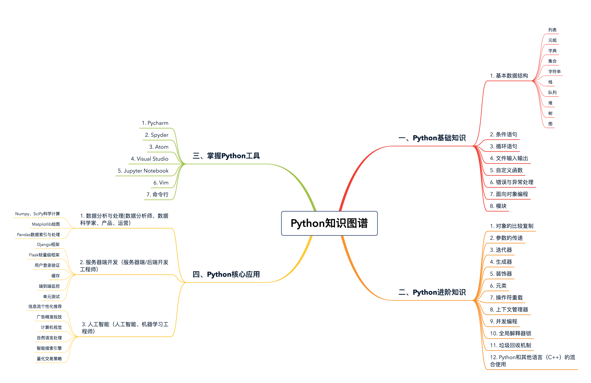

# 极客时间笔记 - Python核心技术

## 开篇词

从工程的角度深入理解Python


本专栏学习的中心观点：“从工程的角度去学习 Python“

编程语言本就是人类控制计算机的指令，语法规则等方面自然大同小异。

最典型的“编程语言两问”：

- 你了解你学过的每种编程语言的特点吗？
- 你能根据不同的产品需求，选用合适的编程语言吗？

很多公司都是这样，服务器端开发基于 Python，但底层的基础架构依赖于 C++。这就是典型的“不同需求选用不同语言”。毕竟，你要明白，哪怕只是几十到几百毫秒的速度差距，对于公司、对于用户体验来说都是决定性的。

编程语言的学习重点，总结成了下面这三步

1. 第一步：大厦之基，勤加练习

   不过，到底什么叫做必要的基础呢？以 Python 为例，如果你能够理解变量间的赋值、基本的数据类型、条件与循环语句、函数的用法，那么你就达到了第一步的底线标准，应该开始在课下多多练习了。
2. 第二步：代码规范，必不可少
3. 第三步：开发经验，质的突破

   

## Jupyter Notebook

主要是因为它的三大特点：整合所有的资源、交互性编程体验和零成本重现结果。


## 列表（list）和元组（tuple）到底用哪个

Python 中最常见的两种数据结构：列表（list）和元组（tuple）

### 列表和元组基础

什么是列表和元组呢？实际上，列表和元组，都是一个可以放置任意数据类型的有序集合。

在绝大多数编程语言中，集合的数据类型必须一致。不过，对于 Python 的列表和元组来说，并无此要求：

```python
l = [1, 2, 'hello', 'world']    # 列表中同时含有int和string类型的元素
print(l)    # res: [1, 2, 'hello', 'world']

tup = ('tom', 18)   # 元组中同时含有int和string类型的元素
print(tup)  # res: ('tom', 18)
```

其次，我们必须掌握它们的区别。

- 列表是动态的，长度大小不固定，可以随意地增加、删减或者改变元素（mutable）。
- 元组是静态的，长度大小固定，无法增加删减或者改变（immutable）。

下面的例子中，我们分别创建了一个列表与元组。你可以看到，对于列表，我们可以很轻松地让其最后一个元素，由 4 变为 40；但是，如果你对元组采取相同的操作，Python 就会报错，原因就是元组是不可变的。

```python
l = [1, 2, 3, 4]
l[3] = 40   # 和很多语言类型，python中的索引同样从0开始，l[3]表示访问列表第四个元素
print(l)

tup = (1, 2, 3, 4)
tup[3] = 40
"""
Traceback (most recent call last):
  File "/Users/suker/PycharmProjects/test/list-tuple.py", line 6, in <module>
    tup[3] = 40
TypeError: 'tuple' object does not support item assignment
"""
```

可是，如果你想对已有的元组做任何"改变"，该怎么办呢？那就只能重新开辟一块内存，创建新的元组了。

比如下面的例子，我们想增加一个元素 5 给元组，实际上就是创建了一个新的元组，然后把原来两个元组的值依次填充进去。

而对于列表来说，由于其是动态的，我们只需简单地在列表末尾，加入对应元素就可以了。如下操作后，会修改原来列表中的元素，而不会创建新的列表。

```python
tup = (1, 2, 3, 4)
new_tup = tup + (5, )   # 创建新的元组new_tup，并依次填充原元组的值
print(new_tup)  # res: (1, 2, 3, 4, 5)

l = [1, 2, 3, 4]
l.append(5)  # 添加元素5到原列表的末尾
print(l)    # res: [1, 2, 3, 4, 5]
```

