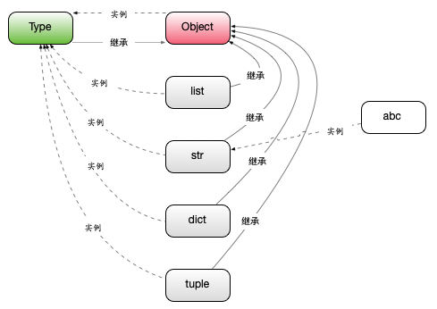
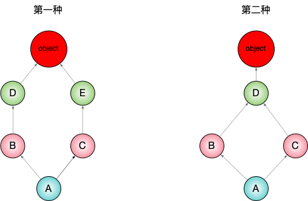

## Jupyter Notebook

什么是jupyter notebook？

按照 Jupyter 创始人 Fernando  Pérez 的说法，他最初的梦想是做一个综合 Ju （Julia）、Py （Python）和 R 三种科学运算语言的计算工具平台，所以将其命名为 Ju-Py-te-R。发展到现在，Jupyter  已经成为一个几乎支持所有语言，能够把软件代码、计算输出、解释文档、多媒体资源整合在一起的多功能科学运算平台。

三大特点：整合所有的资源、交互性编程体验和零成本重现结果。

推荐下面这些 Jupyter  Notebook，作为你实践的第一站。

- 第一个是 Jupyter  官方：https://mybinder.org/v2/gh/binder-examples/matplotlib-versions/mpl-v2.0/?filepath=matplotlib_versions_demo.ipynb
- 第二个是 Google Research 提供的 Colab  环境，尤其适合机器学习的实践应用：https://colab.research.google.com/notebooks/basic_features_overview.ipynb

> 如果你想在本地或者远程的机器上安装  Jupyter  Notebook，可以参考下面的两个文档。
>
> 安装：https://jupyter.org/install.html
>
> 运行：https://jupyter.readthedocs.io/en/latest/running.html#running

> Jupyter本地的两种安装办法： 
>
> 1.安装Anconda。conda包含科学计算的几乎所有包，包含jupyter。
>
> 2.仅安装了Python。可以pip install ipython, jupyter。安装即可。 命令行启动jupyter：jupyter notebook
>
> 国内建议pip install -i https://pypi.douban.com/simple/ notebook

## python一切皆对象

### Python中一切皆对象

主要知识点：动态语言和静态语言的区别、函数和类也是对象属于一等公民

#### 动态语言和静态语言的区别

静态语言，比如java中也是号称所有都是面向对象编程，实际上python的面向对象比java更彻底，python中一切皆对象这一理念几乎是python语言灵活的根本，比如后面遇到的元类编程、猴子布丁（monkey pack）都是基于python一切皆对象这里原理实现的。

问：java中一切皆对象，怎么在java中没有这些概念呢？

实际上，python中的面向对象比在java中更彻底，在java中有object、class概念，object是class的一个实例，在python中class实际上也是一个对象，包括常见的函数也是，在java当中并不是这样的，所以说由于这些，python中一切皆对象这一概念才能让python语言动态性得到充分体现，除了常用的函数和类以外，包括代码和模块也是对象。

问：类和函数怎么能成为对象？特别是类

类可以实例化对象，本身是对象怎么能实例化一个对象呢？python中的类可以理解为一个模版，python根据类的模版去生成对象，这个模版实际上也是一个对象，可以简单的理解为模版对象，python根据模版对象生成一个真正的对象。重要的一点，类是一个属性，可以动态修改其属性。

#### 函数和类也是对象，属于一等公民

一等公民怎么理解？

1. 赋值给一个变量

   函数：

   ```python
   def ask(name='Tom'):
       print(name)
       
   my_func = ask  # 将函数赋值给变量
   my_func('Tom')  # 可以将变量当作函数使用
   """
   Tom
   """
   ```

   函数对象赋值给变量，对变量操作实际上是对函数操作，说明函数也是一等公民

   类：

   ```python
   class Person:
       def __init__(self):
           print('Tom')
           
   my_class = Person  # 将类赋值给变量
   my_class()  # 调用变量对类实例化
   """
   Tom
   Out[2]: <__main__.Person at 0x7facf9449610>
   """
   ```

   以上实验说明函数和类都是对象

2. 可以添加到集合对象中

   ```python
   obj_list = []
   obj_list.append(ask)
   obj_list.append(Person)
   for item in obj_list:
       print(item)
   """
   <function ask at 0x7faca8403430>
   <class '__main__.Person'>
   """
   ```

3. 可以作为参数传递给函数

4. 可以当作函数的返回值（装饰器实现的原理）

   ```python
   def decorator_func():
       print('desc start')
       return ask
   
   my_ask = decorator_func()
   my_ask('tom')
   """运行结果
   desc start
   tom
   """
   ```

### type、object和class的关系

1. type->class->obj（type生成class，class生成obj对象）关系

   ```python
   a = 1
   b = 'abc'
   print(type(1))  # <class 'int'>, 由int类生成
   print(type(int))  # <class 'type'>，由type类生成
   print(type(b))  # <class 'str'>，由str生成
   print(type(str))  # <class 'type'>，由type类生成
   ```

   关系：type->class->obj（type生成class，class生成obj对象）

   那么自己定义的类呢？

   ```python
   class Student:
       pass
   stu = Student()
   print(type(stu))
   print(type(Student))
   """运行结果
   <class '__main__.Student'>
   <class 'type'>
   """
   ```

   所以也是符合type->class->obj逻辑的。

   验证常见的类型list是否符合type->class->obj逻辑

   ```python
   a = [1,2]
   print(type(a))
   print(type(list))
   """运行结果符合
   <class 'list'>
   <class 'type'>
   """
   ```

2. object是所有类的都继承的最顶层基础类, 所有类推导到最后都是object类

   ```python
   class MyStudent(Student):
       pass
      
   # 查看MyStudent的基类
   print(MyStudent.__bases__)
   # 查看Student的基类
   print(Student.__bases__)
   """运行结果
   (<class '__main__.Student'>,)
   (<class 'object'>,)
   """
   ```

3. type是一个类同时也是一个对象

   ```python
   print(type.__bases__)
   print(type(object))
   print(object.__bases__)
   """运行结果
   (<class 'object'>,)
   <class 'type'>
   ()
   """
   ```

python一切皆对象释义图



> type创建了所有的实例，包含自身，所以一切皆对象。
> type继承了object对象，但是object也是type的一个实例。

### python常见的内置类型

对象的三个特征

1. 身份

   可以理解为对象在内存当中的地址

   ```python
   a = 1
   id(a) # 可以理解为指针指向这个地址
   """
   Out[1]: 4521958080 
   """
   ```

2. 类型

   对象都是由类型的，1为int，字符串'abc'为str，python语言类型比java和c++更丰富

3. 值

   `a = 1`，1就是值，1是int类型对象

内置类型

1. None类型（全局只有一个）

   ```python
   a = None
   b = None
   id(a) == id(b)
   """
   Out[2]: 4521958080 
   """
   ```

2. 数值类型 int，float，complex（复数），bool

3. 迭代类型（可以用for循环遍历）

4. 序列类型

5. list，bytes、bytearray、memoryview（二进制序列），range，tuple，str，array

6. 映射(dict)

7. 集合 set，frozenset

8. 上下文管理类型（with）

9. 其他

   模块类型，class和实例，函数类型，方法类型，代码类型，object对象，type类型，ellipsis类型（省略号类型），notimplemented类型（面向对象高级使用这中类型）

**小结**

Python作为动态语言，缺乏静态语言的严谨性，静态在编译的过程中就可以检查数据类型，但python一切皆对象，使得代码没有贬义过程，这样代码的错误只有在运行过程中被发现，这也是动态语言的一大缺点。

## 魔法方法

### 什么是魔法方法

```python
class Company(object):
    def __init__(self, employee_list):
        self.employee = employee_list

# 遍历公司员工
company = Company(['tom', 'bob', 'jane'])
employee = company.employee
for em in employee:
    print(em)
```

魔术方法以双下划线`__`开头，以双下划线`__`结尾，不需要自定义，使用python语言定义的即可。

`__getitem__`

```python
class Company(object):
    def __init__(self, employee_list):
        self.employee = employee_list
    def __getitem__(self, item):
        return self.employee[item]
# 遍历公司员工
company = Company(['tom', 'bob', 'jane'])
for em in company:
    print(em)
```

### python的数据模型以及数据模型对python的影响

`__getitem__`影响

```python
company = company[:2]
for em in company:
    print(em)
"""
tom
bob
"""
```

魔术方法会影响到python语法本身，也会影响python内置函数使用

```python
print(len(company))
"""
2
"""
```

注释`__getitem__`后再次调用`len(company)`报错没有len方法

```
TypeError: object of type 'Company' has no len()
```

`__len__`魔术方法

```python
class Company(object):
    def __init__(self, employee_list):
        self.employee = employee_list
    
    def __len__(self):
        return len(self.employee)
    
company = Company(['tom', 'bob', 'jane'])
print(len(company))
"""
3
"""
```

没有这个魔术方法前面通过`company[:2]`切片后怎么会有len(company)方法，注意这是切片后会得到一个list，list本身是有实现`__len__`魔术方法函数的。

### python魔术方法一览

#### 非数学运算魔术方法

1. 字符串表示`__repr__`,`__str__`
2. 集合、序列相关 `__len__`, `__getitem__`, `__setitem__`, `__delitem__`, `__contains__`
3. 迭代相关  `__iter__`, `__next__`
4. 可调用  `__call__`
5. with上下文管理器  `__enter__`, `__exit__`
6. 数值转换  `__abs__`, `__bool__`, `__int__`, `__float__`, `__hash__`, `__index__`
7. 元类相关  `__new__`, `__init__`
8. 属性相关  `__getattr__`, `__setattr__`, `__getattribute__`, `__setattribute__`, `__dir__`
9. 属性描述法  `__get__`, `__set__`, `__delete__`
10. 协程  `__await__`, `__aiter__`, `__anext__`, `__aenter__`, `__aexit__`

示例：`__str__`

```python
class Company(object):
    def __init__(self, employee_list):
        self.employee = employee_list
        
company = Company(['tom', 'bob', 'jane'])
print(company)
"""
<__main__.Company object at 0x7f9498e7a7f0>
"""
```

希望自定义打印company

```python
def __str__(self):
        return ','.join(self.employee)
```

运行结果

```
tom,bob,jane
```

示例：`__repr__`

```python
class Company(object):
    def __init__(self, employee_list):
        self.employee = employee_list
    def __str__(self):
        return ','.join(self.employee)
        
company = Company(['tom', 'bob', 'jane'])
company
"""
Out[4]: <__main__.Company at 0x7f9498d05460>
"""
```

company会调用`__repr__`魔术方法

```python
def __repr__(self):
        return ','.join(self.employee)
```

再次执行

```
Out[5]: tom,bob,jane
```

此时调用company就会打印了employee信息

魔术方法定义了就没必要调用，python解释器会会自动识别调用。

#### 数学运算魔术方法

1. 一元运算符 `__neg__`（-）	`__pos__`（+）	`__abs__`
2. 二元运算符 `__lt__`(<)	`__le__`(<=)	`__eq__` (==)	`__ne__`(!=)	 `__gt__`(>)	`__ge__` (>=)
3. 算术运算符 `__add__` (+)	 `__sub__` (-)	`__mul__` (*)	`__truediv__` ( /)	`__floordiv__` (//)	`__mod__` (%)	`__divmod__` (divmod())	`__pow__`( ** 或 pow())	`__round__`(round())
4. 反向算术运算符 `__radd__`	`__rsub__`	`__rmul__`	`__rtruediv__`	`__rfloordiv__`	`__rmod__`	`__rdivmod__`	`__rpow__`
5. 增量赋值算术运算符 `__iadd__`	`__isub__`	`__imul__`	`__itruediv__`	`__ifloordiv__`	`__imod__`	`__ipow__`
6. 位运算符 `__invert__` (~)	`__lshift__`(<<)	`__rshift__` (>>)	`__and__` (&)	`__or__` (|)	`__xor__` (^)
7. 反向位运算符 `__rlshift__`  `__rrshift__`  `__rand__`  `__rxor__`  `__ror__`
8. 增量赋值位运算符`__ilshift__`	`__irshift__`	`__iand__`	`__ixor__`	`__ior__`

示例：`__abs__`

```python
class Nums(object):
    def __init__(self, num):
        self.num = num
        
    def __abs__(self):
        return abs(self.num)

my_num = Nums(-1)
abs(my_num)
"""
Out[6]: 1
"""
```

`__add__`

```python
class MyVector(object):
    def __init__(self, x, y):
        self.x = x
        self.y = y
    def __add__(self, other):
        my_vector = MyVector(self.x + other.x, self.y + other.y)
        return my_vector
    def __str__(self):
        return 'x:{x}, y:{y}'.format(x=self.x, y=self.y)

first_vector = MyVector(1,2)
second_vector = MyVector(2,3)
print(first_vector + second_vector)
"""
x:3, y:5
"""
```

### len函数的特殊性

len(list/set/dict)

比如冷对list这种c语言写的数据结构可以直接读取list中的一个变量就知道list的长度而不需要去遍历list中的每个数据，len方法会根据不用的类型调用不同的处理方法。

因此我们尽量使用python原生的数据类型，性能更高。

## 深入类和对象

### 鸭子类型和多态

当看到一只鸟走起来像鸭子，叫起来像鸭子，那么这只鸟被称作鸭子

多态在python类中实现共同的方法名即可

```python
class Cat(object):
    def say(self):
        print('i am a cat')

class Dog(object):
    def say(self):
        print('i am a dog')

class Duck(object):
    def say(self):
        print('i am a duck')

if __name__ == '__main__':
    animal = Cat
    animal().say()
    """
    i am a cat
    """
    animals = [Cat, Dog, Duck]
    for an in animals:
        an().say()
    """
    i am a cat
		i am a dog
		i am a duck
    """
```

extend方法

```python
 def extend(self, *args, **kwargs): # real signature unknown
        """ Extend list by appending elements from the iterable. """
        pass
```

说明的参数是iterable类型就可以，可以是内置，也可以是自定义

```python
class Company(object):
    def __init__(self, employee_list):
        self.employee = employee_list
       
		# 通过魔术方法可以分组数据类型
    def __getitem__(self, item):
        return self.employee[item]

a = ['tom', 'jack']
# list类型
name_list = ['lily', 'mark']
# tuple类型
name_tuple = ('alex', 'jane')
# set类型
name_set = set()
name_set.add('jimmy')
name_set.add('vicky')
# 自定义iterable类型
company = Company(['bob', 'tom', 'jane'])

a.extend(name_list)
a.extend(name_tuple)
a.extend(name_set)
a.extend(company)

print(a)
"""
['tom', 'jack', 'lily', 'mark', 'alex', 'jane', 'jimmy', 'vicky', 'bob', 'tom', 'jane']
"""
```

### 抽象基础类（abc模块）

python动态语言中变量是没有类型的，可以赋值任何数据给变量，并且不需要指明类型

什么是抽象基类？

1. 继承抽象基类的类必须实现抽象基类中的方法
2. 抽象基类无法实例化

问：直接实现方法，为什么还要抽象基类？

检查某个类是否有某种方法

```python
class Company(object):
    def __init__(self, employee_list):
        self.employee = employee_list

    def __len__(self):
        return len(self.employee)

company = Company(['tom', 'alex', 'jack'])
print(len(company))
```

我们怎么知道有len方法呢？

```
print(hasattr(company, '__len__'))
```

返回true便是有len方法。

第一种情况：如果没有抽象方法就要使用hasattr方法了，我们在某些情况之下希望判定某个对象的类型呢？

```python
from collections.abc import Sized
print(isinstance(company, Sized))
```

第二种情况：我们需要强制某个字类必须实现某些方法

实现一个web框架，集成Cache(redis, cache, memcache)，需要设计一个抽象基类，指定子类必须实现某些方法

```python
class CacheBase(object):
    def get(self, key):
        raise NotImplementedError

    def set(self, key, value):
        raise NotImplementedError

class RedisCache(CacheBase):
    pass

redis_cache = RedisCache()
redis_cache.set('key', 'value')
```

字类RedisCache没有实现set方法，此时不友好的是应用到才抛出异常，我们怎么在初始化就检测呢？

```python
import abc

class CacheBase(metaclass=abc.ABCMeta):
    @abc.abstractmethod
    def get(self, key):
        raise NotImplementedError
    @abc.abstractmethod
    def set(self, key, value):
        raise NotImplementedError

class RedisCache(CacheBase):
    pass

redis_cache = RedisCache()  # 此时就会报错
```

Redis实现抽象方法后错误消失

### instance和type的区别

```python
class A:
    pass

class B(A):
    pass

b = B()
# isinstance查找的是B和B一直往上向上查找的父类
print(isinstance(b, B))  # True
print(isinstance(b, A))  # True

print(type(b))  # <class '__main__.B'>
print(type(b) is B)  # True 判断是否是通过一个对象，即id(type(b)), id(B)是否相等
print(type(b) is A)  # False A和B是两个对象，id显然不同
```

### 类变量和实例变量

```python
class A:
    # 类变量
    aa = 1

    # self为实例变量
    def __init__(self, x, y):
        self.x = x
        self.y = y


a = A(1, 2)
print('实例变量：', 'x=', a.x, ', y=', a.y, 'aa=', a.aa)
print('类变量：aa=', A.aa)
print(A.x)  # 报错：类变量不会去查找实例变量
"""
实例变量： x= 1 , y= 2 aa= 1
类变量：aa= 1
AttributeError: type object 'A' has no attribute 'x'
"""
```

测试：修改类变量的值，示例访问类变量也会改变

```python
a = A(1, 2)
A.aa = 17
print('实例变量：', 'x=', a.x, ', y=', a.y, 'aa=', a.aa)
print('类变量：aa=', A.aa)
"""
实例变量： x= 1 , y= 2 aa= 17
类变量：aa= 17
"""
```

测试：修改实例变量值

```python
a = A(1, 2)
a.aa = 17
print('实例变量：', 'x=', a.x, ', y=', a.y, 'aa=', a.aa)
print('类变量：aa=', A.aa)
"""
实例变量： x= 1 , y= 2 aa= 17
类变量：aa= 1
"""
```

发现类变量的值没有改变，其实是对象a新建了一个变量aa

### 类属性和实例属性的查找顺序

算法演变过程：深度优先搜索算法 -> 广度优先算法 -> C3算法



目前采用c3算法，测试第二种

```python
class D:
    pass
class C(D):
    pass
class B(D):
    pass
class A(B, C):
    pass

print(A.__mro__)  # 查看属性查找顺序
"""
(<class '__main__.A'>, <class '__main__.B'>, <class '__main__.C'>, <class '__main__.D'>, <class 'object'>)
"""
```

### 类方法、静态方法和实例方法

实例方法

```python
class Date:
    def __init__(self, year, month, day):
        self.year = year
        self.month = month
        self.day = day

    def __str__(self):
        return '{year}/{month}/{day}'.format(year=self.year, month=self.month, day=self.day)

    def tomorrow(self):
        self.day += 1

if __name__ == '__main__':
    new_date = Date(2022, 10, 21)
    new_date.tomorrow()  # 实例方法，相当于tomorrow（new_date)
    print(new_date)
"""
2022/10/22
"""
```

静态方法

```python
class Date:
    def __init__(self, year, month, day):
        self.year = year
        self.month = month
        self.day = day

    @staticmethod
    def parse_from_setting(date_str):
        year, month, day = tuple(date_str.split('-'))
        return Date(int(year), int(month), int(day))

    def __str__(self):
        return '{year}/{month}/{day}'.format(year=self.year, month=self.month, day=self.day)


if __name__ == '__main__':
    date_str = '2022-10-21'
    print(Date.parse_from_setting(date_str))
```

缺点：类存在硬编码，如果Date修改类名，代码中的Date类名都要修改

使用类方法，解决硬编码

```python
@classmethod
def parse_from_setting(cls, date_str):
  year, month, day = tuple(date_str.split('-'))
  return Date(int(year), int(month), int(day))
```

那静态方法有什么用途呢，比如我们验证一个日期是否合法，不需要返回对象

```python
@staticmethod
def valid_date(date_str):
  year, month, day = tuple(date_str.split('-'))
  # 演示，不写逻辑了
  if year:
    return True
  else:
    return False
```

### 数据封装和私有属性

```python
from datetime import datetime as dt

class User:
    def __init__(self, birthday):
        self.birthday = birthday

    def get_age(self):
        return dt.now().year - self.birthday.year

if __name__ == '__main__':
    user = User(dt(1987, 12, 27))
    print(user.get_age(), user.birthday)
```

问：此时用户可以访问到属性birthday，如果不想让用户访问，该怎么办？

python中没有private，使用双下划线'__'即可

```python
class User:
    def __init__(self, birthday):
        self.__birthday = birthday

    def get_age(self):
        return dt.now().year - self.__birthday.year
```

此时无法通过`user.birthday`访问了，可以使用`user._User__birthday`访问，加双下划线只是使变量变形，并没有真正私有。

```python
class Student(User):
    def __init__(self, birthday):
        self.__birthday = birthday
```

这是birthday变形成了`stu._Student_birthday`，python的这一机制很好的解决了继承变量冲突的问题

### python对象的自省机制

自省是通过一定的机制查询到对象的内部结构

```python
class Person:
    """人类"""
    name = 'person'

class Student(Person):
    def __init__(self, school_name):
        self.school_name = school_name

if __name__ == '__main__':
    user = Student('网课')
    # 通过__dict__查询属性
    print(user.__dict__)
    print(Person.__dict__)
    
"""
{'school_name': '网课'}
{'__module__': '__main__', '__doc__': '人类', 'name': 'person', '__dict__': <attribute '__dict__' of 'Person' objects>, '__weakref__': <attribute '__weakref__' of 'Person' objects>}
"""
```

`print(user.name)`name其实属于person，不升级属于实例，只是可以调用

此外还可以通过`__dict__`修改属性

```
user.__dict__['school_addr'] = '上海'
print(user.school_addr)
```

`dir`比`__dict__`更强大，只显示属性

```python
print(dir(user))
"""
['__class__', '__delattr__', '__dict__', '__dir__', '__doc__', '__eq__', '__format__', '__ge__', '__getattribute__', '__gt__', '__hash__', '__init__', '__init_subclass__', '__le__', '__lt__', '__module__', '__ne__', '__new__', '__reduce__', '__reduce_ex__', '__repr__', '__setattr__', '__sizeof__', '__str__', '__subclasshook__', '__weakref__', 'name', 'school_name']
"""
```

`a=[1,2]`使用`__dict__`报错，可使用`dir`

### super函数

```python
class A:
    def __init__(self):
        print('A')

class B(A):
    def __init__(self):
        print('B')

b = B() 
"""
B
"""
```

使用super

```python
class A:
    def __init__(self):
        print('A')

class B(A):
    def __init__(self):
        print('B')
        super().__init__()

b = B()
"""
B
A
"""
```

问：1）既然我们重写B的构造函数，为什么要去调用super

​		2）super到底执行顺序是怎么样的

第1个问题：

```python
from threading import Thread
class MyThread(Thread):
    def __init__(self, name, user):
        self.user = user
        # self.name = name  # 没必要可以放在父类构造函数中，重用其代码
        super().__init__(name=name)
```

第二个问题

```python
class A:
    def __init__(self):
        print('A')

class B(A):
    def __init__(self):
        print('B')
        super(B, self).__init__()

class C(A):
    def __init__(self):
        print('C')
        super(C, self).__init__()
        
class D(B, C):
    def __init__(self):
        print('D')
        super(D, self).__init__()

if __name__ == '__main__':
    d = D()
    print(D.__mro__)
"""
D
B
C
A
(<class '__main__.D'>, <class '__main__.B'>, <class '__main__.C'>, <class '__main__.A'>, <class 'object'>)
""" 
```

super并不是调用父类函数的意思，而是按mro顺序来调用

### mixin继承案例：django rest framework中对多继承使用的经验

python中不建议使用多继承，使用mixin模式

mixin模式特点

1. mixin类功能单一

2. 不和基类关联，可以和任何基类组合，基类可以不和mixin关联就能初始化成功
3. 在mixin中不要使用super这种用法

### python中的with语句（上下文管理器）

try...except...finally

```python
try:
    print('code started')
    f = open('with.txt')
    raise KeyError
except KeyError as e:
    print('key error')
else:
    print('other error')
finally:
    print('finally')
    f.close() # 关闭资源
```

返回结果：

```python
def exe_try():
    try:
        print('code started')
        raise KeyError
        return 1
    except KeyError as e:
        print('key error')
        return 2
    else:
        print('other error')
        return 3
    finally:
        print('finally')
        return 4

print(exe_try())
"""
code started
key error
finally
4
"""
```

返回finally中的返回值

with语句用来简化try...except...finally

开发上下文管理器协议（魔术方法为`__enter__`，`__exit__`）

```python
class Simple:
    def __enter__(self):
        print('enter')
        # 获取资源
        return self

    def __exit__(self, exc_type, exc_val, exc_tb):
        # 释放资源
        print('exit')

with Simple() as sample:
    print('do something')
"""
enter
do something
exit
"""
```

### contextlib简化上下文管理器

```python
import contextlib

@contextlib.contextmanager
def file_open(file_name):
    print('file open')  # 相当于enter
    yield {}  # 生成器
    print('file end')  # 相当于exit

with file_open('hello.txt') as f:
    print('file processing')
    
"""
file open
file processing
file end
"""
```

## 自定义序列类

### python中的序列分类

1）可存放数据类型维度分类

1. 容器序列 list、tuple、duque
2. 扁平序列 str、bytes、bytearray、array.array(数组)

```python
l = list()
l.append(1)
l.append('abc')
```

容器类型可以放置不同数据类型的数据，只是一个容器

扁平序列可以使用for循环遍历

2）从是否可变维度分类

1. 可变序列 list、deque、bytearray、array
2. 不可变序列 str、tuple、bytes

### 序列类型的abc继承关系

from collections import abc

实现一个序列需要实现哪些魔术方法

### 序列的+、+=和extend的区别

```python
# +
a = [1, 2]
c = a + [3, 4]
print(c)
"""
[1, 2, 3, 4]
"""

# +=
a = [1, 2]
a += [3, 4]  # +=后可以为任意的序列类型
print(a)
a += (5, 6)
print(a)
"""
[1, 2, 3, 4]
[1, 2, 3, 4, 5, 6]
"""
c = a + (5, 6) # TypeError: can only concatenate list (not "tuple") to list

a.extend(range(3)) # iterable类型的都可以
a.extend(range(3))
a.extend((1, 2))
a.extend([6, 8])

a.append(4)  # 只能是一个元素
a.append('abc')
```

### 实现可切片对象（没有理解？？？）

```python
#模式[start:end:step]
"""
    其中，第一个数字start表示切片开始位置，默认为0；
    第二个数字end表示切片截止（但不包含）位置（默认为列表长度）；
    第三个数字step表示切片的步长（默认为1）。
    当start为0时可以省略，当end为列表长度时可以省略，
    当step为1时可以省略，并且省略步长时可以同时省略最后一个冒号。
    另外，当step为负整数时，表示反向切片，这时start应该比end的值要大才行。
"""
aList = [3, 4, 5, 6, 7, 9, 11, 13, 15, 17]
print (aList[::])  # 返回包含原列表中所有元素的新列表
print (aList[::-1])  # 返回包含原列表中所有元素的逆序列表
print (aList[::2])  # 隔一个取一个，获取偶数位置的元素
print (aList[1::2])  # 隔一个取一个，获取奇数位置的元素
print (aList[3:6])  # 指定切片的开始和结束位置
aList[0:100]  # 切片结束位置大于列表长度时，从列表尾部截断
aList[100:]  # 切片开始位置大于列表长度时，返回空列表

aList[len(aList):] = [9]  # 在列表尾部增加元素
aList[:0] = [1, 2]  # 在列表头部插入元素
aList[3:3] = [4]  # 在列表中间位置插入元素
aList[:3] = [1, 2]  # 替换列表元素，等号两边的列表长度相等
aList[3:] = [4, 5, 6]  # 等号两边的列表长度也可以不相等
aList[::2] = [0] * 3  # 隔一个修改一个
print (aList)
aList[::2] = ['a', 'b', 'c']  # 隔一个修改一个
aList[::2] = [1,2]  # 左侧切片不连续，等号两边列表长度必须相等
aList[:3] = []  # 删除列表中前3个元素

del aList[:3]  # 切片元素连续
del aList[::2]  # 切片元素不连续，隔一个删一个
```

实现一个类的切片操作

实现Sequence序列里的抽象魔法方法`__getitem__`是关键

```python
import numbers
class Group:
    #支持切片操作
    def __init__(self, group_name, company_name, staffs):
        self.group_name = group_name
        self.company_name = company_name
        self.staffs = staffs

    def __reversed__(self):
        self.staffs.reverse()

    def __getitem__(self, item):
      	# self.staffs[item]这种用法item会被python转换为slice对象传入到实例里面去
        cls = type(self)
        if isinstance(item, slice):
            return cls(group_name=self.group_name, company_name=self.company_name, staffs=self.staffs[item])
        elif isinstance(item, numbers.Integral):
            return cls(group_name=self.group_name, company_name=self.company_name, staffs=[self.staffs[item]])

    def __len__(self):
        return len(self.staffs)

    def __iter__(self):
        return iter(self.staffs)

    def __contains__(self, item):
        if item in self.staffs:
            return True
        else:
            return False

staffs = ["bobby1", "imooc", "bobby2", "bobby3"]
group = Group(company_name="imooc", group_name="user", staffs=staffs)
# sub_group = group[:2] # 调试
reversed(group)
for user in group:
    print(user)
```

### bisect维护已排列序列

```python
import bisect

inter_list = []
bisect.insort(inter_list, 5)
bisect.insort(inter_list, 2)
bisect.insort(inter_list, 6)
bisect.insort(inter_list, 3)
print(inter_list)

print(bisect.bisect_left(inter_list, 3))  # 查看3位置的左侧位置
print(bisect.bisect(inter_list, 3))  # 查看3在有序列表中的位置, bisect_right与其相同
print(bisect.bisect_right(inter_list, 3))
"""
[2, 3, 5, 6]
1
2
2
"""
```

### 什么时候不该使用列表

array和list的区别，array只能存放单一的数据类型，这中情况array更高效

```
import array

my_array = array.array('i')  # 只能存储类型为signed integer
my_array.append(1)
my_array.append('abc') # TypeError: an integer is required (got type str)
```

### 列表推导式、生成器表达式、字典推导式

1. 列表推导式

   ```
   odd_list = []
   for i in range(11):
       if i % 2 == 1:
           odd_list.append(i)
   
   # 列表推倒式
   odd_list = [i for i in range(11) if i % 2 == 1]
   
   # 逻辑复杂的列表推倒式
   def handle_item(item):
       return item * item
   
   odd_list = [handle_item(i) for i in range(11) if i % 2 == 1]
   ```

   列表生成式性能高于列表操作

2. 生成器表达式

   ```python
   odd_gen = (i for i in range(11) if i % 2 == 1)
   ```

3. 字典推导式

   ```python
   my_dict = {'a': 1, 'b': 2, 'c': 3}
   reversed_dict = {val: key for key, val in my_dict.items()}
   ```

4. 集合推导式

   ```python
   my_dict = {'a': 1, 'b': 2, 'c': 3}
   my_set = {key for key, val in my_dict.items()}
   # 或
   my_set = my_dict.keys()
   ```

## 深入python set和dict

### dict的abc继承关系

```python
from collections.abc import Mapping, MutableMapping
a = {}
print(isinstance(a, MutableMapping)) # True
```

并不是dict继承了Mapping, MutableMapping，只是实现了其魔术方法

### dict的常用方法

clear() 清空字典

```python
a = {'li': {'company': 'baidu'}, 'ma': {'company': 'ali'}}
a.clear()  # 
print(a)
"""
{}
"""
```

copy() 返回浅拷贝

```python
a = {'li': {'company': 'baidu'}, 'ma': {'company': 'ali'}}
new_dict = a.copy()
new_dict['ma']['company'] = 'alibaba'
print(new_dict)
print(a) # 浅拷贝后修改new_dict会影响原字典a的值
"""
{'li': {'company': 'baidu'}, 'ma': {'company': 'alibaba'}}
{'li': {'company': 'baidu'}, 'ma': {'company': 'alibaba'}}
"""
```

深拷贝copy.deepcopy()

```python
import copy

a = {'li': {'company': 'baidu'}, 'ma': {'company': 'ali'}}
new_dict = copy.deepcopy(a)
new_dict['ma']['company'] = 'alibaba'
print(new_dict)
print(a) # 修改new_dict后为影响原字典a的值
"""
{'li': {'company': 'baidu'}, 'ma': {'company': 'alibaba'}}
{'li': {'company': 'baidu'}, 'ma': {'company': 'ali'}}
"""
```

update() 更新字典

```python
a = {'a': 1, 'b': 2}
a.update(c=3)
a.update({'d': 4})
a.update([('e', 5)])
a.update((('f', 6),))
```

from_keys() 静态方法

```python
new_list = ['a', 'b']
new_dict = dict.fromkeys(new_list, 1)
print(new_dict)
"""
{'a': 1, 'b': 1}
"""
```

get()

```python
new_dict = {'a': 1, 'b': 2}
# new_dict['c']  # KeyError: 'c'
new_dict.get('a')
new_dict.get('c', None)  # 获取字典中key为c的值，没有就返回默认值None
```

items()

```python
new_dict = {'a': 1, 'b': 2}
for k, v in new_dict.items():
    print(k, v)
```

setdefault()

```python
new_dict = {'a': 1, 'b': 2}
default_val = new_dict.setdefault('c',  3) # 返回key的值
print(default_val)
print(new_dict)
"""
3
{'a': 1, 'b': 2, 'c': 3}
"""
```

### dict的子类

不建议继承dict和list

```python
class Mydict(dict):
    def __setitem__(self, key, value):
        super().__setitem__(key, value * 2)


my_dict = Mydict(one=1)
print(my_dict)  # 没有生效，在某些情况下c语言写的dict不会调用覆盖的方法
my_dict['two'] = 2  # 生效
print(my_dict)
"""
{'one': 1}
{'one': 1, 'two': 4}应该是{'one': 2}
"""
```

如果继承

```python
from collections import UserDict

class Mydict(UserDict):
    def __setitem__(self, key, value):
        super().__setitem__(key, value * 2)

my_dict = Mydict(one=1)
my_dict['two'] = 2
print(my_dict)
"""
{'one': 2, 'two': 4}
"""
```

defaultdict

```python
from collections import defaultdict
my_dict = defaultdict(dict)
my_val = my_dict['abc']  # key不存在，返回{}
```

### set和fronzenset（不可变集合）

集合特点：不重复，无序

```python
s = set('abc') # 初始化中参数为可迭代类型即可
s2 = set(['a', 'b', 'c'])
s3 = set(('a', 'b', 'c'))

s4 = set('abccc')  # 集合中元素会自动去重
"""
{'a', 'b', 'c'}
"""

s5 = frozenset('abc')  # 不可变了

# 向set中添加数据
another_set = set('efg')
s.add('d')
s.update(another_set)
print(s)
"""
{'b', 'g', 'f', 'c', 'd', 'a', 'e'}
"""

# in
if 'c' in s:
    print('i am in set c')
print(another_set.issubset(s))  # True


# 求差集
re_set = s.difference(another_set)  # 有返回值，没有修改s
print(re_set)
print(s)
"""
{'b', 'd', 'c', 'a'}
{'f', 'b', 'd', 'g', 'e', 'c', 'a'}
"""

# 集合运算符
re_set = s - another_set  # 差
print(re_set)
re_set2 = s & another_set  # 与
print(re_set2)
re_set3 = s | another_set  # 或
print(re_set3)
"""
{'b', 'd', 'a', 'c'}
{'g', 'e', 'f'}
{'b', 'e', 'a', 'g', 'd', 'f', 'c'}
"""
```

### dict和set的实现原理

dict查找的性能远远大于list。

在list中随着list数据的增大查找时间会增大；在dict中查找元素不会随着dict的增大而增大。

问：怎么解决hash冲突？？？？

dict的key或set的值，都必须是可以hash的。

不可变对象都是hash的，str，frozenset，tuple， 自定义类(实现`__hash__`的类)

dict的内存开销大但是查询速度快，自定义的对象和python内部的对象都是用dict包装的

dict的存储顺序和元素添加顺序有关

添加数据可能会改变dict的存储书序（跟数组扩大有关）

### 对象引用、可变性和垃圾回收

python中变量是什么？

python和java中的变量本质不一样，python的变量实际上是一个指针，可理解为便利贴

```python
a = 1  # a贴在1上面，过程是先生成对象，然后贴便利贴

a = [1, 2]
b = a
b.append(3)
print('a:', a)
print('b:', b)
"""
a: [1, 2, 3]
b: [1, 2, 3]
"""

print(a is b) # 返回True表示是一个对象
# 或
print(id(a) == id(b))
```

### is和==的区别

```python
a = [1, 2, 3, 4]
b = [1, 2, 3, 4]
print(a is b)  # false
print(id(a), id(b))  # id很明显不一样
print(a == b)  # 调用__eq__魔法函数

# 对简单类型请注意
a = 1
b = 1
print(a is b)  # True

a = 'abc'
b = 'abc'
print(a is b)  # True

class Person:
    pass

person = Person()
if type(person) is Person:
    print('yes')
```

### del语句和垃圾回收

python中垃圾回收的算法采用引用计数

```python
a = 1
b = a
del a
print(b)

a = object()
b = a
del a
print(b)
print(a)
```

del并不是删除对象，而是引用计数-1

```python
class A:
	def __del__(self):
		pass
```

### 一个经典的参数错误

```python
def add(a, b):
    a += b
    return a

if __name__ == '__main__':
    a = 1
    b = 2
    c = add(a, b)
    print(c)
    print(a, b)
    """
    3
		1 2
    """

    a = [1, 2]
    b = [3, 4]
    c = add(a, b)
    print(c)
    print(a, b)
    """
    [1, 2, 3, 4]
		[1, 2, 3, 4] [3, 4]
    """

    a = (1, 2)
    b = (3, 4)
    c = add(a, b)
    print(c)
    print(a, b)
    """
    (1, 2, 3, 4)
		(1, 2) (3, 4)
    """
```

类中参数：

```python
class Company:
    def __init__(self, name, staffs=[]):
        self.name = name
        self.staffs = staffs

    def add(self, staff_name):
        self.staffs.append(staff_name)

    def remove(self, staff_name):
        self.staffs.remove(staff_name)

if __name__ == '__main__':
    com1 = Company('com1', ['s1', 's2'])
    com1.add('s3')
    com1.remove('s1')
    print(com1.staffs)

    com2 = Company('com2')
    com2.add('s4')

    com3 = Company('com3')
    com3.add('s5')

    print(com2.staffs)
    print(com3.staffs)
    print(com2.staffs is com3.staffs)
    
"""
['s2', 's3']
['s4', 's5']
['s4', 's5']
True
"""
```

com2和com3没有传递staffs参数，都使用默认空list(`Company.__init__.__defaults__`)这是可变的

## 元类编程

### property动态属性

```python
from datetime import datetime, date

class User:
    def __init__(self, name, birthday):
        self.name = name
        self.birthday = birthday
        # self.age = age

    # def get_age(self):
    #     return datetime.now().year - self.birthday.year

    @property
    def age(self):
        return datetime.now().year - self.birthday.year

if __name__ == '__main__':
    user = User('tom', date(year=1987, month=12, day=27))
    print(user.age)
```

不实用类属性age了，不可能全部代码都修改为get_age，此时使用property属性将age方法修改为动态属性。

设置age值

```python
class User:
    def __init__(self, name, birthday):
        self.name = name
        self.birthday = birthday
        self._age = 0

    @property
    def age(self):
        return datetime.now().year - self.birthday.year

    @age.setter
    def age(self, value):
        self._age = value


if __name__ == '__main__':
    user = User('tom', date(year=1987, month=12, day=27))
    user.age = 30
    print(user._age, user.age)
"""输出结果
30 35
"""
```

### `__getattr__`、`__getattribute__`魔法方法

`__getattr__`在查找不到属性的时候调用

```python
class User:
    def __init__(self, name):
        self.name = name

    def __getattr__(self, item):
        return 'not find attr'

if __name__ == '__main__':
    user = User('tom')
    print(user.name)
    print(user.age)  # 没有age属性
    
"""
tom
not find attr
"""
```

`__getattribute__`有没有都会调用这个函数

```python
class User:
    def __init__(self, name):
        self.name = name

    def __getattr__(self, item):
        return 'not find attr'

    def __getattribute__(self, item):
        return 'haha'

if __name__ == '__main__':
    user = User('tom')
    print(user.name)
    print(user.age)
"""
haha
haha
"""
```

### 属性描述符和属性查找过程

```python
from datetime import date, datetime
import numbers

class IntField:
    #数据描述符
    def __get__(self, instance, owner):
        return self.value
    def __set__(self, instance, value):
        if not isinstance(value, numbers.Integral):
            raise ValueError("int value need")
        if value < 0:
            raise ValueError("positive value need")
        self.value = value
    def __delete__(self, instance):
        pass


class NonDataIntField:
    #非数据属性描述符
    def __get__(self, instance, owner):
        return self.value

class User:
    age = IntField()
    # age = NonDataIntField()

'''
如果user是某个类的实例，那么user.age（以及等价的getattr(user,’age’)）
首先调用__getattribute__。如果类定义了__getattr__方法，
那么在__getattribute__抛出 AttributeError 的时候就会调用到__getattr__，
而对于描述符(__get__）的调用，则是发生在__getattribute__内部的。
user = User(), 那么user.age 顺序如下：

（1）如果“age”是出现在User或其基类的__dict__中， 且age是data descriptor， 那么调用其__get__方法, 否则

（2）如果“age”出现在user的__dict__中， 那么直接返回 obj.__dict__[‘age’]， 否则

（3）如果“age”出现在User或其基类的__dict__中

（3.1）如果age是non-data descriptor，那么调用其__get__方法， 否则

（3.2）返回 __dict__[‘age’]

（4）如果User有__getattr__方法，调用__getattr__方法，否则

（5）抛出AttributeError

'''

# class User:
#
#     def __init__(self, name, email, birthday):
#         self.name = name
#         self.email = email
#         self.birthday = birthday
#         self._age = 0
#
#     # def get_age(self):
#     #     return datetime.now().year - self.birthday.year
#
#     @property
#     def age(self):
#         return datetime.now().year - self.birthday.year
#
#     @age.setter
#     def age(self, value):
#         #检查是否是字符串类型
#         self._age = value

if __name__ == "__main__":
    user = User()
    user.__dict__["age"] = "abc"
    print (user.__dict__)
    print (user.age)
    # print (getattr(user, 'age'))
    # user = User("bobby", date(year=1987, month=1, day=1))
    # user.age = 30
    # print (user._age)
    # print(user.age)
```

描述符分为数据描述符和非数据描述符。

把至少实现了内置属性__set__()和__get__()方法的描述符称为数据描述符；把实现了除__set__()以外的方法的描述符称为非数据描述符。之所以要区分描述符的种类，主要是因为它在代理类属性时有着严格的优先级限制。例如当使用数据描述符时，因为数据描述符大于实例属性，所以当我们实例化一个类并使用该实例属性时，该实例属性已被数据描述符代理，此时我们对该实例属性的操作是对描述符的操作。

描述符的优先级的高低如下：类属性 > 数据描述符 > 实例属性 > 非数据描述符 > 找不到的属性触发`__getattr__()`

### `__new__`和`__init__`的区别

```python
class User:
    def __new__(cls, *args, **kwargs):
        print('in new')
        return super().__new__(cls)

    def __init__(self, name):
        print('in init')
        self.name = name
# new是用来控制对象的生成过程，在对象生成之前。
# init是用来完善对象的
# 如果new方法不返回对象，则不会调用init函数

if __name__ == '__main__':
    user = User(name='tom')
```

### 自定义元类

```python
def create_class(name):
    if name == 'user':
        class User:
            def __str__(self):
                return 'user'
        return User
    elif name == 'company':
        class Company:
            def __str__(self):
                return 'company'
        return Company

if __name__ == '__main__':
    MyClass = create_class('user')
    my_obj = MyClass()
    print(my_obj)
```

上述创建类很不灵活，怎么不用class动态去创建类呢？

使用type创建动态类

```python
def say(self):
    return 'i am user'

class BaseClass:
    def answer(self):
        return 'i am baseclass'

if __name__ == '__main__':
    User = type('User', (BaseClass,), {'name': 'user', 'say': say})
    user = User()
    print(user.say())
    print(user.answer())
```

什么是元类？元类是创建类的类。对象 <- class(对象) <- type

python中类的实例化过程，会首先寻找metaclass，通过metaclass去创建user类

```python
class MetaClass(type):
    def __new__(cls, *args, **kwargs):
        return super().__new__(cls, *args, **kwargs)

class User(metaclass=MetaClass):
    def __init__(self, name):
        self.name = name

    def __str__(self):
        return 'user'

if __name__ == '__main__':
    user = User('tom')
    print(user)
```

元类继承方式可以任意修改类本身的各种组织方式，。但是普通继承方式做不到

### 通过元类实现orm

需求

```
class User:
	name = CharField(db_column="", max_length=10)
	age = IntField(db_column="", min_value=0, max_value=100)
	
	class Meta:
		db_table = 'user'
		
if __name__ == '__main__':
	user = User()
	user.name = 'bobby'
	user.age = 28 	# 可以对数据类型检测
	user.save() # 保存到数据表中
```

```python
class Field:
    def __init__(self, name, column_type):
        self.name = name
        self.column_type = column_type

    def __str__(self):
        return '%s:%s' % (self.name, self.column_type)


class IntField(Field):
    def __init__(self, name):
        super(IntField, self).__init__(name, 'bigint')


class StringField(Field):
    def __init__(self, name):
        super(StringField, self).__init__(name, 'varchar(100)')


class ModelMetaClass(type):
    def __new__(cls, name, bases, attrs, **kwargs):
        if name == 'Model':
            return type.__new__(cls, name, bases, attrs, **kwargs)
        mappings = dict()
        for k, v in attrs.items():
            if isinstance(v, Field):
                mappings[k] = v
        for k in mappings:
            attrs.pop(k)
        attrs['__mappings__'] = mappings
        attrs['__table__'] = name
        return type.__new__(cls, name, bases, attrs, **kwargs)


class Model(dict, metaclass=ModelMetaClass):
    def __init__(self, **kwargs):
        super(Model, self).__init__(**kwargs)

    def __getattr__(self, key):
        try:
            return self[key]
        except KeyError:
            raise AttributeError(r"'Model' object has no attribute '%s'" % key)

    def __setattr__(self, key, value):
        self[key] = value

    def save(self):
        fields = list()
        args = list()
        params = list()
        for k in self.__mappings__:
            print(k)
            fields.append(k)
            params.append('?')
            args.append(str(getattr(self, k, None)))
        sql = 'insert into %s (%s) values (%s)' % (self.__table__, ','.join(fields), ','.join(params))
        print(sql)
        print('args:', str(args))


class User(Model):
    id = IntField('id')
    name = StringField('lily')
    age = IntField('age')


if __name__ == '__main__':
    user = User(id=123, name='lily', age=18)
    print(user)
    user.save()
```

### 什么是迭代协议

迭代器是什么？ 迭代器是访问集合内元素的一种方式， 一般用来遍历数据。

迭代器和以下标的访问方式不一样， 迭代器是不能返回的, 迭代器提供了一种惰性方式数据的方式。

list 实现了` __iter__`

```
from collections.abc import Iterable, Iterator
a = [1, 2]
print(isinstance(a, Iterable))  # True
print(isinstance(a, Iterator))  # False
```

说明list是可迭代类型，但不是迭代器。

什么是迭代器和可迭代对象

```python
from collections.abc import Iterator

class Company(object):
    def __init__(self, employee_list):
        self.employee = employee_list

    def __iter__(self):
        return MyIterator(self.employee)

    # def __getitem__(self, item):
    #     return self.employee[item]


class MyIterator(Iterator):
    def __init__(self, employee_list):
        self.iter_list = employee_list
        self.index = 0

    def __next__(self):
        #真正返回迭代值的逻辑
        try:
            word = self.iter_list[self.index]
        except IndexError:
            raise StopIteration
        self.index += 1
        return word

if __name__ == "__main__":
    company = Company(["tom", "bob", "jane"])
    my_itor = iter(company)
    # while True:
    #     try:
    #         print (next(my_itor))
    #     except StopIteration:
    #         pass

    # next(my_itor)
    for item in company:
        print (item)
```

### 生成器函数的使用


### Python是如何实现生成器的

### 生成器在UserList中的应用

from collections import UserList

### 生成器如何读取大文件


## python Socket编程

### 弄懂HTTP、Socket、TCP这几个概念

### socket和server实现通信

### socket实现两天和多用户连接

### socket模拟http请求

## 多线程、多进程和线程池编程

### python中的GIL

gil: global interpreter lock

```python
#gil global interpreter lock （cpython）
#python中一个线程对应于c语言中的一个线程
#gil使得同一个时刻只有一个线程在一个cpu上执行字节码, 无法将多个线程映射到多个cpu上执行

#gil会根据执行的字节码行数以及时间片释放gil，gil在遇到io的操作时候主动释放
# import dis
# def add(a):
#     a = a+1
#     return a
# 
# print(dis.dis(add))

total = 0

def add():
    #1. dosomething1
    #2. io操作
    # 1. dosomething3
    global total
    for i in range(1000000):
        total += 1
def desc():
    global total
    for i in range(1000000):
        total -= 1

import threading
thread1 = threading.Thread(target=add)
thread2 = threading.Thread(target=desc)
thread1.start()
thread2.start()

thread1.join()
thread2.join()
print(total)
```

### 多线程编程Threading

对于io操作来说，多线程和多进程性能差别不大

```python
import time
import threading


def get_detail_html(url):
    print('get detail html started')
    time.sleep(2)
    print('get detail html end')


def get_detail_url(url):
    print('get detail url started')
    time.sleep(4)
    print('get detail url end')


if __name__ == '__main__':
    t1 = threading.Thread(target=get_detail_html, args=('',))
    t2 = threading.Thread(target=get_detail_url, args=('',))
    start_time = time.time()
    t1.start()
    t2.start()
    # 不等主线程结束
    print('cost time: %s' % (time.time() - start_time))
```

