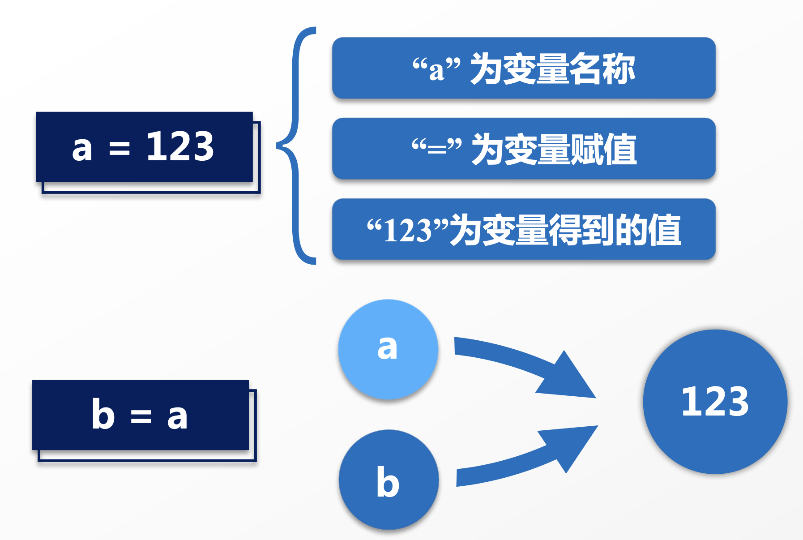
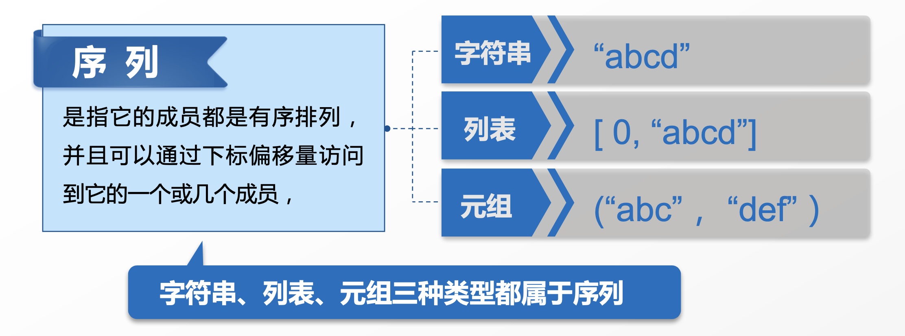
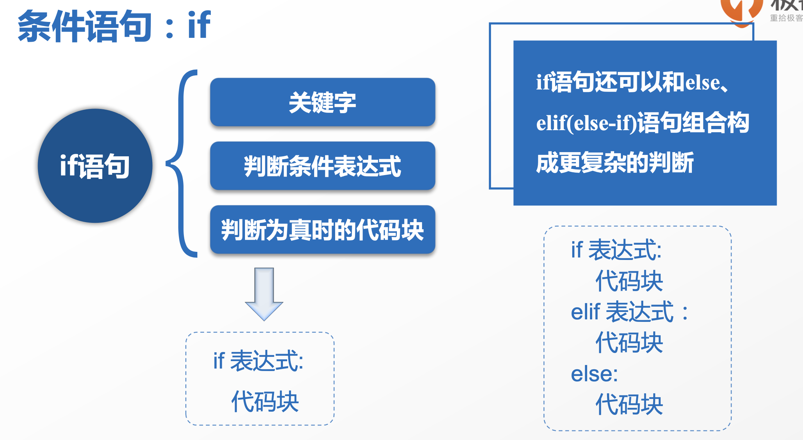
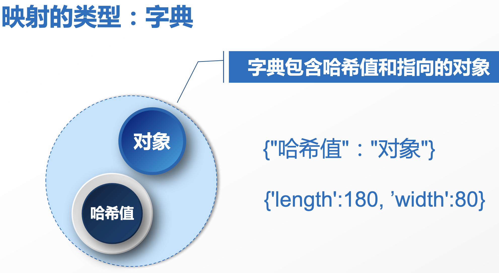
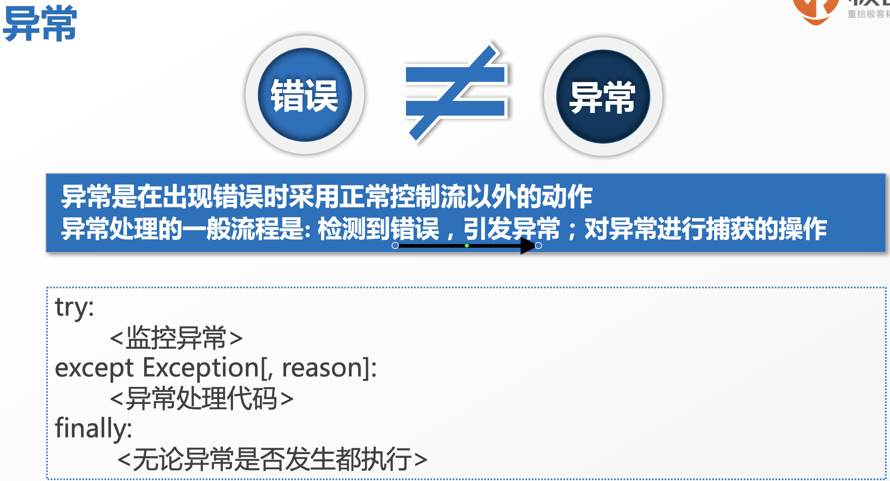
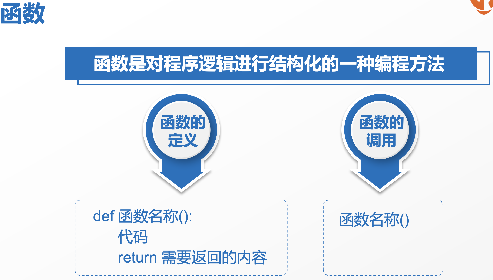
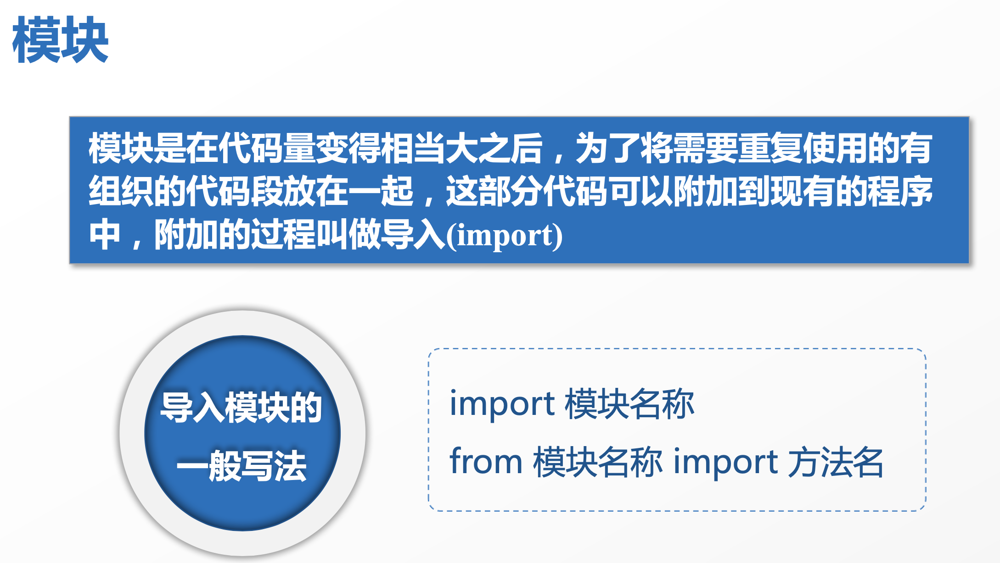
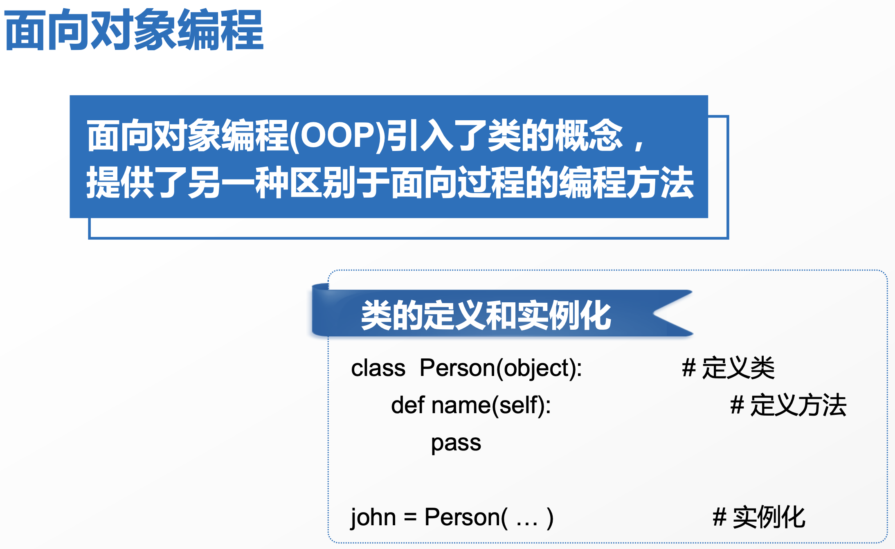
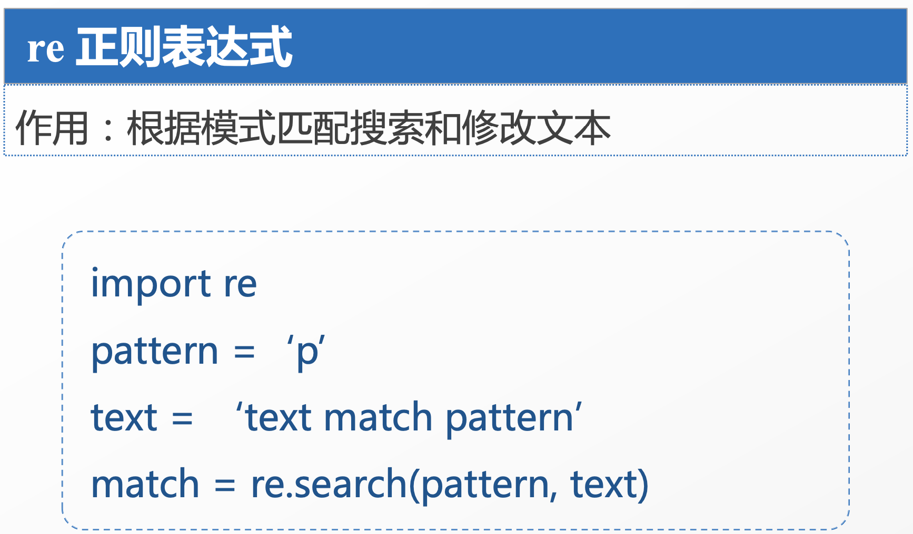

# 极客时间 - Python笔记

## 第一章 Python介绍与安装

python发展历史

## 第二章 Python基础语法

### Python第一个程序

```python
#这是我的第一个python程序
import time

#在屏幕上打印出从1970年1月1日0:00 到现在过了多少秒
print(time.time())
if 10 - 9 > 0:
    #这行需要缩进，缩进一个空格
    print('10 大于 9')
```

### 基本数据类型


| 整型(int) | 浮点型(float) | 字符串(str)     | 布尔值(bool)  |
| ----------- | --------------- | ----------------- | --------------- |
| 8         | 8.8           | "8"    "python" | True    false |

使用type()判断数据类型；类型转换：int('8')，str(8), bool(8)

### 变量



变量命名规则：必须使用字母、下划线开头,数字不能开头；不能使用Python内置的关键字或保留字；变量严格区分大小写

## 第三章 序列

### 序列的概念及常用操作符



序列的基本操作


### 字符串

```python
#记录生肖，根据年份来判断生肖
chinese_zodiac = '猴鸡狗猪鼠牛虎兔龙蛇马羊'

print(chinese_zodiac[0:4]) #猴鸡狗猪
print(chinese_zodiac[-1]) #羊

year = 2018
print(year % 12) #2

print(chinese_zodiac[year % 12]) #狗
print('狗' not in chinese_zodiac) #False
print (chinese_zodiac + 'abcd') #猴鸡狗猪鼠牛虎兔龙蛇马羊abcd
print (chinese_zodiac * 3) #猴鸡狗猪鼠牛虎兔龙蛇马羊猴鸡狗猪鼠牛虎兔龙蛇马羊猴鸡狗猪鼠牛虎兔龙蛇马羊
```

### 元组

```python
#定义一个星座元组
zodiac_name = (u'摩羯座', u'水瓶座', u'双鱼座', u'白羊座', u'金牛座', u'双子座', u'巨蟹座', u'狮子座', u'处女座', u'天秤座', u'天蝎座', u'射手座')
zodiac_days = ((1, 20), (2, 19), (3, 21), (4, 21), (5, 21), (6, 22), (7, 23), (8, 23), (9, 23), (10, 23), (11, 23), (12, 23))
(month, day) = (2, 15)

zodiac_day = filter(lambda x: x <= (month, day), zodiac_days)
zodiac_len = len(list(zodiac_day)) % 12
print(zodiac_name[zodiac_len])
```

### 列表

```python
a_list = ['abc', 'xyz']

# 列表追加元组
a_list.append('X')
print(a_list)	#['abc', 'xyz', 'X']
# 列表删除元素
a_list.remove('abc')
print(a_list)	#['xyz', 'X']
```

**元组与列表的核心区别在于,元组是静态的,列表是动态的, 可变的**

## 第四章 条件与循环

### 条件语句if



```python
x = 'abcd'
if x == 'abc':
    print('x的值和abc相等')
else:
    print('x和abc不想等')
  
#记录生肖，根据年份来判断生肖
chinese_zodiac = '猴鸡狗猪鼠牛虎兔龙蛇马羊'
year = int(input('请用户输入出生年份'))
if chinese_zodiac[year % 12] == '狗':
    print('狗年运势。。。')
```

### for循环和while循环


```python
import time

# 记录生肖，根据年份来判断生肖
chinese_zodiac = '猴鸡狗猪鼠牛虎兔龙蛇马羊'

year = int(input('请用户输入出生年份'))
if(chinese_zodiac[year % 12]) == '狗':
    print('狗年运势。。。')

for cz in chinese_zodiac:
    print(cz)

for i in range(9):
    print(i)

for year in range(2000, 2019):
    print("%s 年的生肖是 %s" % (year, chinese_zodiac[year % 12]))

num = 5

while True:
    num = num + 1
    if num > 10:
        break
    # if num == 10:
    #     continue
    print(num)
    time.sleep(1)
```

### for循环语句中的if嵌套

```python
zodiac_name = (u'摩羯座', u'水瓶座', u'双鱼座', u'白羊座', u'金牛座', u'双子座', u'巨蟹座', u'狮子座', u'处女座', u'天秤座', u'天蝎座', u'射手座')
zodiac_days = ((1, 20), (2, 19), (3, 21), (4, 21), (5, 21), (6, 22), (7, 23), (8, 23), (9, 23), (10, 23), (11, 23), (12, 23))

int_month = int(input("请输入月份："))
int_day = int(input("请输入日期："))

for zd_num in range(len(zodiac_days)):
    if zodiac_days[zd_num] >= (int_month, int_day):
        print(zodiac_name[zd_num])
        break
    elif int_month == 12 and int_day > 23:
        print(zodiac_name[0])
        break
```

### while循环语句中的if嵌套

```python
zodiac_name = (u'摩羯座', u'水瓶座', u'双鱼座', u'白羊座', u'金牛座', u'双子座', u'巨蟹座', u'狮子座', u'处女座', u'天秤座', u'天蝎座', u'射手座')
zodiac_days = ((1, 20), (2, 19), (3, 21), (4, 21), (5, 21), (6, 22),
              (7, 23), (8, 23), (9, 23), (10, 23), (11, 23), (12, 23))


# 用户输入月份和日期
int_month = int(input('请输入月份：'))
int_day = int(input('请输入日期'))

n = 0
while zodiac_days[n] < (int_month,int_day):
    if int_month == 12 and int_day >23:
        break
    n += 1

print(zodiac_name[n])
```

## 第五章 映射与字典



### 字典的定义和常用操作

1. 字典定义、赋值、增加值

   ```python
   dict1 = {}  # 定义一个空字典
   print(type(dict))   # 验证是否为字典类型
   
   dict2 = {'x': 1, 'y': 2}    # 字典赋值
   dict2['z'] = 3  # 字典增加值
   print(dict2)
   ```

2. 字典遍历

   ```python
   
   chinese_zodiac = '猴鸡狗猪鼠牛虎兔龙蛇马羊'
   zodiac_name = (u'摩羯座', u'水瓶座', u'双鱼座', u'白羊座', u'金牛座', u'双子座',
              u'巨蟹座', u'狮子座', u'处女座', u'天秤座', u'天蝎座', u'射手座')
   zodiac_days = ((1, 20), (2, 19), (3, 21), (4, 21), (5, 21), (6, 22),
                 (7, 23), (8, 23), (9, 23), (10, 23), (11, 23), (12, 23))
   
   
   cz_num = {}
   for i in chinese_zodiac:
       cz_num[i] = 0
   
   z_num = {}
   for i in zodiac_name:
       z_num[i] = 0
   
   while True:
   
       # 用户输入出生年份月份和日期
       year = int(input('请输入年份：'))
       month = int(input('请输入月份：'))
       day = int(input('请输入日期:'))
   
       n = 0
       while zodiac_days[n] < (month,day):
           if month == 12 and day >23:
               break
           n += 1
       # 输出生肖和星座
       print(zodiac_name[n])
   
   
       print('%s 年的生肖是 %s' % (year, chinese_zodiac[year % 12]))
   
       cz_num[chinese_zodiac[year % 12]] += 1
       z_num[zodiac_name[n]] += 1
   
       # 输出生肖和星座的统计信息
       for  each_key in  cz_num.keys():
           print('生肖 %s 有 %d 个'%(each_key,cz_num[each_key]))
   
       for  each_key in z_num.keys():
           print('星座 %s 有 %d 个' %(each_key,z_num[each_key]))
   ```

### 列表推倒式与字典推倒式

```python
alist = []
for i in range(1,11):
    if(i % 2 == 0):
        alist.append(i*i)
# 列表推倒式
blist = [i*i for i in range(1,11) if(i % 2) == 0]


z_num = {}
for i in zodiac_name:
    z_num[i] = 0
# 字典推倒式
z_num = {i:0 for i in zodiac_name}
```

## 第六章 文件和输入输出

### 文件的内建函数

open() 打开文件；read() 输入；readline() 输入一行；seek() 文件内移动； write() 输出；close() 关闭文件；

### 文件的常用操作

```python
# 写入文件
# 将小说的主要人物记录在文件中
file1 = open('name.txt','w')
file1.write('诸葛亮')
file1.close()

# 读取文件
file2 = open('name.txt')
print(file2.read())
file2.close()

# 向文件中追加内容
file3 = open('name.txt', 'a')
file3.write('刘备')
file3.close()

# 读取一行
file4 = open('name.txt')
print(file4.readline())

# 逐行读取
file5 = open('name.txt')
for line in file5.readlines():
    print(line)
    print('=====')
    

file6 = open('name.txt')
print(file6.tell())
file6.read(1)
print(file6.tell())
file6.seek(0)
print(file6.tell())

file6 = open('name.txt')
print('当前文件指针的位置 %s' %file6.tell())
print ( '当前读取到了一个字符，字符的内容是 %s' %file6.read(1))
print('当前文件指针的位置 %s' %file6.tell())
# 第一个参数代表偏移位置，第二个参数  0 表示从文件开头偏移  1表示从当前位置偏移，   2 从文件结尾
file6.seek(5,0)
print('我们进行了seek操作')
print('当前文件指针的位置 %s' %file6.tell())
print ( '当前读取到了一个字符，字符的内容是 %s' %file6.read(1))
print('当前文件指针的位置 %s' %file6.tell())
file6.close()
```

## 第七章 错误和异常



### 异常的检测和处理

```python
# i = j


# print())


# a='123'
# print(a[3])
#
# d = {'a':1 ,'b':2}
# print(d['c'])

#
# year = int(input('input year:'))

# try:
#     year = int(input('input year:'))
# except ValueError:
#     print('年份要输入数字')
#
# a=123
# a.append()

# except (ValueError, AttributeError, KeyError)

#
# try:
#     print(1/'a')
# except Exception as e:
#     print(' %s' %e)
#
# try:
#     raise NameError('helloError')
# except NameError:
#     print('my custom error')


try:
    a = open('name.txt')
except Exception as e:
    print(e)

finally:
    a.close()
```

## 第八章 函数



### 函数的定义和常用操作

```python

# 读取人物名称
f = open('name.txt')
data = f.read()
data0 = data.split('|')

# 读取兵器名称
f2 = open('weapon.txt')
# data2 = f2.read()
i = 1
for  line in f2.readlines():
    if i % 2 == 1:
        print(line.strip('\n'))
    i += 1

f3 = open('sanguo.txt',encoding='GB18030')
print(f3.read().replace('\n',''))
#
#
# def func(filename):
#     print(open(filename).read())
#     print('test func')
#
#
#
# func('name.txt')


import re
def find_item( hero ):
    with open('sanguo.txt',encoding='GB18030') as f:
        data = f.read().replace('\n','')
        name_num = re.findall(hero,data)
        # print('主角 %s  出现 %s  次' %(hero, len(name_num)))

    return len(name_num)

# 读取人物的信息
name_dict = {}
with open('name.txt') as f:
    for line in f:
        names = line.split('|')
        for n in names:
#             print(n)
            name_num = find_item(n)
            name_dict[n] = name_num

name_sorted = sorted(name_dict.items(), key=lambda item: item[1], reverse=True)
print(name_sorted[0:10])
```


### 函数的可变长参数

```
print('abc',end='\n')   # 关键字参数
print('abc')


def func (a, b, c):
    print('a= %s' %a)
    print('b= %s' %b)
    print('c= %s' %c)

func(1, c=3, b=2)   # 关键字参数，可忽略顺序

# func(1, c=3) 错误，可定义可变长函数解决
# 取得参数的个数
def  howlong(first, *other):
    print( 1 + len(other))

howlong()
```

### 函数的变量作用域

```python
var1 = 123
def func():
    global var1     # 定义为全局变量
    var1 = 456
    print(var1)
func()
print(var1)
```

### 函数的迭代器和生成器

```python
# 迭代器函数
# iter() next()

list1 =[1, 2, 3]
it = iter(list1)
print(next(it))
print(next(it))
print(next(it))
print(next(it)) # except

# 错误，自定义frange实现
# for i in range(10,20,0.5):
#     print(i)

def frange(start, stop, step):
    x = start
    while x < stop:
        yield x     # 生成迭代器
        x += step

for i in frange(10,20,0.5):
    print(i)
```

### Lambda表达式

```python
def true():return True
lambda : True   # 使用lambda简洁

def add(x,y): return x+y
lambda  x,y: x+y

# lambda  x: x<= (month, day)
# def func1(x):
#     return x<= (month, day)
#
#
# lambda  item:item[1]
#
# def func2(item):
#         return item[1]
```

### Python内建函数

 filter()； map() ；reduce() ；zip()

```
a=[1,2,3,4,5,6,7]
list(filter(lambda x:x>2 , a))

>>> help(filter)
>>> a=[1,2,3,4,5,6,7]
>>> list(filter(lambda x:x>2 , a))
[3, 4, 5, 6, 7]

>>> help(map)
>>> a=[1,2,3]
>>> map(lambda x:x ,a)
<map object at 0x105686e10>
>>> list(map(lambda x:x ,a))
[1, 2, 3]
>>> list(map(lambda x:x+1 ,a))
[2, 3, 4]
>>> b=[4,5,6]
>>> list(map(lambda x,y:x+y ,a,b))
[5, 7, 9]
>>>
>>>

>>> help(reduce)
Traceback (most recent call last):
  File "<stdin>", line 1, in <module>
NameError: name 'reduce' is not defined
# 使用前必须从functools包中导入
>>> from functools import reduce
>>> reduce(lambda x,y: x+y,[2,3,4],1 )
10
计算步骤： ((1+2)+3)+4

>>> for i in zip((1,2,3),(4,5,6)):
...     print(i)
...
(1, 4)
(2, 5)
(3, 6)


>>> dicta = {'a': 'xx', 'b': 'yy'}
>>> dictb = zip(dicta.values(), dicta.keys())
>>> print(dictb)
<zip object at 0x7f89f9683280>
>>> print(dict(dictb))
{'xx': 'a', 'yy': 'b'}
```

### 闭包的定义

```python
def func():
   a = 1
   b = 2
   return a+b


def sum(a):
    # 外部函数参数被内部函数调用，我们称之为闭包
    def add(b):
      return a+b
    # 此时返回的是内部的函数add
    return add

num1 = func()

# 闭包的调用
num2 = sum(2)
print(num2(4))

# 查看两个返回值的不同
print(type(num1))   # <class 'int'>
print(type(num2))   # <class 'function'>


def counter(FIRST=0):
    cnt = [FIRST]
    def add_one():
        cnt[0] += 1
        return cnt[0]
    return add_one


num5 = counter(5)
print(num5())
print(num5())
print(num5())
```

疑问：

闭包计数器为什么要用列表？ 用整数变量为啥传不进嵌套函数呢？   好像定义整数变量后,只要在嵌套函数里定义一下noblocal就可以了,这又是为啥……

```
作者回复: 这个问题非常好！首先我们先从nonlocal说起，python在使用变量的时候要遵循一个LEGB规则，

什么又是LEGB呢，就是如果你使用了一个函数内的变量做运算，python会从函数里面找这个变量的定义，如果找不到函数里面的定义就会报错了--即你看到的未定义先使用的错误了。

这种实现方式比js要好，避免在你忘记声明局部变量的时候，误使用了全局变量。

那变量都有几个作用域（影响范围）呢？一共是四个，分别是局部（local）-闭包（enclosing）-全局（global）-模块（builtin），LEGB就是取的他们的首字母；

如果要引用的变量的定义没在内部函数里面，而是在闭包里面就可以通过nonlocal声明一下，python就会从外层函数里面找这个变量的定义了，如果使用了global关键字修饰内部函数的变量，运算时就会从全局变量里面找变量的定义了。

上面说的是变量作用域，再来说下我为什么使用列表，这里使用列表的目的就是为了达到 nonlocal变量的功能，因为对列表的操作是直接操作内存的位置，对变量的操作是重新分配了一块新的内存；

所以在内部函数直接使用列表的名称也是操作外部函数定义的列表。这里需要通过python底层执行过程观察：

from dis import dis

# dis模块可以反汇编python函数的字节码

def counter2(first2=0):

    CNT2 = first2

    def add_one():
        # nonlocal CNT2
        CNT2 += 1
        return CNT2
    return add_one

dis(counter2(3))


如果将nonlocal注释掉会显示反汇编结果为

LOAD_FAST 0 (CNT2)

如果不注释nonlocal或使用列表会显示反汇编结果为

LOAD_DEREF 0 (CNT2)


LOAD_FAST 的含义是加载了本地变量 

LOAD_DEREF 的含义是加载了引用的变量

LOAD_GLOBAL 的含义是加载了全局变量


这里涉及到python作用域和底层的一些原理，希望你能通过尝试更多的示例进行学习总结
```


老师，我觉得你说的有些问题，如果闭包里面引用的变量的定义没有在闭包中，那么他也会去外层函数中去查找，直到查找到全局作用域，代码如下

```

    cnt2 = 1

    def counter():

        def add_one():

            a = cnt2 + 1

            print(a)

            return a

        return add_one

    

    add_one = counter()

    add_one()

    #output 2
```

上述代码中输入2，说明在闭包中他是可以访问了全局的变量的，即使不用加nonlocal, 那么关于这段代码如下 

```
   def counter():

        count = 1

        def add_one():

            count += 1 # error

            return count

        return add_one
```

那么上述代码报错原因，我也上网搜了一下，一个我可以理解的解释是，在闭包中count  +=  1，实际上是重新声明了一个count变量，覆盖了外层函数的count变量，那么此时这个count变量也没有被赋值，却参与到了运算当中，那么就会报错了，我也用老师说的反汇编测试过 老师，我这样理解的不知道对不对，请老师指点下，我用的python版本是3.7的

```
作者回复:         很细心，第一个问题我在解释的时候不严谨，如果函数内只引用全局变量，但不修改时可以不使用global关键字，一旦对全局变量进行修改必须声明，如：在函数内使用cnt2 += 1 就会报错了，这种情况下强制使用 global cnt2 显式声明才可以正常使用

def add_one():

    global cnt2  # 声明

    cnt2 += 1      # 对全局变量做修改

    a = cnt2 + 1

    print(a)

    return a


第二个问题的理解是对的，能够正确理解变量作用域对工作中有非常大的帮助，继续加油！
```

### 闭包的使用

```python
# 直线公式： ax + b
def a_line(a, b):
    def arg_y(x):
        return a * x + b
    return arg_y


line1 = a_line(5, 3)
print(line1(2))
print(line1(4))

#使用lambda简写
def a_line2(a, b):
    return lambda x: a*x + b

line2 = a_line2(3, 5)
print(line2(10))
print(line2(5))
```

使用闭包由原来传递变量的方式变为传递函数的方式，调用的参数少，更简洁更优雅

### 装饰器的定义

```python

import time

# def i_can_sleep():
#     time.sleep(3)
#
# start_time = time.time()
# i_can_sleep()
# end_time = time.time()
# print("运行的时间是 %s 秒" % (end_time - start_time))
# 带来的问题，如果多次次奥用i_can_sleep,查看每次调用的时间，那不是要写死人了
# 我们可以使用装饰器来完成
def timmer(func):
    def wrapper():
        start_time = time.time()
        func()
        end_time = time.time()
        print("运行的时间是 %s 秒" % (end_time - start_time))
    return wrapper()


# 语法糖
@timmer
def i_can_sleep():
    time.sleep(3)


i_can_sleep
```

### 装饰器的使用

```python
# def tips(func):
#     def nei(a, b):
#         print('start')
#         func(a, b)
#         print('end')
# 
#     return nei
# 
# # 不带参数的装饰器
# @tips
# def add(a,b):
#     print(a+b)
# 
# # 不带参数的装饰器
# @tips
# def sub(a, b):
#     print(a-b)
# 
# 
# add(5,3)
# sub(5,3)

"""
带参数装饰器
"""
def new_tips(argv):
    def tips(func):
        def nei(a, b):
            print('start %s %s' % (argv, func.__name__))
            func(a, b)
            print('stop')

        return nei
    return tips


@new_tips('add_module')
def add(a, b):
    print(a + b)


@new_tips('sub_module')
def sub(a, b):
    print(a - b)


print(add(4, 5))
print(sub(7, 3))
```


### 自定义上下文管理

```python
fd = open('name.txt')
try:
    for line in fd:
        print (line)
finally:
    fd.close()


# 使用with用于上下文管理
with open('name.txt') as f:
    for line in f:
        print(line)
```


## 第九章 模块

### 模块的定义



```python
# 导入模块
# import time
# 导入模块重命名
# import time as t
# t.sleep(1)
# 导入指定的功能， 不推荐
# from time import sleep
# sleep(1)
```

自定义模块，新建mymod.py文件

```python
def print_me():
    print('me')
```

在mod_test.py中使用自定义模块

```python
import mymod
mymod.print_me()
```

## 第十章 语法规范

PEP8: https://www.python.org/dev/peps/pep-0008/

pycharm 安装PEP8
命令行输入：pip3 install autopep8
Tools→Extends Tools→点击加号

Name：Autopep8（可以随便取）
- Tools settings:
    - Programs：`autopep8` （前提是你已经安装了哦）
    - Parameters:`--in-place --aggressive --aggressive $FilePath$`
    - Working directory:`$ProjectFileDir$`
- 点击Output Filters→添加，在对话框中的：Regular expression to match output中输入：`$FILE_PATH$\:$LINE$\:$COLUMN$\:.*`

## 第十一章 面向对象编程



### 类与实例

```python
class Player():
    def __init__(self, name, hp):   # 定义一个类
        self.name = name
        self.hp = hp

    def print_role(self):   # 定义一个方法
        print("%s: %s" % (self.name, self.hp))


user1 = Player('tom', 100)  # 类的实例化
user2 = Player('jerry', 90)
user1.print_role()
user2.print_role()
```

### 如何增加类的属性和方法

```python
class Player():
    def __init__(self, name, hp, occu):   # 定义一个类，增加了属性occu
        self.name = name    # 变量被称作属性
        self.hp = hp
        self.occu = occu

    def print_role(self):   # 定义一个方法
        print("%s: %s %s" % (self.name, self.hp, self.occu))

    def update_name(self, newname):  # 定义一个方法修改属性name的值
        self.name = newname


user1 = Player('tom', 100, 'war')  # 类的实例化
user2 = Player('jerry', 90, 'master')
user1.print_role()
user2.print_role()

user1.update_name('wilson')
user1.print_role()

# 第2中修改属性name的方法
user1.name = 'wilson2'
user1.print_role()
```

如果类的属性name不想让别人访问到使用__name

```python
class Player():
    def __init__(self, name, hp, occu):   # 定义一个类, 使用__name
        self.__name = name    # 变量被称作属性
        self.hp = hp
        self.occu = occu

    def print_role(self):   # 定义一个方法
        print("%s: %s %s" % (self.__name, self.hp, self.occu))

    def update_name(self, newname):  # 定义一个方法修改属性name的值
        self.__name = newname


user1 = Player('tom', 100, 'war')  # 类的实例化
user1.print_role()

# 第2中修改属性name的方法，发现name的值并未被修改
user1.name = 'wilson'
user1.print_role()

# 同样不会被修改
user1.__name = 'wilson2'
user1.print_role()

# 此时使用方法，name被修改
user1.update_name("newwilson")
user1.print_role()
```

### 类的继承

```python
class Monster():
    '定义怪物类'

    def __init__(self, hp=100):
        self.hp = hp

    def run(self):
        print('移动到某个位置')

    def whoami(self):
        print("我是怪兽父类")
        

class Animals(Monster):
    '普通怪物，继承Monster类'
    def __init__(self, hp=10):
        super(Animals, self).__init__(hp)


class Boss(Monster):
    'Boss怪物类'
    def __init__(self, hp=1000):
        super().__init__(hp)

    def whoami(self):
        print('我是怪物我怕谁')


a1 = Monster(200)
print(a1.hp)
print(a1.run())

a2 = Animals(1)
print(a2.hp)
print(a1.run())

a3 = Boss(800)
print(a3.whoami())

print('a1的类型 %s' % type(a1))
print('a2的类型 %s' % type(a2))
print('a3的类型 %s' % type(a3))

# 判断实例是否是某种对象类型
print(isinstance(a3, Monster))
```

多态： 父类定义方法，多子类覆盖

判断对象实例类型使用type()；判断实例是否为某对象类型，使用isinstance()

### 类的使用-自定义with语句

```python
class WithTest():
    def __enter__(self):
        print('enter')

    def __exit__(self, exc_type, exc_val, exc_tb):
        print('exit')


with WithTest():
    print("test")
```

输出结果

```
enter
test
exit
```

异常和类的结合

```python
class WithTest(object):
    def __enter__(self):
        print('enter')

    def __exit__(self, exc_type, exc_val, exc_tb):
        # 如果没有异常
        if exc_tb is None:
            print('exit normal')
        else:
            print(exc_tb)


with WithTest():
    print("test")
    raise NameError("Exception")    # 使用raise抛出异常
```

## 第十二章 多线程编程

### 多线程编程的定义

未使用多线程

```python
def my_thread(arg1, arg2):
    print('%s %s' % (arg1, arg2))


for i in range(1, 6, 1):
    my_thread(i, i+1)
```

使用多线程

```python
import threading
import time
from threading import current_thread


def my_thread(arg1, arg2):
    print(current_thread().getName(), 'start')
    print('%s %s' % (arg1, arg2))
    time.sleep(1)
    print(current_thread().getName(), 'stop')


for i in range(1, 6, 1):
    t1 = threading.Thread(target=my_thread, args=(i, i + 1))
    t1.start()

print(current_thread().getName(), 'end')
```

发现：主线程先结束，子线程后结束，解决这个问题，使用类编写

```python
import threading
from threading import current_thread


class MyThread(threading.Thread):
  	'重写run方法'
    def run(self):
        print(current_thread().getName(), 'start')
        print('run')
        print(current_thread().getName(), 'stop')


t1 = MyThread()
t1.start()
t1.join()
print(current_thread().getName(), 'end')
```


### 经典的生产者和消费者问题

```python
from threading import Thread, current_thread
import time
import random
from queue import Queue

queue = Queue(5)


class ProducerThread(Thread):
    def run(self) -> None:
        name = current_thread().getName()
        nums = range(100)
        global queue
        while True:
            num = random.choice(nums)
            queue.put(num)
            print('生产者 %s 生产了数据 %s' % (name, num))
            t = random.randint(1, 3)
            time.sleep(t)
            print('生产者 %s 睡眠了 %s 秒' % (name, t))


class ConsumerThread(Thread):
    def run(self) -> None:
        name = current_thread().getName()
        global queue
        while True:
            num = queue.get()
            queue.task_done()
            print('消费者 %s 消耗了数据 %s' % (name, num))
            t = random.randint(1, 3)
            time.sleep(t)
            print('消费者 %s 睡眠了 %s 秒' % (name, t))


p1 = ProducerThread(name='p1')
p1.start()
p2 = ProducerThread(name='p2')
p2.start()
p3 = ProducerThread(name='p3')
p3.start()

c1 = ConsumerThread(name='c1')
c1.start()
c2 = ConsumerThread(name='c2')
c2.start()
```

## 第十三章 标准库

### Python标准库的定义

<table>
  <thead>
    <tr><td colspan=3>日常使用模块</td></tr>
  </thead>
  <tbody>
    <tr>
      <td>re<sup>文字处理</sup></td>
      <td>time、datetime<sup>日期类型</sup></td>
      <td>math、random<sup>数字和数学类型</sup></td>
    </tr>
    <tr>
      <td>pathlib、os.path<sup>文件和目录访问</sup></td>
      <td>tarfile<sup>数据压缩和归档</sup></td>
      <td>os、logging、argparse<sup>通用操作系统</sup></td>
    </tr>
    <tr>
      <td>threading、queue<sup>多线程</sup></td>
      <td>base64 、json、urllib<sup>Internet数据处理</sup></td>
      <td>html、xml<sup>结构化标记处理工具</sup></td>
    </tr>
    <tr>
      <td>unitest<sup>开发工具</sup></td>
      <td>timeit<sup>调试工具</sup></td>
      <td>venv<sup>软件包发布</sup></td>
    </tr>
    <tr>
      <td>__main__<sup>运行服务</sup></td>
      <td></td>
      <td></td>
    </tr>
  </tbody>
</table>

### 正则表达式库re



<table>
  <thead>
    <caption>正则表达式的元字符</caption>
    <tr><th colspan=3>正则表达式的元字符</th></tr>
    <tr></tr>
  </thead>
  <tbody>
    <tr>
      <td>.</td>
      <td>匹配任何一个字符</td>
      <td></td>
    </tr>
  </tbody>
</table>


### 正则表达式的元字符

# . ^ $ * + ? {m} {m,n} [] |  \d \D \s ()
# ^$
# .*?

### 正则表达式分组功能实例

r实例

```python
print('\nx\n')
print(r'\nx\n')
```

日期匹配案例

```python
import re

date_str = '2022-08-10'
p = re.compile(r'(\d+)-(\d+)-(\d+)')

print(p.match(date_str).group(1))	# year
print(p.match(date_str).groups())

year, month, day = p.match(date_str).groups()
print('year=', year, ',month=', month, ',day=', day)
```

### 正则表达式库函数match与search的区别

match：完全匹配使用之后分组，如果不能完全匹配调用group会报异常

```python
date_str = 'aa2022-08-aa10'
p = re.compile(r'(\d+)-(\d+)-(\d+)')

print(p.match(date_str).group(2))	# 会报异常,因为完全匹配结果为空，所以没有调用group时报错
```

search：搜索指定字符串

```python
date_str = 'aa2022-08-aa10'
p = re.compile(r'(\d+)-(\d+)-(\d+)')
print(p.search('aa2022-08-10bb').groups()) # (2022,08,10)
```

### 正则表达式替换函数sub()的实例

sub findall

```
# print (p.search('aa2018-05-10bb'))
# phone = '123-456-789 # 这是电话号码'
# p2 = re.sub(r'#.*$','',phone)
# print(p2)
# p3 = re.sub(r'\D','',p2)
# print(p3)
# findall()
```

### 日期与时间函数库

time

datetime

```python
import time
# print(time.time())
# print(time.localtime())
# print(time.strftime('%Y%m%d'))


import datetime
print(datetime.datetime.now())
newtime = datetime.timedelta(minutes=10)
print(datetime.datetime.now()+ newtime)

one_day=datetime.datetime(2008,5,27)
new_date=datetime.timedelta(days=10)
print( one_day + new_date)
```


### 数学相关库

math

random

```python
import  random
print( random.randint(1,5))
print( random.choice(['aa','bb','cc']))
```

### 使用命令行对文件和文件夹操作

os.path

Path lib

```python
import  os
print( os.path.abspath('..'))
print( os.path.exists('/Users'))
print( os.path.isdir('/Users'))
os.path.join('/tmp/a/','b/c')

from pathlib import Path
p = Path('.')
print ( p.resolve())

p.is_dir()

q = Path('/tmp/a/b/c')

Path.mkdir(q,parents=True)
```

### 文件与目录操作库

## 第十四章 机器学习库

numpy

安装

```

```


## 第十五章 爬虫

## 第十六章 综合案例

